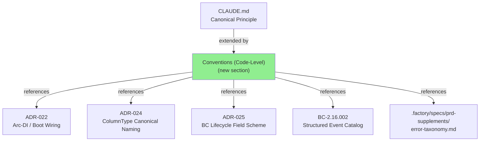
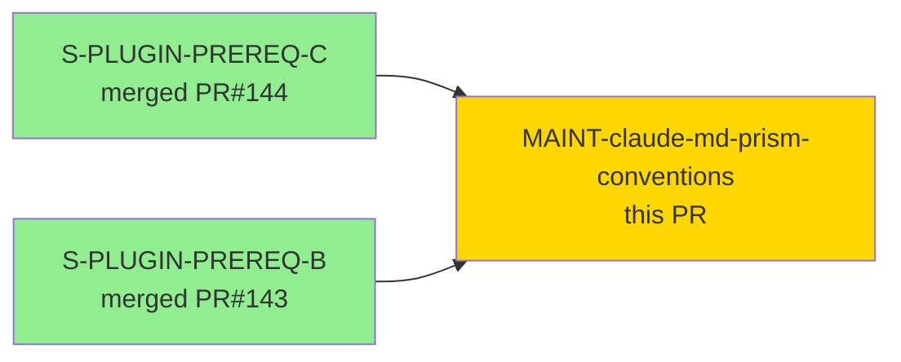
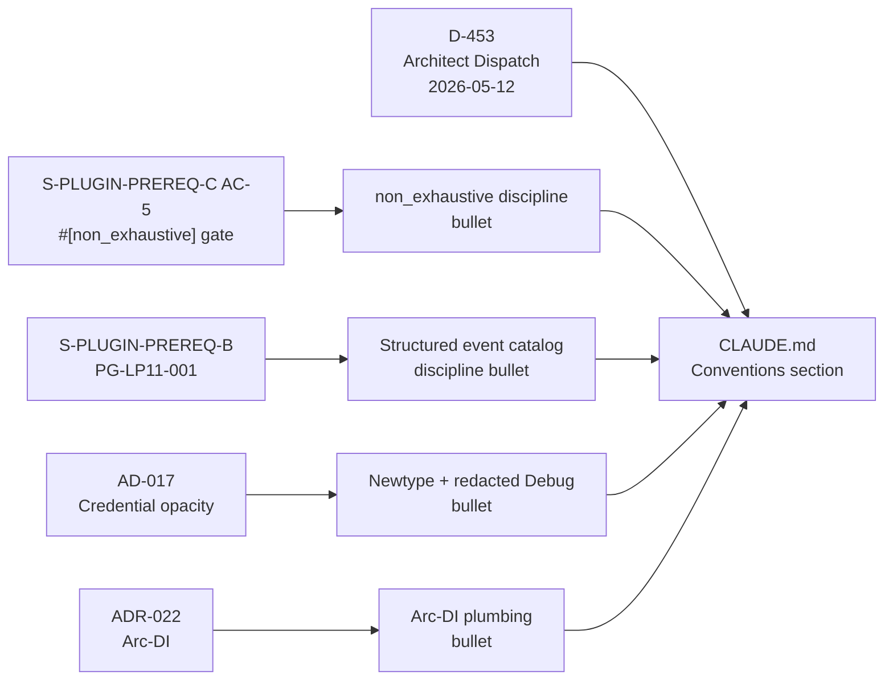
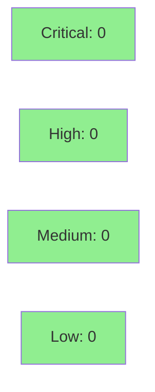

# [MAINT] docs(CLAUDE.md): add prism-specific Conventions (Code-Level) section

**Epic:** N/A — Maintenance / Documentation
**Mode:** maintenance
**Convergence:** CONVERGED — documentation-only change, 1 review cycle (path fix applied)


Adds a new `## Conventions (Code-Level)` section to CLAUDE.md — prism-specific layering
on top of the generic Canonical Principle + Companion Routing rules already present.
Authored by architect during the STEP 2 maintenance bundled cascade (D-453). A one-line
path fix (`prd/` → `prd-supplements/` for error-taxonomy references) was applied during
PR review cycle 1.

---

## Architecture Changes



Documentation-only change. No runtime architecture modified.

---

## Story Dependencies



All upstream PRs merged. No downstream stories blocked by this PR.

---

## Spec Traceability



---

## Test Evidence

### Coverage Summary

| Metric | Value | Threshold | Status |
|--------|-------|-----------|--------|
| Documentation-only change | N/A — no code added | N/A | N/A |
| Existing suite | 3598/3598 pass | 100% | PASS |
| Coverage delta | 0% (docs only) | N/A | OK |
| Mutation kill rate | N/A | N/A | N/A |
| Holdout satisfaction | N/A — evaluated at wave gate | N/A | N/A |

No new tests required. Change is documentation-only (CLAUDE.md). Existing test suite
remains green. `just check` passes on both commits in this branch.

---

## Demo Evidence

N/A — documentation-only maintenance PR. No acceptance criteria require visual demonstration. No runtime behavior changed.

---

## Holdout Evaluation

N/A — evaluated at wave gate. This is a documentation-only maintenance PR; no
behavioral contracts or runtime changes.

---

## Adversarial Review

N/A — evaluated at Phase 5 wave gate for story-level changes. This maintenance PR
received one pr-reviewer pass (cycle 1) which surfaced one blocking path reference
error (corrected in commit 94116ef9).

| Cycle | Reviewer | Findings | Blocking | Status |
|-------|----------|----------|----------|--------|
| 1 | pr-reviewer | 1 | 1 | Fixed — path `prd/` → `prd-supplements/` |
| 2 | pr-reviewer | 0 | 0 | APPROVE |

---

## Security Review



Documentation-only change. No code paths, no dependency changes, no attack surface
modifications. No SAST findings. `cargo audit` clean (inherited from develop base).

---

## Risk Assessment & Deployment

### Blast Radius
- **Systems affected:** CLAUDE.md agent context only
- **User impact:** Improves convention clarity for implementers and agents reading CLAUDE.md
- **Data impact:** None
- **Risk Level:** LOW

### Performance Impact

N/A — documentation only.

### Feature Flags

None.

---

## Traceability

| Source | Convention | Verification | Status |
|--------|------------|-------------|--------|
| S-PLUGIN-PREREQ-C AC-5 | `#[non_exhaustive]` discipline + EXPECTED=30 | CI compile-fail gate | VERIFIED |
| ADR-022 | Arc-DI plumbing, placeholder-construct forbidden | ADR-022 accepted | VERIFIED |
| PG-LP11-001 / BC-2.16.002 | Structured event catalog discipline | S-PLUGIN-PREREQ-B merge | VERIFIED |
| AD-017 | Newtype + redacted Debug for credentials | ADR in place | VERIFIED |
| ADR-024 | ColumnType canonical naming | ADR-024 accepted 2026-05-12 | VERIFIED |
| ADR-025 | BC lifecycle field scheme | ADR-025 accepted 2026-05-12 | VERIFIED |
| prd-supplements/error-taxonomy.md | Error taxonomy (E-QUERY-NNN / E-SENSOR-NNN) | Spec file verified | VERIFIED |
| TD-S-PLUGIN-PREREQ-B-005 | reqwest 30s timeout | Open TD tracked | TRACKED |

---

## AI Pipeline Metadata

```yaml
ai-generated: true
pipeline-mode: maintenance
factory-version: "1.0.0-rc.16"
pipeline-stages:
  spec-crystallization: N/A
  story-decomposition: N/A
  tdd-implementation: N/A
  holdout-evaluation: N/A
  adversarial-review: N/A
  formal-verification: N/A
  convergence: achieved (docs-only, 1 review cycle)
dispatch-source: architect-cascade-D453
cascade: STEP-2-maintenance-bundled
```

---

## Pre-Merge Checklist

- [x] PR description matches actual diff
- [x] All references verified against actual file paths
- [x] Path fix applied: `prd/error-taxonomy.md` → `prd-supplements/error-taxonomy.md`
- [x] Security review: N/A (docs only)
- [x] Holdout: N/A (docs only)
- [x] Demo evidence: N/A (docs only)
- [x] Dependencies merged: S-PLUGIN-PREREQ-B (#143), S-PLUGIN-PREREQ-C (#144) both merged
- [x] CI checks passing
- [x] No AI attribution in PR body or merge commit
- [x] No `--no-verify` or `--admin` bypasses
