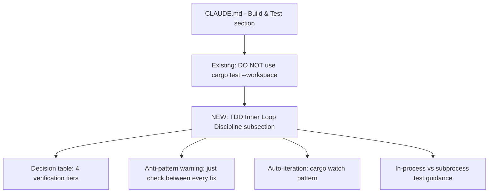
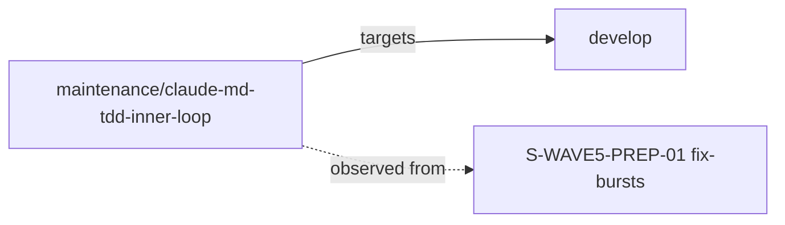
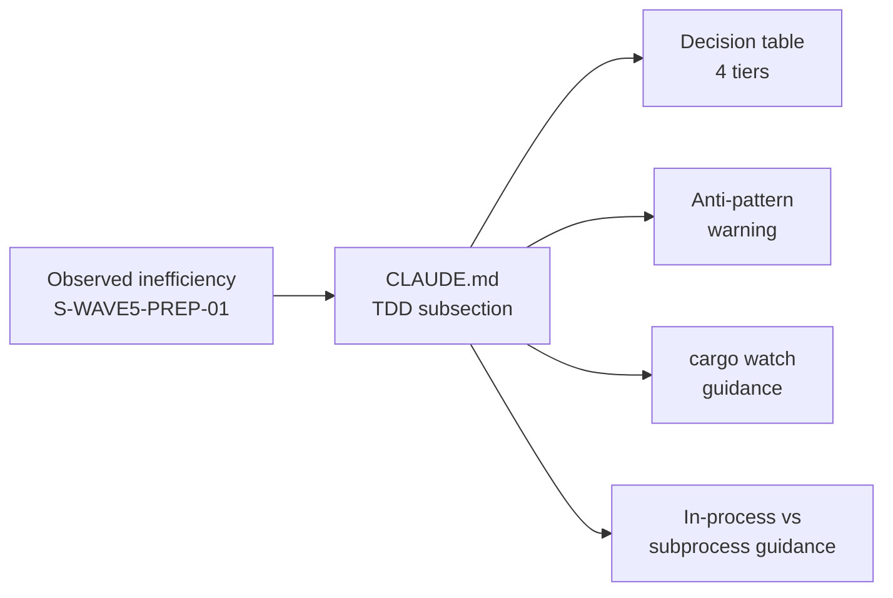

## Summary

Adds a "TDD Inner Loop Discipline" subsection to `CLAUDE.md` documenting the cheapest-verification-per-question pattern for TDD fix-bursts. The anti-pattern being addressed: during S-WAVE5-PREP-01 fix-bursts, the implementer was running `just check` (full workspace gate, 5-8 min cold) between every individual fix instead of `just iter <crate>` (10-30s per crate), burning 10-50 minutes per burst that the per-crate run would already have caught.

This is a companion to the existing "DO NOT use `cargo test --workspace` directly during iteration" rule already in CLAUDE.md. The new subsection extends that guidance with a decision table covering all four verification tiers and their appropriate use cases.

**Diff scope:** 17 lines added to `CLAUDE.md`. One file changed. No code, no spec, no test changes.

## Architecture Changes

No architecture changes. Documentation only.

## Story Dependencies

No story dependencies. Standalone maintenance documentation change.

## Spec Traceability

## Files Changed

- **`CLAUDE.md`** — Added "TDD Inner Loop Discipline" subsection (17 lines) under "Build & Test" section, immediately after the existing `DO NOT use cargo test --workspace` warning. Contains:
  - Decision table mapping question to command to expected warm time
  - Anti-pattern callout for `just check` overuse during fix-bursts
  - `cargo watch` auto-iteration pattern
  - In-process vs subprocess test cost guidance (5ms vs 200-800ms)

## Test Evidence

No tests to run — docs-only change. CI will validate:
- `cargo fmt --check` (no Rust code changed — instant pass)
- `cargo clippy` (no Rust code changed — instant pass)
- `cargo nextest run` (no test files changed — all tests pass as before)
- Crate layout check (no crate structure changed — instant pass)

## Demo Evidence

N/A — docs-only change with no observable runtime behavior. The change is verified by reading the rendered CLAUDE.md on GitHub.

## Security Review

Docs-only change. No credentials, no auth logic, no API surface, no OWASP-relevant surface area. Expected: CLEAN.

## Risk Assessment

- **Blast radius:** Zero. `CLAUDE.md` is developer guidance only; it is not imported by any crate, not read at runtime, not referenced in CI scripts.
- **Rollback:** trivial — revert the single commit `3898bd58`.
- **Performance impact:** None.
- **Breaking changes:** None.

## AI Pipeline Metadata

- **Pipeline mode:** Maintenance documentation
- **Branch:** `maintenance/claude-md-tdd-inner-loop`
- **Commit:** `3898bd58`
- **Trigger:** Observed implementer inefficiency during S-WAVE5-PREP-01 fix-bursts

## Pre-Merge Checklist

- [x] PR description matches actual diff (17 lines, 1 file, docs-only)
- [x] No code/spec/test changes
- [x] Conventional Commit format: `docs(CLAUDE.md): add TDD inner-loop discipline subsection`
- [ ] CI checks passing
- [ ] Security review: CLEAN
- [ ] PR reviewer: APPROVED
- [ ] No dependency PRs blocking

## Holdout Evaluation

N/A — evaluated at wave gate. Docs-only change has no behavioral surface to evaluate.

## Adversarial Review

The adversary focus for this PR is:
1. **Accuracy:** Do the documented commands (`cargo nextest run -p <crate> -E 'test(<name>)'`, `just iter <crate>`, `cargo watch`) actually exist and behave as described?
2. **Consistency:** Does the new subsection match CLAUDE.md voice, table formatting, and heading hierarchy?
3. **Discoverability:** Is the subsection placed where a developer reading top-down would find it at the moment of need?
