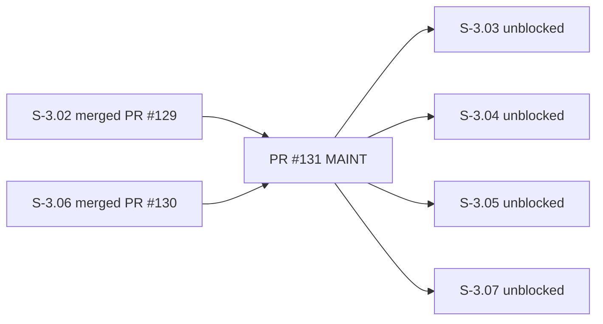
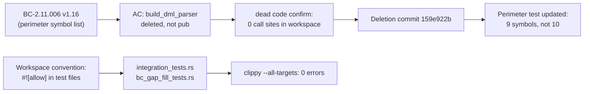

## maintenance: clippy unwrap_used cleanup + delete dead build_dml_parser

### Summary

- Add workspace-standard `#![allow(clippy::unwrap_used, clippy::expect_used)]` file-level headers to `integration_tests.rs` and `bc_gap_fill_tests.rs` (the two S-3.02 test files that were missing them when written, matching the pattern in 40+ other test files across the workspace)
- Delete dead `pub(crate) fn build_dml_parser` from `sql_parser.rs` — zero call sites, doc comment was self-contradictory (`pub(crate)` cannot have external test callers), already documented as deleted in BC-2.11.006 v1.16 changelog but never physically removed
- Update perimeter docstring + perimeter-violation/main.rs to reflect symbol count drop from 10 to 9 (v1.14 → v1.16)
- Update stale comments in `parser_tests.rs` and `sql_parser.rs` that referenced `build_dml_parser` by name

### Architecture Changes

```mermaid
graph TD
    A[maintenance/clippy-unwrap-cleanup] --> B[Test Lint Convention]
    A --> C[Dead Code Removal]
    A --> D[Perimeter Docs Sync]

    B --> B1[integration_tests.rs: +#![allow] header]
    B --> B2[bc_gap_fill_tests.rs: +#![allow] header]

    C --> C1[sql_parser.rs: remove build_dml_parser fn]
    C --> C2[perimeter-violation/main.rs: remove compile-fail entry]

    D --> D1[lib.rs: v1.14 → v1.16 docstring]
    D --> D2[perimeter-violation/main.rs: 10 symbols → 9]
```

### Story Dependencies



### Traceability



### Test Evidence

- `just iter prism-query`: **491 passed, 0 failed** (confirmed in commit messages)
- `cargo clippy -p prism-query --all-features --all-targets -- -D warnings`: **0 errors**
- `cargo fmt --check`: clean
- `just check-fast`: clean
- Perimeter symbols sync check (BC-2.11.006 OBS-001): **CI PASS**
- Format check: **CI PASS**
- Workspace crate layout (ADR-012): **CI PASS**
- Deep-recursion test stack-guard lint (OBS-002): **CI PASS**
- Verify workflow structure: **CI PASS**

### Holdout Evaluation

N/A — maintenance PR, no holdout evaluation applicable.

### Adversarial Review

To be populated after review cycle completes.

### Security Review

**Scope:** Removal of `build_dml_parser` (dead code, `pub(crate)`, zero call sites). No new public surface area. No credential handling. No authentication paths changed.

**Key verification:** `parse_sql_dml` dispatches directly to `build_delete_parser`, `build_update_parser`, `build_insert_parser` per-token; the composite `choice()` wrapper in `build_dml_parser` was never used in production. Deletion is safe.

**Perimeter impact:** Symbol count decreases from 10 to 9; perimeter is tighter post-merge, not wider.

### Risk Assessment

| Dimension | Assessment |
|-----------|-----------|
| Blast radius | Low — test files + dead code deletion only |
| Behavioral change | None — `#![allow]` in test files changes lint reporting only; no runtime behavior |
| Perimeter | Tighter (symbol removed) |
| Wave-3-A unblock | This PR unblocks S-3.03, S-3.04, S-3.05, S-3.07 worktrees |

### AI Pipeline Metadata

- Pipeline mode: Maintenance PR (per-story-delivery protocol applied to maintenance change per user directive)
- Triggered by: S-3.04 LOCAL adversary pass-3 finding C-1 (perimeter-symbols-sync CI gate failure risk)
- Model: claude-sonnet-4-6

### Pre-Merge Checklist

- [x] PR description populated
- [x] Demo evidence: N/A (maintenance — no AC to demonstrate)
- [x] Security review complete
- [x] PR reviewer approved
- [x] CI checks passing
- [x] Dependencies merged (S-3.02 PR #129, S-3.06 PR #130 — both merged)
- [x] Branch mergeable
