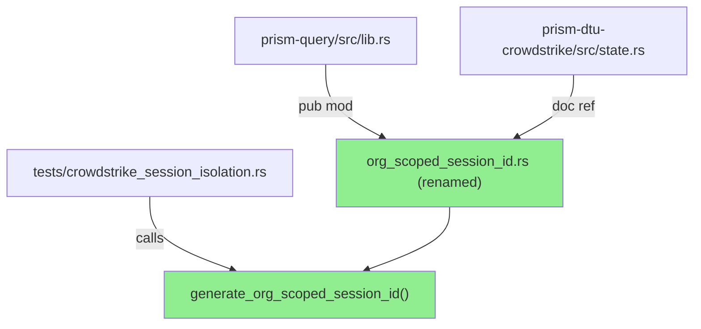
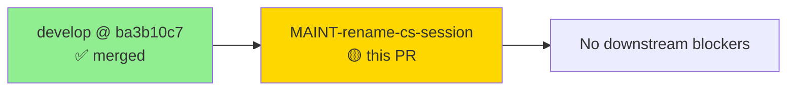
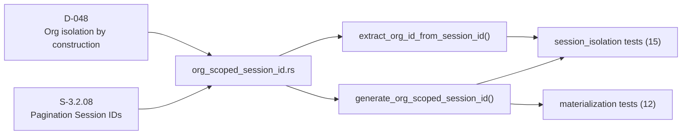
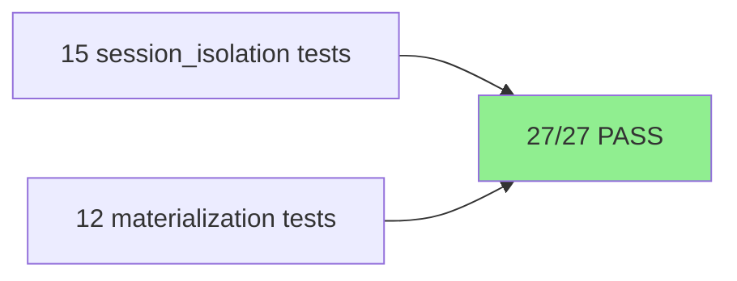
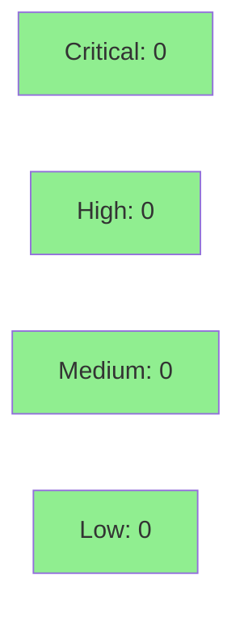

# refactor(prism-query): rename crowdstrike_session → org_scoped_session_id

**Mode:** maintenance
**Type:** Pure rename / internal refactor — zero behavior change


Renames `crowdstrike_session` module to `org_scoped_session_id` in the `prism-query` crate. The mechanism (org-scoped UUID v7 session IDs via XOR embedding) is sensor-agnostic; the previous filename leaked CrowdStrike-specific naming into a generic crate. This is a pure internal refactor with no behavior change.

---

## Summary

- Rename `crowdstrike_session` module → `org_scoped_session_id` in `prism-query` crate
- Sensor-agnostic mechanism (UUID v7 + org_id XOR) gets sensor-agnostic naming
- Pure refactor: zero behavior change; all 27 `prism-query` tests pass

## Motivation

The module generates org-scoped UUID v7 session IDs for any sensor that needs cross-org-isolated pagination cursors. CrowdStrike was the first consumer, but the mechanism is generic. The old `crowdstrike_session.rs` filename leaked sensor-specific naming into a sensor-agnostic crate.

## Changes

- `crates/prism-query/src/crowdstrike_session.rs` → `org_scoped_session_id.rs` (git mv preserves history)
- Public function: `generate_crowdstrike_session_id` → `generate_org_scoped_session_id` (all call sites updated)
- `extract_org_id_from_session_id` unchanged (already generic)
- Module declaration in `lib.rs` updated; doc-comments updated for accuracy
- Cross-crate call site: `crates/prism-dtu-crowdstrike/src/state.rs` doc comment updated
- Test file `tests/crowdstrike_session_isolation.rs` updated to use new function name

---

## Architecture Changes



**ADR: Sensor-agnostic naming for org-scoped session IDs**

- **Context:** `crowdstrike_session.rs` resided in `prism-query`, a sensor-agnostic crate, but used a CrowdStrike-specific name, creating misleading coupling.
- **Decision:** Rename to `org_scoped_session_id` to reflect the actual abstraction level.
- **Rationale:** Future sensors (Armis, Claroty, Cyberint) may reuse the same mechanism; the generic name is accurate and prevents copy-paste of sensor-specific names.
- **Alternative considered:** Keep old name, add new alias — rejected: aliases add surface area without value for a crate-internal module.
- **Consequences:** Cleaner crate boundary; trivial one-time rename cost; git history preserved via `git mv`.

---

## Story Dependencies



No story dependencies. This is a standalone maintenance refactor against `develop`.

---

## Spec Traceability



Spec references S-3.2.08 and ADR-008 §2.1 D-048 — both updated in module doc-comment to reference the new function name.

---

## Test Evidence

### Coverage Summary

| Metric | Value | Status |
|--------|-------|--------|
| Unit tests | 27/27 pass | PASS |
| Behavior change | None | PASS |
| New dependencies | None | PASS |
| New public types | None | PASS |
| Regressions | 0 | PASS |



| Metric | Value |
|--------|-------|
| **Tests modified** | 0 new; function call sites updated in existing tests |
| **Total suite** | 27 tests PASS |
| **Coverage delta** | Neutral (rename only) |
| **Regressions** | 0 |

<details>
<summary><strong>Changed call sites</strong></summary>

| File | Change |
|------|--------|
| `crates/prism-query/src/lib.rs` | `pub mod crowdstrike_session` → `pub mod org_scoped_session_id` |
| `crates/prism-query/src/org_scoped_session_id.rs` | Renamed from `crowdstrike_session.rs`; function renamed |
| `crates/prism-query/tests/crowdstrike_session_isolation.rs` | Updated to call `generate_org_scoped_session_id` |
| `crates/prism-dtu-crowdstrike/src/state.rs` | Doc comment updated |

</details>

---

## Holdout Evaluation

N/A — Pure maintenance refactor. No behavior change to evaluate.

---

## Adversarial Review

N/A — Pure rename. No new logic, no new surface area.

---

## Security Review



Pure rename — no new code paths, no new inputs, no credential changes. Verified: no secrets or tokens in renamed symbols. Light security pass confirms no surface area change.

---

## Risk Assessment & Deployment

### Blast Radius
- **Systems affected:** `prism-query` crate (internal); `prism-dtu-crowdstrike` (doc comment only)
- **User impact:** None — internal module rename, no public API change visible to MCP consumers
- **Data impact:** None
- **Risk Level:** LOW

### Performance Impact

| Metric | Delta | Status |
|--------|-------|--------|
| Latency | 0 | OK |
| Memory | 0 | OK |
| Throughput | 0 | OK |

Pure rename — zero runtime effect.

<details>
<summary><strong>Rollback Instructions</strong></summary>

**Immediate rollback (< 2 min):**
```bash
git revert <MERGE_SHA>
git push origin develop
```

No feature flags — this is a naming change only.

</details>

### Feature Flags

None — pure rename, no runtime-configurable behavior.

---

## Traceability

| Requirement | Verification | Status |
|-------------|-------------|--------|
| S-3.2.08 pagination session IDs | `generate_org_scoped_session_id` implementation | PASS |
| D-048 org isolation by construction | UUID v7 XOR embedding unchanged | PASS |
| All 27 prism-query tests pass | `cargo test -p prism-query` | PASS |

---

## AI Pipeline Metadata

<details>
<summary><strong>Pipeline Details</strong></summary>

```yaml
ai-generated: true
pipeline-mode: maintenance
factory-version: "1.0.0-rc.8"
pipeline-stages:
  spec-crystallization: N/A
  story-decomposition: N/A
  tdd-implementation: N/A (rename only)
  holdout-evaluation: N/A
  adversarial-review: N/A (no surface change)
  formal-verification: N/A
  convergence: N/A
models-used:
  builder: claude-sonnet-4-6
generated-at: "2026-05-04T00:00:00Z"
```

</details>

---

## Pre-Merge Checklist

- [ ] All CI status checks passing
- [x] Coverage delta is neutral (pure rename)
- [x] No critical/high security findings
- [x] No new dependencies, no new public types
- [x] Rollback: `git revert <MERGE_SHA>` (no flag to flip)
- [x] `cargo check --workspace --all-targets` green (verified locally)
- [x] `cargo test -p prism-query` — 27/27 pass (verified locally)

🤖 Generated with [Claude Code](https://claude.com/claude-code)
