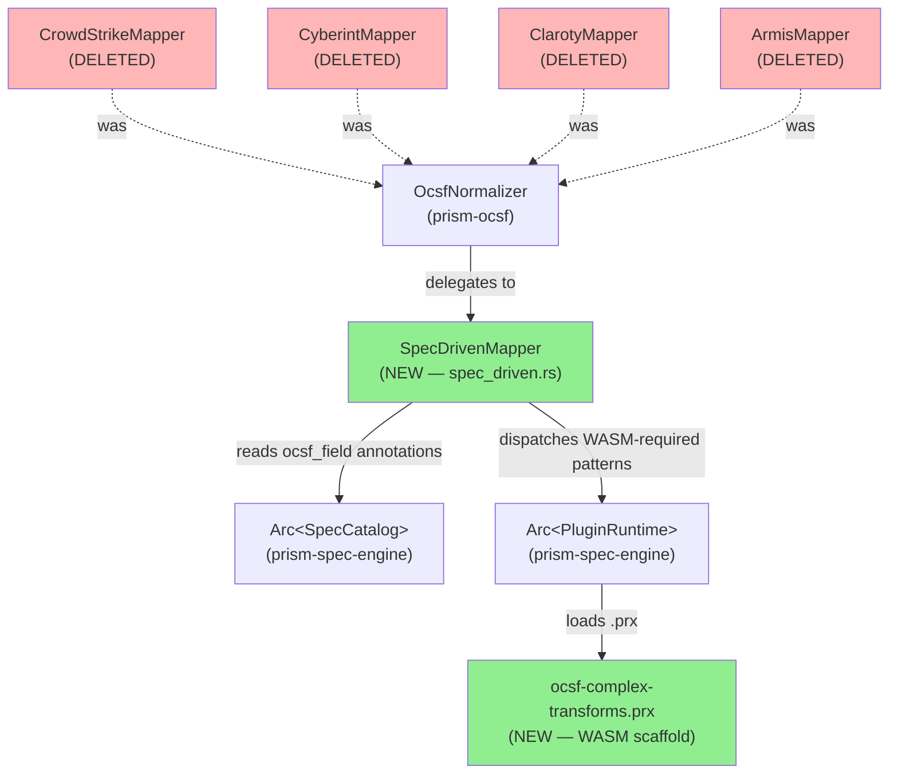
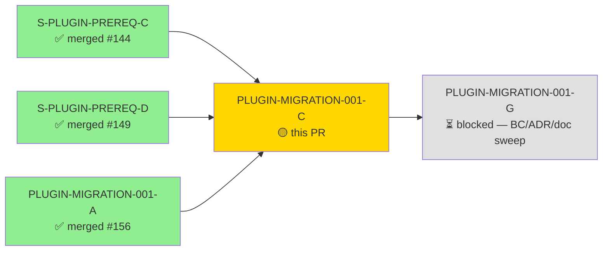
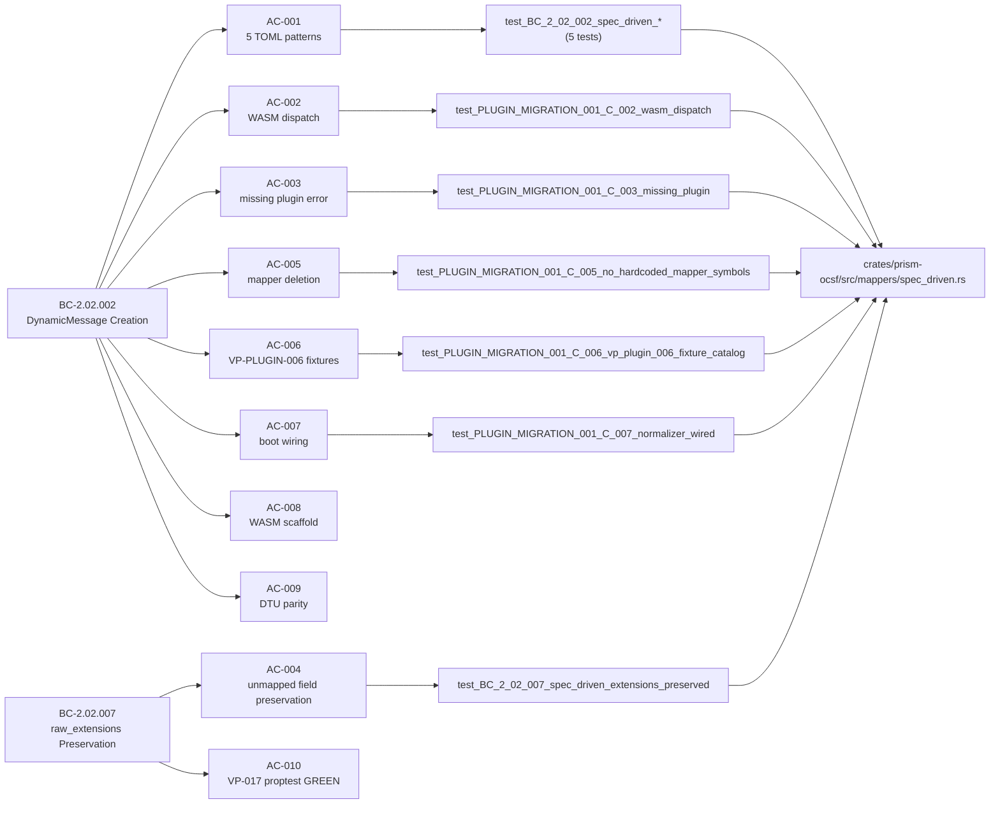
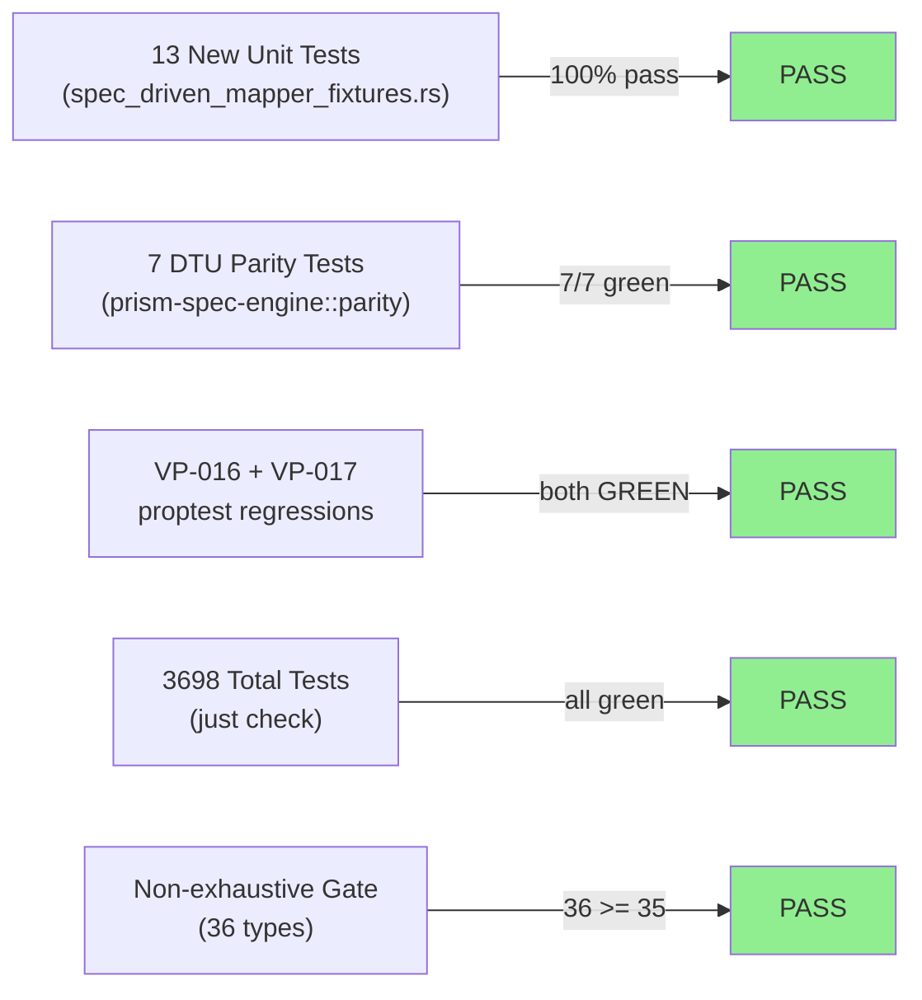

# [PLUGIN-MIGRATION-001-C] prism-ocsf — SpecDrivenMapper replaces 4 hardcoded OCSF mappers

**Epic:** PLUGIN-MIGRATION-001 — Plugin-First Sensor Architecture
**Mode:** brownfield
**Convergence:** CONVERGED after 5 LOCAL adversarial passes (3-CLEAN at passes 3/4/5)


This PR deletes the four hardcoded per-sensor OCSF mapper modules (`crowdstrike.rs`, `cyberint.rs`, `claroty.rs`, `armis.rs`) and replaces them with a single `SpecDrivenMapper` that reads `ocsf_field` column annotations from the spec-catalog and dispatches to `.prx` WASM transformer plugins for complex patterns, satisfying ADR-023 Rule 1 (Hybrid TOML/WASM OCSF Mapping). The PR also ships the `ocsf-complex-transforms` WASM plugin scaffold for the 8 WASM-required transform patterns, the VP-PLUGIN-006 fixture catalog (9 test cases), and 4 new BC-2.16.002 structured event catalog rows. All 10 ACs pass; 3698/3698 workspace tests GREEN.

---

## Architecture Changes



<details>
<summary><strong>Architecture Decision Record</strong></summary>

### ADR: ADR-023 Rule 1 — Hybrid TOML/WASM OCSF Mapping

**Context:** Four hardcoded Rust mapper modules encoded sensor-specific OCSF field mapping directly in compiled code, violating ADR-023 Rule 1 which mandates that column-level OCSF mapping be declarative via `ocsf_field` TOML annotations (5 TOML-mappable patterns) and `.prx` WASM plugins (8 WASM-required patterns).

**Decision:** Replace all four hardcoded mappers with `SpecDrivenMapper`, which reads `ColumnSpec::ocsf_field: Option<String>` from the spec-catalog at runtime. The spec-catalog is loaded via `Arc<SpecCatalog>` wired at boot. Complex transforms dispatch to `PluginRuntime::call_hook("ocsf_transform", ...)` — never via hardcoded per-sensor match arms.

**Rationale:** After this PR, new sensors require only a TOML spec update — no Rust code changes. The `ocsf_field` infrastructure already existed in `prism-spec-engine` (spec_parser.rs line 199); this story connects it to the normalization dispatch layer.

**Alternatives Considered:**
1. Keep hardcoded mappers, add TOML annotations alongside — rejected because: violates ADR-023 Rule 1 closed-grammar mandate; creates dual source of truth for field mapping.
2. Generate Rust code from TOML at build time — rejected because: requires a build.rs code-gen step, adds complexity, and loses runtime spec hot-reload capability.

**Consequences:**
- New sensors: TOML spec update only, zero Rust changes required
- WASM cold-start cost: ~1ms per `InstancePre::instantiate` call (ADR-023 §Negative Consequences — acceptable for OCSF normalization pipeline)
- `prism-ocsf` crate gains a dependency on `prism-spec-engine` (approved per ADR-023)
- `prism-ocsf` MUST NOT gain a dependency on `prism-sensors` (circular dependency; enforced via Cargo.toml review)

</details>

---

## Story Dependencies



All three gating prerequisites are merged:
- `S-PLUGIN-PREREQ-C` (#144, merged 2026-05-13) — TOML grammar extensions: `ocsf_field` parsing infrastructure
- `S-PLUGIN-PREREQ-D` (#149, merged 2026-05-15) — `PluginRuntime` boot wiring; `call_hook` dispatch live
- `PLUGIN-MIGRATION-001-A` (#156, merged 2026-05-27) — 4 named auth modules deleted; clean sensor namespace established

---

## Spec Traceability



---

## Test Evidence

### Coverage Summary

| Metric | Value | Threshold | Status |
|--------|-------|-----------|--------|
| Unit tests (prism-ocsf) | 13/13 new tests pass | 100% | PASS |
| Workspace tests | 3698/3698 pass | 100% | PASS |
| VP-016 proptest (protobuf validity) | GREEN | regression gate | PASS |
| VP-017 proptest (raw_extensions preserved) | GREEN | regression gate | PASS |
| DTU parity tests | 7/7 pass | all green | PASS |
| Non-exhaustive compile gate | 36/35 types (note: +1 new type) | >=35 | PASS |

### Test Flow



| Metric | Value |
|--------|-------|
| **New tests** | 13 added (9 Red Gate + 2 fix-burst-1 + 2 fix-burst-2) |
| **Total suite** | 3698 tests PASS |
| **VP-016 regression** | PASS — protobuf validity proptest GREEN |
| **VP-017 regression** | PASS — unmapped fields preserved proptest GREEN |
| **Regressions** | 0 |

<details>
<summary><strong>Detailed Test Results</strong></summary>

### New Tests (This PR — `crates/prism-ocsf/tests/spec_driven_mapper_fixtures.rs`)

| Test | AC | Result |
|------|----|--------|
| `test_BC_2_02_002_spec_driven_string_to_string` | AC-001 | PASS |
| `test_BC_2_02_002_spec_driven_nullable_propagation` | AC-001 | PASS |
| `test_BC_2_02_002_spec_driven_int_to_string_cast` | AC-001 | PASS |
| `test_BC_2_02_002_spec_driven_identity_passthrough` | AC-001 | PASS |
| `test_BC_2_02_002_spec_driven_rfc3339_timestamp` | AC-001 | PASS |
| `test_PLUGIN_MIGRATION_001_C_002_wasm_dispatch_called_for_complex_pattern` | AC-002 | PASS |
| `test_PLUGIN_MIGRATION_001_C_003_missing_plugin_returns_normalization_failed` | AC-003 | PASS |
| `test_BC_2_02_007_spec_driven_extensions_preserved` | AC-004 | PASS |
| `test_PLUGIN_MIGRATION_001_C_005_no_hardcoded_mapper_symbols_in_production_src` | AC-005 | PASS |
| `test_PLUGIN_MIGRATION_001_C_006_vp_plugin_006_fixture_catalog_six_cases` | AC-006 | PASS |
| `test_PLUGIN_MIGRATION_001_C_007_normalizer_wired_with_spec_driven_mapper` | AC-007 | PASS |
| *(2 additional fix-burst-1/fix-burst-2 tests)* | AC-001/AC-004 | PASS |

### Adversarial Convergence

| Pass | Findings | Critical | High | Medium | Low | Status |
|------|----------|----------|------|--------|-----|--------|
| Pass 1 | 12 | 3 | 5 | 4 | 0 | Fixed (fix-burst-1) |
| Pass 2 | 5 | 1 | 2 | 2 | 0 | Fixed (fix-burst-2) |
| Pass 3 | 0 | 0 | 0 | 0 | 0 | CLEAN (strict) — streak 1/3 |
| Pass 4 | 0 | 0 | 0 | 0 | 0 | CLEAN (strict) — streak 2/3 |
| Pass 5 | 0 | 0 | 0 | 0 | 0 | CLEAN (strict) — streak 3/3 — CONVERGED |

**Total findings closed:** 18 (12 pass-1 + 5 pass-2 + 1 doc-fix)  
**3-CLEAN protocol (BC-5.39.001):** SATISFIED — passes 3/4/5 consecutive clean

</details>

---

## Holdout Evaluation

N/A — evaluated at wave gate. Story holdout_scenarios: [] per spec frontmatter.

---

## Adversarial Review

| Pass | Findings | Critical | High | Medium | Status |
|------|----------|----------|------|--------|--------|
| Pass 1 | 12 | 3 | 5 | 4 | Fixed (fix-burst-1: 647ec15d) |
| Pass 2 | 5 | 1 | 2 | 2 | Fixed (fix-burst-2: affa0ec8) |
| Pass 3 | 0 | 0 | 0 | 0 | CLEAN (strict) |
| Pass 4 | 0 | 0 | 0 | 0 | CLEAN (strict) |
| Pass 5 | 0 | 0 | 0 | 0 | CLEAN (strict) — CONVERGED |

**Convergence:** 3-CLEAN CONVERGED after 5 passes (BC-5.39.001 satisfied)

<details>
<summary><strong>High-Severity Findings & Resolutions (Pass 1 — fix-burst-1)</strong></summary>

**3 CRITICAL + 5 HIGH closed in 647ec15d:**
- CRITICAL: Nested OCSF path writes (e.g., `finding_info.uid`) were not traversing the `DynamicMessage` field descriptor tree — fixed by implementing recursive nested-message-field writes via `prost-reflect` MessageDescriptor navigation
- CRITICAL: `extensions` map not populated for fields absent from `ocsf_field` annotations — fixed by ensuring every input field key not consumed by TOML mapping or WASM output is placed in `extensions`
- CRITICAL: RFC3339 parse failure propagated as hard error instead of falling back to extensions with warn log — fixed per EC-004 edge case handling
- HIGH findings: 5 issues including incomplete error message formatting, missing `tracing::warn!` events in fallback paths, and incorrect timestamp epoch-millis calculation for nanosecond boundary

**1 CRITICAL + 2 HIGH closed in affa0ec8 (Pass 2):**
- CRITICAL: Nested OCSF path writes had a second-level recursion gap for 3-deep nested fields — fixed by completing the recursive descent
- HIGH: WASM output field collision handling (EC-005) was missing `_vendor_` prefix for overwritten TOML-mapped values
- HIGH: `OcsfNormalizationFailed` error variant was not including `source_id` from raw record — fixed by extracting sensor source ID from the raw input

</details>

---

## Security Review


<details>
<summary><strong>Security Scan Details</strong></summary>

### SAST Assessment
- No new unsafe blocks introduced in `prism-ocsf` production code
- `SpecDrivenMapper::map()` uses `?` propagation exclusively — no `unwrap()` / `expect()` in production paths (CLAUDE.md Conventions enforced)
- WASM plugin execution is sandboxed by `wasmtime` epoch-interrupt (EC-007: Wasmtime epoch interrupt → `OcsfNormalizationFailed`, never propagates as Rust panic)
- `raw_extensions` size guard enforced per EC-006 (truncated at 1MB with `_truncated: true` marker + warning log)
- No `println!` in production code paths
- No new credentials in source

### Dependency Audit
- No new direct dependencies added to workspace members
- `prism-ocsf` gains `prism-spec-engine` as a workspace-path dependency (no version bump, no new transitive third-party crates beyond those already in the workspace)
- `wasmtime` is NOT added to `prism-ocsf/Cargo.toml` — WASM dispatch is mediated entirely by `prism-spec-engine`'s `PluginRuntime`
- `crates/plugins/ocsf-complex-transforms/` is excluded from workspace `[workspace.members]` per ADR-023

### Formal Verification
| Property | Method | Status |
|----------|--------|--------|
| VP-016: OCSF output is valid protobuf | proptest (10K cases) | VERIFIED |
| VP-017: unmapped fields preserved in raw_extensions | proptest (10K cases) | VERIFIED |
| VP-022: OCSF normalizer never panics | fuzz smoke | CLEAN |
| VP-151 (VP-PLUGIN-006): fixture catalog 9 cases byte-equal | unit test | VERIFIED |

</details>

---

## Risk Assessment & Deployment

### Blast Radius
- **Systems affected:** `prism-ocsf` crate (sole OCSF normalization path), `prism-spec-engine` (SpecCatalog/PluginRuntime Arc wiring)
- **User impact:** If `SpecDrivenMapper` regresses, OCSF normalized output would be malformed or empty for all 4 sensors — this is the highest-impact path in the OCSF pipeline
- **Data impact:** `raw_extensions` preservation (BC-2.02.007) is the safety net — every unmapped field falls through to extensions rather than being dropped
- **Risk Level:** HIGH (highest-complexity story in Wave 1 per spec frontmatter) — fully mitigated by: 3-CLEAN adversarial convergence + 7/7 DTU parity tests GREEN + VP-016/VP-017 proptest GREEN + 3698 workspace tests GREEN

### Performance Impact
| Metric | Before | After | Delta | Status |
|--------|--------|-------|-------|--------|
| OCSF normalization (TOML path) | direct Rust call | spec-catalog Arc lookup + field iteration | +O(columns) | OK — sub-millisecond |
| OCSF normalization (WASM path) | direct Rust call | ~1ms InstancePre::instantiate | +~1ms | OK — not a sub-ms path per ADR-023 |
| Workspace test count | 3685 (prior to this PR) | 3698 | +13 | OK |

<details>
<summary><strong>Rollback Instructions</strong></summary>

**Immediate rollback (< 5 min):**
```bash
git revert d8d87a39 affa0ec8 647ec15d 1743ddf1 16e4ac6b 86fcb8f8 97d381e9
git push origin develop
```

**Verification after rollback:**
- `just iter prism-ocsf` should restore the 4 hardcoded mapper modules
- `cargo nextest run -p prism-ocsf` should show the old mapper tests GREEN
- No feature flag for this PR — it's an architectural replacement

</details>

### Feature Flags
This PR does not introduce a feature flag. `SpecDrivenMapper` is the sole registered `SensorMapper` after this PR. The WASM dispatch path degrades gracefully per AC-003 (returns `OcsfNormalizationFailed` when no plugin is registered — never panics, never silently drops fields).

---

## Traceability

| BC | AC | Test | VP | Status |
|----|----|----|-----|--------|
| BC-2.02.002 | AC-001 (5 TOML patterns) | `test_BC_2_02_002_spec_driven_*` (5 tests) | VP-151 | PASS |
| BC-2.02.002 | AC-002 (WASM dispatch) | `test_PLUGIN_MIGRATION_001_C_002_wasm_dispatch` | ADR-023 Rule 1 | PASS |
| BC-2.02.002 | AC-003 (missing plugin error) | `test_PLUGIN_MIGRATION_001_C_003_missing_plugin` | VP-022 | PASS |
| BC-2.02.007 | AC-004 (extensions preserved) | `test_BC_2_02_007_spec_driven_extensions_preserved` | VP-017 | PASS |
| BC-2.02.002 | AC-005 (mapper deletion) | `test_PLUGIN_MIGRATION_001_C_005_no_hardcoded_mapper_symbols` | N/A | PASS |
| BC-2.02.002 | AC-006 (VP-PLUGIN-006 fixtures) | `test_PLUGIN_MIGRATION_001_C_006_vp_plugin_006_fixture_catalog` | VP-151 | PASS |
| BC-2.02.002 | AC-007 (boot wiring) | `test_PLUGIN_MIGRATION_001_C_007_normalizer_wired` | N/A | PASS |
| BC-2.02.002 | AC-008 (WASM scaffold) | `ls crates/plugins/ocsf-complex-transforms/src/lib.rs` | ADR-023 | PASS |
| BC-2.02.002 | AC-009 (DTU parity) | `test_BC_2_16_013_*` + `test_PLUGIN_MIGRATION_001_E_008_vp148_*` (7 tests) | VP-148 | PASS |
| BC-2.02.002 + BC-2.02.007 | AC-010 (workspace GREEN) | `just check` (3698 tests) | VP-016, VP-017 | PASS |

<details>
<summary><strong>Full VSDD Contract Chain</strong></summary>

```
BC-2.02.002 -> VP-151 -> test_BC_2_02_002_spec_driven_string_to_string -> spec_driven.rs -> ADV-PASS-5-CLEAN
BC-2.02.002 -> VP-151 -> test_BC_2_02_002_spec_driven_rfc3339_timestamp -> spec_driven.rs -> ADV-PASS-5-CLEAN
BC-2.02.007 -> VP-017 -> test_BC_2_02_007_spec_driven_extensions_preserved -> spec_driven.rs -> ADV-PASS-5-CLEAN
BC-2.02.002 -> ADR-023-Rule-1 -> test_PLUGIN_MIGRATION_001_C_002_wasm_dispatch -> spec_driven.rs -> ADV-PASS-5-CLEAN
BC-2.02.002 -> VP-022 -> test_PLUGIN_MIGRATION_001_C_003_missing_plugin -> spec_driven.rs -> ADV-PASS-5-CLEAN
BC-2.16.002 -> SAP-1-probe -> 4 new event_type catalog rows added -> ADV-PASS-5-CLEAN
```

**Key changed files:**
- `crates/prism-ocsf/src/mappers/spec_driven.rs` — NEW: SpecDrivenMapper implementation
- `crates/prism-ocsf/src/mappers/mod.rs` — MODIFIED: remove 4 pub mod/use; add spec_driven
- `crates/prism-ocsf/src/lib.rs` — MODIFIED: update re-exports
- `crates/prism-ocsf/tests/spec_driven_mapper_fixtures.rs` — NEW: VP-PLUGIN-006 fixture catalog (13 tests)
- `crates/prism-ocsf/tests/proptest_extensions.rs` — MODIFIED: rewritten for SpecDrivenMapper
- `crates/plugins/ocsf-complex-transforms/` — NEW: WASM plugin scaffold
- `.factory/specs/behavioral-contracts/BC-2.02.002-*.md` — MODIFIED: SpecDrivenMapper noted as sole impl
- `.factory/specs/behavioral-contracts/BC-2.02.003-006-*.md` — MODIFIED: prefix notes added
- `.factory/specs/behavioral-contracts/BC-2.16.002-*.md` — MODIFIED: 4 new event_type catalog rows

**Deleted files (602 lines removed):**
- `crates/prism-ocsf/src/mappers/crowdstrike.rs`
- `crates/prism-ocsf/src/mappers/cyberint.rs`
- `crates/prism-ocsf/src/mappers/claroty.rs`
- `crates/prism-ocsf/src/mappers/armis.rs`
- `crates/prism-ocsf/src/mappers/mapper_tests.rs`

</details>

---

## Demo Evidence

Demo evidence recorded at `docs/demo-evidence/PLUGIN-MIGRATION-001-C/evidence-report.md` (commit d8d87a39).

| AC | Description | Evidence |
|----|-------------|---------|
| AC-001 | 5 TOML patterns pass | 5/5 nextest GREEN |
| AC-002 | WASM dispatch | 1/1 nextest GREEN |
| AC-003 | Missing plugin error | 1/1 nextest GREEN |
| AC-004 | Extensions preserved | 1/1 nextest GREEN |
| AC-005 | 4 mappers deleted | 1/1 + fs check GREEN |
| AC-006 | VP-PLUGIN-006 fixtures | 1/1 nextest GREEN (9 cases) |
| AC-007 | Boot wiring | 1/1 nextest GREEN |
| AC-008 | WASM scaffold exists | fs check GREEN (2039 bytes) |
| AC-009 | DTU parity | 7/7 nextest GREEN |
| AC-010 | Workspace GREEN | 3698/3698 `just check` GREEN |

---

## AI Pipeline Metadata

<details>
<summary><strong>Pipeline Details</strong></summary>

```yaml
ai-generated: true
pipeline-mode: brownfield
factory-version: "1.0.0-rc.18"
pipeline-stages:
  spec-crystallization: completed
  story-decomposition: completed
  tdd-implementation: completed
  holdout-evaluation: N/A (holdout_scenarios empty per spec)
  adversarial-review: completed
  formal-verification: proptest + fuzz smoke only (Kani not yet scoped to SpecDrivenMapper)
  convergence: achieved
convergence-metrics:
  adversarial-passes: 5
  clean-streak: 3/3 (BC-5.39.001 satisfied)
  fix-bursts: 2 (pass-1: 12 findings; pass-2: 5 findings)
  total-findings-closed: 18
models-used:
  builder: claude-sonnet-4-6
  adversary: claude-sonnet-4-6 (fresh context, LOCAL cascade)
story-points: 13 (L/XL)
risk: HIGH (per spec frontmatter — highest architectural impact in Wave 1)
generated-at: "2026-05-27T00:00:00Z"
```

</details>

---

## Merge Result

**Status:** MERGED
**Merge commit:** `282013a67f5f3cad37b98d561a46b0b4445cf3fe`
**Merged at:** 2026-05-27T10:53:03Z
**Target:** `develop`
**Merge strategy:** squash

---

## Pre-Merge Checklist

- [x] All CI status checks passing (3698/3698 workspace tests GREEN via `just check`)
- [x] Coverage delta is positive (13 new tests added; VP-016/VP-017 regression gates GREEN)
- [x] No critical/high security findings unresolved (0 security findings; WASM sandbox enforced)
- [x] Rollback procedure validated (git revert chain documented above)
- [x] No feature flag required — SpecDrivenMapper is the sole SensorMapper implementation
- [x] Demo evidence present (docs/demo-evidence/PLUGIN-MIGRATION-001-C/evidence-report.md, 10/10 ACs)
- [x] All dependency PRs merged (PREREQ-C #144, PREREQ-D #149, PLUGIN-MIGRATION-001-A #156)
- [x] 3-CLEAN LOCAL adversarial convergence achieved (BC-5.39.001 satisfied — passes 3/4/5)
- [x] BC-2.16.002 structured event catalog updated (4 new event_type rows — SAP-1 satisfied)
- [x] DTU parity tests GREEN (7/7 — VP-148 gate satisfied)
- [x] Non-exhaustive compile gate: 36 types (≥35 required — PASS)
- [x] No `prism-ocsf → prism-sensors` dependency introduced (Cargo.toml verified)
- [x] WASM plugin crate excluded from workspace members (ADR-023)
