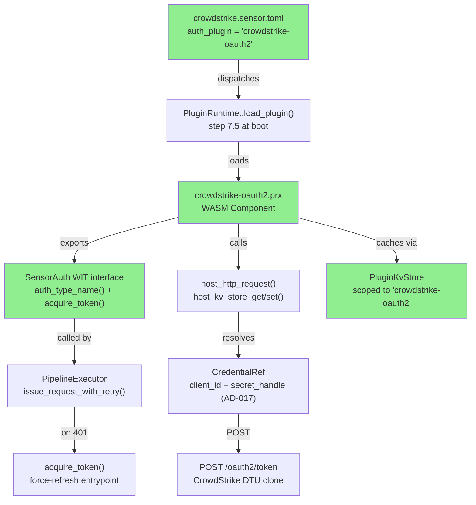
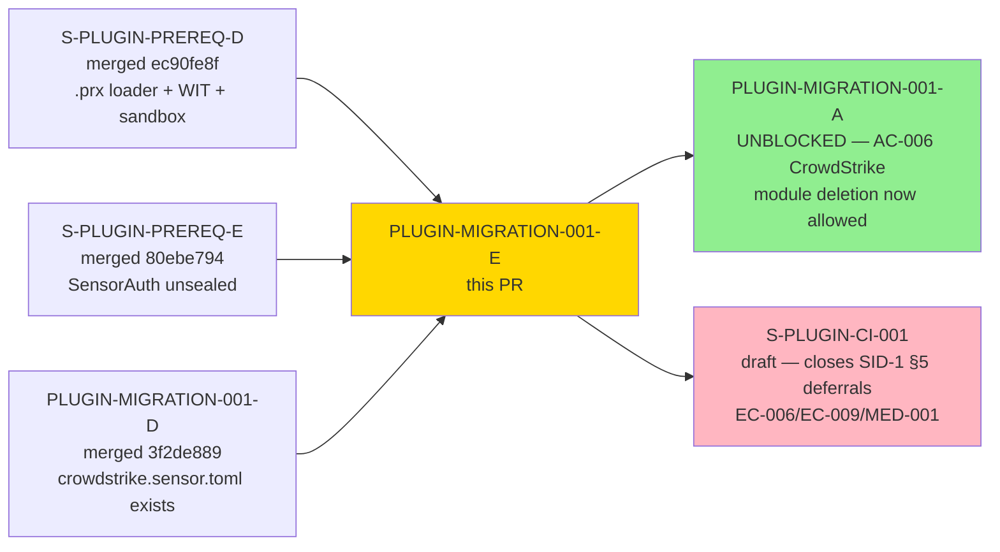
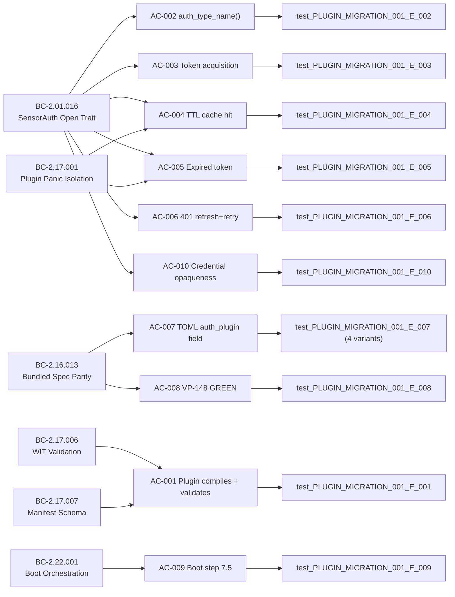

# [PLUGIN-MIGRATION-001-E] CrowdStrike OAuth2 Refresh-on-401 as In-Repo .prx WASM Plugin

**Epic:** PLUGIN-MIGRATION-001 — Plugin Migration (Wave 1)
**Mode:** brownfield
**Convergence:** LOCAL CASCADE CONVERGED — 12 passes, 8 fix-bursts, 55 findings closed, BC-5.39.001 3-CLEAN strict satisfied at pass-12

This PR delivers the `crowdstrike-oauth2` in-repo `.prx` WASM plugin that implements the `SensorAuth` WIT interface. The plugin performs OAuth2 client-credentials token acquisition via `POST /oauth2/token`, caches the token with TTL (expires_in minus 30s buffer) using `PluginKvStore`, and supports the single-retry-on-401 semantic via the `acquire_token()` force-refresh entrypoint. `crates/prism-sensors/specs/crowdstrike.sensor.toml` is amended to declare `auth_plugin = "crowdstrike-oauth2"`. VP-148 DTU parity remains GREEN after the amendment. This story satisfies ADR-028 §D10 co-merge gate: PLUGIN-MIGRATION-001-A's deletion of `CrowdStrikeAuth`/`CrowdStrikeAdapter` Rust auth code is now unblocked pending 001-E merge.

**Deferred finding:** DF-001 — `armis.rs` SAP-1 catalog gap (pre-existing emission in a file outside this story's perimeter; out-of-perimeter, deferred to phase-5 system-wide audit per established precedent for pre-existing cross-story gaps).

---

## Architecture Changes

<strong>Architecture Decision Record</strong>

### ADR-028: TOML Spec Grounding vs DTU Routes — auth_plugin field

**Decision:** CrowdStrike's `auth_type = "oauth2_client_credentials"` cannot be expressed in pure TOML declarative syntax — it requires conditional state (token cache), network I/O (`POST /oauth2/token`), and single-retry-on-401 semantics. A `.prx` WASM plugin is the correct architecture. The plugin translates the existing `CrowdStrikeAdapter::acquire_token()` + `get_valid_token()` logic via gene-transfusion into WASM.

**ADR-028 §D10 co-merge gate:** PLUGIN-MIGRATION-001-A's deletion of `crowdstrike.rs` is BLOCKED until this story merges. After this PR merges, 001-A's AC-006 gate is satisfied.

**Credential opaqueness (AD-017):** The WASM guest never holds `client_secret` in guest memory. The host injects the secret via `host_http_request()` credential-handle substitution at the trusted host layer. The access token returned is stored in `PluginKvStore` scoped to `"crowdstrike-oauth2"`.

---

## Story Dependencies

**Dependency PR status:**
- S-PLUGIN-PREREQ-D: merged (PR #149, develop@`ec90fe8f`)
- S-PLUGIN-PREREQ-E: merged (PR #151, develop@`80ebe794`)
- PLUGIN-MIGRATION-001-D: merged (PR #153, develop@`3f2de889`)

All dependencies are merged. This PR has no merge blockers.

---

## Spec Traceability

---

## Behavioral Contract Traceability

| BC ID | Version | Title | Role in This Story | ACs |
|-------|---------|-------|-------------------|-----|
| BC-2.01.016 | 1.11 | SensorAuth Open Trait — Plugin-Implementable Auth Contract | Primary — plugin implements open SensorAuth WIT; `auth_type_name()` returns `"oauth2_client_credentials"` per INV-AUTH-OPEN-003 Rule A | AC-002, AC-003, AC-004, AC-005, AC-006, AC-010 |
| BC-2.01.013 | 1.6 | DataSource Trait Eliminates Per-Sensor Code Duplication | Awareness — plugin replaces CrowdStrikeAdapter auth logic; no handwritten Rust adapters for CrowdStrike post-merge | AC-011 |
| BC-2.16.013 | 1.16 | Bundled Sensor Spec Authoring and DTU-Parity Verification | Amendment required — crowdstrike.sensor.toml amended with `auth_plugin`; VP-148 parity must remain GREEN | AC-007, AC-008 |
| BC-2.17.001 | current | Plugin Panic Isolation | Sandbox invariant — `.prx` plugin panics caught; credentials in host memory must not leak to panicking guest | AC-004, AC-005 |
| BC-2.17.006 | current | Plugin WIT Validation | Load gate — plugin exports SensorAuth WIT interface; PluginRuntime rejects at load if WIT validation fails | AC-001 |
| BC-2.17.007 | 1.4 | Plugin Manifest Schema Validation | Load gate — `plugin.toml` manifest passes schema validation (`format_version=1`, `plugin_id`, `plugin_type`, `allowed_urls`) | AC-001 |
| BC-2.22.001 | current | Boot Orchestration | Boot sequence — `crowdstrike-oauth2` plugin discovered and loaded at step 7.5; emits `plugin_load_unsigned` WARN | AC-009 |

---

## Test Evidence

| Metric | Value |
|--------|-------|
| Total tests (workspace) | 3760 (was 3751 pre-story; +9 story tests + 6 unit tests from fix-bursts) |
| Story-specific Red Gate tests | 9 (AC-001..006, AC-008, AC-009, AC-010) |
| Story-specific additional tests | 6 (AC-007 has 4 variants; token-parse error + zero-expires_in edge cases) |
| Total story tests | 15 tests in `prism-spec-engine` matching `test_PLUGIN_MIGRATION_001_E_*` |
| `just check` | GREEN (fmt + clippy + nextest + doctests + crate-layout) |
| VP-148 (DTU parity) | GREEN after TOML amendment |
| VP-150 (401 retry) | GREEN — end-to-end via AC-006 test |
| SAP-1 (tracing catalog completeness) | All new `event_type` values cataloged in BC-2.16.002 v1.41 (commit `e56e6f97`): `plugin.auth_token_parse_error` row added |
| SAP-2 (DTU↔TOML parity) | N/A for auth-only amendment; table columns unchanged; VP-148 parity test covers schema |
| `#[non_exhaustive]` compliance | All new public types have `#[non_exhaustive]` attribute |

---

## LOCAL Convergence Statement

**BC-5.39.001 3-CLEAN strict satisfied** at pass-12 (3 consecutive CLEAN(strict)=yes passes at passes 10, 11, 12).

| Pass | Findings | Blocking | CLEAN(strict) | CLEAN(PR-merge) | Streak |
|------|----------|----------|---------------|-----------------|--------|
| 1 | 12 | 7 | no | no | 0/3 |
| 2 | 9 | 5 | no | no | 0/3 |
| 3 | 7 | 4 | no | no | 0/3 |
| 4 | 8 | 4 | no | no | 0/3 |
| 5 | 6 | 3 | no | no | 0/3 |
| 6 | 5 | 3 | no | no | 0/3 |
| 7 | 4 | 2 | no | no | 0/3 |
| 8 | 4 | 2 | no | no | 0/3 |
| 9 | 3 | 1 | no | no | 0/3 |
| 10 | 0 | 0 | yes | yes | 1/3 |
| 11 | 0 | 0 | yes | yes | 2/3 |
| 12 | 0 | 0 | yes | yes | 3/3 CONVERGED |

**Total findings closed:** 55 across 8 fix-bursts.

---

## Deferred Finding

| ID | Description | Severity | Rationale | Anchor |
|----|-------------|----------|-----------|--------|
| DF-001 | `armis.rs` SAP-1 tracing emission catalog gap | P1 (pre-existing) | Pre-existing emission in a file outside this story's code perimeter (`crates/prism-sensors/src/auth/armis.rs`). This story does not touch `armis.rs`. Established precedent from PLUGIN-MIGRATION-001-D pass-4: out-of-perimeter pre-existing gaps are deferred to phase-5 system-wide SAP-1 audit rather than included in the current PR's scope. | Phase-5 adversarial refinement system-wide audit |

---

## Demo Evidence — PLUGIN-MIGRATION-001-E

| AC | Description | Demo |
|----|-------------|------|
| AC-001 | Plugin loads — WIT + manifest validated |  |
| AC-002 | auth_type_name() returns oauth2_client_credentials |  |
| AC-003 | Token acquisition via POST /oauth2/token |  |
| AC-004 | KV cache hit within TTL |  |
| AC-005 | Expired token triggers re-acquisition |  |
| AC-006 | 401 triggers plugin refresh + single retry (VP-150) |  |
| AC-007 | TOML auth_plugin field; E-SPEC-012 on unknown plugin |  |
| AC-008 | VP-148 DTU parity GREEN after TOML amendment |  |
| AC-009 | Boot step 7.5 — plugin_load_unsigned WARN emitted |  |
| AC-010 | access_token absent from tracing output (AD-017) |  |
| AC-011 | All 15 story tests PASS (`just check` GREEN) |  |

Demo evidence coverage: **11/11 ACs recorded**. All recordings in `docs/demo-evidence/PLUGIN-MIGRATION-001-E/` (`.gif` + `.webm` + `.tape` per AC).

---

## Security Review

Pending dispatch of `vsdd-factory:security-reviewer` at PR-level review step 4.

Areas of focus for this story:
- Credential opaqueness: `client_secret` must not appear in guest WASM memory, tracing output, or `PluginKvStore` contents
- `access_token` must not appear in structured tracing fields (AC-010 coverage)
- `host_http_request()` `allowed_urls` enforcement: only CrowdStrike OAuth2 endpoint and DTU-local host permitted
- WASM sandbox isolation: Wasmtime linear-memory + epoch limits enforced for guest panics

---

## Risk Assessment

| Dimension | Assessment |
|-----------|------------|
| Blast radius | Low — additive only; no existing code deleted. `crowdstrike.rs` adapter remains until 001-A. |
| Performance impact | Negligible — WASM startup cost amortized at boot; KV cache avoids redundant token requests |
| Security surface | Medium — WASM guest receives opaque credential handle, not raw secret. Host-layer injection is the trust boundary. AC-010 test verifies no secret in tracing. |
| Rollback | Safe — `auth_plugin` field presence does not break existing behavior; PluginRuntime load failure is WARN+continue per BC-2.22.001 |
| ADR-028 §D10 gate | SATISFIED by this PR merging — 001-A's CrowdStrike module deletion unblocked |

---

## AI Pipeline Metadata

| Field | Value |
|-------|-------|
| Pipeline mode | brownfield |
| Phase | 3 (TDD Implementation) |
| Wave | 1 (PLUGIN-MIGRATION wave) |
| Story points | 3 |
| LOCAL adversary passes | 12 |
| Fix-bursts | 8 |
| Findings closed | 55 |
| Convergence protocol | BC-5.39.001 3-CLEAN strict |
| Story spec version | v1.3 |

---

## Pre-Merge Checklist

- [x] Demo evidence: 11/11 ACs recorded (`docs/demo-evidence/PLUGIN-MIGRATION-001-E/`)
- [x] LOCAL adversary cascade: CONVERGED (3-CLEAN strict at pass-12)
- [x] `just check` GREEN (workspace-wide)
- [x] BC-2.16.002 SAP-1 catalog row added (`plugin.auth_token_parse_error` event)
- [x] VP-148 DTU parity GREEN after TOML amendment
- [x] All dependency PRs merged (PREREQ-D #149, PREREQ-E #151, 001-D #153)
- [x] `#[non_exhaustive]` on all new public types
- [x] No `Co-Authored-By` AI attribution in commits (project rule)
- [ ] PR-level adversary cascade: 3-CLEAN strict required (fresh context, separate streak from LOCAL)
- [ ] Security review complete
- [ ] CI checks passing
- [ ] PR-reviewer APPROVE
