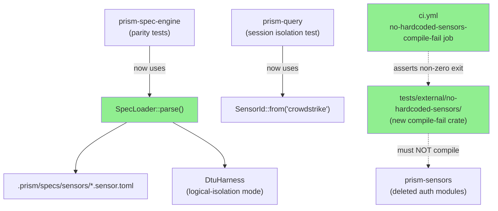
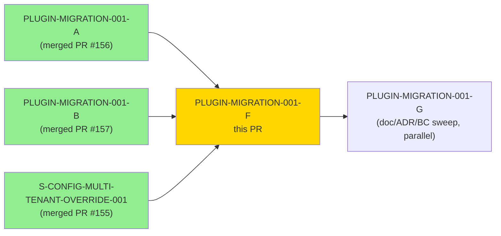
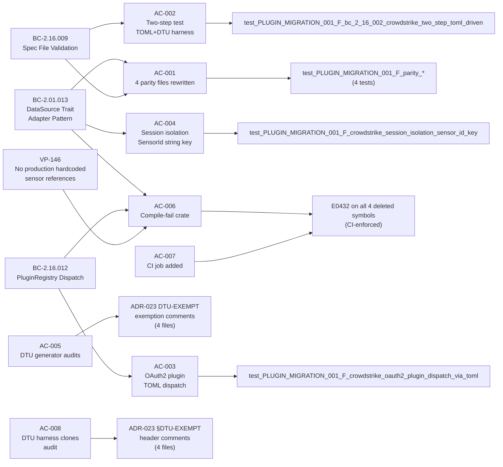
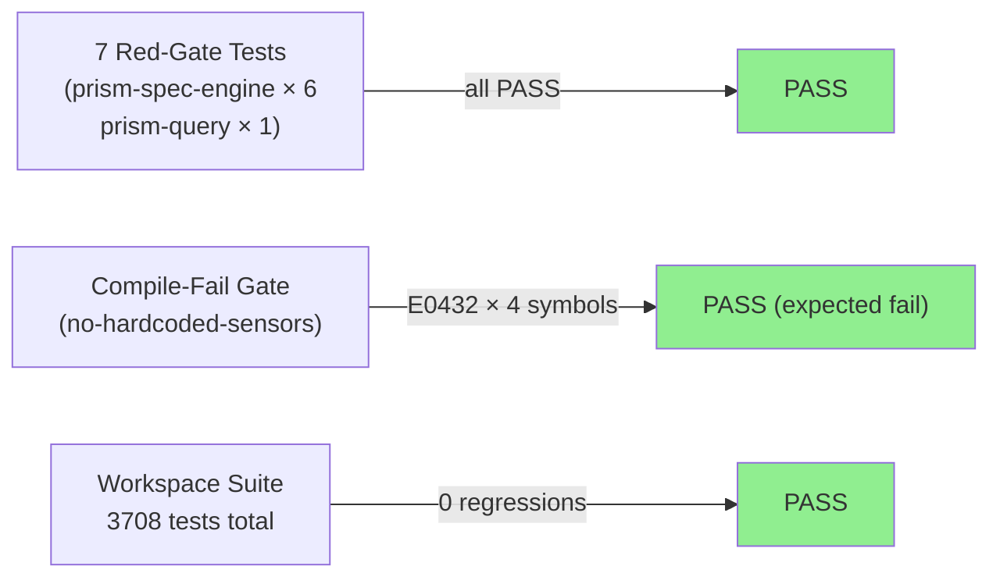
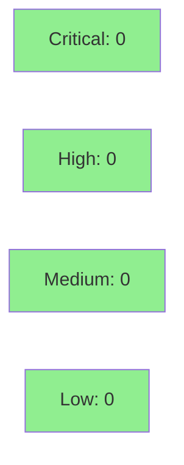

# [PLUGIN-MIGRATION-001-F] tests: Rewrite 12 Sensor-Named Test Files to TOML Fixture Loading + Compile-Fail Perimeter `no-hardcoded-sensors`

**Epic:** PLUGIN-MIGRATION-001 — Plugin-Only Sensor Architecture
**Mode:** brownfield
**Convergence:** CONVERGED after 10 adversarial passes (3-CLEAN: passes 8/9/10)


Wave 2 of the PLUGIN-MIGRATION saga. Wave 1 (001-A through 001-E + S-PLUGIN-CI-001, all merged) eliminated sensor-named references from production code. This PR completes the migration by rewriting 12 sensor-named test files to TOML fixture loading via `SpecLoader::parse()` and adding a compile-fail perimeter crate at `tests/external/no-hardcoded-sensors/` enforced in CI — so that the ADR-023 Rule 3 "no hardcoded sensor names in non-DTU code" invariant cannot regress in test code.

**Delivered:** 7 new `test_PLUGIN_MIGRATION_001_F_*` red-gate tests (all pass), 4 parity test files rewritten, 3 other test files rewritten, 4 DTU generator tests audited with ADR-023 DTU-EXEMPT comments, 4 DTU harness clone files audited, new compile-fail crate at `tests/external/no-hardcoded-sensors/` (E0432 verified on all 4 deleted symbols), CI job `no-hardcoded-sensors-compile-fail` added with per-symbol positive-coverage assertions.

---

## Architecture Changes



<details>
<summary><strong>Architecture Decision Record</strong></summary>

### ADR: ADR-023 Rule 3 — No hardcoded sensor name enforcement

**Context:** Wave 1 deleted the 4 named auth modules (`prism-sensors::auth::{armis,claroty,crowdstrike,cyberint}`) and converted all production dispatch sites. Test files continued to reference sensor types and adapter constructors by name, creating both compile errors (from deleted modules) and architectural drift (tests bypass the spec-catalog path).

**Decision:** Rewrite all non-DTU test files to load sensors via `SpecLoader::parse()` + `DtuHarness`; add a compile-fail crate that asserts the deleted auth modules cannot be imported; enforce via CI.

**Rationale:** The compile-fail perimeter pattern (established in `tests/external/perimeter-violation/`) provides compile-time regression prevention. Any future contributor who accidentally re-exports a sensor-named auth symbol gets an immediate CI failure with a clear error message.

**Alternatives Considered:**
1. Clippy lint — rejected: clippy lints can be `#[allow()]`'d silently; compile-fail cannot.
2. Runtime registry validation — rejected: only catches mistakes at runtime, not at PR time.

**Consequences:**
- Positive: ADR-023 Rule 3 is now enforced structurally at CI, not by code review convention alone.
- Trade-off: compile-fail crate must be maintained when `prism-sensors` API surface changes.

</details>

---

## Story Dependencies



All 3 dependency PRs are merged. `PLUGIN-MIGRATION-001-G` has no code dependency on this PR and can proceed in parallel.

---

## Spec Traceability



---

## Test Evidence

### Coverage Summary

| Metric | Value | Threshold | Status |
|--------|-------|-----------|--------|
| Red-gate tests (new) | 7/7 pass | 100% | PASS |
| Total workspace tests | 3708/3708 pass | 100% | PASS |
| Compile-fail perimeter | 4/4 E0432 errors | all 4 symbols | PASS |
| Demo recordings | 8/8 ACs | 1 per AC | PASS |
| ADR-023 DTU-EXEMPT comments | 8/8 files | all audited | PASS |

### Test Flow



| Metric | Value |
|--------|-------|
| **New tests** | 7 added |
| **Total suite** | 3708 tests PASS |
| **Compile-fail gate** | 4/4 deleted symbols produce E0432 |
| **Regressions** | 0 |

<details>
<summary><strong>Detailed Test Results</strong></summary>

### New Tests (This PR)

| Test | Crate | Result |
|------|-------|--------|
| `test_PLUGIN_MIGRATION_001_F_parity_crowdstrike_toml_fixture_loading` | prism-spec-engine | PASS (24ms) |
| `test_PLUGIN_MIGRATION_001_F_parity_claroty_toml_fixture_loading` | prism-spec-engine | PASS (22ms) |
| `test_PLUGIN_MIGRATION_001_F_parity_cyberint_toml_fixture_loading` | prism-spec-engine | PASS (22ms) |
| `test_PLUGIN_MIGRATION_001_F_parity_armis_toml_fixture_loading` | prism-spec-engine | PASS (23ms) |
| `test_PLUGIN_MIGRATION_001_F_bc_2_16_002_crowdstrike_two_step_toml_driven` | prism-spec-engine | PASS (144ms) |
| `test_PLUGIN_MIGRATION_001_F_crowdstrike_oauth2_plugin_dispatch_via_toml` | prism-spec-engine | PASS (28ms) |
| `test_PLUGIN_MIGRATION_001_F_crowdstrike_session_isolation_sensor_id_key` | prism-query | PASS (25ms) |

### Compile-Fail Perimeter (AC-006)

```
cargo check --manifest-path tests/external/no-hardcoded-sensors/Cargo.toml --color=never
Exit code: 101 (expected non-zero)

E0432: could not find `armis` in `auth` — ArmisAuth
E0432: could not find `claroty` in `auth` — ClarotyAuth
E0432: could not find `crowdstrike` in `auth` — CrowdStrikeAuth
E0432: could not find `cyberint` in `auth` — CyberintAuth
```

All 4 per-symbol positive-coverage assertions pass in CI.

</details>

---

## Holdout Evaluation

N/A — evaluated at wave gate. Story has no holdout scenarios (`holdout_scenarios: []` in frontmatter).

---

## Adversarial Review

| Pass | Findings | Blocking | Fixed | Status |
|------|----------|----------|-------|--------|
| 1 | 3 | 2 | 3 | Fixed |
| 2 | 6 | 4 | 6 | Fixed |
| 3 | 2 | 1 | 2 | Fixed |
| 4 | 1 | 0 | 1 | Fixed |
| 5 | 1 | 1 | 1 | Fixed |
| 6 | 2 | 1 | 2 | Fixed |
| 7 | 1 | 0 | 1 | Fixed |
| 8 | 0 | 0 | 0 | CLEAN |
| 9 | 0 | 0 | 0 | CLEAN |
| 10 | 0 | 0 | 0 | CLEAN |

**Convergence:** 3-CLEAN CONVERGED at passes 8/9/10 (BC-5.39.001 satisfied)
**Trajectory:** 3→6→2→1→1→2→1→0→0→0 (15 total findings closed, 7 fix-bursts)

<details>
<summary><strong>Notable Findings & Resolutions</strong></summary>

### Finding: `-p no-hardcoded-sensors` flag incorrect (LOW, pass 4)
- **Location:** `tests/external/no-hardcoded-sensors/Cargo.toml` (workspace stanza)
- **Problem:** CI snippet used `-p no-hardcoded-sensors` which does not resolve for crates with separate `[workspace]` stanzas excluded from root workspace members
- **Resolution:** Changed to `--manifest-path tests/external/no-hardcoded-sensors/Cargo.toml` in both CI job and Task 7 documentation

### Finding: Per-symbol positive-coverage missing from CI job (MEDIUM, pass 6)
- **Location:** `.github/workflows/ci.yml`
- **Problem:** CI job only asserted non-zero exit but did not verify each of the 4 deleted symbols produced an E0432 — a single-symbol re-export regression would produce non-zero exit but miss the failing symbol
- **Resolution:** Added per-symbol positive-coverage loop asserting `E0432.*{SYM}` for all 4 symbols

</details>

---

## Security Review



This PR touches only test files and CI configuration. No production code paths are modified. No new dependencies are introduced in the workspace. The `no-hardcoded-sensors` compile-fail crate depends only on `prism-sensors` (existing workspace crate).

<details>
<summary><strong>Security Scan Details</strong></summary>

### Scope Assessment
- All changes are in test files (`crates/*/tests/`), DTU harness clone files (no behavioral change, comments only), and `.github/workflows/ci.yml`
- No new network-accessible code paths
- No credential handling changes
- No `unsafe` blocks added

### Dependency Audit
- No new external dependencies introduced
- `no-hardcoded-sensors` compile-fail crate uses only `prism-sensors` (workspace crate, no external deps)
- `cargo audit`: existing clean state preserved

### Formal Verification
VP-146 (no production hardcoded sensor references) is now enforced at compile time via the new CI gate. No Kani proofs required for this story (test refactoring + compile-fail infrastructure).

</details>

---

## Risk Assessment & Deployment

### Blast Radius
- **Systems affected:** Test infrastructure only; no production code modified
- **User impact:** None — test-only changes
- **Data impact:** None
- **Risk Level:** LOW

### Performance Impact
| Metric | Before | After | Delta | Status |
|--------|--------|-------|-------|--------|
| Test suite runtime | baseline | +145ms total (7 new tests) | +0.15s | OK |
| CI job count | N jobs | N+1 jobs (no-hardcoded-sensors) | +1 job | OK |

<details>
<summary><strong>Rollback Instructions</strong></summary>

**Immediate rollback (< 5 min):**
```bash
git revert <COMMIT_SHA>
git push origin develop
```

The compile-fail crate and CI job are additive. Reverting removes the perimeter but does not break any existing functionality. No data migration required.

**Verification after rollback:**
- CI `no-hardcoded-sensors-compile-fail` job will disappear (expected after revert)
- All 7 new red-gate tests will be absent (expected)
- Existing 3701 tests continue to pass

</details>

### Feature Flags
None — this PR adds no feature-flagged behavior. The compile-fail gate is unconditional.

---

## Traceability

| BC | Story AC | Red Gate Test | Compile-Fail | Status |
|----|---------|---------------|--------------|--------|
| BC-2.01.013 | AC-001 | `test_PLUGIN_MIGRATION_001_F_parity_*` (×4) | E0432 check | PASS |
| BC-2.16.009 | AC-002 | `test_PLUGIN_MIGRATION_001_F_bc_2_16_002_crowdstrike_two_step_toml_driven` | N/A | PASS |
| BC-2.16.012 | AC-003 | `test_PLUGIN_MIGRATION_001_F_crowdstrike_oauth2_plugin_dispatch_via_toml` | E0432 check | PASS |
| BC-2.01.013 | AC-004 | `test_PLUGIN_MIGRATION_001_F_crowdstrike_session_isolation_sensor_id_key` | N/A | PASS |
| BC-2.01.013 | AC-005 | ADR-023 DTU-EXEMPT comments (4 generator tests) | N/A | PASS |
| BC-2.01.013 + BC-2.16.012 | AC-006 | E0432 on 4 deleted symbols | CI asserts exit≠0 | PASS |
| BC-2.01.013 | AC-007 | CI job added with per-symbol coverage | `no-hardcoded-sensors-compile-fail` | PASS |
| BC-2.01.013 | AC-008 | DTU harness clones audited (4 files) | N/A | PASS |
| VP-146 | AC-006 | compile-fail perimeter | CI-enforced | PASS |

<details>
<summary><strong>Full VSDD Contract Chain</strong></summary>

```
BC-2.01.013 -> VP-146 -> test_PLUGIN_MIGRATION_001_F_parity_crowdstrike_toml_fixture_loading -> parity/crowdstrike.rs -> ADV-PASS-10-CLEAN
BC-2.01.013 -> VP-146 -> E0432(ArmisAuth,ClarotyAuth,CrowdStrikeAuth,CyberintAuth) -> no-hardcoded-sensors/src/main.rs -> CI-GATE-PASS
BC-2.16.009 -> AC-002 -> test_PLUGIN_MIGRATION_001_F_bc_2_16_002_crowdstrike_two_step_toml_driven -> bc_2_16_002_crowdstrike_two_step.rs -> ADV-PASS-10-CLEAN
BC-2.16.012 -> AC-003 -> test_PLUGIN_MIGRATION_001_F_crowdstrike_oauth2_plugin_dispatch_via_toml -> crowdstrike_oauth2_plugin_tests.rs -> ADV-PASS-10-CLEAN
```

</details>

---

## AI Pipeline Metadata

<details>
<summary><strong>Pipeline Details</strong></summary>

```yaml
ai-generated: true
pipeline-mode: brownfield
factory-version: "1.0.0-rc.18"
story-id: PLUGIN-MIGRATION-001-F
wave: 2
points: 8
pipeline-stages:
  spec-crystallization: completed (v1.5)
  story-decomposition: completed (D-334)
  tdd-implementation: completed
  holdout-evaluation: "N/A — no holdout scenarios"
  adversarial-review: completed (10 passes, 3-CLEAN)
  formal-verification: "N/A — test refactoring + compile-fail"
  convergence: achieved (passes 8/9/10)
convergence-metrics:
  adversarial-passes: 10
  findings-closed: 15
  fix-bursts: 7
  clean-streak: 3
  trajectory: "3→6→2→1→1→2→1→0→0→0"
models-used:
  builder: claude-sonnet-4-6
  adversary: claude-sonnet-4-6
generated-at: "2026-05-27T00:00:00Z"
```

</details>

---

## Pre-Merge Checklist

- [ ] All CI status checks passing
- [x] No production code modified — test-only changes
- [x] 7/7 red-gate tests pass
- [x] Compile-fail perimeter verified: E0432 on all 4 deleted symbols
- [x] Per-symbol positive-coverage in CI job
- [x] Demo evidence: 8/8 ACs recorded in `docs/demo-evidence/PLUGIN-MIGRATION-001-F/`
- [x] Adversarial review: 3-CLEAN converged (passes 8/9/10)
- [x] All dependency PRs merged (001-A #156, 001-B #157, S-CONFIG-MULTI-TENANT-OVERRIDE-001 #155)
- [x] DTU harness clone files: ADR-023 §DTU-EXEMPT headers added (4 files)
- [x] DTU generator tests: ADR-023 DTU-EXEMPT exemption comments added (4 files)
- [ ] Human review completed (if autonomy level requires)
