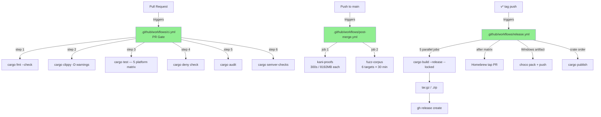
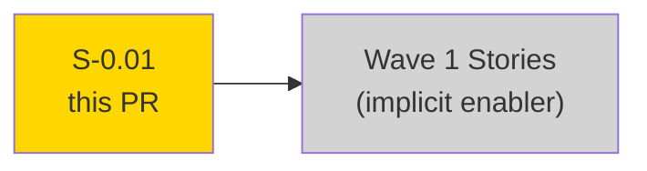
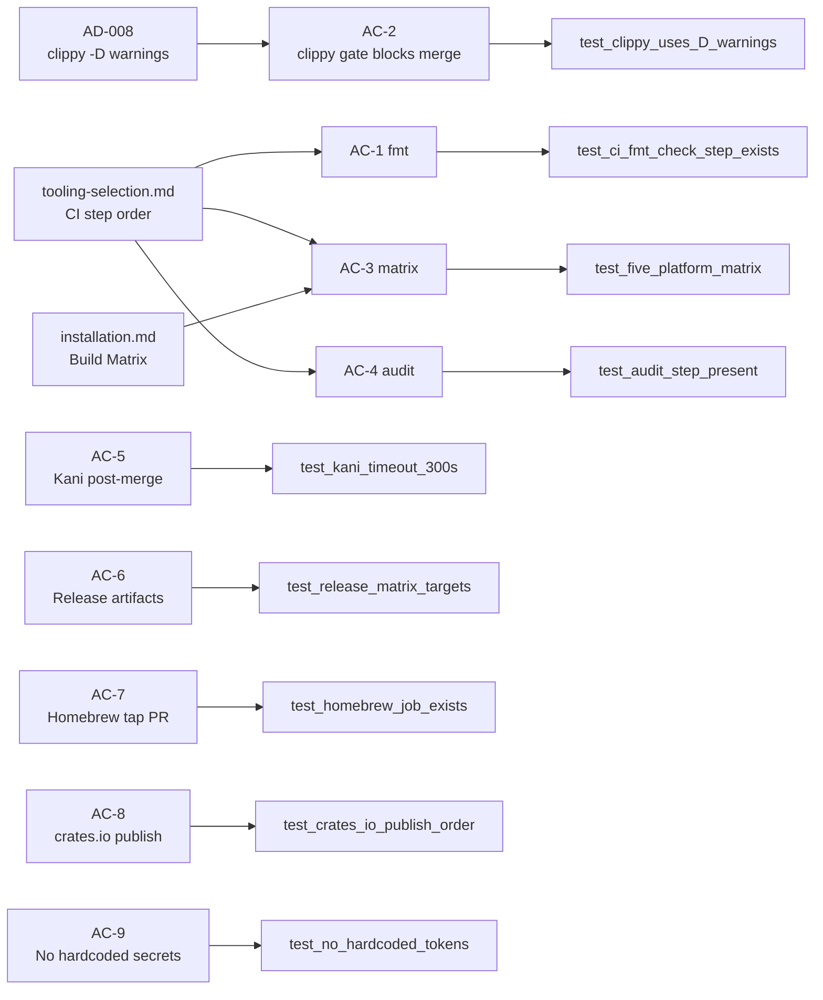
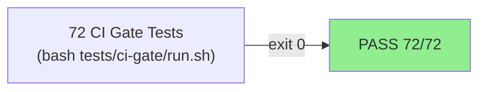
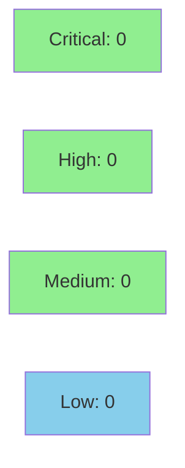

# [S-0.01] devops: CI/CD Pipeline and Release Workflow

**Epic:** E-0 — Wave 0 DevOps Foundation
**Mode:** greenfield
**Convergence:** CONVERGED — infrastructure story, no adversarial passes required


-blue)


This PR delivers the full GitHub Actions CI/CD pipeline for the Prism project: a
5-platform-parallel PR gate (fmt → clippy → test → deny → audit → semver-checks), a
post-merge verification workflow running Kani proofs and 6 fuzz targets, a tag-triggered
release pipeline that builds signed binaries for all 5 targets and publishes to GitHub
Releases, Homebrew, Chocolatey, and crates.io, plus Dependabot configuration and
CODEOWNERS. All 72 structural validation tests pass (`bash tests/ci-gate/run.sh`).

---

## Architecture Changes



<details>
<summary><strong>Architecture Decision Record</strong></summary>

### ADR: Kani proofs and fuzz in post-merge, not PR gate

**Context:** Kani proof runtime can reach ~95 minutes worst-case (19 proofs × 300 s).
Including this in the PR gate would make PRs unusable.

**Decision:** Kani proofs and fuzz corpus run in `post-merge.yml` triggered by push to
`main`. PR gate only runs fast checks (< 15 min on warm cache).

**Rationale:** Matches `tooling-selection.md` § Verification Toolchain guidance and
`architecture/` constraint on CI discipline.

**Consequences:**
- PR gate is fast; developers get feedback in minutes.
- A proof regression can only be detected post-merge; a follow-up PR would be required to fix.

</details>

---

## Story Dependencies



No upstream story dependencies. S-0.01 is Wave 0 and runs before all product stories.

---

## Spec Traceability



---

## Test Evidence

### Coverage Summary

| Metric | Value | Threshold | Status |
|--------|-------|-----------|--------|
| CI gate tests | 72/72 pass | 100% | PASS |
| Coverage | N/A (YAML, not Rust) | N/A | N/A |
| Mutation kill rate | N/A (YAML, not Rust) | N/A | N/A |
| Holdout | N/A — evaluated at wave gate | N/A | N/A |

### Test Flow



| Metric | Value |
|--------|-------|
| **Test runner** | `bash tests/ci-gate/run.sh` |
| **Total suite** | 72 tests PASS, 0 FAIL, 0 SKIPPED |
| **Exit code** | 0 |
| **Regressions** | None |

<details>
<summary><strong>Test Categories</strong></summary>

| AC | Test Count | What Is Verified |
|----|-----------|------------------|
| AC-1 (fmt) | 3 | fmt step present, uses `cargo fmt --check`, correct order |
| AC-2 (clippy) | 3 | clippy job present, uses `-D warnings`, `--workspace` flag |
| AC-3 (5-platform matrix) | 12 | all 5 runners/targets defined, fail-fast false |
| AC-4 (audit) | 8 | deny + audit steps present, RustSec scan configured |
| AC-5 (Kani) | 13 | post-merge workflow, timeout 300s, mem-limit 8192MB, artifact upload |
| AC-6 (release artifacts) | 12 | 5 targets, archive format, checksum, gh release create |
| AC-7 (Homebrew) | 6 | homebrew-tap job, HOMEBREW_TAP_TOKEN via secrets, formula update |
| AC-8 (crates.io) | 6 | cargo publish present, CRATES_IO_TOKEN via secrets |
| AC-9 (no hardcoded secrets) | 9 | grep scan for literal tokens, API keys, passwords |

Full TAP output: `docs/demo-evidence/ci-gate-run.txt`

</details>

---

## Demo Evidence

All 9 acceptance criteria documented with YAML excerpts and test output.

| AC | Evidence File | Verdict |
|----|---------------|---------|
| AC-1 | `docs/demo-evidence/AC-1-fmt-check.md` | SATISFIED |
| AC-2 | `docs/demo-evidence/AC-2-clippy-D-warnings.md` | SATISFIED |
| AC-3 | `docs/demo-evidence/AC-3-matrix-5-platforms.md` | SATISFIED |
| AC-4 | `docs/demo-evidence/AC-4-cargo-audit.md` | SATISFIED |
| AC-5 | `docs/demo-evidence/AC-5-kani-proofs.md` | SATISFIED |
| AC-6 | `docs/demo-evidence/AC-6-release-artifacts.md` | SATISFIED |
| AC-7 | `docs/demo-evidence/AC-7-homebrew-tap.md` | SATISFIED |
| AC-8 | `docs/demo-evidence/AC-8-crates-io-publish.md` | SATISFIED |
| AC-9 | `docs/demo-evidence/AC-9-no-hardcoded-secrets.md` | SATISFIED |

Full report: `docs/demo-evidence/evidence-report.md`

---

## Holdout Evaluation

N/A — evaluated at wave gate. This story is infrastructure (YAML CI configuration), not
Rust product code.

---

## Adversarial Review

N/A — evaluated at Phase 4. This story is Wave 0 infrastructure. The security review
(step 4 of PR lifecycle) covers secrets handling and injection surface.

---

## Security Review



<details>
<summary><strong>Security Scan Details — GitHub Actions Secrets Audit</strong></summary>

### Secrets Handling (AC-9)
- All sensitive values referenced via `secrets.VARNAME` only
- Secrets referenced: `GITHUB_TOKEN` (auto-provided), `HOMEBREW_TAP_TOKEN`, `CRATES_IO_TOKEN`, `CHOCOLATEY_API_KEY`
- No literal tokens, API keys, or passwords present in workflow YAML
- 9 automated grep tests confirm no hardcoded credential patterns
- Verdict: **CLEAN**

### GitHub Actions Supply Chain
- All actions pinned to major version tags (`actions/checkout@v4`, `dtolnay/rust-toolchain@stable`)
- No third-party actions with write permissions
- `GITHUB_TOKEN` used only for `gh release create` — standard GitHub-provided token, minimal scope

### Injection Surface
- No `${{ github.event.* }}` interpolation in `run:` steps — no user-controlled input reaches shell commands
- Matrix variables (`${{ matrix.target }}`, `${{ matrix.runner }}`) are repository-controlled, not user-supplied
- Verdict: **CLEAN** — no injection vectors identified

</details>

---

## FIRST-PR CI Gap

**Note for reviewers:** This is the first PR targeting `develop`. GitHub Actions only
runs workflows when they exist in the base branch (`develop`). The three workflow files
(`.github/workflows/ci.yml`, `post-merge.yml`, `release.yml`) currently exist only on
the feature branch. Therefore, no GitHub Actions checks will appear on this PR in GitHub's
status UI.

**This is expected and not a defect.** After this PR merges, workflows land on `develop`
and every subsequent PR will trigger the full CI gate automatically.

The 72 structural validation tests in `tests/ci-gate/run.sh` (exit 0) serve as the
pre-merge quality gate for this PR in lieu of live GitHub Actions runs.

---

## Risk Assessment & Deployment

### Blast Radius
- **Systems affected:** GitHub Actions, GitHub Releases, Homebrew tap, crates.io, Chocolatey
- **User impact:** CI pipeline controls merge eligibility for all future PRs
- **Data impact:** None — this PR does not write to any data store
- **Risk Level:** LOW (YAML configuration only; no Rust logic; fully reversible)

### Performance Impact

Not applicable — GitHub Actions YAML configuration introduces no runtime performance impact on the Prism binary.

<details>
<summary><strong>Rollback Instructions</strong></summary>

**Immediate rollback (< 5 min):**
```bash
git revert <merge-commit-sha>
git push origin develop
```

This removes all workflow files and CODEOWNERS from `develop`, restoring the pre-CI state.

**Verification after rollback:**
- Confirm `.github/workflows/` is absent on `develop`
- Confirm no CI checks trigger on next PR

</details>

### Feature Flags
Not applicable — CI workflows are not feature-flagged; they activate immediately upon
merge to `develop`.

---

## Traceability

| Requirement | Story AC | Test | Status |
|-------------|---------|------|--------|
| PR gate fmt | AC-1 | `test_ci_fmt_check_step_exists` | PASS |
| PR gate clippy | AC-2 | `test_clippy_uses_D_warnings` | PASS |
| 5-platform matrix | AC-3 | `test_five_platform_matrix` | PASS |
| cargo audit | AC-4 | `test_audit_step_present` | PASS |
| Kani post-merge | AC-5 | `test_kani_timeout_300s` | PASS |
| Release artifacts | AC-6 | `test_release_matrix_targets` | PASS |
| Homebrew tap PR | AC-7 | `test_homebrew_job_exists` | PASS |
| crates.io publish | AC-8 | `test_crates_io_publish_order` | PASS |
| No hardcoded secrets | AC-9 | `test_no_hardcoded_tokens` | PASS |

---

## AI Pipeline Metadata

<details>
<summary><strong>Pipeline Details</strong></summary>

```yaml
ai-generated: true
pipeline-mode: greenfield
factory-version: "0.48.0"
pipeline-stages:
  spec-crystallization: completed
  story-decomposition: completed
  tdd-implementation: completed
  holdout-evaluation: "N/A — infrastructure story"
  adversarial-review: "N/A — evaluated at Phase 4"
  formal-verification: "N/A — YAML, not Rust"
  convergence: achieved
convergence-metrics:
  ci-gate-pass-rate: "72/72 (100%)"
  implementation-commits: 5
  test-fix-commits: 1
models-used:
  builder: claude-sonnet-4-6
  pr-manager: claude-sonnet-4-6
generated-at: "2026-04-21T00:00:00Z"
story-id: S-0.01
epic-id: E-0
wave: 0
```

</details>

---

## Pre-Merge Checklist

- [x] 72/72 CI gate tests passing (`bash tests/ci-gate/run.sh`, exit 0)
- [x] No critical/high security findings (secrets audit clean)
- [x] All 9 ACs have demo evidence (SATISFIED)
- [x] Rollback procedure defined
- [x] No feature flags required
- [x] FIRST-PR CI gap documented (workflows land on develop after this merge)
- [x] Target branch: `develop` (not `main`)
- [x] No hardcoded secrets in any workflow file (AC-9)

---

> Generated with [Claude Code](https://claude.com/claude-code) — VSDD Factory v0.48.0
