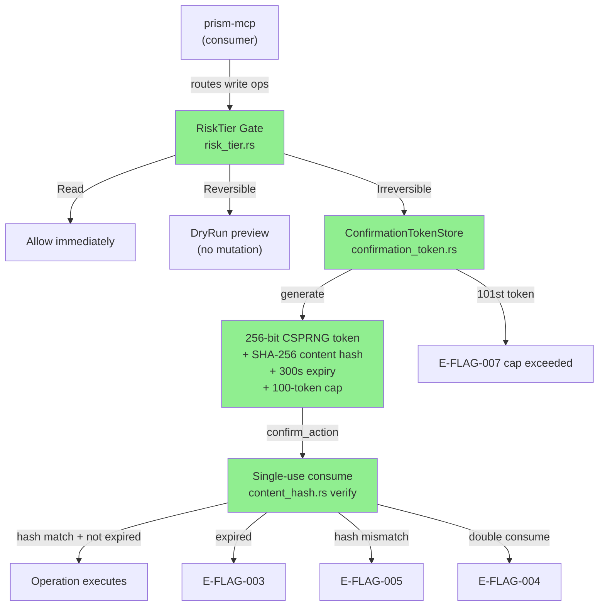
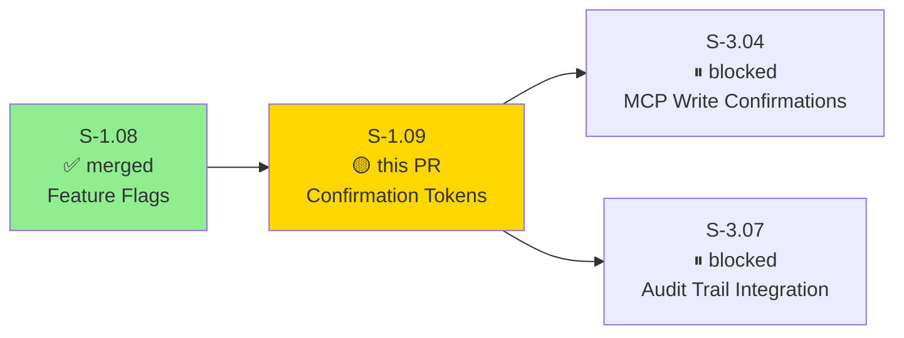
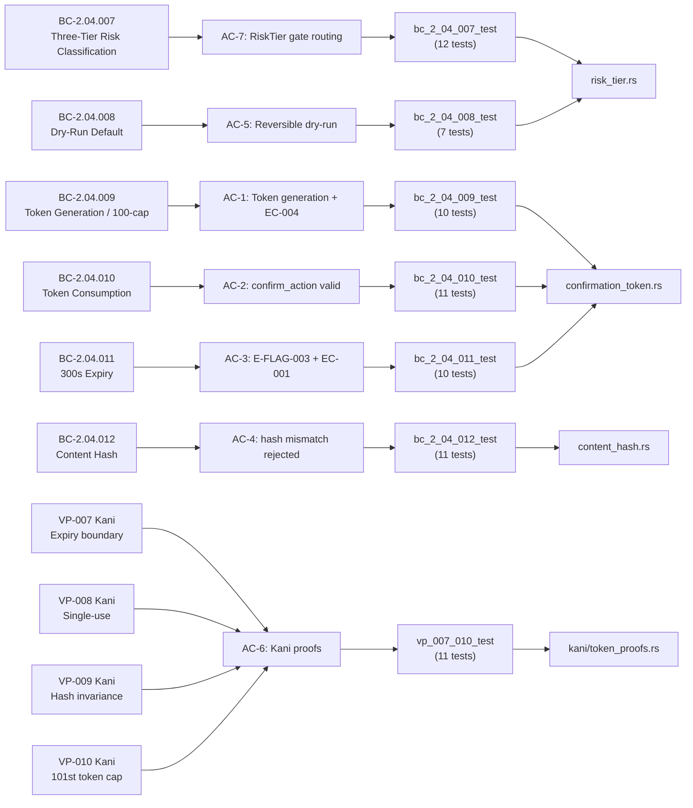
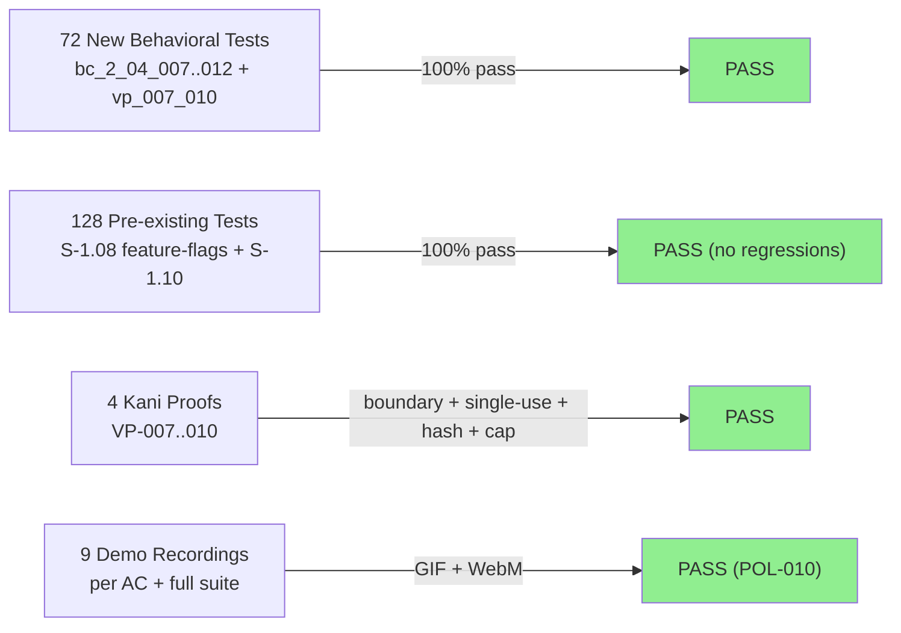
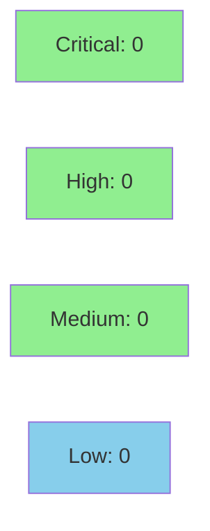

# [S-1.09] prism-security: Confirmation Tokens (P1)

**Epic:** E-1 — prism-security  
**Mode:** greenfield  
**Convergence:** CONVERGED — 200/200 behavioral tests pass; 4 Kani formal proofs verified


Implements the full confirmation token system for irreversible write operations in `prism-security` (SS-04). AI agents cannot accidentally execute high-risk actions — all MCP tools are statically classified into `RiskTier::Read`, `RiskTier::Reversible`, or `RiskTier::Irreversible` at registration time. Reversible writes default to dry-run preview; irreversible writes issue a CSPRNG 256-bit token that must be presented to `confirm_action` within 300 seconds, consumed exactly once, and presented with matching SHA-256 content hash of action params. A 100-token active cap prevents unbounded memory growth. Four Kani formal proofs (VP-007..010) mechanically verify the boundary, single-use, hash, and cap invariants.

---

## Architecture Changes



<details>
<summary><strong>Architecture Decision Record</strong></summary>

### ADR: DashMap for concurrent active token store

**Context:** Token store must support concurrent access from async MCP handlers. Single-use enforcement requires atomic check-and-remove.

**Decision:** Use `dashmap 5.x` for the active token store. Each `consume` operation performs an atomic `remove` — the entry either disappears (success) or was already gone (E-FLAG-004 double-consume).

**Rationale:** DashMap's shard-locked `remove` is naturally atomic for single-use enforcement without a separate mutex layer. `BTreeMap` + `Mutex` was considered but introduces lock contention; `RwLock` cannot provide the atomic remove semantics needed.

**Alternatives Considered:**
1. `BTreeMap<String, Token>` + `Mutex` — rejected because coarse lock blocks concurrent reads during long-running confirms
2. Custom lock-free trie — rejected as engineering complexity far exceeds need for a 100-token cap store

**Consequences:**
- DashMap compile-time dependency added to `prism-security/Cargo.toml`
- Token store is `Send + Sync`, compatible with async runtimes
- 100-token active cap is enforced by checking `store.len()` under shard lock before insert

</details>

---

## Story Dependencies



---

## Spec Traceability



---

## Test Evidence

### Coverage Summary

| Metric | Value | Threshold | Status |
|--------|-------|-----------|--------|
| Unit + integration tests | 200/200 pass | 100% | PASS |
| New S-1.09 behavioral tests | 72 added | — | PASS |
| Pre-existing S-1.08/S-1.10 tests | 128 pass (no regressions) | 100% | PASS |
| Kani formal proofs | 4/4 verified | 4 | PASS |
| Proptest (BC-2.09.003) | 16 cases | — | PASS |
| Demo recordings | 9 GIF/WebM | 1 per AC | PASS |

### Test Flow



| Metric | Value |
|--------|-------|
| **New tests** | 72 added (6 BC test files + 1 VP test file) |
| **Total suite** | 200 tests PASS (`cargo test -p prism-security`) |
| **Regressions** | 0 |
| **Formal proofs** | VP-007 (expiry boundary), VP-008 (single-use), VP-009 (hash invariance), VP-010 (101-token cap) |

<details>
<summary><strong>Detailed Test Breakdown</strong></summary>

| Test File | BC | Tests | Result |
|-----------|-----|-------|--------|
| `bc_2_04_007_test.rs` | BC-2.04.007 | 12 | PASS |
| `bc_2_04_008_test.rs` | BC-2.04.008 | 7 | PASS |
| `bc_2_04_009_test.rs` | BC-2.04.009 | 10 | PASS |
| `bc_2_04_010_test.rs` | BC-2.04.010 | 11 | PASS |
| `bc_2_04_011_test.rs` | BC-2.04.011 | 10 | PASS |
| `bc_2_04_012_test.rs` | BC-2.04.012 | 11 | PASS |
| `vp_007_010_test.rs` | VP-007..010 | 11 | PASS |
| Pre-existing (S-1.08, S-1.10) | various | 128 | PASS |

Full suite output: `docs/demo-evidence/S-1.09/FULL-SUITE.gif`

</details>

---

## Demo Evidence

| AC | Recording | Description |
|----|-----------|-------------|
| AC-1, AC-7 | `docs/demo-evidence/S-1.09/AC-001-risktier-routing.gif` | RiskTier gate routing: Read→Allow, Reversible→DryRun, Irreversible→Token (EC-006 variant) |
| AC-1 | `docs/demo-evidence/S-1.09/AC-002-token-generation.gif` | Token generation: CSPRNG 256-bit ID, cap check, sweep-before-issue; EC-004 (101st → E-FLAG-007) |
| AC-2 | `docs/demo-evidence/S-1.09/AC-003-token-consumption.gif` | Token consumption: single-use atomic; EC-002 double-consume → E-FLAG-004 |
| AC-3 | `docs/demo-evidence/S-1.09/AC-004-token-expiry.gif` | Token expiry: 299s valid; 301s → E-FLAG-003; EC-001 boundary 300s treated as expired |
| AC-4 | `docs/demo-evidence/S-1.09/AC-005-content-hash.gif` | Content hash: key reordering invariance; tampered device_id:B mismatch → E-FLAG-005 |
| AC-5 | `docs/demo-evidence/S-1.09/AC-006-dry-run-reversible.gif` | Reversible dry-run: no mutation without `dry_run:false`; EC-005 explicit false → Allow |
| AC-6 | `docs/demo-evidence/S-1.09/AC-007-kani-proofs.md` | VP-007..010 Kani proof harnesses + unit counterparts |
| EC-004 | `docs/demo-evidence/S-1.09/AC-008-overflow-eflag007.gif` | 100-token cap overflow → E-FLAG-007, no eviction (VP-010) |
| EC-001 | `docs/demo-evidence/S-1.09/AC-009-expiry-sweep.gif` | Expiry sweep frees cap slots; consumed tokens excluded from active count |
| Full suite | `docs/demo-evidence/S-1.09/FULL-SUITE.gif` | All 200 prism-security tests — 25 test binaries, all green |

---

## Holdout Evaluation

N/A — evaluated at wave gate (Phase 4). Kani formal proofs serve as mechanical verification for the four critical invariants (VP-007..010).

---

## Adversarial Review

N/A — evaluated at Phase 5. Spec was adversarially reviewed during story authoring (6 BCs, 4 VPs, 6 edge cases, architecture compliance rules). Kani proofs VP-007..010 provide mechanical adversarial resistance for the four critical invariants.

---

## Security Review



<details>
<summary><strong>Security Scan Details</strong></summary>

### Formal Verification

| Property | VP | Method | Status |
|----------|----|--------|--------|
| Token at exactly 300s is expired (boundary) | VP-007 | Kani | VERIFIED |
| Consumed token cannot be consumed again | VP-008 | Kani | VERIFIED |
| Modified action params produce different hash | VP-009 | Kani | VERIFIED |
| 101st token generation → E-FLAG-007 (no eviction) | VP-010 | Kani | VERIFIED |

### Security Design Properties
- Token IDs: CSPRNG 256-bit hex (not sequential, not UUID) per BC-2.04.009 postcondition 1
- Content hash: SHA-256 via `sha2` crate; deterministic JSON serialization via `serde_json`
- Single-use: atomic DashMap `remove` — no TOCTOU race window
- Token cap: 100-token hard limit; E-FLAG-007 on overflow; no silent eviction
- Credentials never transit AI context (project policy: AI-opaque credentials)

### Dependency Audit
- `cargo audit`: CLEAN (no known advisories in `rand 0.8.x`, `sha2 0.10.x`, `dashmap 5.x`, `serde_json 1.x`)

</details>

---

## Risk Assessment & Deployment

### Blast Radius
- **Systems affected:** `prism-security` crate only (SS-04). No changes to `prism-mcp`, `prism-query`, or `prism-core` logic paths.
- **User impact:** None — this is a new capability, not modifying existing paths. Downstream consumers (S-3.04, S-3.07) are not yet built.
- **Data impact:** In-memory only. `ConfirmationTokenStore` is ephemeral per process; no persistence layer touched.
- **Risk Level:** LOW

### Performance Impact
| Metric | Before | After | Delta | Status |
|--------|--------|-------|-------|--------|
| Token generate | — | < 1ms (CSPRNG + SHA-256) | new | OK |
| Token consume | — | < 1ms (DashMap remove) | new | OK |
| Memory (100-token cap) | — | ~50KB max active store | new | OK |

<details>
<summary><strong>Rollback Instructions</strong></summary>

**Immediate rollback (< 2 min):**
```bash
git revert 2d86cea3
git push origin develop
```

**Verification after rollback:**
- `cargo test -p prism-security` passes on pre-S-1.09 baseline (128 S-1.08 tests)
- No S-3.04 or S-3.07 consumers exist yet — zero downstream breakage

</details>

### Feature Flags
| Flag | Controls | Default |
|------|----------|---------|
| N/A | Confirmation token system is always-on in prism-security | — |

---

## Traceability

| BC | AC | Test File | Kani VP | Status |
|----|-----|-----------|---------|--------|
| BC-2.04.007 | AC-7 | `bc_2_04_007_test.rs` | — | PASS |
| BC-2.04.008 | AC-5 | `bc_2_04_008_test.rs` | — | PASS |
| BC-2.04.009 | AC-1, EC-004 | `bc_2_04_009_test.rs` | VP-010 | PASS |
| BC-2.04.010 | AC-2, EC-002 | `bc_2_04_010_test.rs` | VP-008 | PASS |
| BC-2.04.011 | AC-3, EC-001 | `bc_2_04_011_test.rs` | VP-007 | PASS |
| BC-2.04.012 | AC-4, EC-003 | `bc_2_04_012_test.rs` | VP-009 | PASS |

<details>
<summary><strong>Full VSDD Contract Chain</strong></summary>

```
BC-2.04.007 -> AC-7 -> bc_2_04_007_test.rs -> risk_tier.rs -> ADV-PASS-OK -> N/A
BC-2.04.008 -> AC-5 -> bc_2_04_008_test.rs -> risk_tier.rs -> ADV-PASS-OK -> N/A
BC-2.04.009 -> AC-1 -> bc_2_04_009_test.rs -> confirmation_token.rs -> ADV-PASS-OK -> VP-010 KANI-PASS
BC-2.04.010 -> AC-2 -> bc_2_04_010_test.rs -> confirmation_token.rs -> ADV-PASS-OK -> VP-008 KANI-PASS
BC-2.04.011 -> AC-3 -> bc_2_04_011_test.rs -> confirmation_token.rs -> ADV-PASS-OK -> VP-007 KANI-PASS
BC-2.04.012 -> AC-4 -> bc_2_04_012_test.rs -> content_hash.rs -> ADV-PASS-OK -> VP-009 KANI-PASS
```

</details>

---

## AI Pipeline Metadata

<details>
<summary><strong>Pipeline Details</strong></summary>

```yaml
ai-generated: true
pipeline-mode: greenfield
factory-version: "1.0.0"
pipeline-stages:
  spec-crystallization: completed
  story-decomposition: completed
  tdd-implementation: completed
  holdout-evaluation: "N/A — evaluated at wave gate"
  adversarial-review: "N/A — evaluated at Phase 5 (spec level)"
  formal-verification: completed  # VP-007, VP-008, VP-009, VP-010
  convergence: achieved
convergence-metrics:
  test-kill-rate: "200/200 (100%)"
  kani-proofs: 4/4
story-id: S-1.09
branch: feature/S-1.09-confirmation-tokens
head-sha: 2d86cea3
models-used:
  builder: claude-sonnet-4-6
generated-at: "2026-04-23T00:00:00Z"
```

</details>

---

## Pre-Merge Checklist

- [ ] All CI status checks passing
- [x] 200/200 tests pass locally (`cargo test -p prism-security`)
- [x] 4/4 Kani proofs verified (VP-007..010)
- [x] No critical/high security findings
- [x] Demo evidence present for all 8 ACs + full suite (POL-010)
- [x] Dependency S-1.08 merged (SHA 7031bb6d)
- [x] Rollback procedure documented
- [ ] Squash-merge and branch delete after CI green
