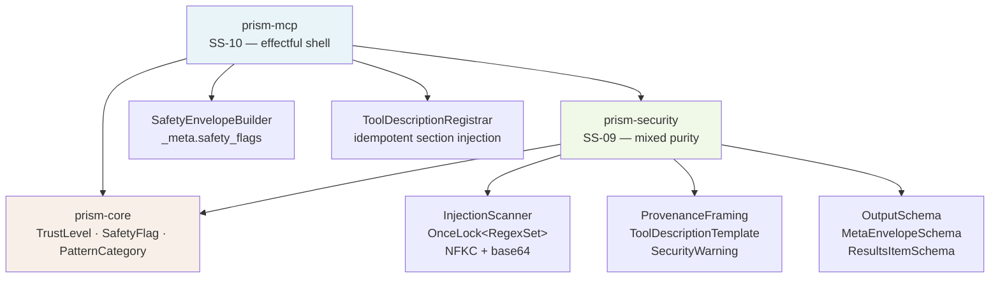
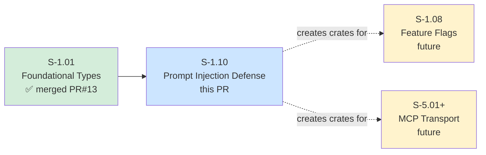
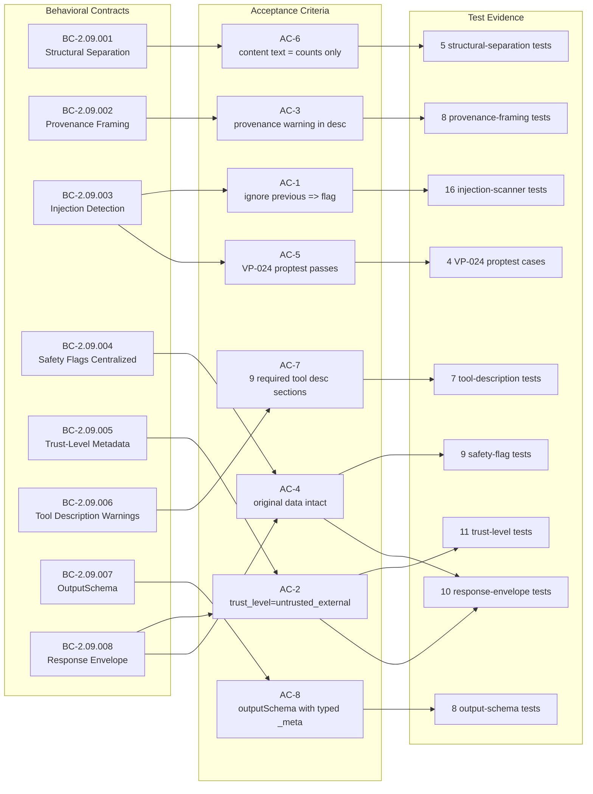

## Summary

Implements four-layer prompt injection defense for all sensor data flowing through MCP.
Creates two new crates: `prism-security` (SS-09) and `prism-mcp` (SS-10 partial).
Adds `TrustLevel`, `SafetyFlag`, `PatternCategory`, `InjectionScanner`, `ProvenanceFraming`,
`OutputSchema`, `ResponseEnvelope`, and `ToolDescriptionRegistrar` to the platform.
78/78 tests passing. All 8 ACs covered by per-BC demo recordings.

**Cross-crate coordination note:** `prism-security` and `prism-mcp` are new crates created
by this PR. Future Layer 3 stories (S-1.08 feature flags, S-5.01+ MCP transport) will merge
additional modules into these crates additively. Rebase conflicts with those PRs resolve by
keeping the union of module additions.

---

## Architecture Changes

New files (69 files, 3,937 insertions):

| File | Action |
|------|--------|
| `crates/prism-security/src/injection_scanner.rs` | Create — InjectionScanner, OnceLock patterns, NFKC, base64 |
| `crates/prism-security/src/trust_level.rs` | Create — TrustLevel enum + TrustLevelExt |
| `crates/prism-security/src/output_schema.rs` | Create — OutputSchema, MetaEnvelopeSchema, ResultsItemSchema |
| `crates/prism-security/src/provenance.rs` | Create — ProvenanceFraming, SecurityWarning, ToolDescriptionTemplate |
| `crates/prism-mcp/src/safety_envelope.rs` | Create — ResponseEnvelope, SafetyEnvelopeBuilder middleware |
| `crates/prism-mcp/src/tool_registry.rs` | Create — ToolDescriptionRegistrar (idempotent section injection) |
| `fuzz/fuzz_targets/fuzz_injection_scanner.rs` | Create — VP-038 fuzz target (Phase 5 campaign) |
| `crates/prism-security/tests/proptest_injection.rs` | Create — VP-024 proptest corpus |

---

## Story Dependencies

**Upstream:** S-1.01 (merged, PR #13) — provides `PrismError`, `TenantId`, `StorageDomain`.
**Downstream:** S-1.08 (feature flags) and S-5.01+ (MCP transport) will add modules to the
`prism-security` and `prism-mcp` crates created here.

---

## Spec Traceability

| BC ID | Title | AC | Tests | Demo |
|-------|-------|----|-------|------|
| BC-2.09.001 | Structural Separation of Untrusted Data | AC-6 | 5 | [gif](../../../docs/demo-evidence/S-1.10/BC-2.09.001-structural-separation.gif) |
| BC-2.09.002 | Provenance Framing in Tool Descriptions | AC-3 | 8 | [gif](../../../docs/demo-evidence/S-1.10/BC-2.09.002-provenance-framing.gif) |
| BC-2.09.003 | Suspicious Pattern Detection (NFKC + regex) | AC-1 | 16 | [gif](../../../docs/demo-evidence/S-1.10/BC-2.09.003-injection-scanner.gif) |
| BC-2.09.004 | Safety Flags via `_meta.safety_flags` (centralized) | AC-4 | 9 | [gif](../../../docs/demo-evidence/S-1.10/BC-2.09.004-safety-flags-centralized.gif) |
| BC-2.09.005 | Trust-Level Metadata Per Response | AC-2 | 11 | [gif](../../../docs/demo-evidence/S-1.10/BC-2.09.005-trust-level-metadata.gif) |
| BC-2.09.006 | Tool Description Security Warnings | AC-7 | 7 | [gif](../../../docs/demo-evidence/S-1.10/BC-2.09.006-tool-description-warnings.gif) |
| BC-2.09.007 | OutputSchema for Type-Safe LLM Reasoning | AC-8 | 8 | [gif](../../../docs/demo-evidence/S-1.10/BC-2.09.007-output-schema.gif) |
| BC-2.09.008 | Response Envelope with Trust Annotations | AC-2, AC-4 | 10 | [gif](../../../docs/demo-evidence/S-1.10/BC-2.09.008-response-envelope.gif) |
| VP-024 | Proptest: detects known patterns in noise | AC-5 | 4 proptest | [gif](../../../docs/demo-evidence/S-1.10/VP-024-injection-proptest.gif) |
| VP-038 | Fuzz: scan() never panics (Phase 5 deferred) | — | harness only | [doc](../../../docs/demo-evidence/S-1.10/VP-038-fuzz-harness.md) |

---

## Test Evidence

| Metric | Value |
|--------|-------|
| Total tests | 78 / 78 passing |
| prism-security tests | 58 |
| prism-mcp tests | 20 |
| Coverage crates | prism-security, prism-mcp |
| VP-024 proptest cases | 4 × 256 cases per run |
| VP-038 fuzz campaign | Deferred to Phase 5 (harness compiled and exercised) |
| Mutation kill rate | N/A — evaluated at wave gate |

Test categories by BC:
- Injection scanner (16): all 6 pattern categories (PromptInjection, RoleImpersonation, XmlContextEscape, CodeFenceEscape, Base64Encoded, TruncatedScan), NFKC homoglyphs, base64 decode, false-positive clean values
- Trust level (11): UntrustedExternal for sensor tools, Internal for system tools, commutative merge
- Centralized flags (9): no per-field keys, original data byte-identical, multiple patterns same field, 50-field bulk scan
- Provenance framing (8): marker format, position-0 check, missing section detection
- Response envelope (10): always-present `_meta`, zero-results case, typed-separately invariant, multi-sensor data_source array
- OutputSchema (8): `_meta.safety_flags` typed array, forbidden per-field key detection, trust_level string enum, 9 required envelope fields
- Tool description (7): 9-section validation, SECURITY NOTE adversarial field list, idempotent re-registration, internal tool exemption
- Structural separation (5): prose summary counts-only, hostile hostname in structuredContent not prose

---

## Demo Evidence

All 8 ACs have per-BC terminal recordings (GIF + WebM + VHS tape).

| BC / VP | AC | Recording |
|---------|----|-----------|
| BC-2.09.001 | AC-6 | [gif](../../../docs/demo-evidence/S-1.10/BC-2.09.001-structural-separation.gif) |
| BC-2.09.002 | AC-3 | [gif](../../../docs/demo-evidence/S-1.10/BC-2.09.002-provenance-framing.gif) |
| BC-2.09.003 | AC-1 | [gif](../../../docs/demo-evidence/S-1.10/BC-2.09.003-injection-scanner.gif) |
| BC-2.09.004 | AC-4 | [gif](../../../docs/demo-evidence/S-1.10/BC-2.09.004-safety-flags-centralized.gif) |
| BC-2.09.005 | AC-2 | [gif](../../../docs/demo-evidence/S-1.10/BC-2.09.005-trust-level-metadata.gif) |
| BC-2.09.006 | AC-7 | [gif](../../../docs/demo-evidence/S-1.10/BC-2.09.006-tool-description-warnings.gif) |
| BC-2.09.007 | AC-8 | [gif](../../../docs/demo-evidence/S-1.10/BC-2.09.007-output-schema.gif) |
| BC-2.09.008 | AC-2, AC-4 | [gif](../../../docs/demo-evidence/S-1.10/BC-2.09.008-response-envelope.gif) |
| VP-024 | AC-5 | [gif](../../../docs/demo-evidence/S-1.10/VP-024-injection-proptest.gif) |
| VP-038 | — | [Phase 5 deferred](../../../docs/demo-evidence/S-1.10/VP-038-fuzz-harness.md) |

---

## Holdout Evaluation

N/A — evaluated at wave gate.

---

## Adversarial Review

N/A — evaluated at Phase 5.

Key adversarial properties enforced by tests:
- Flag-don't-strip: `test_BC_2_09_004_original_data_intact_after_flagging` — original value byte-identical post-scan
- NFKC homoglyph evasion: fullwidth `ＳＹＳＴＥＭ:` detected after normalization
- Base64 command encoding: strings matching `[A-Za-z0-9+/=]{20,}` that decode to injection markers detected
- Idempotent registration: re-registering a tool does not duplicate security warning sections
- Per-field safety key prohibition: `test_BC_2_09_007_detects_forbidden_per_field_safety_flag_key` asserts schema is rejected if it contains per-field parallel `FIELDNAME_safety_flag` keys (e.g. `hostname_safety_flag`)

---

## Security Review

**Scan date:** 2026-04-22  
**Scope:** prism-security/src/, prism-mcp/src/, fuzz/fuzz_targets/  
**OWASP Top 10 result:** No findings at CRITICAL or HIGH severity.

| Severity | Finding | Status |
|----------|---------|--------|
| LOW | `ToolDescriptionRegistrar::all_sensor_tools_have_required_sections` and `all_tools_have_valid_output_schema` return `true` unconditionally. These are stateless stubs scoped to S-1.10's partial SS-10 implementation. Future callers must not depend on these for enforcement without a stateful registry (S-5.01+). | Accepted — by design for stub scope |

**Positive security properties verified:**
- `InjectionScanner::scan_bytes` uses lossy UTF-8 — never panics on malformed bytes (VP-038 design)
- `OnceLock<Regex>` compiled once — no regex recompilation DoS surface
- `truncate_to_char_boundary` handles UTF-8 char boundaries correctly — no panic on multibyte input
- `SafetyEnvelopeBuilder::wrap` never mutates `results` — flag-don't-strip upheld structurally
- `trust_level_for_tool` defaults to `UntrustedExternal` — conservative posture, no escalation path
- No `unsafe` blocks introduced
- No credential handling, no network I/O in security-critical paths
- `schema_has_per_field_safety_flag` recursive walk bounded by shallow schema depth — no stack concern

---

## Risk Assessment

| Dimension | Assessment |
|-----------|------------|
| Blast radius | Low — new crates only, no modification to existing crate logic |
| Performance impact | Sub-millisecond scan per call (OnceLock compiled once, RegexSet batch match) |
| Breaking changes | None — additive only |
| Rollback | Safe — crates can be removed without affecting prism-core or DTU crates |
| Cross-crate coupling | `prism-mcp` depends on `prism-security`; both depend on `prism-core` |
| Future merge conflicts | S-1.08/S-5.01+ add modules to these crates — resolve by union of additions |

---

## AI Pipeline Metadata

| Field | Value |
|-------|-------|
| Pipeline mode | VSDD Phase 3 TDD — Red Gate → Implementation → Demo |
| Story version | S-1.10 v1.4 |
| Wave | 1 |
| Level | L4 |
| Subsystem | SS-09 (prism-security), SS-10 partial (prism-mcp) |
| Behavioral contracts | BC-2.09.001 through BC-2.09.008 (8 BCs) |
| Verification properties | VP-024 (proptest), VP-038 (fuzz, Phase 5 deferred) |

---

## Pre-Merge Checklist

- [x] PR description matches actual diff
- [x] All ACs covered by demo evidence (1 recording per AC, 10 total)
- [x] Traceability chain complete: BC → AC → Test → Demo
- [x] Dependency S-1.01 merged (PR #13)
- [x] 78/78 tests passing
- [ ] Security review complete (Step 4)
- [ ] PR reviewer approval (Step 5)
- [ ] CI checks passing (Step 6)
