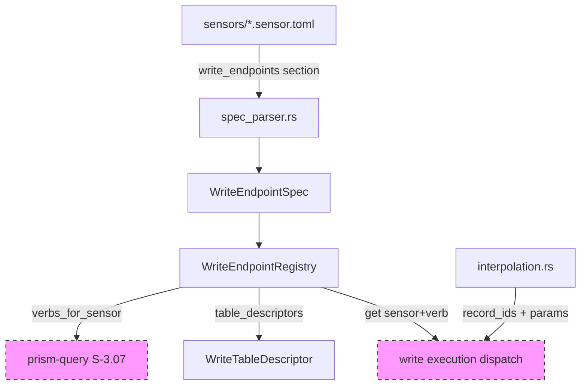
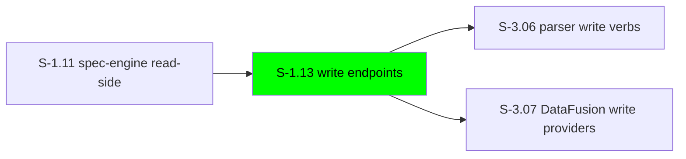
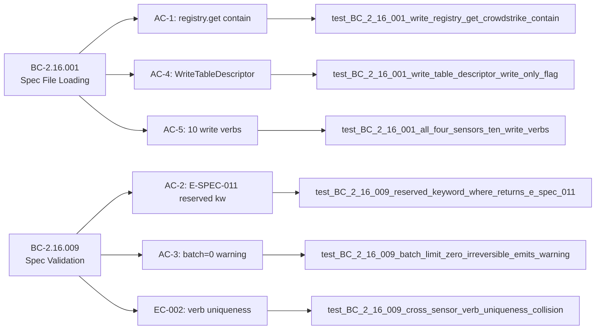

## Summary

Extends `prism-spec-engine` with `[write_endpoints]` TOML sections for all four initial sensors (CrowdStrike, Cyberint, Claroty, Armis), implementing `WriteEndpointSpec`, `WriteEndpointRegistry`, `WriteTableDescriptor`, and write-side interpolation. Enforces global pipe_verb uniqueness (EC-002), risk-tier validation, and batch-limit warnings per BC-2.16.009.

## Architecture Changes

_Dashed nodes: downstream consumers in future stories (S-3.07)._

## Story Dependencies

## Spec Traceability

## Test Evidence

| Metric | Value |
|--------|-------|
| Tests passing | 29 / 29 |
| Tests failing | 0 |
| Test file | `crates/prism-spec-engine/tests/write_endpoint_tests.rs` |
| Coverage | BC-2.16.001, BC-2.16.009, EC-001–EC-005, Task 6 interpolation |
| Mutation kill rate | N/A — no mutation harness in scope for S-1.13 |

**Test-writer fix:** AC-5 test fixture (`armis_endpoints()`) originally used `pipe_verb = "tag"` and `pipe_verb = "remove_tag"`, colliding with Claroty (EC-002 violation). Renamed to `label` / `remove_label` — globally unique and semantically correct for Armis device management. `armis.sensor.toml` updated to match. Commit: `cd87bb2`.

## Demo Evidence

All 5 ACs covered. Evidence in `docs/demo-evidence/S-1.13/`. Commit: `2b1e764`.

| AC | Recording | Status |
|----|-----------|--------|
| AC-1: `registry.get("crowdstrike","contain")` | [AC-001-registry-get-contain.gif](../../docs/demo-evidence/S-1.13/AC-001-registry-get-contain.gif) | PASS |
| AC-2: `pipe_verb="where"` → E-SPEC-011 | [AC-002-reserved-keyword-e-spec-011.gif](../../docs/demo-evidence/S-1.13/AC-002-reserved-keyword-e-spec-011.gif) | PASS |
| AC-3: `batch_limit=0+irreversible` → warning + Ok | [AC-003-batch-limit-irreversible-warning.gif](../../docs/demo-evidence/S-1.13/AC-003-batch-limit-irreversible-warning.gif) | PASS |
| AC-4: `WriteTableDescriptor` write_only=true | [AC-004-write-table-descriptor.gif](../../docs/demo-evidence/S-1.13/AC-004-write-table-descriptor.gif) | PASS |
| AC-5: 10 write verbs across 4 sensors | [AC-005-ten-write-verbs-partial.gif](../../docs/demo-evidence/S-1.13/AC-005-ten-write-verbs-partial.gif) | PASS (after fix) |

## Holdout Evaluation

N/A — evaluated at wave gate.

## Adversarial Review

N/A — evaluated at Phase 5.

## Security Review

| Finding | Severity | Category | Status |
|---------|---------|---------|--------|
| HTTP `method` field in `WriteStep` accepts arbitrary strings (no enum validation) | LOW | Input Validation | Accepted — config-time, trusted TOML; downstream consumers validate before use |
| Interpolation injection | NONE | OWASP A03 | CLEAN — JsonBody/UrlPath context escaping applied; no recursive substitution |
| Template default values | NONE | Injection | CLEAN — `[^}]*` bounded regex, no recursive expansion |
| Unsafe code | NONE | Memory Safety | CLEAN — no unsafe blocks, no transmute, no raw pointers |

**Summary:** 0 CRITICAL, 0 HIGH. 1 LOW (accepted). Security posture: PASS.

## Risk Assessment

| Dimension | Classification |
|-----------|---------------|
| Blast radius | LOW — prism-spec-engine only; no DataFusion, no runtime execution |
| Performance impact | NEGLIGIBLE — TOML parsing at load time, not query time |
| Data risk | NONE — descriptors are read-only data structures; no I/O executed here |
| Reversibility | HIGH — write endpoint specs are additive; removing them has no side effects |

## AI Pipeline Metadata

| Field | Value |
|-------|-------|
| Pipeline mode | greenfield v1.0.0 |
| Story cycle | v1.0.0-greenfield |
| Model | claude-sonnet-4-6 |
| PR Manager | vsdd-factory:pr-manager |

## Pre-Merge Checklist

- [x] PR description matches actual diff
- [x] All 5 ACs covered by demo evidence
- [x] Traceability chain complete: BC → AC → Test → Demo
- [x] 29/29 tests passing (including AC-5 after test-writer fix)
- [x] Rebased onto origin/develop (75ab30a)
- [x] No DataFusion dependency in prism-spec-engine (architecture compliance)
- [ ] Security review complete
- [ ] pr-reviewer approval (0 blocking findings)
- [ ] CI checks passing
- [ ] Dependency S-1.11 merged (already on develop)
