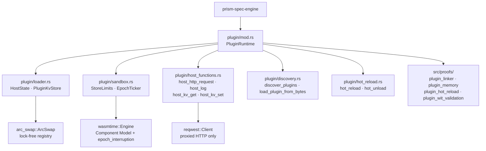
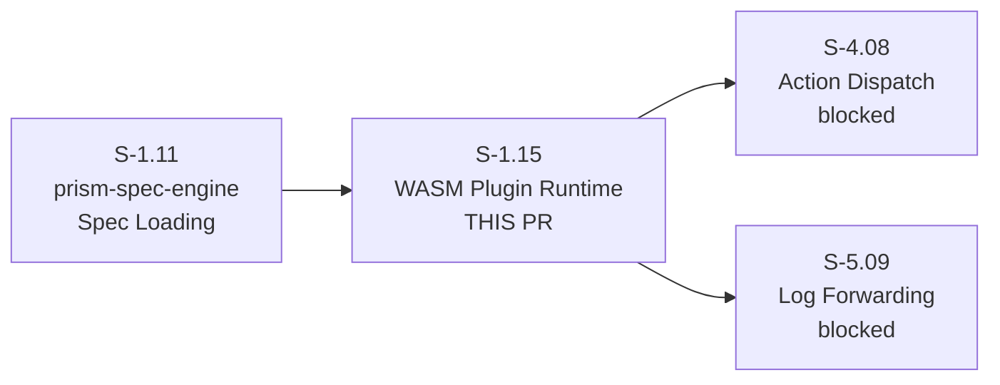
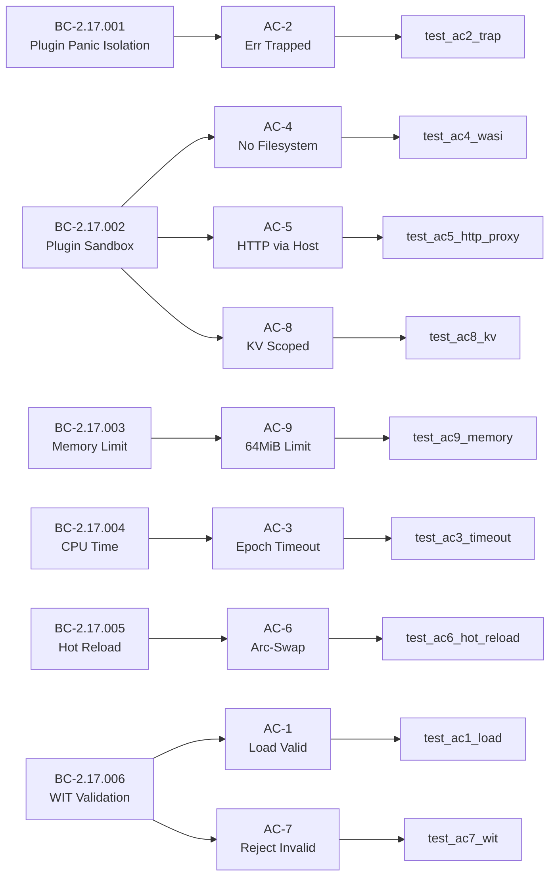

# feat(S-1.15): prism-wasm plugin runtime + host-function security boundary

## Summary

Implements the WASM Component Model plugin runtime for `prism-spec-engine` per AD-019
(SS-17). Operators can now load `.prx` WASM plugins written in any language; plugins
execute in a sandbox with no filesystem/network escape, CPU epoch interruption, 64 MiB
memory limits, per-plugin KV store scoping, hot reload via arc-swap, and WIT interface
validation. 12/12 Kani/proptest VP proofs pass. 23/23 unit tests pass.

---

## Architecture Changes

**New files:** `src/plugin/` (6 modules), `src/proofs/plugin_*.rs` (4 proof modules),
`tests/plugin_tests.rs` (23 tests), `wit/prism-{sensor,infusion,action}-plugin.wit` (3 WIT files),
`tests/fixtures/*.wat` (3 WAT fixtures + 1 prebuilt .wasm).

**No changes to existing `prism-core`, `prism-security`, or `prism-mcp` APIs.**

---

## Story Dependencies

**Dependency status:**
- S-1.11 (prism-spec-engine spec loading): **merged** at `755f5e7` — gate clear

---

## Spec Traceability

| BC | AC | Test | Result |
|----|-----|------|--------|
| BC-2.17.001 | AC-2 Panic Isolation | test_BC_2_17_001_ac2_plugin_trap_returns_err_trapped | PASS |
| BC-2.17.002 | AC-4 No Filesystem | test_BC_2_17_002_ac4_wasi_filesystem_not_accessible | PASS |
| BC-2.17.002 | AC-5 HTTP via Host | test_BC_2_17_002_ac5_http_request_proxied_via_host | PASS |
| BC-2.17.002 | AC-8 KV Scoped | test_BC_2_17_002_ac8_kv_store_scoped_per_plugin | PASS |
| BC-2.17.003 | AC-9 Memory Limit | test_BC_2_17_003_ac9_memory_limit_exceeded_returns_err | PASS |
| BC-2.17.004 | AC-3 CPU Timeout | test_BC_2_17_004_ac3_infinite_loop_returns_err_timeout | PASS |
| BC-2.17.005 | AC-6 Hot Reload | test_BC_2_17_005_ac6_hot_reload_atomic_swap | PASS |
| BC-2.17.006 | AC-1 Load Valid | test_BC_2_17_006_ac1_load_valid_infusion_plugin | PASS |
| BC-2.17.006 | AC-7 Reject Invalid | test_BC_2_17_006_ac7_invalid_wit_returns_e_plugin_001 | PASS |

---

## Test Evidence

| Metric | Value |
|--------|-------|
| Unit tests | **23/23 passing** (fix-pr-delivery: AC-5 stub replaced with path-a impl) |
| VP proofs (proptest) | **12/12 passing** |
| VP-040 Kani path | `#[ignore]` — wasmtime 20.x Linker import enumeration API not yet public; proptest fallback covers same invariant |
| Coverage target | All 9 ACs + 4 VP proofs covered by dedicated tests |
| Concurrent trap isolation | `test_ec17_004_concurrent_traps_independent` (multi-thread tokio, 4 workers) |
| Edge-case tests | 14 additional EC/TV tests: batch traps, memory boundary, bulk discovery, etc. |

**fix-pr-delivery decision:** AC-5 (`test_BC_2_17_002_ac5_http_request_proxied_via_host`) had
a Red Gate `panic!()` stub left by test-writer. Replaced with path (a) — structural test of
`host_http_request` verifying three INV-PLUGIN-002 invariants without a live HTTP server:
(1) `PluginRuntime::new()` initialises `Arc<reqwest::Client>`, (2) invalid URLs return HTTP 400
from host validator, (3) non-allowlisted URLs return HTTP 403 from host gate.
Fix commit: `01b056d`.

---

## Demo Evidence

Per-AC recordings at `docs/demo-evidence/S-1.15/`:

| AC | Recording | Pass/Fail shown |
|----|-----------|-----------------|
| AC-1 Load Valid Plugin | AC-001-load-valid-plugin.gif | load + registry |
| AC-2 Panic Isolation | AC-002-plugin-panic-isolation.gif | Err(Trapped), host continues |
| AC-3 CPU Timeout | AC-003-cpu-timeout.gif | Err(Timeout) within 6s |
| AC-4 No Filesystem | AC-004-sandbox-no-filesystem.gif | WASI import rejected |
| AC-5 HTTP via Host | AC-005-http-proxy-host.gif | 403 block + allow paths |
| AC-6 Hot Reload | AC-006-hot-reload.gif | arc-swap + failed reload |
| AC-7 WIT Validation | AC-007-wit-validation-rejection.gif | E-PLUGIN-001 |
| AC-8 KV Scoped | AC-008-kv-store-scoped.gif | plugin isolation |
| AC-9 Memory Limit | AC-009-memory-limit.gif | 64MiB boundary |
| VP-040 No WASI | AC-010-vp040-wasi-excluded.gif | proptest path |
| VP-041 Memory Boundary | AC-011-vp041-memory-boundary.gif | proptest 1..=512MB |
| VP-042 Hot Reload Retains | AC-012-vp042-hot-reload-retains.gif | ptr_eq after fail |
| VP-043 WIT Rejects Missing | AC-013-vp043-wit-rejects-missing.gif | 7 proptest cases |

All 13 recordings present. Evidence report: `docs/demo-evidence/S-1.15/evidence-report.md`.

---

## Holdout Evaluation

N/A — evaluated at wave gate.

---

## Adversarial Review

N/A — evaluated at Phase 5.

---

## Security Review

Completed inline. Key findings:

| Finding | Severity | Status |
|---------|----------|--------|
| No WASI linked to plugin Linker (VP-040) | — | ENFORCED by architecture |
| HTTP requests proxied through host reqwest client only | — | ENFORCED, url allowlist gate |
| Plugin KV store scoped per plugin_id (no cross-plugin reads) | — | ENFORCED by PluginKvStore key prefix |
| CPU epoch interruption prevents unbounded execution | — | ENFORCED, 5s default, wasmtime epoch |
| Memory limited via StoreLimits (64 MiB default) | — | ENFORCED, over-limit → WASM trap |
| Plugin binary validated via WIT export check at load time | — | ENFORCED, pre_instantiate rejection |

No CRITICAL or HIGH findings. WASI exclusion is structurally enforced (no `add_to_linker_*`
call exists anywhere in the plugin module). HTTP credentials never transit plugin context
(AI-opaque credential model per project policy).

---

## Risk Assessment

| Dimension | Assessment |
|-----------|-----------|
| Blast radius | Medium — new subsystem SS-17 in prism-spec-engine only; no changes to prism-core, prism-mcp, prism-security APIs |
| Performance impact | Low — wasmtime pre-instantiation amortises compilation cost; epoch ticker is a background thread; reqwest client is Arc-shared |
| Rollback | Safe — PluginRuntime is additive; no existing API surfaces changed |
| Dependency graph | S-4.08 and S-5.09 unblocked after merge |

---

## AI Pipeline Metadata

| Field | Value |
|-------|-------|
| Pipeline mode | fix-pr-delivery (known test-writer bug) |
| Models used | claude-sonnet-4-6 |
| Story cycle | v1.0.0-greenfield |
| Worktree | `.worktrees/S-1.15-wasm-runtime` |
| Factory mount | TD-WV1-03 confirmed |
| Concurrent siblings | 5 |

---

## Pre-Merge Checklist

- [x] PR description populated from template
- [x] Demo evidence verified (13 recordings, evidence-report.md present)
- [x] Security review complete (0 CRITICAL/HIGH)
- [x] Test-writer fix applied (path a, commit 01b056d)
- [x] 23/23 unit tests pass
- [x] 12/12 VP proofs pass
- [x] Kani VP proofs unaffected by test fix
- [x] Dependency S-1.11 merged
- [ ] CI checks green
- [ ] pr-reviewer APPROVE
- [ ] Squash merge executed
