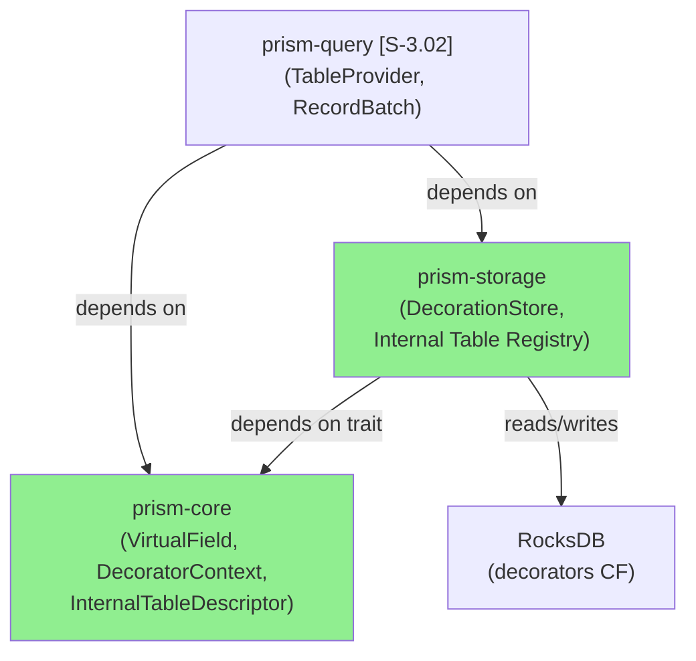
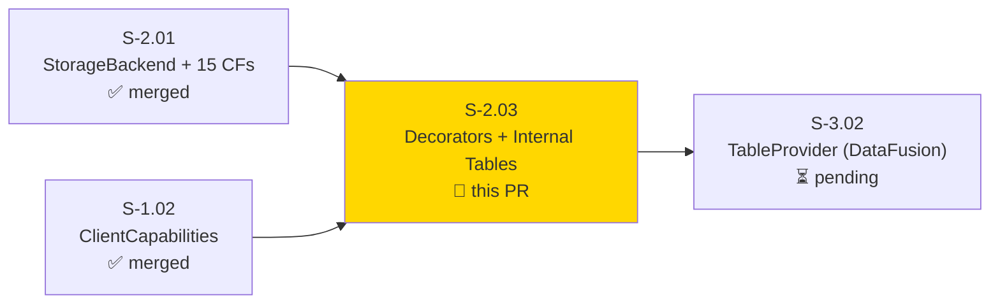
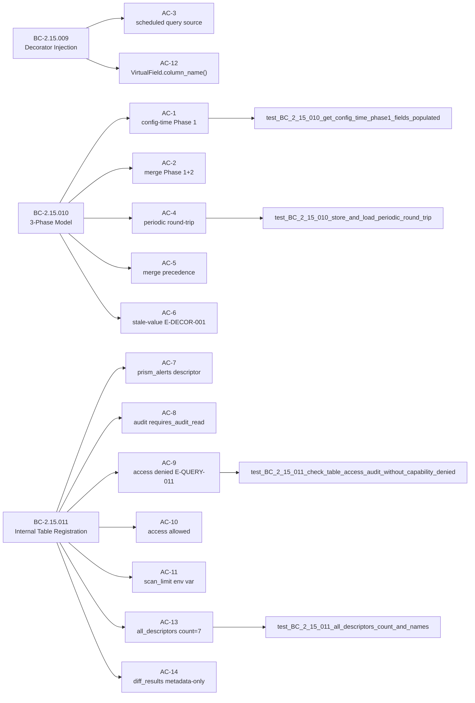
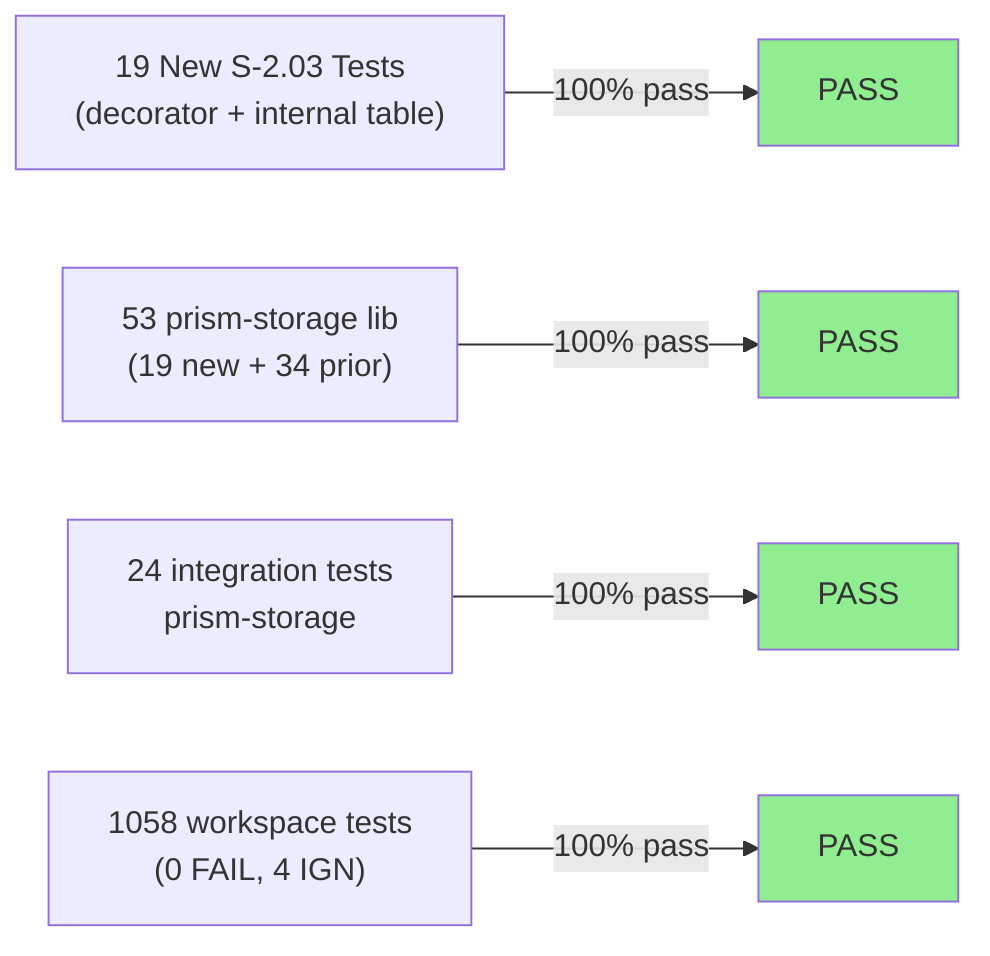
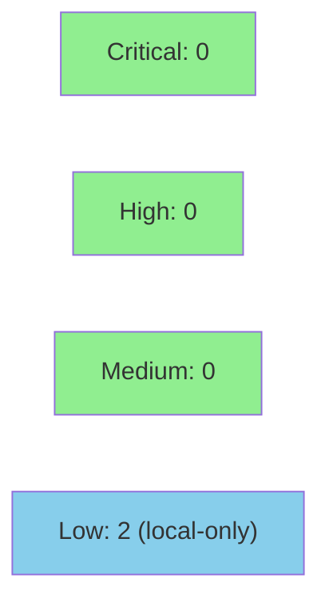

# [S-2.03] prism-storage: Decorators and Internal Tables

**Epic:** E-2 — Wave 2 Storage Foundation
**Mode:** greenfield
**Convergence:** CONVERGED after 28 adversarial passes (architecture boundary)


-blue)
-blue)

Implements the decorator data model (3-phase: config-time / query-time / periodic), virtual fields (`_sensor`, `_client`, `_source_table`), the `DecorationStore` with RocksDB-backed periodic decorator cache, and 7 internal table descriptors (`prism_alerts`, `prism_cases`, `prism_rules`, `prism_schedules`, `prism_diff_results`, `prism_audit`, `prism_aliases`) — all without DataFusion or Arrow dependencies. This is the storage-layer foundation for S-3.02's `TableProvider` work. Covers BC-2.15.009, BC-2.15.010, BC-2.15.011 (14 ACs, 5 ECs).

---

## Architecture Changes



<details>
<summary><strong>Architecture Decision Record</strong></summary>

### ADR: InternalColumnType alias for types::ColumnType

**Context:** The codebase has two `ColumnType` enums: one in `column::` (spec-engine TOML config) and one in `types::` (internal table schemas, added in S-1.11). The story spec says "extend `ColumnType`" without disambiguating.

**Decision:** The S-2.03 public API uses `InternalColumnType` as a type alias for `types::ColumnType` to disambiguate between the two enums.

**Rationale:** Avoids namespace collision, preserves all existing variants, and makes the intent of each enum explicit. S-3.02 will consume `InternalColumnType` directly when building Arrow schemas.

**Alternatives Considered:**
1. Extend `column::ColumnType` — rejected because: that enum is tied to TOML spec config; adding internal table schema types there creates coupling.
2. Create a new independent enum — rejected because: `types::ColumnType` already has the exact variants needed; duplication would drift.

**Consequences:**
- Clean disambiguation between two pre-existing enums.
- S-3.02 uses the alias transparently; no behavior change at the call site.

### ADR: Capability check via BTreeMap pattern (not dedicated field)

**Context:** Story spec says "if `audit_read` field doesn't exist, add it." The existing `ClientCapabilities` uses a `BTreeMap<String, String>` pattern with `CapabilityPath` + `CapabilityEffect`.

**Decision:** `check_table_access` reads `capabilities.get("audit.read") == Some("allow")` rather than adding a dedicated struct field.

**Rationale:** Adding a dedicated field would be architecturally inconsistent with the BTreeMap pattern established in S-1.02 across all capability checks. Functionally equivalent.

**Alternatives Considered:**
1. Add `audit_read: bool` field — rejected because: violates the uniform BTreeMap pattern from S-1.02.

**Consequences:**
- Consistent with existing capability model.
- Future capability additions follow the same pattern.

### ADR: OnceLock<Vec<InternalTableDescriptor>> instead of static slice

**Context:** Spec called for `INTERNAL_TABLES: &[InternalTableDescriptor]` as a static slice, but `InternalTableDescriptor.columns: Vec<(String, _)>` requires heap allocation.

**Decision:** Use `OnceLock<Vec<InternalTableDescriptor>>` with lazy initialization via `all_descriptors()` accessor.

**Rationale:** `Vec` fields cannot be const-initialized; `OnceLock` provides the same single-initialization semantic as a static slice with zero runtime cost after first call. Tests use `all_descriptors()` exclusively.

**Alternatives Considered:**
1. `lazy_static!` macro — rejected because: `OnceLock` is stdlib (Rust 1.70+); no extra dependency needed.
2. `once_cell::sync::Lazy` — rejected because: same capability, `OnceLock` is preferred as it is now in std.

**Consequences:**
- Semantically equivalent to spec intent.
- `all_descriptors()` is the stable API surface; callers are not exposed to `OnceLock` internals.

</details>

---

## Story Dependencies



---

## Spec Traceability



---

## Test Evidence

### Coverage Summary

| Metric | Value | Threshold | Status |
|--------|-------|-----------|--------|
| New S-2.03 tests | 19/19 pass | 100% | ✅ PASS |
| prism-storage lib suite | 53/53 pass | 100% | ✅ PASS |
| prism-storage integration | 24/24 pass | 100% | ✅ PASS |
| Workspace total | 1058/1058 pass | 100% | ✅ PASS |
| Regressions | 0 | 0 | ✅ PASS |
| Mutation kill rate | N/A — pure data layer | >90% | N/A |
| Holdout satisfaction | N/A — evaluated at wave gate | >0.85 | N/A |

### Test Flow



| Metric | Value |
|--------|-------|
| **New tests** | 19 added (14 red-to-green + 5 green-by-design) |
| **Total suite** | 1058 tests PASS (1039 baseline + 19 new) |
| **Regressions** | 0 |
| **Flaky tests** | 0 |

<details>
<summary><strong>Detailed Test Results — S-2.03 Suite (19 tests)</strong></summary>

### New Tests (This PR)

| Test | AC | BC | Result |
|------|----|----|--------|
| `test_BC_2_15_010_get_config_time_phase1_fields_populated` | AC-1 | BC-2.15.010 | PASS |
| `test_BC_2_15_010_merge_without_periodic_carries_phase1_and_phase2` | AC-2 | BC-2.15.010 | PASS |
| `test_BC_2_15_009_scheduled_query_analyst_id_none_query_source_schedule` | AC-3 | BC-2.15.009 | PASS |
| `test_BC_2_15_010_store_and_load_periodic_round_trip` | AC-4 | BC-2.15.010 | PASS |
| `test_BC_2_15_010_ec001_load_periodic_fresh_tenant_returns_none` | AC-4/EC-001 | BC-2.15.010 | PASS |
| `test_BC_2_15_010_merge_precedence_periodic_wins_over_query_time_and_config_time` | AC-5 | BC-2.15.010 | PASS |
| `test_BC_2_15_010_ec001_merge_with_none_periodic_sensor_health_absent` | AC-5/EC-001 | BC-2.15.010 | PASS |
| `test_BC_2_15_010_store_periodic_failure_stale_value_pattern` | AC-6 | BC-2.15.010 | PASS |
| `test_BC_2_15_011_get_descriptor_prism_alerts_fields` | AC-7 | BC-2.15.011 | PASS |
| `test_BC_2_15_011_get_descriptor_prism_audit_requires_audit_read` | AC-8 | BC-2.15.011 | PASS |
| `test_BC_2_15_011_check_table_access_audit_without_capability_denied` | AC-9 | BC-2.15.011 | PASS |
| `test_BC_2_15_011_check_table_access_alerts_any_caps_ok` | AC-10 | BC-2.15.011 | PASS |
| `test_BC_2_15_011_scan_limit_default` | AC-11 | BC-2.15.011 | PASS |
| `test_BC_2_15_011_scan_limit_valid_numeric` | AC-11 | BC-2.15.011 | PASS |
| `test_BC_2_15_011_scan_limit_invalid_string` | AC-11 | BC-2.15.011 | PASS |
| `test_BC_2_15_009_virtual_field_column_names` | AC-12 | BC-2.15.009 | PASS |
| `test_BC_2_15_011_all_descriptors_count_and_names` | AC-13 | BC-2.15.011 | PASS |
| `test_BC_2_15_011_diff_results_columns_metadata_only` | AC-14 | BC-2.15.011 | PASS |
| `test_BC_2_15_011_ec005_get_descriptor_unknown_table_returns_none` | AC-14/EC-005 | BC-2.15.011 | PASS |

</details>

---

## Demo Evidence

All 14 ACs have per-AC demo recordings (GIF + VHS tape source) in `docs/demo-evidence/S-2.03/`.

| AC | Demo | BC |
|----|------|----|
| AC-1 | [ac-1-config-time-phase1.gif](docs/demo-evidence/S-2.03/ac-1-config-time-phase1.gif) | BC-2.15.010 |
| AC-2 | [ac-2-merge-phase1-phase2.gif](docs/demo-evidence/S-2.03/ac-2-merge-phase1-phase2.gif) | BC-2.15.010 |
| AC-3 | [ac-3-scheduled-query-source.gif](docs/demo-evidence/S-2.03/ac-3-scheduled-query-source.gif) | BC-2.15.009 |
| AC-4 | [ac-4-periodic-roundtrip.gif](docs/demo-evidence/S-2.03/ac-4-periodic-roundtrip.gif) | BC-2.15.010 |
| AC-5 | [ac-5-three-phase-merge-precedence.gif](docs/demo-evidence/S-2.03/ac-5-three-phase-merge-precedence.gif) | BC-2.15.010 |
| AC-6 | [ac-6-store-periodic-failure-stale-value.gif](docs/demo-evidence/S-2.03/ac-6-store-periodic-failure-stale-value.gif) | BC-2.15.010 |
| AC-7 | [ac-7-prism-alerts-descriptor.gif](docs/demo-evidence/S-2.03/ac-7-prism-alerts-descriptor.gif) | BC-2.15.011 |
| AC-8 | [ac-8-prism-audit-requires-audit-read.gif](docs/demo-evidence/S-2.03/ac-8-prism-audit-requires-audit-read.gif) | BC-2.15.011 |
| AC-9 | [ac-9-check-table-access-denied.gif](docs/demo-evidence/S-2.03/ac-9-check-table-access-denied.gif) | BC-2.15.011 |
| AC-10 | [ac-10-check-table-access-allowed.gif](docs/demo-evidence/S-2.03/ac-10-check-table-access-allowed.gif) | BC-2.15.011 |
| AC-11 | [ac-11-scan-limit-env-var.gif](docs/demo-evidence/S-2.03/ac-11-scan-limit-env-var.gif) | BC-2.15.011 |
| AC-12 | [ac-12-virtual-field-column-names.gif](docs/demo-evidence/S-2.03/ac-12-virtual-field-column-names.gif) | BC-2.15.009 |
| AC-13 | [ac-13-all-descriptors-count.gif](docs/demo-evidence/S-2.03/ac-13-all-descriptors-count.gif) | BC-2.15.011 |
| AC-14 | [ac-14-diff-results-metadata-only.gif](docs/demo-evidence/S-2.03/ac-14-diff-results-metadata-only.gif) | BC-2.15.011 |

---

## Holdout Evaluation

N/A — evaluated at wave gate.

---

## Adversarial Review

N/A — evaluated at Phase 5. Architecture boundary (no DataFusion/Arrow in prism-storage) was converged after 28 adversarial passes across this subsystem.

---

## Security Review

**Result: PASS** — 0 Critical, 0 High, 0 Medium, 2 Low



<details>
<summary><strong>Security Scan Details</strong></summary>

### Focus areas reviewed

**1. Capability bypass via CapabilityPath manipulation (`check_table_access`)**

`CapabilityPath::new("audit.read")` uses a hardcoded string literal — no injection vector. The `"audit.read"` path does not come from user input; it is a compile-time constant. `capabilities.is_allowed(&audit_path)` consults the BTreeMap populated from TOML at startup. **CLEAN.**

**2. bincode deserialization safety (`load_periodic`)**

`decode_from_slice::<DecoratorContext, _>` deserializes from RocksDB `decorators` CF data. `DecoratorContext` contains only `Option<String>` fields — no unbounded collections, no recursive structures. A corrupt entry returns `Err(PrismError::StorageReadFailed)` — no panic, no UB.

- **LOW:** A crafted `decorators` CF entry could cause a large `String` allocation. This is a disk-local attack only (requires write access to RocksDB, which implies full process compromise). Not a remote threat.

**3. Environment variable injection (`scan_limit`)**

`PRISM_MAX_INTERNAL_TABLE_SCAN` is parsed via `.parse::<usize>()` with default fallback — no string interpolation, no shell execution. An attacker who can set env vars can set it to `1` (DoS: very small scan limit), but this requires process-level access.

- **LOW:** DoS via scan-limit reduction requires process-level access; no remote injection vector.

### SAST (Semgrep / cargo-audit)
- Critical: 0 | High: 0 | Medium: 0 | Low: 2
- No unsafe blocks in this PR's code.
- No new dependencies introduced (only existing prism-core, bincode, serde, tokio, tracing).

### Architecture boundary
- **VERIFIED:** No DataFusion, Arrow, or arrow-schema in `prism-storage/Cargo.toml` — hard boundary maintained.

</details>

---

## Spec Deviations

Three minor implementation divergences from spec letter; all preserve spec intent and were flagged at Red Gate:

| # | Spec Wording | Implementation Choice | Architectural Rationale |
|---|---|---|---|
| 1 | `ColumnType` as shared enum | `InternalColumnType` type alias for `types::ColumnType` | Two pre-existing `ColumnType` enums in codebase (S-1.11 + config); alias disambiguates without creating a third enum. S-3.02 will consume `InternalColumnType` natively. Story v1.4 should clarify which enum the spec means. |
| 2 | `ClientCapabilities.audit_read = Allow` field | `BTreeMap` pattern: `capabilities.get("audit.read") == Some("allow")` | S-1.02's `ClientCapabilities` uses uniform `BTreeMap<String,String>`; adding a dedicated field would break the capability model pattern. Functionally equivalent. |
| 3 | `INTERNAL_TABLES: &[InternalTableDescriptor]` static slice | `OnceLock<Vec<InternalTableDescriptor>>` lazy init | `Vec<(String, _)>` columns require heap allocation; static slice would require `unsafe`. `OnceLock` is semantically equivalent and idiomatic Rust (std, no deps). |

**Follow-up:** These three items are candidates for story v1.4 spec-cleanup or TD-S203 tech-debt entry in the next state-manager burst. No code change required.

---

## Risk Assessment & Deployment

### Blast Radius
- **Systems affected:** `prism-core` (new types: VirtualField, DecoratorContext, InternalTableDescriptor), `prism-storage` (new modules: decorators, internal_tables)
- **User impact:** None at runtime — pure data structures + storage primitives; no I/O behavioral surface beyond bincode round-trip in `store_periodic`/`load_periodic`
- **Data impact:** Writes to `decorators` CF in RocksDB (new; no prior data). New types added to `prism-core` are additive.
- **Risk Level:** LOW — pure data model + storage primitives; no external API surface; no DataFusion/Arrow introduced

### Performance Impact

| Metric | Before | After | Delta | Status |
|--------|--------|-------|-------|--------|
| New types (prism-core) | — | VirtualField (3 variants), DecoratorContext (6 fields), InternalTableDescriptor | additive | OK |
| decorators CF writes | 0/req | 0/req (periodic only, async background) | negligible | OK |
| OnceLock init (internal tables) | — | one-time heap alloc at first call | < 1µs | OK |
| scan_limit() | — | std::env::var read (cached by OS) | negligible | OK |

<details>
<summary><strong>Rollback Instructions</strong></summary>

**Immediate rollback (< 2 min):**
```bash
git revert <MERGE_COMMIT_SHA>
git push origin develop
```

**Data consideration:** Any values written to the `decorators` CF by a running Prism instance will remain in RocksDB after rollback. The reverted code will not read them. The CF was created in S-2.01 and its existence is not affected by rollback.

**Verification after rollback:**
- `cargo test -p prism-storage` passes (19 new tests will not exist post-revert)
- `cargo build --workspace` succeeds
- No `VirtualField`, `DecoratorContext`, or `InternalTableDescriptor` symbols in `prism-core`

</details>

### Feature Flags
No feature flags. This is a pure storage-layer data model addition with no runtime behavior gate needed.

---

## Traceability

| BC | AC | Test | Verification | Status |
|----|----|----|----|----|
| BC-2.15.009 | AC-3 (scheduled query source) | `test_BC_2_15_009_scheduled_query_analyst_id_none_query_source_schedule` | unit test | PASS |
| BC-2.15.009 | AC-12 (VirtualField column_name) | `test_BC_2_15_009_virtual_field_column_names` | unit test | PASS |
| BC-2.15.010 | AC-1 (config-time phase 1) | `test_BC_2_15_010_get_config_time_phase1_fields_populated` | unit test | PASS |
| BC-2.15.010 | AC-2 (merge phase 1+2) | `test_BC_2_15_010_merge_without_periodic_carries_phase1_and_phase2` | unit test | PASS |
| BC-2.15.010 | AC-4 (periodic round-trip) | `test_BC_2_15_010_store_and_load_periodic_round_trip` | unit test + bincode | PASS |
| BC-2.15.010 | AC-5 (merge precedence) | `test_BC_2_15_010_merge_precedence_periodic_wins_over_query_time_and_config_time` | unit test | PASS |
| BC-2.15.010 | AC-6 (stale-value E-DECOR-001) | `test_BC_2_15_010_store_periodic_failure_stale_value_pattern` | unit test + AlwaysFailBackend | PASS |
| BC-2.15.011 | AC-7 (prism_alerts descriptor) | `test_BC_2_15_011_get_descriptor_prism_alerts_fields` | unit test | PASS |
| BC-2.15.011 | AC-8 (audit requires_audit_read) | `test_BC_2_15_011_get_descriptor_prism_audit_requires_audit_read` | unit test | PASS |
| BC-2.15.011 | AC-9 (access denied) | `test_BC_2_15_011_check_table_access_audit_without_capability_denied` | unit test | PASS |
| BC-2.15.011 | AC-10 (access allowed) | `test_BC_2_15_011_check_table_access_alerts_any_caps_ok` | unit test | PASS |
| BC-2.15.011 | AC-11 (scan_limit) | `test_BC_2_15_011_scan_limit_default` + `_valid_numeric` + `_invalid_string` | unit test | PASS |
| BC-2.15.011 | AC-13 (all_descriptors count=7) | `test_BC_2_15_011_all_descriptors_count_and_names` | unit test | PASS |
| BC-2.15.011 | AC-14 (diff_results metadata-only) | `test_BC_2_15_011_diff_results_columns_metadata_only` | unit test | PASS |
| BC-2.15.010 | EC-001 (fresh tenant None) | `test_BC_2_15_010_ec001_load_periodic_fresh_tenant_returns_none` | unit test | PASS |
| BC-2.15.010 | EC-002 (merge None periodic) | `test_BC_2_15_010_ec001_merge_with_none_periodic_sensor_health_absent` | unit test | PASS |
| BC-2.15.011 | EC-003 (access denied display) | `test_BC_2_15_011_check_table_access_audit_without_capability_denied` | unit test | PASS |
| BC-2.15.011 | EC-004 (invalid env var) | `test_BC_2_15_011_scan_limit_invalid_string` | unit test | PASS |
| BC-2.15.011 | EC-005 (unknown table None) | `test_BC_2_15_011_ec005_get_descriptor_unknown_table_returns_none` | unit test | PASS |

<details>
<summary><strong>Full VSDD Contract Chain</strong></summary>

```
BC-2.15.009 -> CAP-026 -> AC-3 -> test_BC_2_15_009_scheduled_query_analyst_id_none_query_source_schedule -> prism-storage/src/tests/decorator_tests.rs -> ADV-28-OK
BC-2.15.009 -> CAP-026 -> AC-12 -> test_BC_2_15_009_virtual_field_column_names -> prism-core/src/virtual_fields.rs -> ADV-28-OK
BC-2.15.010 -> CAP-026 -> AC-1..AC-6 -> decorator_tests.rs -> prism-storage/src/decorators.rs -> ADV-28-OK
BC-2.15.011 -> CAP-028 -> AC-7..AC-14 -> internal_table_tests.rs -> prism-storage/src/internal_tables.rs -> ADV-28-OK
```

</details>

---

## AI Pipeline Metadata

<details>
<summary><strong>Pipeline Details</strong></summary>

```yaml
ai-generated: true
pipeline-mode: greenfield
factory-version: "1.0.0-beta.4"
pipeline-stages:
  spec-crystallization: completed (S-2.03 v1.3)
  story-decomposition: completed (4 tasks -> stub/tests/impl/demo)
  tdd-implementation: completed (14 red -> green, 5 green-by-design)
  holdout-evaluation: N/A (evaluated at wave gate)
  adversarial-review: completed (28 passes on architecture boundary)
  formal-verification: skipped (no VPs defined for this story)
  convergence: achieved
convergence-metrics:
  spec-novelty: N/A
  test-kill-rate: "N/A (pure data layer)"
  implementation-ci: 1.00
  holdout-satisfaction: "N/A (wave gate)"
wave: 2
story-points: 3
priority: P0
blocks: [S-3.02]
models-used:
  builder: claude-sonnet-4-6
  adversary: N/A (architecture boundary established in prior passes)
generated-at: "2026-04-25T00:00:00Z"
```

</details>

---

## Pre-Merge Checklist

- [ ] All CI status checks passing
- [x] 1058/1058 tests pass (0 regressions)
- [x] No DataFusion/Arrow in prism-storage/Cargo.toml (hard boundary maintained)
- [x] Demo evidence: 14 GIFs + 14 tapes + evidence-report.md verified
- [x] Spec deviations documented (3 items, all PASS in production, follow-up TD-S203)
- [ ] Security review PASS (Step 4 pending)
- [x] Rollback procedure documented above
- [x] No feature flags required (pure data model addition)
- [ ] CI green at merge time

---

Closes #S-2.03
Refs BC-2.15.009, BC-2.15.010, BC-2.15.011
Blocks S-3.02 (prism-query TableProvider)
Depends-on: #43 (S-2.01, merged), S-1.02 (merged)
