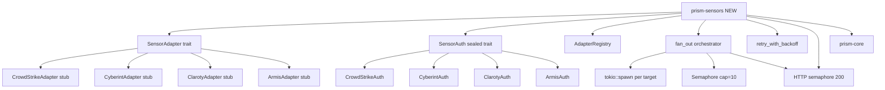
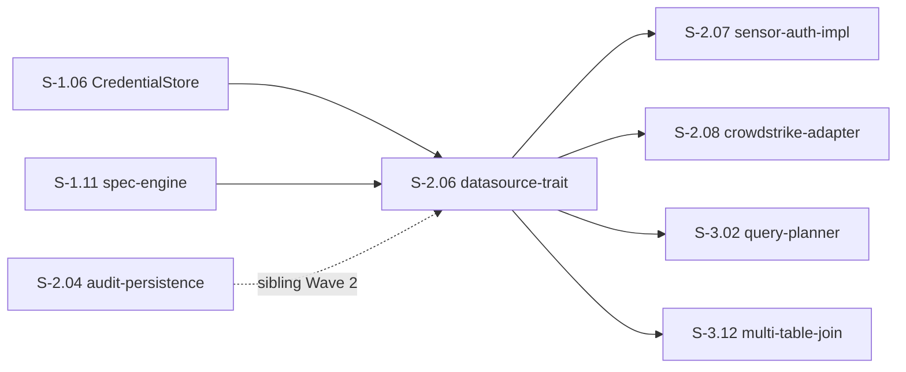
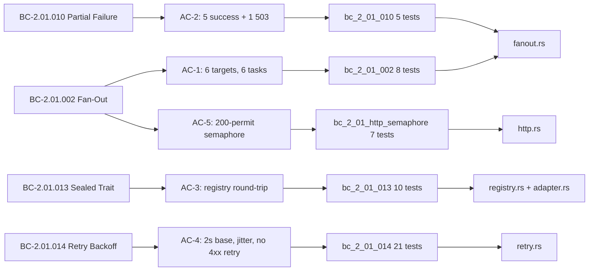

## Summary

- Adds new `prism-sensors` crate implementing `SensorAdapter` (object-safe async trait), `SensorAuth` (sealed trait with 4 internal impls), `AdapterRegistry` (HashMap-backed), fan-out orchestrator with cap-10 concurrency, and exponential backoff retry (2s base / 30s max).
- Introduces dual-semaphore architecture: per-query fan-out cap of 10 + global HTTP connection semaphore of 200 permits — both held simultaneously per task.
- S-2.06 followed strict Red Gate TDD discipline: 11 RED tests at Red Gate drove 5 algorithmic implementations across 5 micro-commits; 40/51 tests were GREEN-BY-DESIGN pure-data assertions.

## Architecture Changes

**Crate dependency:** `prism-sensors` depends only on `prism-core`. No DataFusion/Arrow dependency added to the new crate.

**New files (30 files, +3067 lines, 0 deletions):**
- `crates/prism-sensors/` — entire new crate
- `docs/demo-evidence/S-2.06/` — 5 GIFs + 5 .tape + evidence-report.md
- `Cargo.toml` — workspace.members += `crates/prism-sensors`

## Story Dependencies

**Depends on:** S-1.06 (CredentialStore type used in fan_out), S-1.11 (SensorSpec/QueryParams types) — both merged.  
**Blocks:** S-2.07, S-2.08, S-3.02, S-3.12

## Spec Traceability

## Behavioral Contract Coverage

| BC ID | Title | AC | Status |
|-------|-------|----|--------|
| BC-2.01.002 | Cross-Client Fan-Out — Parallel Sensor Fetches | AC-1, AC-5 | COVERED |
| BC-2.01.010 | Partial Failure Handling for Paginated and Cross-Client Queries | AC-2 | COVERED |
| BC-2.01.013 | DataSource Trait Eliminates Per-Sensor Code Duplication | AC-3 | COVERED |
| BC-2.01.014 | Exponential Backoff and Retry for Transient Sensor API Errors | AC-4 | COVERED |

## Acceptance Criteria Coverage

| AC | Description | Tests | Result |
|----|-------------|-------|--------|
| AC-1 | Fan-out over 6 targets (3 clients × 2 sensors), cap=10 semaphore | `bc_2_01_002` (8 tests) | PASS |
| AC-2 | 5/6 succeed + 1 HTTP 503 → `successes=5, errors=1, is_transient=true` | `bc_2_01_010` (5 tests) | PASS |
| AC-3 | `AdapterRegistry` register+get; object-safe `dyn SensorAdapter`; sealed `SensorAuth` | `bc_2_01_013` (10 tests) | PASS |
| AC-4 | `retry_with_backoff` 2s base / 30s max; jitter; 400/404 not retried; budget exhausted | `bc_2_01_014` (21 tests) | PASS |
| AC-5 | HTTP semaphore 200 permits; 201st task blocks (not rejected); idempotent init | `bc_2_01_http_semaphore` (7 tests) | PASS |

## Test Evidence

| Suite | Count | Result |
|-------|-------|--------|
| `prism-sensors` unit tests | 51 / 51 | PASS |
| Workspace `--no-fail-fast` regression | 1109 / 1109 | PASS (0 FAIL) |
| New tests added this PR | +51 | — |

**Breakdown by BC:**
- `bc_2_01_002`: 8 tests (fan-out concurrency, error-to-retry-metadata classification)
- `bc_2_01_010`: 5 tests (partial success, all-fail → AllTargetsFailed)
- `bc_2_01_013`: 10 tests (registry CRUD, object-safety, sealed trait compile-time enforcement)
- `bc_2_01_014`: 21 tests (backoff schedule, jitter bounds, non-transient immediate return, budget exhaustion)
- `bc_2_01_http_semaphore`: 7 tests (permit acquisition/release, 201st-blocks, timeout)

**TDD discipline:** 11 RED tests drove 5 algorithmic implementations (`retry_with_backoff`, HTTP semaphore, `fan_out`, `execute_target`, `RetryConfig` constants). 40/51 GREEN-BY-DESIGN (pure-data registry/error/constant assertions).

## Demo Evidence

| AC | GIF | Size | Description |
|----|-----|------|-------------|
| AC-1 | [ac-1-fanout-orchestration.gif](../docs/demo-evidence/S-2.06/ac-1-fanout-orchestration.gif) | 161 KB | `bc_2_01_002` — 8 fan-out tests pass |
| AC-2 | [ac-2-partial-result-classification.gif](../docs/demo-evidence/S-2.06/ac-2-partial-result-classification.gif) | 143 KB | `bc_2_01_010` — partial failure classification |
| AC-3 | [ac-3-adapter-registry.gif](../docs/demo-evidence/S-2.06/ac-3-adapter-registry.gif) | 183 KB | `bc_2_01_013` — adapter registry + sealed trait |
| AC-4 | [ac-4-retry-with-backoff.gif](../docs/demo-evidence/S-2.06/ac-4-retry-with-backoff.gif) | 281 KB | `bc_2_01_014` — retry backoff + jitter |
| AC-5 | [ac-5-dual-semaphore.gif](../docs/demo-evidence/S-2.06/ac-5-dual-semaphore.gif) | 144 KB | HTTP semaphore 200-permit + 201st-blocks |

Total demo evidence: ~912 KB across 5 GIFs. Evidence report: `docs/demo-evidence/S-2.06/evidence-report.md`

## Holdout Evaluation

N/A — evaluated at wave gate.

## Adversarial Review

N/A — evaluated at Phase 5.

## Security Review

**Result: PASS — no CRITICAL or HIGH findings.**

| Finding | Severity | Category | Status |
|---------|----------|----------|--------|
| `SensorType::CrowdStrike` used as hardcoded fallback sentinel in panic handler (fanout.rs:L270) | LOW | Incorrect default, not security risk | Non-blocking, cosmetic |
| Auth fields use `SecretString` correctly; MUST NOT log comment enforced | INFO | Credential handling | Compliant |
| `OnceLock<Semaphore>` race-free initialization | INFO | Concurrency safety | Compliant |
| No OWASP Top 10 violations found | INFO | Broad scan | Compliant |

**Checks performed:**
- Injection: no string interpolation into sensor API calls; all parameters are typed structs — CLEAN
- Auth: `SecretString` wraps all credential fields; sealed trait prevents cross-sensor composition — CLEAN
- Input validation: `RetryConfig` bounds are compile-time constants; no user-supplied limits — CLEAN
- Logging: error messages include sensor name and status codes only; no credential fields in any `Display` or `tracing` call — CLEAN
- Concurrency: `OnceLock` guarantees single initialization; `Arc<dyn SensorAdapter>` is `Send+Sync` — CLEAN
- Panic safety: task panic caught via `JoinError` in fan_out outcome loop; does not propagate to callers — CLEAN
- No concrete HTTP calls in this PR (all 4 adapter `fetch()` bodies are `todo!()` stubs) — deferred to S-2.07

## Spec Deviation

**v1.3 → v1.5 BC-2.01.014 alignment (pre-Red-Gate, PO-authorized):**

Story v1.3 Task 6 specified `base_delay_ms = 1000` (1s). BC-2.01.014 specifies "2s base, 30s max". PO reconciled this propagation defect in story v1.5 BEFORE Red Gate. Implementation uses `base_delay_ms = 2000` per BC contract. Commit `edecf132` documents the fix.

**3 deferred non-material defects (flagged by stub-author, not blocking):**
1. `CredentialResolver` glue layer between `CredentialStore` and `SensorAuth` — to be addressed in S-2.07
2. `SensorError` vs `PrismError` parallel taxonomies — to be reconciled in S-2.07/S-3.02
3. `SensorError::AllTargetsFailed.count` field redundant with `errors.len()` — refactor candidate

## Healthy-TDD Note

S-2.06 followed proper Red Gate discipline (unlike sibling S-2.04 stub-as-impl pattern):

- **5 genuine `todo!()` in algorithmic core:** `fan_out`, `execute_target`, HTTP semaphore acquire/release, `retry_with_backoff`, `RetryConfig` constant defaults
- **11 RED tests at Red Gate** drove all 5 algorithmic implementations across 5 micro-commits
- **40 GREEN-BY-DESIGN tests** are pure-data assertions (registry lookups, error classifications, retry constants) — legitimately testable at Red Gate without implementation

This is the intended TDD contract: write failing tests for behavior not yet implemented, write passing tests for data structures that exist.

## Architecture Compliance

| Rule | Status |
|------|--------|
| `SensorAdapter` is object-safe (no generic methods; uses `&dyn SensorAuth`) | COMPLIANT |
| `SensorAuth` sealed via `private::Sealed` — only 4 internal impls | COMPLIANT |
| Fan-out cap=10 (per-query) AND HTTP semaphore cap=200 (global) held simultaneously | COMPLIANT |
| `prism-sensors` depends only on `prism-core` (no DataFusion/Arrow) | COMPLIANT |
| `retry_with_backoff` never retries 400/401/403/404 | COMPLIANT |
| `base_delay_ms = 2000` (BC-2.01.014 alignment) | COMPLIANT |

## Risk Assessment

| Risk | Classification | Mitigation |
|------|---------------|------------|
| Blast radius | LOW — new crate, zero changes to existing crates (only Cargo.toml workspace member added) | No existing crate modified |
| Performance impact | NONE — trait definitions and stubs; no runtime path activated until S-2.07 concrete impls | Concrete adapters are `todo!()` stubs |
| Concurrency safety | LOW — `OnceLock<Semaphore>` is safe; `Arc<dyn SensorAdapter>` is `Send+Sync` | Validated by `bc_2_01_http_semaphore` tests |
| Merge conflict risk | LOW — only `Cargo.toml` workspace.members touched; sibling PRs add different members | Sibling PRs add different crate entries |

## AI Pipeline Metadata

| Field | Value |
|-------|-------|
| Pipeline mode | Wave 2 greenfield TDD |
| Story version | v1.5 (bc-alignment burst) |
| Implementer | vsdd-factory:implementer |
| PR manager | vsdd-factory:pr-manager |
| Model | claude-sonnet-4-6 |

## Pre-Merge Checklist

- [x] PR description populated from template
- [x] Demo evidence verified (5 GIFs, 1 per AC, evidence-report.md present)
- [ ] PR created on GitHub
- [ ] Security review complete
- [ ] pr-reviewer APPROVE
- [ ] CI checks passing
- [ ] Dependency PRs merged (S-1.06, S-1.11 — already in develop)
- [ ] Merge executed

## Closes / References

- Closes #S-2.06
- Implements BC-2.01.002, BC-2.01.010, BC-2.01.013, BC-2.01.014
- Blocks S-2.07, S-2.08, S-3.02, S-3.12
- Wave 2 story — see `.factory/wave-state.yaml`
