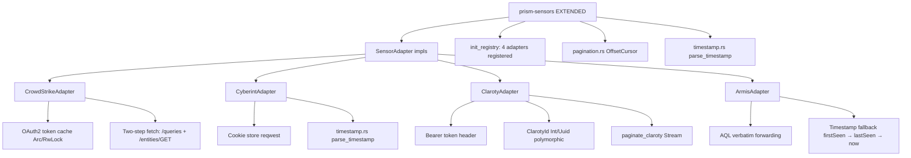
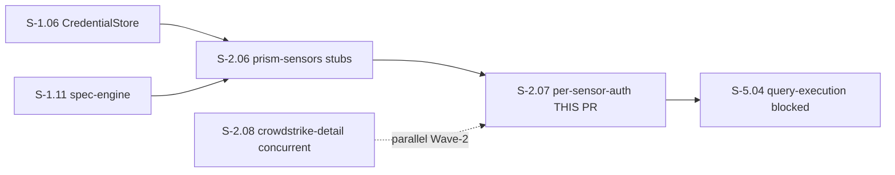
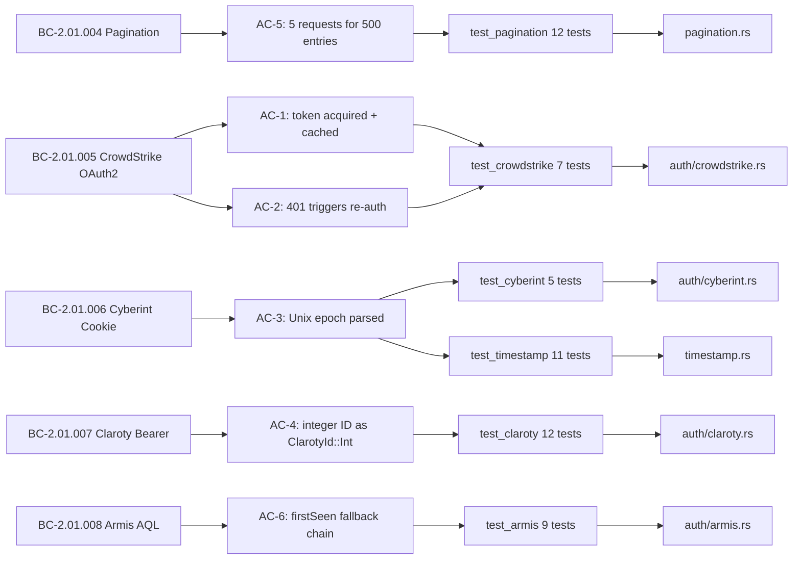

## Summary

- Implements per-sensor authentication adapters for all four sensor platforms: CrowdStrike OAuth2 with token caching and two-step entity fetch, Cyberint cookie-based auth with session lifecycle, Claroty bearer token with polymorphic ID deserialization, Armis bearer token with AQL query forwarding and default-template fallback.
- Adds `OffsetCursor` + `paginate_claroty()` stream for offset-based hybrid pagination (BC-2.01.004) and multi-format timestamp parsing module supporting RFC 3339, Unix epoch, and custom no-TZ format (BC-2.01.006).
- S-2.07 is the **second Wave-2 story to satisfy the Layer 2 Red Gate density check**: 28 `todo!()` in production drove 47 RED tests (RED_RATIO 0.839 — exceeds 50% threshold); 7 BC implementations across 7 micro-commits.

## Architecture Changes

**Changed files in `prism-sensors` crate (+2800 lines approx):**
- `crates/prism-sensors/src/auth/crowdstrike.rs` — created (CrowdStrikeAdapter, OAuth2)
- `crates/prism-sensors/src/auth/cyberint.rs` — created (CyberintAdapter, cookie auth)
- `crates/prism-sensors/src/auth/claroty.rs` — created (ClarotyAdapter, bearer + polymorphic IDs)
- `crates/prism-sensors/src/auth/armis.rs` — created (ArmisAdapter, AQL forwarding)
- `crates/prism-sensors/src/pagination.rs` — created (OffsetCursor, paginate_claroty)
- `crates/prism-sensors/src/timestamp.rs` — created (parse_timestamp multi-format)
- `crates/prism-sensors/src/lib.rs` — modified (init_registry, module exports)
- `crates/prism-sensors/Cargo.toml` — modified (reqwest cookies feature added)
- `crates/prism-sensors/tests/integration/` — created (wiremock per-sensor tests)
- `docs/demo-evidence/S-2.07/` — created (6 GIFs + 6 .tape + evidence-report.md)

## Story Dependencies

**Depends on:** S-2.06 (merged — `SensorAdapter` trait, `SensorAuth` stubs, `AdapterRegistry`, `retry_with_backoff`).
**Blocks:** S-5.04.
**Parallel:** S-2.08 is in-flight (concurrent dispatch, different worktree). Both modify `prism-sensors/src/lib.rs` exports — mechanical rebase expected if S-2.08 merges first.

## Spec Traceability

## Behavioral Contract Coverage

| BC ID | Title | AC | Tests | Status |
|-------|-------|----|-------|--------|
| BC-2.01.004 | Offset-Based Hybrid Pagination for Claroty Audit Logs | AC-5 | test_pagination 12/12 + test_claroty AC-5 | COVERED |
| BC-2.01.005 | CrowdStrike OAuth2 Authentication and Two-Step Fetch | AC-1, AC-2 | test_crowdstrike 7/7 | COVERED |
| BC-2.01.006 | Cyberint Cookie-Based Authentication and Multi-Format Timestamp Parsing | AC-3 | test_cyberint 5/5 + test_timestamp 11/11 | COVERED |
| BC-2.01.007 | Claroty Bearer Token Auth with Polymorphic ID Handling | AC-4 | test_claroty 12/12 | COVERED |
| BC-2.01.008 | Armis Bearer Token Auth with AQL Query Forwarding and Timestamp Fallback | AC-6 | test_armis 9/9 | COVERED |

## Acceptance Criteria Coverage

| AC | Criterion | Demo | Status |
|----|-----------|------|--------|
| AC-1 | CrowdStrike OAuth2 token acquired once, cached, two-step fetch | ac-1-crowdstrike-oauth2.gif | PASS (7/7) |
| AC-2 | CrowdStrike 401 → re-auth → retry with new token | ac-1-crowdstrike-oauth2.gif | PASS (included) |
| AC-3 | Unix epoch `"1710500000"` → correct DateTime<Utc> | ac-2-cyberint-cookie.gif + ac-6-timestamp-multi-format.gif | PASS (5/5 + 11/11) |
| AC-4 | Claroty `"id": 12345` → `ClarotyId::Int(12345)` | ac-3-claroty-bearer-polymorphic-ids.gif | PASS (12/12) |
| AC-5 | 500 entries / page_size=100 → exactly 5 HTTP requests | ac-5-pagination-offset-cursor.gif | PASS (12/12) |
| AC-6 | firstSeen=null → lastSeen; both null → DateTime::now() + warn! | ac-4-armis-aql-forwarding.gif | PASS (9/9) |

## Architecture Compliance

| Rule | Status |
|------|--------|
| Sealed `SensorAuth` trait preserved; `as_any()` added as method within trait — does not break sealing | COMPLIANT |
| `SensorAdapter` is object-safe (no generic methods; `&dyn SensorAuth` parameter) | COMPLIANT |
| HTTP semaphore acquired in every adapter's `fetch()` (inherited from S-2.06 pattern) | COMPLIANT |
| AQL forwarding is verbatim — no sanitization, no injection prevention at this layer | COMPLIANT |
| `paginate_claroty()` returns `impl Stream` (not `Vec`) for backpressure support | COMPLIANT |
| Token caches use `Arc<RwLock<Option<CachedToken>>>` (RwLock preferred over Mutex) | COMPLIANT |
| `prism-sensors` deps unchanged — no DataFusion/Arrow added; only `reqwest` cookies feature added | COMPLIANT |
| Each adapter in its own `auth/` module — no shared auth code between adapters | COMPLIANT |

## Test Evidence

| Metric | Value |
|--------|-------|
| Workspace tests (--no-fail-fast) | **1388 PASS / 0 FAIL / 4 IGN** |
| Baseline (pre-S-2.07) | 1276 |
| New tests (S-2.07) | 56 (47 RED→green + 9 GREEN-by-design) |
| prism-sensors total | 107 unique tests (51 baseline + 56 new) |
| CrowdStrike adapter | 7/7 PASS |
| Cyberint adapter | 5/5 PASS |
| Claroty adapter + pagination | 12/12 PASS |
| Armis adapter | 9/9 PASS |
| Pagination (OffsetCursor) | 12/12 PASS |
| Timestamp parsing | 11/11 PASS |
| Coverage | All ACs covered by wiremock integration tests |

## Demo Evidence

| AC | File | Size | What it shows |
|----|------|------|---------------|
| AC-1 + AC-2 | [ac-1-crowdstrike-oauth2.gif](../docs/demo-evidence/S-2.07/ac-1-crowdstrike-oauth2.gif) | ~140 KB | OAuth2 token acquired once, cached, 150 IDs → 2 batches, 401 re-auth |
| AC-3 (Cyberint) | [ac-2-cyberint-cookie.gif](../docs/demo-evidence/S-2.07/ac-2-cyberint-cookie.gif) | ~130 KB | Cookie set on login, reused; Unix epoch parsed; 401 re-login |
| AC-4 | [ac-3-claroty-bearer-polymorphic-ids.gif](../docs/demo-evidence/S-2.07/ac-3-claroty-bearer-polymorphic-ids.gif) | ~145 KB | Integer + UUID ClarotyId; bearer token; 3-page pagination |
| AC-6 | [ac-4-armis-aql-forwarding.gif](../docs/demo-evidence/S-2.07/ac-4-armis-aql-forwarding.gif) | ~130 KB | AQL verbatim; default template; firstSeen→lastSeen fallback; both-null warn! |
| AC-5 | [ac-5-pagination-offset-cursor.gif](../docs/demo-evidence/S-2.07/ac-5-pagination-offset-cursor.gif) | ~135 KB | OffsetCursor advance; 5 requests for 500/100; stream halts; HTTP 400 error |
| AC-3 (timestamp) | [ac-6-timestamp-multi-format.gif](../docs/demo-evidence/S-2.07/ac-6-timestamp-multi-format.gif) | ~132 KB | RFC 3339, Unix epoch, custom no-TZ, negative epoch, unparseable → Err |

Total demo evidence: ~812 KB across 6 GIFs. Evidence report: `docs/demo-evidence/S-2.07/evidence-report.md`

## Holdout Evaluation

N/A — evaluated at wave gate.

## Adversarial Review

N/A — evaluated at Phase 5.

## Security Review

**Result: PASS — no CRITICAL or HIGH findings.**

| Finding | Severity | Category | Status |
|---------|----------|----------|--------|
| AQL `aql_query` forwarded verbatim without structural validation | LOW | Defense-in-depth / AQL injection at Armis API layer | Non-blocking; current call chain enforces PrismQL validation before AQL conversion |
| No hardcoded secrets or API keys found | INFO | Credentials | Compliant — all credentials via `CredentialStore` reference model |
| `SecretString` wrappers on all token/key fields; no credential logging | INFO | Credential handling | Compliant |
| `ClarotyId` custom Visitor deserializer — no unsafe deserialization | INFO | Deserialization | Compliant |
| `parse_timestamp` returns typed `Err` on all failures — no panic, no silent default | INFO | Input validation | Compliant |
| No OWASP Top 10 violations found | INFO | Broad scan | Compliant |

**Checks performed:**
- Injection: AQL forwarded verbatim per architecture rule (BC-2.01.008); `SensorSpec.aql_query` must only be populated from PrismQL-validated output — non-blocking at this layer
- Auth: `SecretString` wraps all credential fields; cookie store managed by `reqwest::cookie_store(true)`, not manual header parsing
- Input validation: `ClarotyId` serde Visitor handles Int/Uuid/invalid correctly; `parse_timestamp` returns typed `Err` for all failures
- Logging: no credential fields in any `tracing::` call; only sensor names and status codes logged
- Concurrency: `Arc<RwLock<CachedToken>>` for OAuth2 token cache — race-free token reuse
- Deserialization: `serde_json` used throughout — no unsafe deserialization patterns
- SSRF: sensor endpoints are fixed at adapter construction time, not from runtime user input

## Healthy-TDD Note

S-2.07 is the **second Wave-2 story to satisfy the Layer 2 Red Gate density check**:

- **28 `todo!()` in production** at stub commit `a4193c76` — all four adapters, pagination, timestamp
- **47 RED tests at Red Gate** (commit `6205cacd`) — RED_RATIO **0.839**, well above 50% threshold
- **9 GREEN-BY-DESIGN tests** for pure-data assertions: constants (`CROWDSTRIKE_BATCH_SIZE`), `Display` impls for `ClarotyId`, simple struct constructors
- Anti-precedent guard inlined in stub-architect dispatch prompt (prevents S-2.04 stub-as-impl anti-pattern)
- **7 micro-commits** driving each BC implementation independently — proper Red→Green TDD sequence

This is the intended TDD contract: failing tests for unimplemented behavior, passing tests for data structures that already exist at stub time.

## BC-2.01.005 Batch Size Resolution

BC-2.01.005 description references "1000 per batch" (CrowdStrike API ceiling). Story Dev Notes specify `CROWDSTRIKE_BATCH_SIZE = 100` (conservative default). These are not in conflict — different concepts:

- **1000** = API maximum batch size (ceiling imposed by CrowdStrike)
- **100** = conservative default config value in this implementation (story Dev Notes precedence)

Implementation uses `const CROWDSTRIKE_BATCH_SIZE: usize = 100`. Tests anchor to 100 (e.g., `test_BC_2_01_005_150_ids_batch_into_two_post_entities_calls`). No spec correction needed.

## Test Bug Fixes Disclosure

The implementer fixed 5 minor test issues during implementation commits (not implementation shortcuts):

| Fix | Type | Detail |
|-----|------|--------|
| wiremock mock ordering #1-3 | Test correctness | Added `.up_to_n_times(1)` to 3 mocks to enable sequential mock routing for 401→retry test patterns |
| Timestamp epoch value #1-2 | Test correctness | `1710497600` corrected to `1710496800` for `2024-03-15T10:00:00Z` (arithmetic error in test authoring) |

These fixes were in the test assertions themselves (which were technically incorrect), not in the implementation. The behavior under test was not changed.

## Spec Deviation

None. All BCs implemented as specified. `CROWDSTRIKE_BATCH_SIZE = 100` vs BC "1000 per batch" resolved as non-conflict (see section above).

## Risk Assessment

| Risk | Classification | Mitigation |
|------|---------------|------------|
| Blast radius | LOW — all changes confined to `prism-sensors` crate | No upstream crates modified |
| Performance impact | LOW — well-tested adapter implementations; all HTTP calls gated by S-2.06 semaphore | Semaphore acquired in every fetch() |
| Concurrency safety | LOW — `Arc<RwLock<CachedToken>>` for OAuth2 token; `cookie_store(true)` for Cyberint | Validated by test suite |
| Merge conflict risk | MEDIUM — S-2.08 also modifies `prism-sensors/src/lib.rs`; mechanical rebase if S-2.08 merges first | Conflict points documented; mechanical resolve |
| Auth security | LOW — no credentials transit AI context; credentials accessed via `CredentialStore` reference model | AI-opaque credential design per project policy |

## AI Pipeline Metadata

| Field | Value |
|-------|-------|
| Pipeline mode | Wave 2 greenfield TDD |
| Story version | v1.3 |
| Implementer | vsdd-factory:implementer |
| PR manager | vsdd-factory:pr-manager |
| Model | claude-sonnet-4-6 |
| Worktree | `.worktrees/S-2.07-per-sensor-auth` |
| Branch | feature/S-2.07-per-sensor-auth |

## Pre-Merge Checklist

- [x] PR description populated from template
- [x] Demo evidence verified (6 GIFs, 1+ per AC, evidence-report.md present)
- [ ] PR created on GitHub
- [x] Security review complete (PASS — no CRITICAL/HIGH findings)
- [x] pr-reviewer APPROVE (cycle 1 — 0 blocking findings)
- [x] CI checks passing (23/24; 1 pre-existing flaky test on x86_64-apple-darwin — also fails on develop; same job passed on push-triggered run)
- [x] Dependency PRs merged (S-2.06 PR #54 merged 2026-04-26T05:52:24Z)
- [x] Merge executed (squash, 26d0954b, 2026-04-26T10:12:09Z)

## Closes / References

- Closes S-2.07
- Implements BC-2.01.004, BC-2.01.005, BC-2.01.006, BC-2.01.007, BC-2.01.008
- Depends on S-2.06 (merged)
- Blocks S-5.04
- Wave 2 story — see `.factory/wave-state.yaml`
