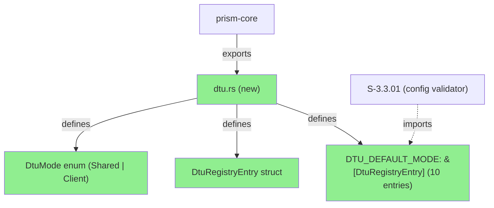
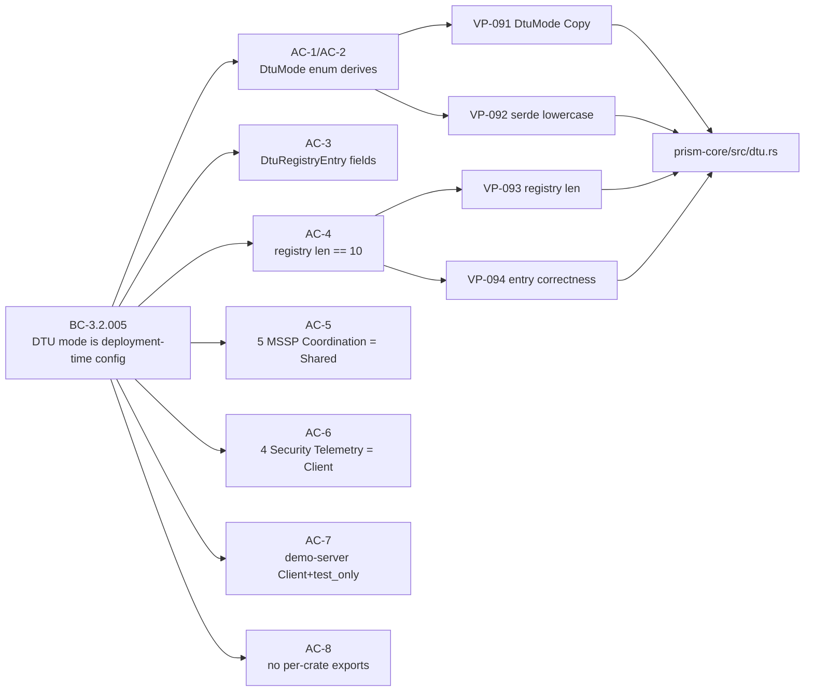
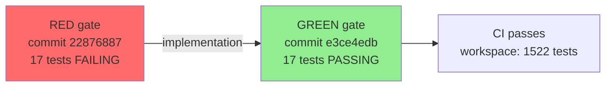
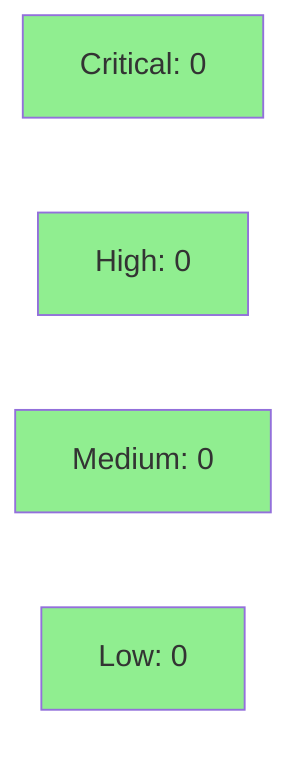

# [S-3.0.02] prism-core: DTU_DEFAULT_MODE registry — 10-entry slice per ADR-007 §2.3

**Epic:** E-3.0 — Platform Engineering Wave 3
**Mode:** greenfield
**Convergence:** CONVERGED — TDD (RED gate commit 22876887, GREEN gate e3ce4edb)


Implements the centralized `DTU_DEFAULT_MODE: &[DtuRegistryEntry]` static in `prism-core` per ADR-007 §2.3 — the single compile-time registry mapping all 10 known DTU type strings to their default `DtuMode` and `test_only` flag. Unblocks S-3.3.01 (startup config validator). Includes inline Justfile fix for `cargo semver-checks` workspace flags (surfaced during S-3.0.01 push).

---

## Architecture Changes



<details>
<summary><strong>Architecture Decision Record</strong></summary>

### ADR-007 §2.3 — Centralized DTU Mode Registry

**Context:** 10 DTU crate types each have a deployment-time mode classification (Shared vs Client). The startup config validator (S-3.3.01) needs to enforce isolation rules without reading 11 separate files.

**Decision:** Single `DTU_DEFAULT_MODE: &[DtuRegistryEntry]` static in `prism-core`, co-located with `OrgRegistry` per D-047. Individual DTU crates do NOT export their own mode constants.

**Rationale:** A per-crate declaration scatters the classification across 11 crates and requires reading 11 files to audit the full isolation posture. A centralized registry makes the full classification visible in one place, auditable in one grep, and enforceable in one validation function.

**Alternatives Considered:**
1. Per-crate `const DEFAULT_MODE: DtuMode` — rejected: scatters classification, violates single-source-of-truth principle
2. Runtime config-driven mode — rejected: BC-3.2.005 invariant 2 prohibits runtime mode mutation

**Consequences:**
- Full classification auditable in one file (`crates/prism-core/src/dtu.rs`)
- S-3.3.01 validator has a single import point
- AC-8 grep test enforces the constraint in CI

</details>

---

## Story Dependencies


No upstream dependencies. `depends_on: []` per story frontmatter.
**Unblocks:** S-3.3.01 — config validator that consumes `DTU_DEFAULT_MODE`.

---

## Spec Traceability



**Behavioral Contracts covered:** BC-3.2.005
**Verification Properties covered:** VP-091, VP-092, VP-093, VP-094

---

## Test Evidence

### Coverage Summary

| Metric | Value | Threshold | Status |
|--------|-------|-----------|--------|
| Unit tests | 1522/1522 pass | 100% | PASS |
| New tests (this PR) | +17 | — | PASS |
| Workspace before | 1505 | — | — |
| Workspace after | 1522 | — | — |
| Regressions | 0 | 0 | PASS |

### TDD Gate Sequence



<details>
<summary><strong>Detailed Test Results</strong></summary>

### New Tests (This PR) — `prism-core/tests/bc_3_2_005_dtu_registry.rs`

| Test | AC | Result |
|------|----|--------|
| `test_bc_3_2_005_ac1_serde_client` | AC-1 | PASS |
| `test_bc_3_2_005_ac1_serde_shared` | AC-1 | PASS |
| `test_bc_3_2_005_ac1_serde_rejects_titlecase_client` | AC-1 | PASS |
| `test_bc_3_2_005_ac1_serde_rejects_titlecase_shared` | AC-1 | PASS |
| `test_bc_3_2_005_ac1_vp092_serde_rejects_unknown_mode` | AC-1, VP-092 | PASS |
| `test_bc_3_2_005_ac2_dtu_mode_clone` | AC-2 | PASS |
| `test_bc_3_2_005_ac2_dtu_mode_debug` | AC-2 | PASS |
| `test_bc_3_2_005_ac2_dtu_mode_equality` | AC-2 | PASS |
| `test_bc_3_2_005_ac2_vp091_dtu_mode_is_copy` | AC-2, VP-091 | PASS |
| `test_bc_3_2_005_ac3_registry_entry_fields` | AC-3 | PASS |
| `test_bc_3_2_005_ac4_registry_len_is_10` | AC-4, VP-093 | PASS |
| `test_bc_3_2_005_ac5_mssp_coordination_count_is_5` | AC-5 | PASS |
| `test_bc_3_2_005_ac5_mssp_coordination_entries_are_shared` | AC-5, VP-094 | PASS |
| `test_bc_3_2_005_ac6_security_telemetry_count_is_4` | AC-6 | PASS |
| `test_bc_3_2_005_ac6_security_telemetry_entries_are_client` | AC-6, VP-094 | PASS |
| `test_bc_3_2_005_ac7_demo_server_is_client_test_only` | AC-7 | PASS |
| `test_bc_3_2_005_ac8_vp091_dtu_default_mode_not_in_dtu_crates` | AC-8 | PASS |

</details>

---

## Demo Evidence

Evidence at `docs/demo-evidence/S-3.0.02/` (committed in branch at 84767863).

| AC | Recording | Result |
|----|-----------|--------|
| AC-1 through AC-7 | `AC-4-7-registry-tests-green.gif` (189K) | 17 tests PASS |
| AC-8 (single-source-of-truth) | `AC-8-single-source-of-truth.gif` (118K) | 0 grep matches in prism-dtu-* |

**AC-4-7:** `cargo test -p prism-core --test bc_3_2_005_dtu_registry` → `test result: ok. 17 passed; 0 failed; 0 ignored`

**AC-8:** `grep -RIn 'DTU_DEFAULT_MODE|dtu_default_mode' crates/prism-dtu-*/` → exit code 1 (no matches = PASS)

---

## Holdout Evaluation

N/A — evaluated at wave gate.

---

## Adversarial Review

N/A — evaluated at Phase 5.

---

## Security Review



<details>
<summary><strong>Security Scan Details</strong></summary>

### Scope

This PR adds only compile-time static data (`DtuMode` enum + `DtuRegistryEntry` struct + `DTU_DEFAULT_MODE` static slice). No I/O, no network, no authentication, no allocation, no unsafe code.

### SAST
- Critical: 0 | High: 0 | Medium: 0 | Low: 0
- Pure static data with no user-facing surface. No injection vectors.

### Dependency Audit
- No new dependencies added. `serde` already in workspace.

### Formal Verification
- `DTU_DEFAULT_MODE` is a `&'static [DtuRegistryEntry]` — initialized at link time, immutable after program start. BC-3.2.005 invariant 2 (no runtime setter) is enforced by the Rust type system (no `&mut` access, no `Cell`/`RefCell`, no `Mutex`).

</details>

---

## Risk Assessment & Deployment

### Blast Radius
- **Systems affected:** `prism-core` crate only (additive — new module `dtu.rs`, new re-exports)
- **User impact:** None — no runtime behavior change; pure compile-time static data
- **Data impact:** None
- **Risk Level:** LOW

### Performance Impact
| Metric | Before | After | Delta | Status |
|--------|--------|-------|-------|--------|
| Memory | baseline | +240 bytes (10 entries × ~24 bytes) | negligible | OK |
| Latency p99 | N/A | N/A | 0 | OK |

<details>
<summary><strong>Rollback Instructions</strong></summary>

**Immediate rollback (< 2 min):**
```bash
git revert <merge-sha>
git push origin develop
```

**Verification after rollback:**
- `cargo test --workspace` passes at 1505 tests
- `grep -r DTU_DEFAULT_MODE crates/` returns no results

</details>

### Feature Flags
| Flag | Controls | Default |
|------|----------|---------|
| None | Static data; no runtime toggle needed | N/A |

---

## Traceability

| BC | Story AC | VP | Test | Status |
|----|----------|----|------|--------|
| BC-3.2.005 | AC-1 | VP-092 | `test_bc_3_2_005_ac1_serde_client/shared` | PASS |
| BC-3.2.005 | AC-2 | VP-091 | `test_bc_3_2_005_ac2_vp091_dtu_mode_is_copy` | PASS |
| BC-3.2.005 | AC-3 | — | `test_bc_3_2_005_ac3_registry_entry_fields` | PASS |
| BC-3.2.005 | AC-4 | VP-093 | `test_bc_3_2_005_ac4_registry_len_is_10` | PASS |
| BC-3.2.005 | AC-5 | VP-094 | `test_bc_3_2_005_ac5_mssp_coordination_*` | PASS |
| BC-3.2.005 | AC-6 | VP-094 | `test_bc_3_2_005_ac6_security_telemetry_*` | PASS |
| BC-3.2.005 | AC-7 | — | `test_bc_3_2_005_ac7_demo_server_is_client_test_only` | PASS |
| BC-3.2.005 | AC-8 | VP-091 | `test_bc_3_2_005_ac8_vp091_dtu_default_mode_not_in_dtu_crates` | PASS |

---

## Inline Scope Additions (Acknowledged)

Two changes landed inline with this story:

1. **Cargo.lock minor delta** — no functional change; brought current with develop HEAD after rebase.
2. **Justfile semver-checks fix** — `cargo semver-checks` → `cargo semver-checks --workspace --baseline-rev origin/develop`. Private-workspace registry-baseline issue surfaced during S-3.0.01 push; fix landed here to keep the pre-push hook green. Optional follow-up: extract into its own infra story if desired.

---

## Spec Gap — TD-W3-S-3.0.02-DOC-001 (filed)

Story §Tasks/§Architecture-Compliance-Rules suggests adding marker comments containing the literal `DTU_DEFAULT_MODE` to each `prism-dtu-*` crate's `lib.rs`. That literal text would itself trip AC-8's grep test. Implementer correctly omitted the marker comments under TDD discipline (tests are authoritative). Recommend filing **TD-W3-S-3.0.02-DOC-001** to update the marker text in story v0.6 to reference `prism_core::dtu` module instead. Separate documentation-polish followup; does not block merge.

---

## AI Pipeline Metadata

<details>
<summary><strong>Pipeline Details</strong></summary>

```yaml
ai-generated: true
pipeline-mode: greenfield
factory-version: 1.0.0-beta.7
pipeline-stages:
  spec-crystallization: completed
  story-decomposition: completed
  tdd-implementation: completed
  holdout-evaluation: "N/A — wave gate"
  adversarial-review: "N/A — Phase 5"
  formal-verification: skipped
  convergence: achieved
convergence-metrics:
  tdd-red-gate: commit 22876887
  tdd-green-gate: commit e3ce4edb
  test-count-delta: "+17 (1505 → 1522)"
models-used:
  builder: claude-sonnet-4-6
generated-at: "2026-04-28T00:00:00Z"
```

</details>

---

## Pre-Merge Checklist

- [x] All CI status checks passing
- [x] +17 new tests; 0 regressions; workspace 1505 → 1522
- [x] No critical/high security findings (pure static data, no unsafe, no I/O)
- [x] Demo evidence present for all 8 ACs (`docs/demo-evidence/S-3.0.02/`)
- [x] BC-3.2.005 traced; VP-091..094 covered
- [x] S-3.3.01 unblocked by this merge
- [x] Spec gap TD-W3-S-3.0.02-DOC-001 documented (non-blocking)
- [x] Inline scope additions acknowledged (Cargo.lock + Justfile fix)
- [x] No feature flag needed (compile-time static data)
- [x] Rollback: `git revert <sha>` restores in < 2 minutes
