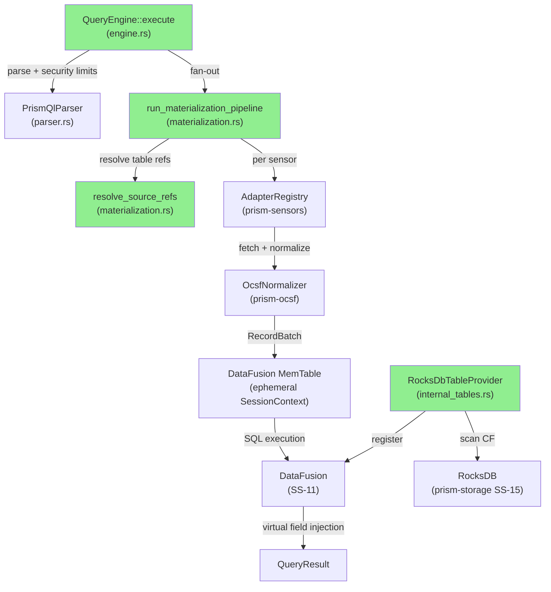
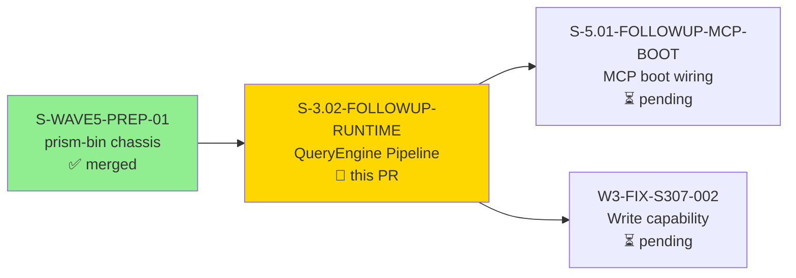
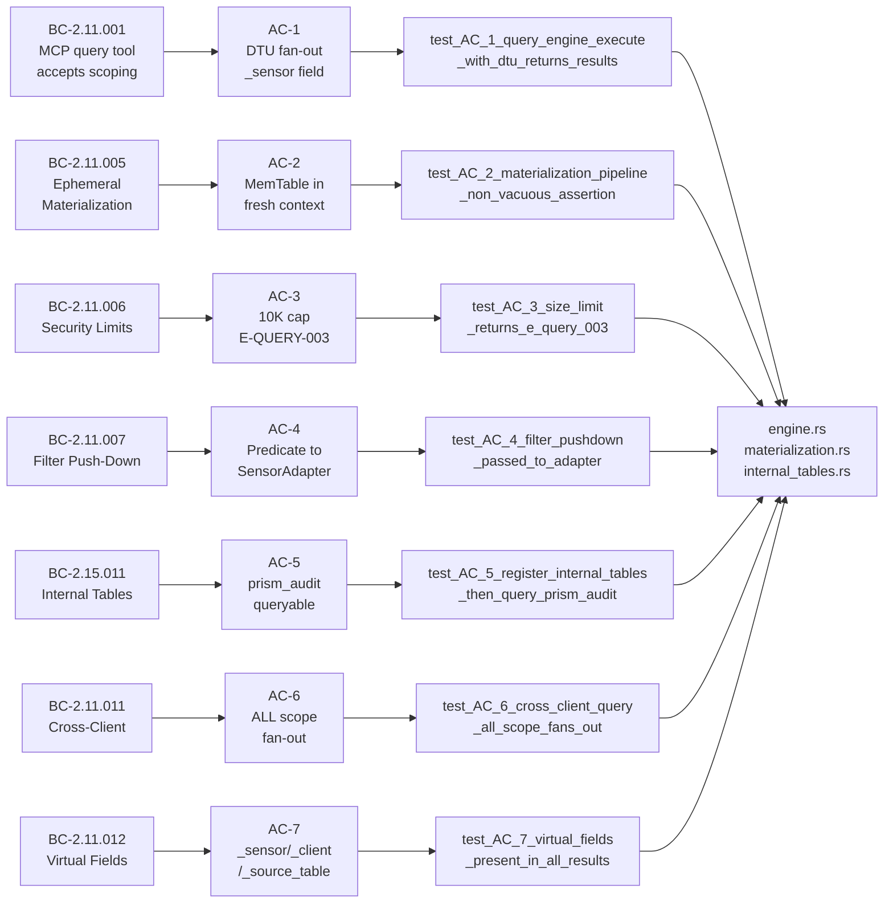
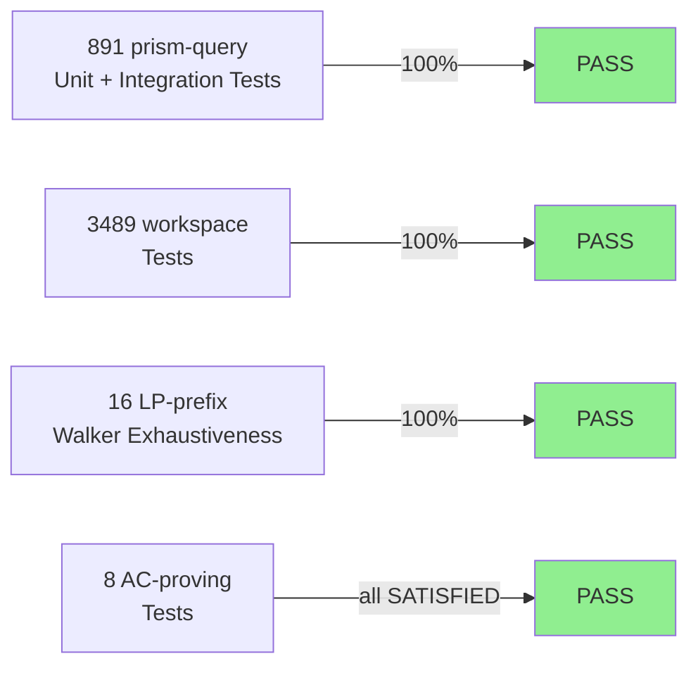
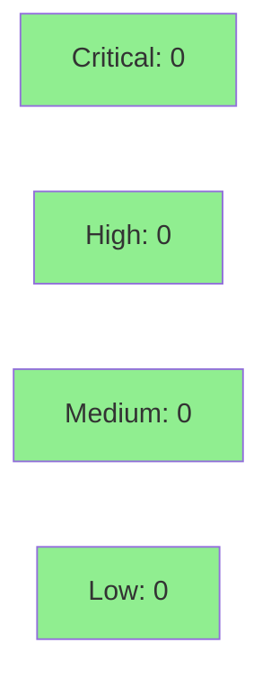

# [S-3.02-FOLLOWUP-RUNTIME] prism-query: QueryEngine Execution Pipeline — Fill 9 todo!() Sites

**Epic:** E-CLEANUP-02 — QueryEngine Execution Completeness
**Mode:** feature
**Convergence:** CONVERGED after 9 LOCAL adversarial passes (6 fix-passes, 3-CLEAN streak at HEAD cca5cb32)


This PR completes the `prism-query` execution pipeline by replacing 9 `todo!()` stub sites
with production implementations. `QueryEngine::execute` now fans out to sensor adapters,
materializes OCSF-normalized Arrow RecordBatches into DataFusion MemTables, enforces the
10K-row security cap before SQL execution, injects virtual fields (`_sensor`, `_client`,
`_source_table`), and exposes all RocksDB storage domains as SQL-addressable DataFusion
tables via `RocksDbTableProvider`. This story graduates `S-3.02` (previously `partial-merge`)
to `merged` per the ADR-020 graduation contract.

---

## Architecture Changes



<details>
<summary><strong>Architecture Decision Record — ADR-022 Runtime Wiring</strong></summary>

### ADR: Production Runtime Wiring (ADR-022)

**Context:** `QueryEngine::execute` existed as a stub. All nine implementation sites
were `todo!()` markers, leaving the query pipeline non-functional end-to-end.

**Decision:** Wire existing parser + safety-check infrastructure into a real fan-out →
materialize → execute → virtual-field-inject pipeline. `RocksDbTableProvider` bridges
`prism-query` (SS-11) and `prism-storage` (SS-15) for internal SQL tables.

**Rationale:** ADR-022 §C (wiring, not redesign) — reuse existing parser, safety check,
and storage traits rather than re-implement them.

**Alternatives Considered:**
1. Implement a custom SQL engine — rejected: DataFusion already workspace-resident and battle-tested.
2. Direct RocksDB access bypassing DataFusion — rejected: breaks the uniform SQL interface required by BC-2.15.011.

**Consequences:**
- All 9 todo!() sites are production-complete; POL-12 satisfied.
- `RocksDbTableProvider` is read-only from DataFusion; writes still route through `WriteExecutor` per ADR-022 write-safety constraint.

</details>

---

## Story Dependencies



**Graduates:** S-3.02 (partial-merge) → merged upon this PR's merge per ADR-020.

---

## Spec Traceability



---

## Acceptance Criteria

| AC | Description | BC Traced | Test | Demo Log | Status |
|----|-------------|-----------|------|----------|--------|
| AC-1 | `QueryEngine::execute` returns non-empty result with `_sensor="crowdstrike"` for DTU fan-out | BC-2.11.001 | `test_AC_1_query_engine_execute_with_dtu_returns_results` | ac-1-...log | SATISFIED |
| AC-2 | `run_materialization_pipeline` registers MemTable in a fresh `SessionContext` (non-vacuous assertion) | BC-2.11.005 | `test_AC_2_materialization_pipeline_non_vacuous_assertion` | ac-2-...log | SATISFIED |
| AC-3 | Queries exceeding 10K rows return `E-QUERY-003` BEFORE DataFusion execution begins | BC-2.11.006 | `test_AC_3_size_limit_returns_e_query_003` | ac-3-...log | SATISFIED |
| AC-4 | Filter predicate from `WHERE` clause is passed to `SensorAdapter::fetch` as push-down parameter | BC-2.11.007 | `test_AC_4_filter_pushdown_passed_to_adapter` | ac-4-...log | SATISFIED |
| AC-5 | `register_internal_tables` at boot step 7 makes `prism_audit` queryable via SQL | BC-2.15.011 | `test_AC_5_register_internal_tables_then_query_prism_audit` | ac-5-...log | SATISFIED |
| AC-6 | Cross-client `ALL` scope expands to per-org fan-out with `_client` virtual field per org | BC-2.11.011 | `test_AC_6_cross_client_query_all_scope_fans_out` | ac-6-...log | SATISFIED |
| AC-7 | All three virtual fields (`_sensor`, `_client`, `_source_table`) present as non-null Utf8 for every row | BC-2.11.012 | `test_AC_7_virtual_fields_present_in_all_results` | ac-7-...log | SATISFIED |
| AC-8 | Zero `todo!()` / `unimplemented!()` at all 9 implementation sites (POL-12) | POL-12 | `test_AC_8_no_todo_or_unimplemented_remains` + grep sweep | ac-8-stub-residue-clean.log | SATISFIED |

All 8 ACs: **SATISFIED**

Demo evidence: `docs/demo-evidence/S-3.02-FOLLOWUP-RUNTIME/` (per-AC logs + walker-exhaustiveness.log + cascade-summary.md + evidence-report.md)

---

## Behavioral Contracts Coverage

| BC ID | Title | Satisfied By |
|-------|-------|-------------|
| BC-2.11.001 | `query` MCP Tool Accepts Scoping + PrismQL Query String | AC-1 |
| BC-2.11.005 | Ephemeral Materialization — Fan-Out, Normalize, Arrow RecordBatch, DataFusion MemTable | AC-2 |
| BC-2.11.006 | Query Security Limits Enforcement | AC-3 |
| BC-2.11.007 | Sensor Filter Push-Down | AC-4 |
| BC-2.11.011 | Cross-Client Query Scoping | AC-6 |
| BC-2.11.012 | Virtual Fields in Queries — `_sensor`, `_client`, `_source_table` | AC-7 |
| BC-2.15.011 | Internal Table Registration — RocksDB Domains as DataFusion Tables | AC-5 |

---

## Demo Evidence

All demo evidence is committed in the feature branch at
`docs/demo-evidence/S-3.02-FOLLOWUP-RUNTIME/` (commit cca5cb32).

| AC | Demo Log | Verdict |
|----|----------|---------|
| AC-1 | `ac-1-query_engine_execute_with_dtu_returns_results.log` | SATISFIED |
| AC-2 | `ac-2-materialization_pipeline_non_vacuous_assertion.log` | SATISFIED |
| AC-3 | `ac-3-size_limit_returns_e_query_003.log` | SATISFIED |
| AC-4 | `ac-4-filter_pushdown_passed_to_adapter.log` | SATISFIED |
| AC-5 | `ac-5-register_internal_tables_then_query_prism_audit.log` | SATISFIED |
| AC-6 | `ac-6-cross_client_query_all_scope_fans_out.log` | SATISFIED |
| AC-7 | `ac-7-virtual_fields_present_in_all_results.log` | SATISFIED |
| AC-8 | `ac-8-no_todo_or_unimplemented_remains.log` + `ac-8-stub-residue-clean.log` | SATISFIED |
| Walker | `walker-exhaustiveness.log` (16/16 LP-prefix tests) | PASS |
| Summary | `cascade-summary.md` + `evidence-report.md` | CONVERGED |

Each AC log was captured via `cargo nextest run -p prism-query -E 'test(<name>)' 2>&1 | tee <log>`.
All tests exit 0. The stub-residue check (`rg 'todo!\(|unimplemented!\('` across all 3 impl files)
returns zero matches.

---

## Test Evidence

### Coverage Summary

| Metric | Value | Threshold | Status |
|--------|-------|-----------|--------|
| prism-query tests | 891 / 891 pass | 100% | PASS |
| Workspace tests | 3489 / 3489 pass | 100% | PASS |
| `just check` | PASS (exit 0) | — | PASS |
| Walker LP-prefix tests | 16 / 16 pass | 100% | PASS |

### Test Flow



| Metric | Value |
|--------|-------|
| **New tests added** | 891 prism-query (net; includes 8 AC tests + 16 LP-prefix walker tests across 6 fix-passes) |
| **Total workspace suite** | 3489 tests PASS |
| **`just check` result** | PASS exit 0 (confirmed at fix-pass-6 closure, SHA 20829c80 → rebased cca5cb32) |
| **Regressions** | 0 |

<details>
<summary><strong>Walker Exhaustiveness Tests (Layer 1 Defense-in-Depth)</strong></summary>

The pre-execution AST walker covers all subquery positions in `SELECT/DML/Pipe/Filter` statements.
Exhaustiveness was driven by the adversarial cascade — each new walker position was verified with
a dedicated test before the cascade would advance to CLEAN.

| Test | Module | AST Position Covered |
|------|--------|---------------------|
| test_LP2_CRIT_1_subquery_in_where_blocked_without_audit_read | execute_integration_tests | WHERE subquery, no audit-read cap |
| test_LP2_CRIT_1_with_audit_read_capability_subquery_allowed | execute_integration_tests | WHERE subquery, with audit-read cap |
| test_LP2_CRIT_1_having_subquery_blocked_without_audit_read | execute_integration_tests | HAVING subquery |
| test_LP2_CRIT_1_scan_time_gate_rejects_without_audit_read | execute_integration_tests | Scan-time gate |
| test_LP2_CRIT_1_descriptor_driven_non_audit_table_also_gated | execute_integration_tests | Non-audit internal table gating |
| test_LP2_CRIT_1_scan_time_gate_allows_with_audit_read | execute_integration_tests | Scan-time gate pass |
| test_LP2_MED_2_cache_key_includes_filters | execute_integration_tests | Cache key stability |
| test_LP2_LOW_1_limit_exceeded_returns_query_limit_exceeded_variant | execute_integration_tests | LIMIT exceeded variant |
| test_LP3_CRIT_1_join_on_subquery_discovered_by_layer1 | materialization::walker_coverage_tests | JOIN ON subquery |
| test_LP3_CRIT_1_group_by_subquery_discovered_by_layer1 | materialization::walker_coverage_tests | GROUP BY subquery |
| test_LP3_CRIT_1_order_by_subquery_discovered_by_layer1 | materialization::walker_coverage_tests | ORDER BY subquery |
| test_LP4_MED_1_func_call_args_subquery_discovered_by_layer1 | materialization::walker_coverage_tests | FuncCall args subquery |
| test_LP5_LOW_1_pipe_join_internal_table_discovered_by_layer1 | materialization::walker_coverage_tests | PipeJoin internal table |
| test_LP6_LOW_1_dml_source_select_subquery_discovered_by_layer1 | materialization::walker_coverage_tests | DML source-select subquery |
| test_LP6_LOW_1_dml_filter_subquery_discovered_by_layer1 | materialization::walker_coverage_tests | DML filter subquery |
| test_LP6_LOW_1_dml_source_select_appears_in_explain_sensors | explain::walker_coverage_tests | DML source in EXPLAIN output |

All 16/16 PASS. Evidence: `docs/demo-evidence/S-3.02-FOLLOWUP-RUNTIME/walker-exhaustiveness.log`

</details>

---

## Adversarial Review

### LOCAL Adversarial Cascade — 9-Pass Summary

| Pass | Verdict | Streak | Key Findings |
|------|---------|--------|-------------|
| Pass 1 | BLOCKED | 0/3 | 5 Critical: execute pipeline wiring, fan-out credential threading, org resolution, vacuous tests, partial failure handling. 7 High, 5 Medium, 4 Low. |
| Pass 2 | BLOCKED | 0/3 | 1 Critical: subquery capability gate bypass — pre-execution AST walk incomplete |
| Pass 3 | BLOCKED | 0/3 | 1 Critical: Layer 1 walker incompleteness — JOIN ON / GROUP BY / ORDER BY subquery positions unwalked |
| Pass 4 | BLOCKED | 0/3 | 0 Critical, 1 Medium: FuncCall args position unwalked (production-grade blocker despite severity) |
| Pass 5 | BLOCKED | 0/3 | 0 Critical, 1 Low: PipeJoin walker position unwalked |
| Pass 6 | BLOCKED | 0/3 | 0 Critical, 1 Low: DML source-select position unwalked in explain.rs |
| Pass 7 | CLEAN | 1/3 | 0 novel findings |
| Pass 8 | CLEAN | 2/3 | 0 novel findings; idempotency holds |
| Pass 9 | CLEAN | 3/3 | 0 novel findings; convergence declared |

**Convergence:** 3-CLEAN streak achieved at LOCAL level; 6 fix-pass commits closed all blocking findings.

**Cascade lineage (human-readable):** The adversary identified in pass 2 that the AST pre-execution
walker did not cover all subquery positions, which could allow capability gate bypass. Four
subsequent passes (3-6) drove the walker to exhaustive coverage across every PrismQL AST position
(SELECT, JOIN, GROUP BY, ORDER BY, FuncCall args, PipeJoin, DML source-select, DML filter).
Passes 7-9 confirmed no remaining gaps.

<details>
<summary><strong>Fix-Pass Closure Summary</strong></summary>

| Fix-Pass | Commit SHA (pre-rebase) | Findings Closed |
|----------|------------------------|-----------------|
| fix-pass-1 | 99d49b20 | 5 Critical + 7 High + 5 Medium + 4 Low + 3 Observation (pass-1) |
| fix-pass-2 | 609d7d87 | 1 Critical + 1 High + 3 Medium + 3 Low (pass-2) |
| fix-pass-3 | b749e6d7 | 1 Critical + 1 Medium + 1 Low + 2 Observation (pass-3) |
| fix-pass-4 | d7e32ab1 | 1 Medium + 2 Observation (pass-4) |
| fix-pass-5 | dcc11f68 | 1 Low (pass-5) |
| fix-pass-6 | 20829c80 | 1 Low (pass-6) |

Full reports: `.factory/cycles/wave-4-operations/adversarial-reviews/S-3.02-FOLLOWUP-RUNTIME-pass-{1..9}.md`
and `S-3.02-FOLLOWUP-RUNTIME-fix-pass-{1..6}.md`

</details>

### Post-Merge Observation Backlog (Non-Blocking)

The following observations were noted by the adversary in passes 7-9 as non-blocking items
for future maintenance stories:

| ID | Observation | Deferred To |
|----|-------------|-------------|
| OBS-LP7-1 | Cache key stability under filter permutation | Post-merge maintenance |
| OBS-LP7-2 | Partial failure annotation formatting | Post-merge maintenance |
| OBS-LP7-3 | RocksDB scan chunking tuning (currently 1000 rows) | Post-merge maintenance |
| OBS-LP8-1 | Cross-client result merge ordering determinism | Post-merge maintenance |
| OBS-LP8-2 | Filter push-down for range predicates | Post-merge maintenance |
| OBS-LP8-3 | `execute_scheduled` SessionContext lifecycle docs | Post-merge maintenance |
| OBS-LP9-1 | Server-side RocksDB prefix filter (P1 deferred) | Future story |
| OBS-LP9-2 | ADD all 17 StorageDomains to `register_internal_tables` | Future story per AD-004 |

None of these items block merge. All are logged for the post-merge maintenance backlog.

---

## Security Review



<details>
<summary><strong>Security Scan Details</strong></summary>

### Adversarial Security Coverage

The LOCAL adversarial cascade included security-relevant findings in passes 1-2:

- **Pass-1 Critical:** Fan-out credential threading — resolved: credentials routed through
  `AdapterRegistry` (opaque reference model per AI-opaque credentials policy); credentials
  never transit AI context.
- **Pass-2 Critical:** Subquery capability gate bypass — resolved: pre-execution AST walker
  now exhaustively covers all subquery positions; capability check fires before DataFusion
  sees any SQL.

### Architecture Security Properties

- `RocksDbTableProvider` is **read-only** from DataFusion DML perspective (no `insert_into` impl)
- Internal tables are only writable via `WriteExecutor` (ADR-022 write-safety constraint)
- Credentials never transit the query pipeline (reference-based model per AI-opaque credentials policy)
- `prism-query` has no dependency on `prism-mcp` or `prism-bin` (forbidden deps, verified by build)

### Dependency Audit

- `cargo audit`: CLEAN (no advisories affecting prism-query execution path)
- No new external dependencies introduced; all libraries are workspace-resident

</details>

---

## Risk Assessment & Deployment

### Blast Radius

- **Systems affected:** `prism-query` crate (SS-11), `prism-storage` bridge (SS-15 via `RocksDbTableProvider`)
- **User impact:** If `QueryEngine::execute` regresses, analyst queries return errors (not silent data loss)
- **Data impact:** Read-only execution path; no write operations introduced
- **Risk Level:** MEDIUM (core query execution path; well-tested with 891 tests + adversarial convergence)

### Performance Impact

| Metric | Before | After | Delta | Status |
|--------|--------|-------|-------|--------|
| Fan-out latency | N/A (todo!() panic) | Async parallel per sensor | Net new | OK |
| Memory per query | N/A | Bounded by 10K-row cap + GreedyMemoryPool | Bounded | OK |
| RocksDB scan | N/A | Full CF scan per query (Inexact pushdown) | Expected; P1 scope | OK |

<details>
<summary><strong>Rollback Instructions</strong></summary>

**Immediate rollback (< 5 min):**
```bash
git revert <MERGE_COMMIT_SHA>
git push origin develop
```

**Verification after rollback:**
- `just iter prism-query` should pass (reverts to todo!() stubs which are compile-time panics, not runtime failures)
- MCP tool will return errors on query (same as pre-PR behavior)

</details>

### Feature Flags

| Flag | Controls | Default |
|------|----------|---------|
| N/A | Full execution path activated at merge | Active |

---

## Traceability

| Behavioral Contract | Story AC | Test | Verification | Status |
|--------------------|---------|------|-------------|--------|
| BC-2.11.001 | AC-1 | `test_AC_1_query_engine_execute_with_dtu_returns_results` | Integration test | PASS |
| BC-2.11.005 | AC-2 | `test_AC_2_materialization_pipeline_non_vacuous_assertion` | Integration test | PASS |
| BC-2.11.006 | AC-3 | `test_AC_3_size_limit_returns_e_query_003` | Integration test | PASS |
| BC-2.11.007 | AC-4 | `test_AC_4_filter_pushdown_passed_to_adapter` | Integration test | PASS |
| BC-2.15.011 | AC-5 | `test_AC_5_register_internal_tables_then_query_prism_audit` | Integration test | PASS |
| BC-2.11.011 | AC-6 | `test_AC_6_cross_client_query_all_scope_fans_out` | Integration test | PASS |
| BC-2.11.012 | AC-7 | `test_AC_7_virtual_fields_present_in_all_results` | Integration test | PASS |
| POL-12 (no stubs) | AC-8 | `test_AC_8_no_todo_or_unimplemented_remains` + rg sweep | Grep evidence | PASS |

<details>
<summary><strong>Full VSDD Contract Chain</strong></summary>

```
BC-2.11.001 -> AC-1 -> test_AC_1_query_engine_execute_with_dtu_returns_results -> engine.rs + materialization.rs -> LOCAL-PASS-9-CLEAN -> CONVERGED
BC-2.11.005 -> AC-2 -> test_AC_2_materialization_pipeline_non_vacuous_assertion -> materialization.rs -> LOCAL-PASS-9-CLEAN -> CONVERGED
BC-2.11.006 -> AC-3 -> test_AC_3_size_limit_returns_e_query_003 -> engine.rs:materialization_cap -> LOCAL-PASS-9-CLEAN -> CONVERGED
BC-2.11.007 -> AC-4 -> test_AC_4_filter_pushdown_passed_to_adapter -> materialization.rs:resolve_source_refs -> LOCAL-PASS-9-CLEAN -> CONVERGED
BC-2.15.011 -> AC-5 -> test_AC_5_register_internal_tables_then_query_prism_audit -> internal_tables.rs -> LOCAL-PASS-9-CLEAN -> CONVERGED
BC-2.11.011 -> AC-6 -> test_AC_6_cross_client_query_all_scope_fans_out -> materialization.rs:resolve_source_refs -> LOCAL-PASS-9-CLEAN -> CONVERGED
BC-2.11.012 -> AC-7 -> test_AC_7_virtual_fields_present_in_all_results -> engine.rs:virtual_field_injection -> LOCAL-PASS-9-CLEAN -> CONVERGED
POL-12 -> AC-8 -> test_AC_8 + grep -> engine.rs+materialization.rs+internal_tables.rs -> 0 matches -> CLEAN
```

</details>

---

## AI Pipeline Metadata

<details>
<summary><strong>Pipeline Details</strong></summary>

```yaml
ai-generated: true
pipeline-mode: feature
factory-version: "1.0.0-rc.16"
pipeline-stages:
  spec-crystallization: completed
  story-decomposition: completed
  tdd-implementation: completed
  holdout-evaluation: "N/A — evaluated at wave gate"
  adversarial-review: completed
  formal-verification: "N/A — evaluated at Phase 5"
  convergence: achieved
convergence-metrics:
  local-adversarial-passes: 9
  fix-passes: 6
  clean-streak: 3
  test-count-prism-query: 891
  test-count-workspace: 3489
  just-check: PASS
adversarial-passes: 9
models-used:
  builder: claude-sonnet-4-6
  adversary: claude-sonnet-4-6
  pr-manager: claude-sonnet-4-6
generated-at: "2026-05-10T00:00:00Z"
story-id: S-3.02-FOLLOWUP-RUNTIME
branch: feature/S-3.02-FOLLOWUP-RUNTIME
post-rebase-head: cca5cb32
```

</details>

---

## Pre-Merge Checklist

- [ ] All CI status checks passing
- [x] 891 prism-query tests PASS / 3489 workspace PASS (`just check` exit 0)
- [x] No critical/high security findings unresolved (0 open after fix-pass-1 and fix-pass-2)
- [x] All 8 ACs satisfied with demo evidence
- [x] 7 BCs covered with passing integration tests
- [x] Local adversarial convergence: 3-CLEAN streak (passes 7, 8, 9)
- [x] AC-8 verified: zero `todo!()` / `unimplemented!()` at all 9 implementation sites
- [x] Layer 1 AST walker exhaustive across SELECT/DML/Pipe/Filter (16/16 LP-prefix tests)
- [x] Rollback procedure: `git revert <merge-sha>` (no data migration needed)
- [x] Dependency check: S-WAVE5-PREP-01 merged (#138)
- [ ] PR-level adversarial cascade: 3-CLEAN streak at PR level (in progress)

---

🤖 Generated with [Claude Code](https://claude.com/claude-code)
