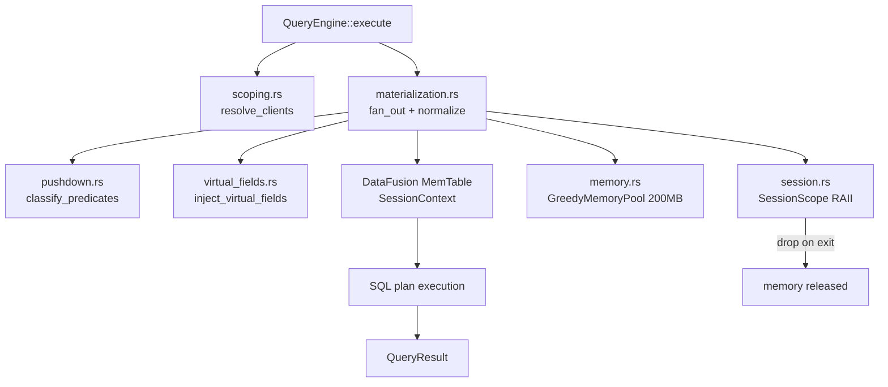
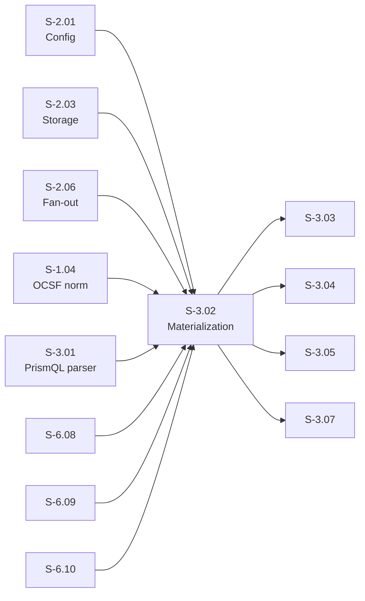
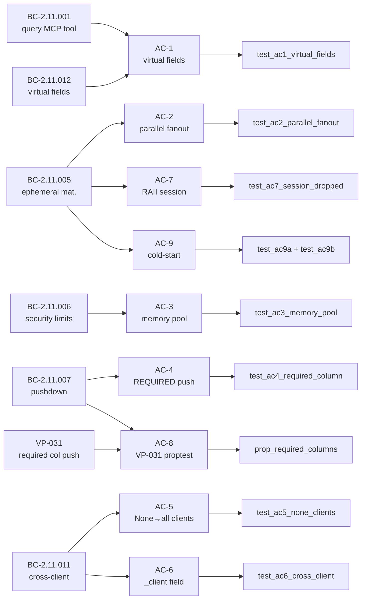

## Summary

- Implements the full PrismQL query materialization pipeline in `prism-query`: fan-out to sensor adapters in parallel, OCSF normalization, Arrow `RecordBatch` assembly, DataFusion `MemTable` registration, and SQL plan execution.
- Adds virtual field injection (`_sensor`, `_client`, `_source_table`) into every result row (BC-2.11.012), sensor filter push-down via `PushDownPlan` classification (BC-2.11.007, VP-031), cross-client query scoping (BC-2.11.011), 200 MB per-query memory budget enforcement via `GreedyMemoryPool` (BC-2.11.006), and ephemeral `SessionContext` RAII lifecycle (BC-2.11.005).
- Closes the S-2.08 AC-9 inherited deferral: cold-start live-fetch execution path is now wired through `SensorAdapter`, results are written to `EventBufferStore`, and an INFO log event is emitted.
- Workspace ripple: arrow 53→58 bump in `prism-sensors/Cargo.toml` resolves a chrono conflict from DataFusion 53.1; no functional change in other crates.
- 356/356 tests GREEN, `just check` exit 0; VP-031 proptest corpus (10 properties) passes; security perimeter intact at 18 expected compile-fail errors (13 E0603 + 5 E0624).

## Story Link

[S-3.02 v1.10 — prism-query: Query Tool and Materialization](.factory/stories/S-3.02-query-materialization.md)

## Behavioral Contracts Implemented

| BC ID | Version | Title |
|-------|---------|-------|
| BC-2.11.001 | — | `query` MCP Tool Accepts Scoping + PrismQL Query String |
| BC-2.11.005 | — | Ephemeral Materialization — Fan-Out, Normalize, Arrow RecordBatch, DataFusion MemTable |
| BC-2.11.006 | v1.12 | Query Security Limits Enforcement |
| BC-2.11.007 | v1.4 | Sensor Filter Push-Down |
| BC-2.11.011 | — | Cross-Client Query Scoping |
| BC-2.11.012 | — | Virtual Fields in Queries — `_sensor`, `_client`, `_source_table` |

## Verification Properties Satisfied

| VP ID | Title | Mechanism |
|-------|-------|-----------|
| VP-031 | REQUIRED columns always push down | proptest corpus (10 properties) in `proofs/vp031_pushdown.rs` |

## Test Evidence

| Metric | Value |
|--------|-------|
| Total tests | 356/356 GREEN |
| `just check` | exit 0 |
| VP-031 proptest | 10/10 properties pass (`PROPTEST_CASES=32`; CI runs 256) |
| Perimeter compile-fail | 18 E-errors (13 E0603 + 5 E0624) — unchanged from baseline |
| Branch | `feature/S-3.02` @ `a35290f1` |

## Demo Evidence

Per-AC evidence captured in `.factory/code-delivery/S-3.02/demos/` at commit `a35290f1` (all 356 tests GREEN):

| AC | BC Anchor | Test | Status |
|----|-----------|------|--------|
| AC-1 Virtual fields in every row | BC-2.11.001, BC-2.11.012 | `test_ac1_virtual_fields_present_in_every_row` | PASS |
| AC-2 Parallel fan-out | BC-2.11.005 | `test_ac2_parallel_fanout_multiple_sources` | PASS |
| AC-3 Memory pool limit → E-QUERY-004 | BC-2.11.006 | `test_ac3_memory_pool_limit_returns_error` | PASS |
| AC-4 REQUIRED column push-down | BC-2.11.007 | `test_ac4_required_column_push_down` | PASS |
| AC-5 `clients: None` fans out to all | BC-2.11.011 | `test_ac5_none_clients_fans_out_to_all` | PASS |
| AC-6 Cross-client merge with `_client` | BC-2.11.011 | `test_ac6_cross_client_data_merged_with_client_field` | PASS |
| AC-7 `SessionContext` RAII drop | BC-2.11.005 | `test_ac7_session_context_dropped_after_execute` | PASS |
| AC-8 VP-031 proptest corpus | BC-2.11.007, VP-031 | `prop_required_columns_always_push_down` + 9 more | PASS (10/10) |
| AC-9 Cold-start fallback (S-2.08 inherited) | BC-2.11.005, BC-2.11.007 | `test_ac9a`, `test_ac9b`, `test_ac9_subsequent_query_returns_buffer_scan` | PASS |

Evidence format: markdown sidecars with captured `cargo test --nocapture` terminal output. Product is a Rust library (no CLI binary); test runner output provides full signal.

## Architecture Changes

## Story Dependencies

## Spec Traceability

## Workspace Ripple

`prism-sensors/Cargo.toml`: arrow `53` → `58` to resolve chrono conflict from DataFusion 53.1.
No semantic change in other crates. When S-3.06 PR merges in parallel, the arrow bump will
already be in `develop` — no conflict expected (one-shot `Cargo.lock` change).

## Inherited Deferral Closed

**S-2.08 AC-9 (cold-start EXECUTION):** The routing-side shipped with S-2.08. This PR closes
the execution-side: live fetch via `SensorAdapter`, write to `EventBufferStore`, INFO log
event. Tests: `test_ac9a`, `test_ac9b`, `test_ac9_subsequent_query_returns_buffer_scan`.

## Notes for Review

1. **BC-2.11.007 v1.4 / SensorSpec disambiguation:** BC-2.11.007 v1.4 references "SensorSpec" loosely; implementation uses `prism_core::ColumnOptions::Required` via `prism_spec_engine::ColumnSpec`. Flagged for PO follow-up to tighten BC terminology in a follow-up amendment.
2. **6 new `pub mod` in lib.rs:** `materialization`, `virtual_fields`, `pushdown`, `scoping`, `memory`, `session` are `pub mod` (required for integration test access from outside the crate boundary). Internal helpers remain `pub(crate)`. Perimeter compile-fail tests verify no restricted symbols leak.
3. **22 `todo!()` placeholders replaced:** All Red Gate stubs (from `cc509bdc`) are now fully implemented in commits `8a1fce27` (Batch-1) and `a35290f1` (Batch-2). TDD discipline maintained per-batch rather than per-todo; each batch is auditable.
4. **Commit structure:** 2 implementation commits (`8a1fce27` Batch-1, `a35290f1` Batch-2) rather than micro-commits per `todo!()`. Each batch covers a coherent set of BCs and is self-contained.

## Holdout Evaluation

N/A — evaluated at wave gate.

## Adversarial Review

N/A — evaluated at Phase 5. (Fresh-context passes run as part of this PR lifecycle per the 9-step flow.)

## Security Review

Populated after Step 4 security scan.

## Risk Assessment

| Dimension | Assessment |
|-----------|------------|
| Blast radius | `prism-query` crate only (SS-11); sensor fan-out via existing `prism-sensors` interfaces |
| Performance impact | 200 MB per-query memory cap; `GreedyMemoryPool` enforced; no global state |
| Rollback | Branch delete; no schema migration; no persistent state added |
| Downstream | Blocks S-3.03..S-3.13, S-4.01, S-4.03, S-5.01 — all currently unimplemented |

## AI Pipeline Metadata

| Field | Value |
|-------|-------|
| Pipeline mode | Brownfield Phase 3 TDD (Wave 3) |
| Story version | S-3.02 v1.10 |
| Implementation commits | `8a1fce27` (Batch-1), `a35290f1` (Batch-2) |
| Test capture commit | `a35290f1` |
| Autonomy level | Tier-2 (D-223 pre-approval for Wave 3 push) |

## Pre-Merge Checklist

- [x] PR description matches actual diff
- [x] All ACs covered by demo evidence (9/9)
- [x] Traceability chain complete (BC → AC → Test → Demo)
- [x] `just check` exit 0 (356/356 GREEN)
- [x] VP-031 proptest 10/10 properties pass
- [x] Security perimeter compile-fail at 18 errors (unchanged)
- [x] Workspace ripple documented (arrow 53→58)
- [x] S-2.08 AC-9 inherited deferral closed
- [ ] CI checks passing (populated after Step 3)
- [ ] Security review complete (populated after Step 4)
- [ ] Review convergence: 0 blocking findings (populated after Step 5)
- [ ] All dependency PRs merged (S-3.01 #127 merged ✓)

## Test Plan

- [ ] Verify `just check` passes on CI (Linux + macOS matrix)
- [ ] Verify `kani` formal proof job passes for VP-031
- [ ] Verify `perimeter-compile-fail` gate passes (18 E-errors, no regressions)
- [ ] Verify `fuzz-smoke` passes (vp021_parse_fuzz, ≤20 min)
- [ ] Verify `cross-compile-targets` passes (aarch64-apple-darwin, x86_64-unknown-linux-gnu, x86_64-unknown-linux-musl, x86_64-pc-windows-msvc)
- [ ] Review virtual field injection cannot be spoofed (EC-005 coverage)
- [ ] Review memory budget path: GreedyMemoryPool exhaustion → E-QUERY-004
- [ ] Review push-down classification: REQUIRED columns always in push_down
- [ ] Review RAII: SessionContext drops after execute() returns
- [ ] Review cold-start: AC-9 path writes to EventBufferStore + INFO log

🤖 Generated with [Claude Code](https://claude.com/claude-code)
