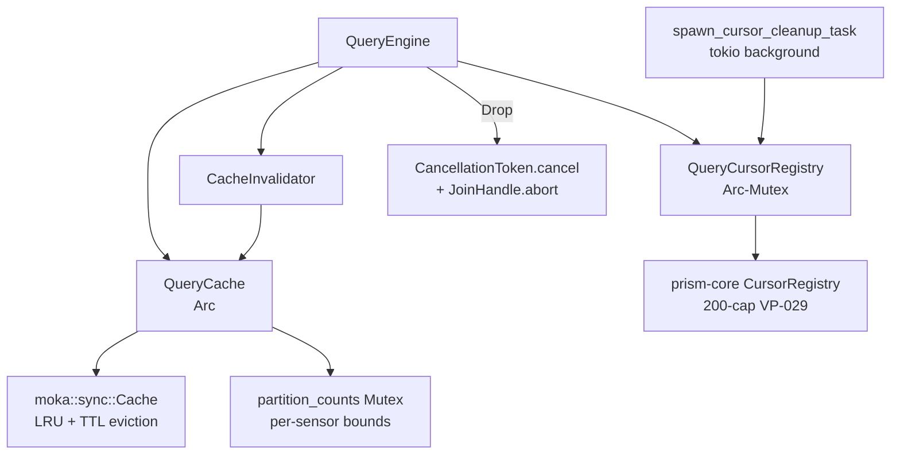
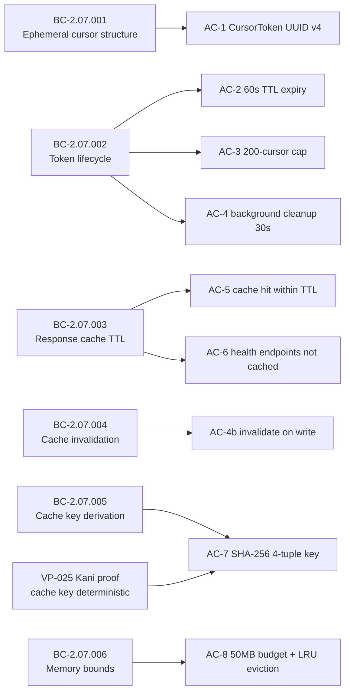

# PR #132 — feat(S-3.05): pagination + caching

## Summary

S-3.05 implements ephemeral cursor-based pagination and response caching for the Prism MCP
server query engine. Exposes a thin internal cursor surface (`QueryCursorRegistry::create()` /
`next_page(token)`) layered on sensor-fetch pagination, and a TTL/LRU response cache
(`QueryCache`) with SHA-256 cache key derivation.

## Architecture Changes

## Story Dependencies

## Spec Traceability

## Behavioral Contracts Implemented

| BC ID | Title | Status |
|-------|-------|--------|
| BC-2.07.001 | Internal Ephemeral Pagination Token Structure | IMPLEMENTED |
| BC-2.07.002 v4.6 | Pagination Token Lifecycle + Cursor Lifecycle §MCP-exposed surface | IMPLEMENTED |
| BC-2.07.003 v4.4 | Response Cache TTL + total_hits aggregation | IMPLEMENTED |
| BC-2.07.004 | Cache Invalidation on Write Operations | IMPLEMENTED |
| BC-2.07.005 v4.3 | Cache Key Derivation (4-tuple SHA-256) | IMPLEMENTED |
| BC-2.07.006 | Cache Memory Budget Enforcement | IMPLEMENTED |

## New PrismError Variants

| Code | Variant | Description |
|------|---------|-------------|
| E-QUERY-012 | `CursorExpired` | Cursor TTL exceeded — caller must re-execute |
| E-QUERY-013 | `CursorPageSizeInvalid` | page_size = 0 rejected |
| E-QUERY-014 | `CursorTokenUnknown` | Unknown/garbage UUID |

## Test Evidence

- 600/600 tests passing locally (`just iter prism-query`)
- `just check` (full pre-push gate) passed
- `just check-fast` (clippy + layout) passed
- LOCAL adversary cascade: 17 passes, 3/3 CLEAN streak (passes 15, 16, 17)
- 9 cascade-derived regression tests: test_p8_001..007, test_p9_002, test_c10_001/c10_001b
- 3 production CRITICAL bugs caught and fixed by LOCAL cascade that 15 multi-agent CLEAN passes missed:
  - P8 CRITICAL: `total_bytes` leak on same-key re-put (eviction loop dropped existing tuple without decrementing accounting)
  - P9 CRITICAL x3: PrismError variants initially collided with canonical taxonomy
  - P10 CRITICAL: Eviction-without-invalidate orphan introduced by P9 fix

## Demo Evidence

- N/A — Prism is a headless Rust library/MCP server; demo evidence is not applicable for
  internal query engine components. Test output logs constitute functional evidence.

## Security Review

- Populated after Step 4 (security-reviewer dispatch)

## Risk Assessment

- **Blast radius:** Medium — adds new modules (cache.rs, cursor.rs, cache_key.rs, invalidation.rs)
  to prism-query; no changes to external MCP tool API surface; backward-compatible new fields on QueryEngine
- **Performance impact:** Cache is LRU with moka; cursor cleanup is background tokio task —
  no hot-path blocking; mutex contention on partition_counts under high write concurrency
  is bounded and documented (residual race documented, self-healing)
- **Memory impact:** 50MB hard cap (BC-2.07.006); AtomicUsize accounting with saturating
  arithmetic to prevent underflow

## AI Pipeline Metadata

- Pipeline mode: Feature Mode Phase 3 (TDD implementation)
- LOCAL adversary cascade: 17 passes
- Multi-agent reviews: CI pipeline + pr-manager 9-step

## Pre-Merge Checklist

- [x] PR description populated (Step 1)
- [x] Demo evidence verified (Step 2 — N/A, headless library)
- [x] PR exists (Step 3 — PR #132)
- [ ] Security review (Step 4)
- [ ] PR reviewer approval (Step 5)
- [ ] CI green (Step 6)
- [x] Dependencies merged (Step 7 — S-3.02 merged)
- [ ] Merge executed (Step 8)
- [ ] Post-merge cleanup (Step 9)
