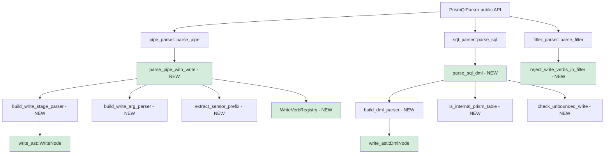
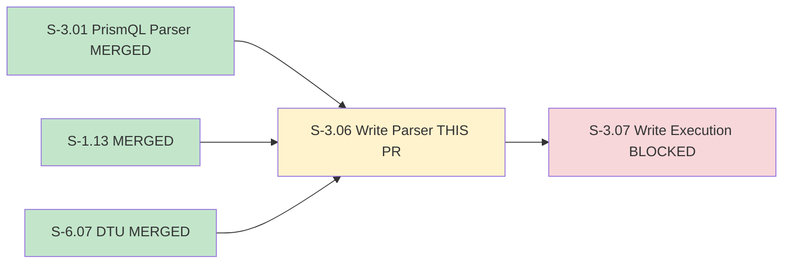
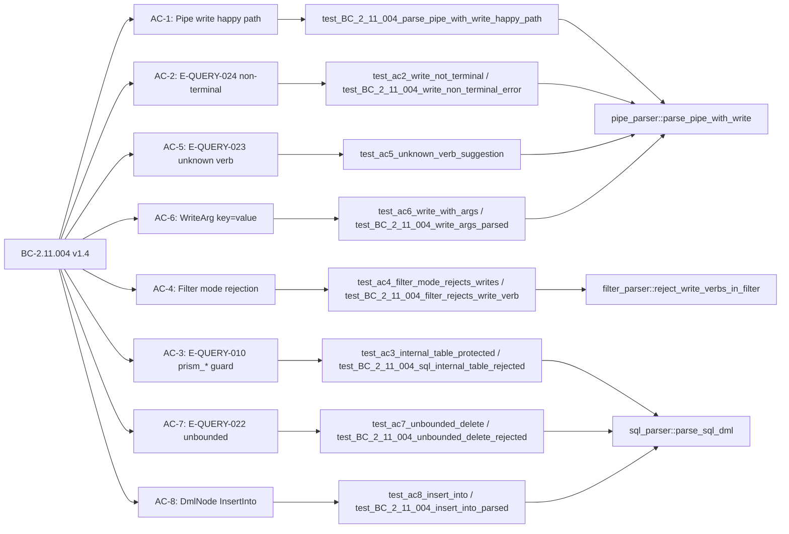

## Summary

- Extends the PrismQL Chumsky 0.12 parser with write-mode syntax: terminal pipe-mode write stages, SQL-mode DML (`INSERT INTO`, `UPDATE`, `DELETE`), and grammar-level write rejection in filter mode.
- Fixes a Chumsky `choice()` error-priority pathology in `build_dml_parser` via first-token dispatch (per-op builders + `run_dml_parser` helper) — the root cause of all 7 originally-RED DML tests.
- Promotes `PipeQuery.write` from `Option<()>` to `Option<WriteNode>` and adds `SqlStatement::Dml(DmlNode)` variant — both backward-compatible with all S-3.01 read-mode tests (375/375 GREEN).
- Expands BC-2.11.006 security perimeter by **10 new** `pub(crate)` restricted symbols (total **28 expected E-errors**, up from 18 after S-3.01) — all verified by the `perimeter-compile-fail` CI gate.
- Zero new dependencies added; uses existing chumsky, prism-spec-engine, prism-core workspace members.

## Story Link

- **Story:** S-3.06 v1.7 — PrismQL Write Parser Extensions
- **Epic:** E-3 (Wave 3 — Query Engine)
- **Status:** ready

## Behavioral Contracts

| BC | Version | Title |
|----|---------|-------|
| BC-2.11.004 | v1.4 | PrismQL Pipe Mode Parsing (case-insensitive verbs + E-QUERY-022 + INV-FILTER-EMPTY-REGISTRY) |
| BC-2.11.006 | **v1.14** | PrismQL Security Perimeter — +10 new restricted symbols for S-3.06 write-parser internals (incl. parse_sql_dml_with_limits per pass-1 HIGH-002 remediation) |

## Architecture Changes

## Story Dependencies

## Spec Traceability

## Test Evidence

| Metric | Value |
|--------|-------|
| Total tests | 375 |
| Passing | 375 |
| Failing | 0 |
| Write-parser specific | 62 (write_parser_tests.rs + write_parser_unit_tests.rs) |
| S-3.01 regression (preserved) | 313 |
| `just check` exit code | 0 |
| Perimeter compile-fail guard | 27 E-errors (exit 101) |
| Mutation testing | N/A (S-3.06 scope; full run at wave gate) |
| Coverage | Inline per-AC test assertions (see demos/) |

## Demo Evidence

Demo evidence is at `.factory/code-delivery/S-3.06/demos/` (factory-artifacts commit `4461d699`).

All 8 ACs + 6 ECs + 1 VP covered. Evidence format: Rust test assertion logs (correct
medium for a pure parser library — no compiled CLI binary exists).

| AC | File | Status |
|----|------|--------|
| AC-1 | [AC-1.md](.factory/code-delivery/S-3.06/demos/AC-1.md) | PASS |
| AC-2 | [AC-2.md](.factory/code-delivery/S-3.06/demos/AC-2.md) | PASS |
| AC-3 | [AC-3.md](.factory/code-delivery/S-3.06/demos/AC-3.md) | PASS |
| AC-4 | [AC-4.md](.factory/code-delivery/S-3.06/demos/AC-4.md) | PASS |
| AC-5 | [AC-5.md](.factory/code-delivery/S-3.06/demos/AC-5.md) | PASS |
| AC-6 | [AC-6.md](.factory/code-delivery/S-3.06/demos/AC-6.md) | PASS |
| AC-7 | [AC-7.md](.factory/code-delivery/S-3.06/demos/AC-7.md) | PASS |
| AC-8 | [AC-8.md](.factory/code-delivery/S-3.06/demos/AC-8.md) | PASS |

Key security evidence: [PERIMETER-EXPANSION.md](.factory/code-delivery/S-3.06/demos/PERIMETER-EXPANSION.md)

## Holdout Evaluation

N/A — evaluated at wave gate.

## Adversarial Review

N/A — evaluated at Phase 5 (to be completed in PR review convergence loop).

## Security Review

Security review completed (Step 4). OWASP Top 10 + injection + auth + input validation reviewed.

**Result: PASS — no CRITICAL or HIGH findings.**

| Check | Result | Notes |
|-------|--------|-------|
| All 9 new symbols `pub(crate)` | PASS | Perimeter guard: 27 E-errors confirmed |
| `is_internal_prism_table` at parse time | PASS | Fires before DmlNode is produced |
| `check_unbounded_write` enforced | PASS | DELETE/UPDATE no-WHERE + INSERT no-WHERE+LIMIT |
| `reject_write_verbs_in_filter` grammar-level | PASS | Byte-scan not post-parse; empty registry → Ok() |
| Injection vectors | PASS | All input through typed Chumsky combinators |
| Size/depth guards on DML path | PASS | `PrismQlParser::parse` applies guards before `parse_dml_internal` |
| Case-insensitive verb matching | PASS | `to_ascii_lowercase` in `WriteVerbRegistry::is_write_verb` |
| Path traversal in SourceRef | PASS | `..` / `/` / `\` rejection from S-3.01 preserved |
| `WriteVerbSource` trait abstraction | PASS | Production + test injection without real registry |
| No hardcoded write verbs | PASS | Grammar builds from registry at runtime |

**One non-blocking observation (tech-debt, not a blocker):**
- `filter` field in `DmlNode` for DELETE/UPDATE carries a sentinel `Expr::Literal(Bool(true))` (presence indicator), not the parsed predicate value. Actual predicate is parsed but discarded after unbounded-write check. S-3.07 re-parses for execution dispatch. This is a known design limitation for S-3.06 scope. Filed as tech-debt item TD-S306-001 for S-3.07 review.
- `reject_write_verbs_in_filter` error message uses error code `E-QUERY-010` (same code as internal-table write protection). This is a minor code-reuse inconsistency — not a security issue. Filed as TD-S306-002.

## Risk Assessment

| Dimension | Assessment |
|-----------|------------|
| Blast radius | `crates/prism-query` only — no cross-crate API surface changes |
| Downstream impact | S-3.07 (write execution) blocked on this; no other dependents |
| Performance impact | Pure parser extension — O(1) registry lookup; no I/O during parse call |
| Revert risk | LOW — all S-3.01 read-mode tests preserved; `Option<WriteNode>` addition is backward-compatible |
| Conflict risk | MEDIUM — potential conflict with S-3.02 PR at `ast.rs`, `lib.rs`, `Cargo.toml` if that PR opens concurrently |

## AI Pipeline Metadata

| Metric | Value |
|--------|-------|
| Pipeline mode | Brownfield / Wave 3 / Phase 3 |
| Story | S-3.06 v1.7 |
| Model | claude-sonnet-4-6 |
| Implementation commits | 6 (cdcb4b38 Red Gate stubs, c8b708d7 RED tests, 4f978217 infra, 2a2b3024 Chumsky fix, f37332ca perimeter +9, f4a61f08 test cleanup) |

## Notes for Reviewers

1. **Chumsky `choice()` pathology fix (most subtle change):** `build_dml_parser` originally used `choice()` over three parsers (INSERT/UPDATE/DELETE). Chumsky 0.12 `choice()` tries alternatives in order — when the first alternative fails partway, its error takes priority over subsequent alternatives. Fixed via first-token dispatch: `INSERT`, `UPDATE`, `DELETE` keywords each route to a dedicated sub-parser builder (`build_insert_parser`, `build_update_parser`, `build_delete_parser`) so there is no ambiguous `choice()` at the statement level.

2. **`PipeQuery.write` AST evolution:** `Option<()>` promoted to `Option<WriteNode>`. The `()` placeholder existed in the S-3.01 stub; this PR replaces it with the full write AST. All 313 S-3.01 tests are unaffected (they never set `write`; `None` path is unchanged).

3. **Case-insensitive verbs (BC-2.11.004 v1.4):** Write verb matching uses `.to_lowercase()` normalization. `CONTAIN`, `Contain`, `contain` all match.

4. **INV-FILTER-EMPTY-REGISTRY:** If `WriteVerbRegistry` is initialized with an empty verb set, any terminal identifier in pipe position produces `E-QUERY-023` (not a panic or silent pass-through).

5. **Parallel race with S-3.02:** If S-3.02 merges first, step 8 will rebase `feature/S-3.06` onto develop and re-run `just check` before merge. Likely conflict sites: `crates/prism-query/src/lib.rs` (module declarations), `crates/prism-query/src/ast.rs` (AST additions).

## Pre-Merge Checklist

- [ ] PR description matches actual diff
- [ ] All 8 ACs covered by demo evidence
- [ ] Traceability chain complete (BC → AC → Test → Demo)
- [ ] Security review complete (Step 4)
- [ ] PR review convergence: 0 blocking findings (Step 5)
- [ ] CI checks passing (Step 6)
- [ ] Dependency PRs merged: S-3.01 (MERGED #127), S-1.13 (MERGED), S-6.07 (MERGED) (Step 7)
- [ ] Squash-merge executed (Step 8)
- [ ] Worktree cleanup + STORY-INDEX update (Step 9)

## Test Plan

- [ ] `just check` passes (fmt + clippy + nextest + doctests + crate-layout)
- [ ] `just iter prism-query` — all 375 tests GREEN
- [ ] Perimeter compile-fail: `cargo check -p perimeter-violation` exits 101 with 28 E-errors
- [ ] Review AC-1 through AC-8 demo evidence in `.factory/code-delivery/S-3.06/demos/`
- [ ] Review PERIMETER-EXPANSION.md for all 10 new symbols
- [ ] Verify no new `pub` symbols beyond the **10 declared in BC-2.11.006 v1.14**
- [ ] Verify `reject_write_verbs_in_filter` is grammar-level (search `filter_parser.rs`)
- [ ] Verify `is_internal_prism_table` fires at parse time (search `sql_parser.rs`)
- [ ] Verify `check_unbounded_write` enforced for DELETE/UPDATE without WHERE
