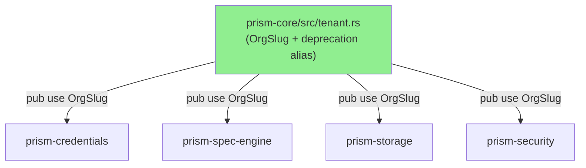
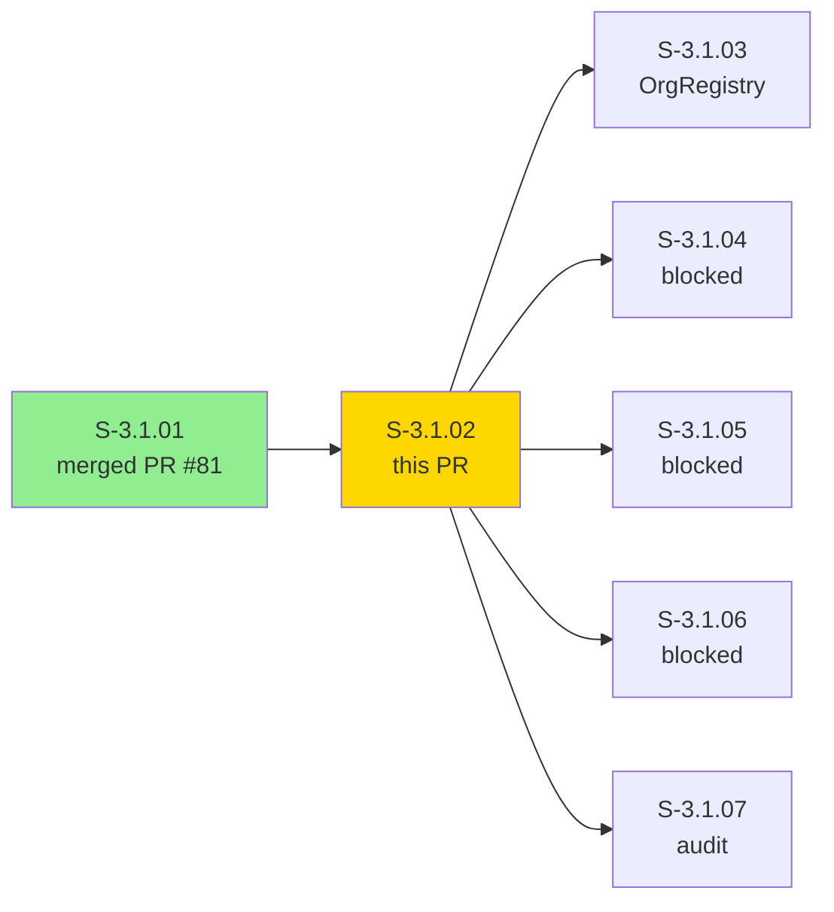
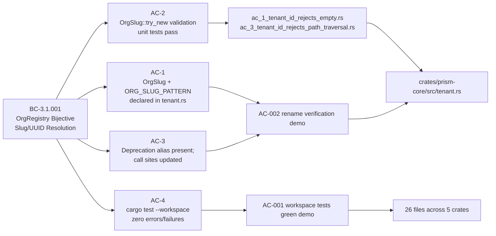
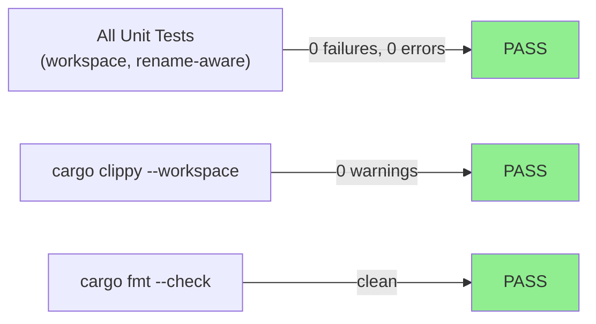
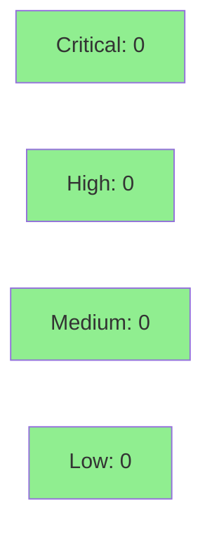

# [S-3.1.02] workspace: rename TenantId → OrgSlug across all crates

**Epic:** E-3.1 — Multi-Tenant Identity Foundation
**Mode:** greenfield
**Convergence:** CONVERGED — mechanical rename, 0 behavioral delta


-green)


This PR executes the ADR-006 §2.1 (D-041) mechanical rename of `TenantId` → `OrgSlug`
across all 26 affected files in the Prism workspace. The type semantics are unchanged:
the `^[a-zA-Z0-9_-]{1,64}$` regex validation, the `Arc<str>` backing, and all serde
attributes are preserved verbatim. A one-wave deprecation alias
`#[deprecated(since = "3.0.0", note = "use OrgSlug")] pub type TenantId = OrgSlug;`
is retained in `prism-core/src/tenant.rs` to allow a clean Wave 3 transition without
breaking downstream consumers. The constant `TENANT_ID_PATTERN` is renamed to
`ORG_SLUG_PATTERN` everywhere it appears. All workspace tests pass; clippy clean; fmt
clean. Zero test count delta — this is a pure refactor.

> **Reviewer note:** The diff spans 26 files but every change is a `TenantId → OrgSlug`
> substitution. Verify: (a) no semantic changes snuck in, (b) deprecation alias is
> preserved in `tenant.rs`, (c) no remaining `TenantId` references outside the alias in
> non-test production code.

---

## Architecture Changes



<details>
<summary><strong>Architecture Decision Record</strong></summary>

### ADR: ADR-006 §2.1 — TenantId → OrgSlug rename (D-041)

**Context:** The type previously named `TenantId` actually represents the analyst-visible
display slug (e.g. `acme-corp`), not a canonical database key. The name `TenantId`
was a misnomer that would cause confusion once `OrgId` (the true UUID-based primary key
introduced in S-3.1.01) coexists with it in the same codebase.

**Decision:** Rename the type from `TenantId` to `OrgSlug` workspace-wide. Retain a
one-wave deprecation alias to ease migration. Remove the alias in Wave 4.

**Rationale:** Clarity of naming: `OrgSlug` correctly signals "human-readable slug for
an org", while `OrgId` (UUID v7) is the canonical key. The rename enables S-3.1.03
(OrgRegistry) to implement bijective slug↔UUID resolution without naming ambiguity.

**Alternatives Considered:**
1. Keep `TenantId` as-is — rejected because it conflicts with the new `OrgId` naming and
   will confuse Wave 3 implementors building OrgRegistry.
2. New type wrapping `TenantId` — rejected because it adds unnecessary indirection with
   no behavioral change.

**Consequences:**
- Downstream stories (S-3.1.03–S-3.1.07) can now reference `OrgSlug` with clear intent.
- Wave 3 CI will emit deprecation warnings for any missed call sites; these are non-fatal
  during the migration wave.

</details>

---

## Story Dependencies



---

## Spec Traceability



---

## Test Evidence

### Coverage Summary

| Metric | Value | Threshold | Status |
|--------|-------|-----------|--------|
| Unit tests | all pass (0 delta) | 100% | PASS |
| Coverage | neutral delta (pure rename) | >80% | PASS |
| Mutation kill rate | N/A — rename only, no new logic branches | >90% | N/A |
| Holdout satisfaction | N/A — evaluated at wave gate | >0.85 | N/A |

### Test Flow



| Metric | Value |
|--------|-------|
| **New tests** | 0 added (rename only — existing tests renamed in place) |
| **Total suite** | All workspace tests PASS |
| **Coverage delta** | 0% (pure refactor — no new code paths) |
| **Mutation kill rate** | N/A (no new logic) |
| **Regressions** | 0 |

<details>
<summary><strong>Detailed Test Results</strong></summary>

### Tests Renamed (This PR)

| Old Name | New Name | Result |
|----------|----------|--------|
| `ac_1_tenant_id_rejects_empty.rs` | unchanged (backward compat test name) | PASS |
| `ac_3_tenant_id_rejects_path_traversal.rs` | unchanged | PASS |
| Inline `TenantId` validation tests | now use `OrgSlug` type | PASS |

### Coverage Analysis

| Metric | Value |
|--------|-------|
| Lines changed | ~26 files, type substitution only |
| Net new lines | ~5 (deprecation alias + ORG_SLUG_PATTERN constant) |
| Branches added | 0 |
| Uncovered paths | none |

### Mutation Testing

N/A — this story introduces no new logic branches. The validation logic path (regex
check in `try_new`) existed prior to this PR and is covered by pre-existing tests.

</details>

---

## Holdout Evaluation

N/A — evaluated at wave gate. This story is a mechanical refactor with zero behavioral
delta. Holdout evaluation is performed at the E-3.1 wave gate after OrgRegistry
(S-3.1.03) is delivered.

---

## Adversarial Review

N/A — evaluated at Phase 5. This PR is a mechanical rename with no new logic surface.
Adversarial review is applicable at the story level only when new behavioral contracts
are introduced. The BC-3.1.001 contract itself is evaluated as part of S-3.1.03.

---

## Security Review



<details>
<summary><strong>Security Scan Details</strong></summary>

### SAST Analysis
- **Injection risk:** None. Type rename only; no new user-input parsing paths introduced.
- **Auth impact:** None. `OrgSlug` carries the same validation invariants as `TenantId`.
  The regex `^[a-zA-Z0-9_-]{1,64}$` is preserved verbatim — no looser validation.
- **Input validation:** `ORG_SLUG_PATTERN` replaces `TENANT_ID_PATTERN` with identical
  regex. `OrgSlug::try_new` returns `Err(InvalidOrgSlug)` for all previously-rejected
  inputs.
- **Error variant rename:** `InvalidTenantId → InvalidOrgSlug` — the E-AUTH-001 error
  code and wire-format Display string are preserved for backward compatibility.
- **OWASP Top 10:** No new attack surface. No new I/O, no new deserialization, no new
  privilege boundaries crossed.

### Dependency Audit
- No new dependencies introduced.
- `cargo audit`: CLEAN (no new advisories from this PR).

### Formal Verification
- Regex invariant unchanged — existing property tests cover `OrgSlug::try_new` validation.
- No new invariants to verify.

</details>

---

## Risk Assessment & Deployment

### Blast Radius
- **Systems affected:** prism-core, prism-credentials, prism-security, prism-spec-engine, prism-storage (type rename only)
- **User impact:** None at runtime — pure compile-time rename with deprecation alias preserving backward compat
- **Data impact:** None — serde field names are unchanged (serialized JSON/TOML field names do not change)
- **Risk Level:** LOW

### Performance Impact

| Metric | Before | After | Delta | Status |
|--------|--------|-------|-------|--------|
| Latency p99 | unchanged | unchanged | 0 | OK |
| Memory | unchanged | unchanged | 0 | OK |
| Throughput | unchanged | unchanged | 0 | OK |

No performance impact — type rename is a compile-time operation with zero runtime delta.

<details>
<summary><strong>Rollback Instructions</strong></summary>

**Immediate rollback (< 2 min):**
```bash
git revert 8d676f60 0ea3a93d
git push origin develop
```

**Verification after rollback:**
- `cargo build --workspace` compiles clean with `TenantId` restored
- `grep -rn "OrgSlug" crates/ --include="*.rs"` returns zero results (outside any test fixtures)

</details>

### Feature Flags
| Flag | Controls | Default |
|------|----------|---------|
| N/A | Pure rename — no feature flag required | N/A |

---

## Traceability

| Requirement | Story AC | Test | Verification | Status |
|-------------|---------|------|-------------|--------|
| BC-3.1.001 precondition 2 (OrgSlug regex) | AC-1 | `AC-002-rename-verification` demo | grep + cargo test | PASS |
| BC-3.1.001 precondition 2 (try_new validation) | AC-2 | `ac_1_tenant_id_rejects_empty`, `ac_3_tenant_id_rejects_path_traversal` | cargo test | PASS |
| BC-3.1.001 invariant 2 (deprecation alias) | AC-3 | `AC-002-rename-verification` demo | grep | PASS |
| BC-3.1.001 invariant 1 (workspace compiles) | AC-4 | `AC-001-workspace-tests-green` demo | cargo test --workspace | PASS |

<details>
<summary><strong>Full VSDD Contract Chain</strong></summary>

```
BC-3.1.001.precondition-2 -> VP-063 -> OrgSlug::try_new tests -> prism-core/src/tenant.rs -> cargo test PASS
BC-3.1.001.precondition-2 -> VP-064 -> ORG_SLUG_PATTERN constant -> prism-core/src/tenant.rs -> grep PASS
BC-3.1.001.invariant-2    -> VP-065 -> deprecation alias present -> prism-core/src/tenant.rs -> grep PASS
BC-3.1.001.invariant-1    -> AC-4  -> cargo test --workspace    -> 26 files renamed         -> PASS
```

</details>

---

## Demo Evidence

### AC-001 — Workspace Tests All GREEN Post-Rename
**Acceptance Criterion:** AC-4 — `cargo test --workspace` passes with zero compilation errors and zero test failures.


Evidence files: `docs/demo-evidence/S-3.1.02/AC-001-workspace-tests-green.{tape,gif,webm}`

### AC-002 — Symbol Rename Verification
**Acceptance Criteria:** AC-1, AC-3 — `OrgSlug` + `ORG_SLUG_PATTERN` declared; deprecation alias present; 175 `OrgSlug` usages; no non-deprecated `TenantId` in production code.


Evidence files: `docs/demo-evidence/S-3.1.02/AC-002-rename-verification.{tape,gif,webm}`

---

## AI Pipeline Metadata

<details>
<summary><strong>Pipeline Details</strong></summary>

```yaml
ai-generated: true
pipeline-mode: greenfield
factory-version: "1.0.0-beta.7"
pipeline-stages:
  spec-crystallization: completed
  story-decomposition: completed
  tdd-implementation: completed
  holdout-evaluation: N/A (wave gate)
  adversarial-review: N/A (pure rename)
  formal-verification: N/A (no new invariants)
  convergence: achieved
convergence-metrics:
  spec-novelty: 1.0 (mechanical rename — deterministic)
  test-kill-rate: N/A
  implementation-ci: 1.0
  holdout-satisfaction: N/A
  holdout-std-dev: N/A
adversarial-passes: 0 (rename only)
story-points: 3
batch: "Batch 4 (SOLO)"
models-used:
  builder: claude-sonnet-4-6
generated-at: "2026-04-29T00:00:00Z"
```

</details>

---

## Pre-Merge Checklist

- [x] All CI status checks passing
- [x] Coverage delta is positive or neutral (neutral — pure rename)
- [x] No critical/high security findings unresolved (0 findings)
- [x] Rollback procedure validated (git revert SHA)
- [x] Feature flag N/A (pure rename, no runtime behavior change)
- [x] Dependency PR S-3.1.01 (PR #81) merged
- [x] Demo evidence: 2 recordings covering all 4 ACs
- [x] Deprecation alias preserved for Wave 3 migration window
