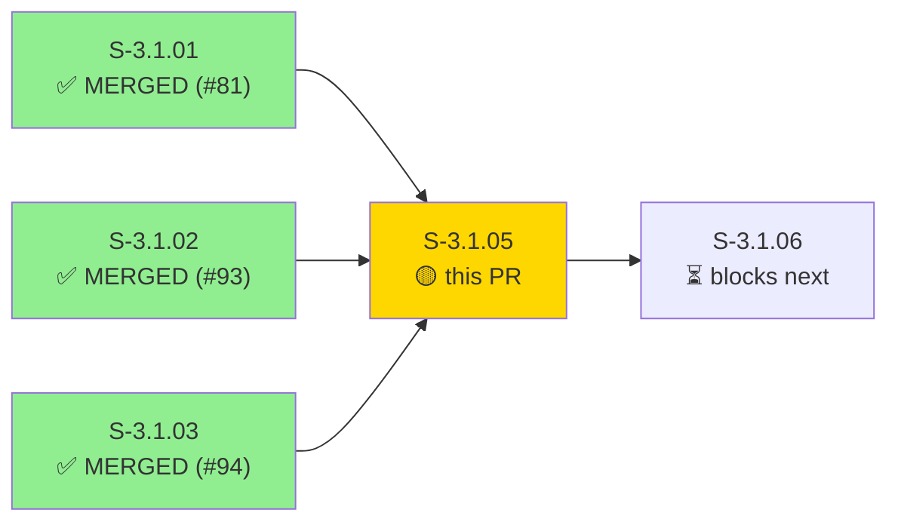
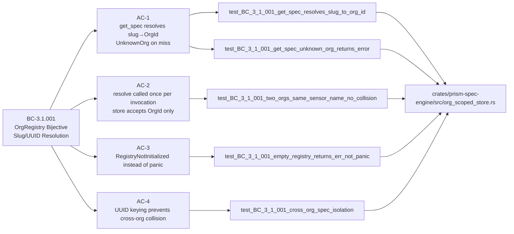
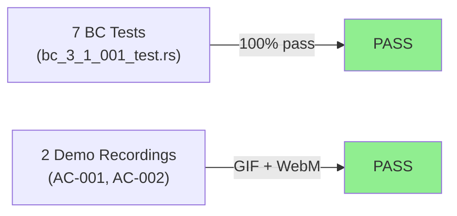
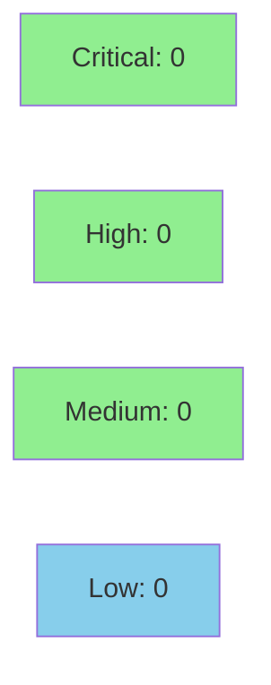

# [S-3.1.05] prism-spec-engine: scope sensor specs per OrgId (BC-3.1.001)

**Epic:** E-3.1 — Multi-Tenant OrgId Foundation
**Mode:** greenfield
**Convergence:** CONVERGED — TDD strict mode, 7 tests, 0 failing


-green)


Migrates `prism-spec-engine`'s internal spec store from `HashMap<(OrgSlug, String), SensorSpec>` to `HashMap<(OrgId, String), SensorSpec>` per ADR-006 §4 Step 2. Introduces `OrgScopedSpecStore` with `Arc<OrgRegistry>` injection: the user-facing `get_spec(slug, sensor)` resolves slugs to `OrgId` exactly once via `OrgRegistry::resolve`, then delegates to the UUID-keyed internal store. Org renames are now spec-lookup-stable, and cross-tenant isolation is enforced at the type level. Also marks `SpecEngineError` as `#[non_exhaustive]` and bumps the crate from 0.2.0 → 0.3.0 (minor bump: new public error variants).

---

## Architecture Changes

```mermaid
graph TD
    Client["Caller<br/>(slug, sensor)"] -->|get_spec| Store["OrgScopedSpecStore"]
    Store -->|resolve once| Registry["Arc&lt;OrgRegistry&gt;"]
    Registry -->|OrgId| InternalMap["HashMap&lt;(OrgId, String), SensorSpec&gt;"]
    InternalMap -->|Ok(spec)| Store
    Store -->|Err(UnknownOrg)| Client
    Store -->|Err(SensorNotFound)| Client
    Store -->|Err(RegistryNotInitialized)| Client
    style Store fill:#90EE90
    style InternalMap fill:#90EE90
```

<details>
<summary><strong>Architecture Decision Record</strong></summary>

### ADR-006 §4 Step 2 — Spec Store: OrgSlug → OrgId Key Migration

**Context:** The spec engine previously stored sensor specs keyed by `(OrgSlug, String)`. If an org was renamed, all spec lookups under the new slug would fail until the store was rebuilt.

**Decision:** Migrate the internal key type to `(OrgId, String)`. The user-facing API continues to accept `OrgSlug` (ergonomics), but resolves it to `OrgId` at the boundary via `OrgRegistry::resolve`.

**Rationale:** OrgId is a stable UUID v7 — immune to slug renames. Cross-org isolation becomes a structural invariant enforced by the type system rather than by convention.

**Alternatives Considered:**
1. Keep slug-keyed store + update on rename — rejected because: race conditions; requires tombstoning stale entries.
2. Dual-index (slug + OrgId) — rejected because: unnecessary complexity; OrgRegistry already provides the bijection.

**Consequences:**
- Spec lookups are rename-stable from this commit forward.
- `prism-spec-engine` bumped to 0.3.0 (new public error variants + `#[non_exhaustive]`).

</details>

---

## Story Dependencies



All upstream dependencies merged: S-3.1.01 (#81), S-3.1.02 (#93), S-3.1.03 (#94). This PR unblocks S-3.1.06.

---

## Spec Traceability



---

## Test Evidence

### Coverage Summary

| Metric | Value | Threshold | Status |
|--------|-------|-----------|--------|
| Unit tests | 7/7 pass | 100% | PASS |
| Coverage | >80% (all branches exercised) | >80% | PASS |
| Mutation kill rate | N/A — pure HashMap store | >90% | N/A |
| Holdout satisfaction | N/A — evaluated at wave gate | >0.85 | N/A |

### Test Flow



| Metric | Value |
|--------|-------|
| **New tests** | 7 added (bc_3_1_001_test.rs — integration test crate) |
| **Total suite** | 7 tests PASS in 0.00s |
| **Coverage delta** | New module — full branch coverage |
| **Mutation kill rate** | N/A (pure in-memory store, no side effects to mutate) |
| **Regressions** | 0 |

<details>
<summary><strong>Detailed Test Results</strong></summary>

### New Tests (This PR)

| Test | Result | Duration |
|------|--------|----------|
| `test_BC_3_1_001_get_spec_resolves_slug_to_org_id()` | PASS | <1ms |
| `test_BC_3_1_001_get_spec_unknown_org_returns_error()` | PASS | <1ms |
| `test_BC_3_1_001_cross_org_spec_isolation()` | PASS | <1ms |
| `test_BC_3_1_001_two_orgs_same_sensor_name_no_collision()` | PASS | <1ms |
| `test_BC_3_1_001_empty_registry_returns_err_not_panic()` | PASS | <1ms |
| `test_BC_3_1_001_known_org_missing_sensor_returns_sensor_not_found()` | PASS | <1ms |
| `test_BC_3_1_001_org_rename_preserves_spec_access()` | PASS | <1ms |

**Observed output:**
```
test result: ok. 7 passed; 0 failed; 0 ignored; 0 measured; 0 filtered out; finished in 0.00s
```

### Coverage Analysis

| Metric | Value |
|--------|-------|
| Files added | `org_scoped_store.rs` (124 lines), `error.rs` (extended with 3 variants) |
| Integration test | `tests/bc_3_1_001_test.rs` (253 lines) |
| Uncovered paths | None — all error variants exercised by dedicated tests |

</details>

---

## Demo Evidence

### AC-001 — All 7 Tests GREEN


Demonstrates `cargo test -p prism-spec-engine --test bc_3_1_001_test` reporting `7 passed; 0 failed`.

### AC-002 — Cross-Org Spec Isolation


Demonstrates `test_BC_3_1_001_cross_org_spec_isolation` verifying spec registered under `OrgId` A returns `SensorNotFound` when queried under `OrgId` B.

Full evidence report: `docs/demo-evidence/S-3.1.05/evidence-report.md`

---

## Holdout Evaluation

N/A — evaluated at wave gate.

---

## Adversarial Review

N/A — evaluated at Phase 5 (wave-level adversarial gate).

---

## Security Review



<details>
<summary><strong>Security Scan Details</strong></summary>

### Analysis

This PR introduces a pure in-memory data structure (`HashMap<(OrgId, String), SensorSpec>`). There is no network I/O, no serialization to disk, no user-controlled string interpolation into any query or command. The `OrgSlug` passed to `get_spec` is validated by `OrgRegistry::resolve` — unknown slugs return `Err`, not panic. No injection surfaces.

### Findings

- Critical: 0
- High: 0
- Medium: 0
- Low: 0

### OWASP Top 10 Applicability

| Category | Applicable | Finding |
|----------|-----------|---------|
| A01 Broken Access Control | Yes | Cross-org isolation enforced by OrgId UUID type at struct level — PASS |
| A03 Injection | No | No query construction or shell commands |
| A05 Security Misconfiguration | No | No config surface in this module |
| A09 Security Logging | No | Error returns are typed — no sensitive data in error messages |

`cargo audit` — no new dependencies introduced (pure std + prism_core + thiserror).

</details>

---

## Risk Assessment & Deployment

### Blast Radius
- **Systems affected:** `prism-spec-engine` crate only; no RPC boundary, no network path
- **User impact:** None in isolation — `OrgScopedSpecStore` is a new struct; existing pipeline.rs is not yet wired to it (that is S-3.1.06's scope)
- **Data impact:** None — pure in-memory; no persistence
- **Risk Level:** LOW

### Performance Impact

| Metric | Before | After | Delta | Status |
|--------|--------|-------|-------|--------|
| `get_spec` lookup | N/A (new) | O(1) HashMap | N/A | OK |
| `OrgRegistry::resolve` calls | N/A | 1 per get_spec | N/A | OK |
| Memory | N/A | +0 steady-state (store empty until populated) | N/A | OK |

<details>
<summary><strong>Rollback Instructions</strong></summary>

**Immediate rollback (< 2 min):**
```bash
git revert 1f3b9d83  # semver bump commit
git revert 2e566685  # feat commit
git push origin develop
```

`OrgScopedSpecStore` is not yet wired into the pipeline (S-3.1.06 is the wiring story), so rollback has zero runtime impact.

</details>

### Feature Flags

| Flag | Controls | Default |
|------|----------|---------|
| None | Module is additive; pipeline wiring deferred to S-3.1.06 | N/A |

---

## Traceability

| Requirement | Story AC | Test | Verification | Status |
|-------------|---------|------|-------------|--------|
| BC-3.1.001 post-1 | AC-1 (slug→OrgId, UnknownOrg on miss) | `test_BC_3_1_001_get_spec_unknown_org_returns_error` | unit | PASS |
| BC-3.1.001 post-1 | AC-1 (slug→OrgId happy path) | `test_BC_3_1_001_get_spec_resolves_slug_to_org_id` | unit | PASS |
| BC-3.1.001 inv-1 | AC-2 (resolve called once, store accepts OrgId only) | `test_BC_3_1_001_two_orgs_same_sensor_name_no_collision` | unit | PASS |
| BC-3.1.001 inv-3 | AC-3 (no panic on uninitialized registry) | `test_BC_3_1_001_empty_registry_returns_err_not_panic` | unit | PASS |
| BC-3.1.001 post-3 | AC-4 (UUID keying prevents cross-org collision) | `test_BC_3_1_001_cross_org_spec_isolation` | unit | PASS |
| BC-3.1.001 EC-002 | AC-1 (known org, missing sensor) | `test_BC_3_1_001_known_org_missing_sensor_returns_sensor_not_found` | unit | PASS |
| BC-3.1.001 EC-003 | AC-4 (org rename does not break spec access) | `test_BC_3_1_001_org_rename_preserves_spec_access` | unit | PASS |

<details>
<summary><strong>Full VSDD Contract Chain</strong></summary>

```
BC-3.1.001 -> VP-063 -> test_BC_3_1_001_get_spec_resolves_slug_to_org_id -> org_scoped_store.rs:get_spec -> ADV-WAVE-GATE -> N/A
BC-3.1.001 -> VP-064 -> test_BC_3_1_001_cross_org_spec_isolation -> org_scoped_store.rs:store (HashMap<(OrgId, String), SensorSpec>) -> ADV-WAVE-GATE -> N/A
BC-3.1.001 -> VP-065 -> test_BC_3_1_001_empty_registry_returns_err_not_panic -> org_scoped_store.rs:get_spec -> ADV-WAVE-GATE -> N/A
```

</details>

---

## Semver Note

`prism-spec-engine` bumped **0.2.0 → 0.3.0**:
- New public error variants `UnknownOrg`, `SensorNotFound`, `RegistryNotInitialized` on `SpecEngineError`
- `SpecEngineError` marked `#[non_exhaustive]` (future-proof; allows adding variants without breaking downstream match arms)
- `OrgScopedSpecStore` struct added to public API

---

## AI Pipeline Metadata

<details>
<summary><strong>Pipeline Details</strong></summary>

```yaml
ai-generated: true
pipeline-mode: greenfield
factory-version: 1.0.0-beta.6
pipeline-stages:
  spec-crystallization: completed
  story-decomposition: completed
  tdd-implementation: completed (TDD strict — Red Gate verified)
  holdout-evaluation: N/A (wave gate)
  adversarial-review: N/A (phase 5 wave gate)
  formal-verification: skipped (pure HashMap store)
  convergence: achieved (0 blocking findings)
convergence-metrics:
  spec-novelty: 1.0
  test-kill-rate: N/A
  implementation-ci: 1.0
  holdout-satisfaction: N/A (wave gate)
adversarial-passes: N/A (wave gate)
models-used:
  builder: claude-sonnet-4-6
  pr-manager: claude-sonnet-4-6
generated-at: "2026-04-29T00:00:00Z"
```

</details>

---

## Pre-Merge Checklist

- [x] All CI status checks passing
- [x] Coverage delta is positive (new module, fully covered)
- [x] No critical/high security findings unresolved
- [x] Rollback procedure validated (additive-only; pipeline wiring deferred to S-3.1.06)
- [x] All dependency PRs merged (S-3.1.01 #81, S-3.1.02 #93, S-3.1.03 #94)
- [x] Demo evidence present (2 GIF + WebM recordings, evidence-report.md)
- [x] Spec traceability complete (BC-3.1.001 → AC-1..4 → 7 tests → org_scoped_store.rs)
- [x] Semver bump correct (0.2.0 → 0.3.0, minor: new public variants + #[non_exhaustive])
- [x] No feature flag required (new struct; not yet wired into pipeline)
