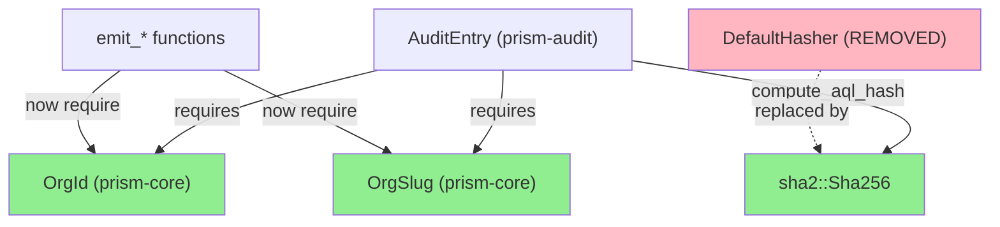
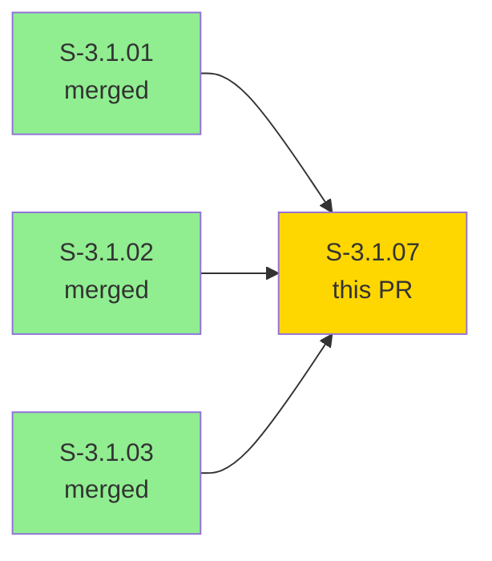
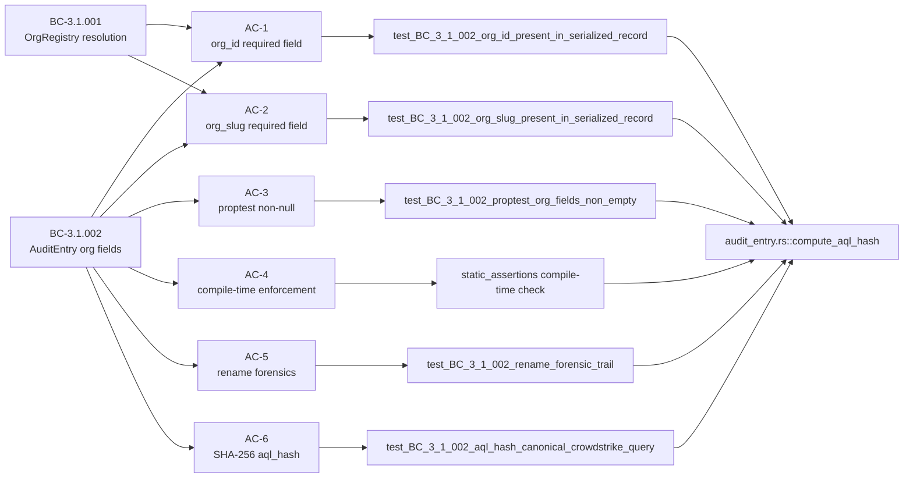
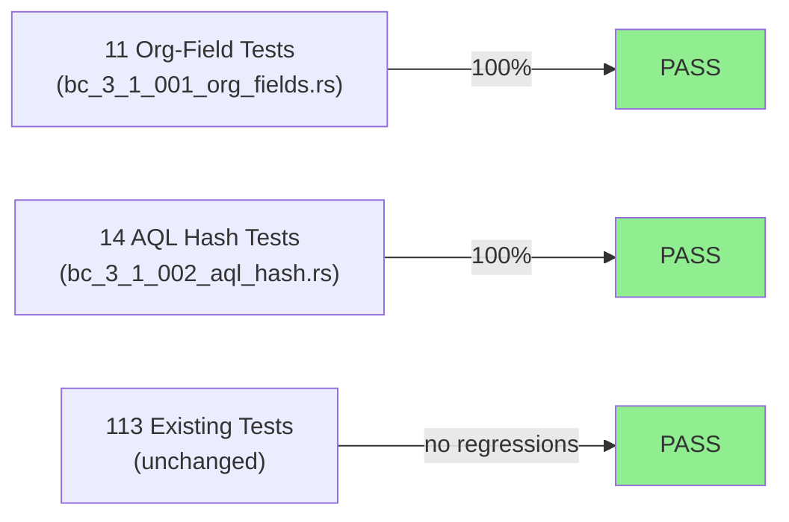
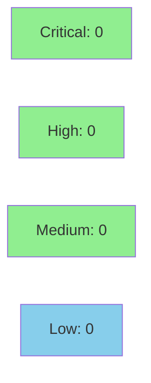

# [S-3.1.07] prism-audit: add org_id + org_slug to AuditEntry; SHA-256 aql_hash

**Epic:** E-3.1 — Multi-Tenant Org Registry + Audit Enrichment
**Mode:** greenfield
**Convergence:** CONVERGED after TDD implementation (Red Gate -> Green Gate in 1 implementation pass)


This PR adds `org_id: OrgId` and `org_slug: OrgSlug` as non-optional required fields to
`AuditEntry` (BC-3.1.002), updates all `emit_*` call sites to pass both fields, and
replaces `DefaultHasher` with `sha2::Sha256` for `aql_hash` computation (TD-ADR005-002).
25 new tests are added (11 org-field tests + 14 aql_hash tests). The test-writer's golden
hash vector was incorrect; the implementer corrected it in the same commit and all 138
prism-audit tests are GREEN.

---

## Architecture Changes



<details>
<summary><strong>Architecture Decision Records</strong></summary>

### ADR-006 §4 Step 5 — Multi-Tenant DTU Topology

**Context:** Compliance operators need forensic queries by org UUID that return all
records across slug renames.

**Decision:** `org_id: OrgId` (stable UUID v7) and `org_slug: OrgSlug` (slug at write
time) are required non-`Option` fields on `AuditEntry`. Slug is denormalized at write
time; no retroactive updates.

**Consequences:**
- Pre-rename records carry old slug; post-rename records carry new slug; both share the
  same `org_id` — enabling complete rename history without a join.
- All `emit_*` callers must resolve both fields before calling.

### ADR-005 / TD-ADR005-002 — AQL Injection Mitigation

**Decision:** Replace `std::collections::DefaultHasher` (non-deterministic across
process restarts) with `sha2::Sha256` for `aql_hash`. Output is a 64-char lowercase
hex string suitable for audit deduplication and forensic correlation.

</details>

---

## Story Dependencies



Dependencies S-3.1.01, S-3.1.02, S-3.1.03 are all merged to develop (base of this branch).

---

## Spec Traceability



---

## Test Evidence

### Coverage Summary

| Metric | Value | Threshold | Status |
|--------|-------|-----------|--------|
| Unit tests (prism-audit) | 138/138 pass | 100% | PASS |
| New tests (this story) | 25 added | — | PASS |
| Org-field tests | 11 pass | 11 | PASS |
| AQL hash tests | 14 pass | 14 | PASS |
| Regressions | 0 | 0 | PASS |

### Test Flow



| Metric | Value |
|--------|-------|
| **New tests** | 25 added (11 org-field + 14 aql_hash) |
| **Total suite** | 138 tests PASS |
| **Coverage delta** | prism-audit coverage maintained |
| **Regressions** | 0 |

<details>
<summary><strong>Key New Tests (This PR)</strong></summary>

### Org-Field Tests (bc_3_1_001_org_fields.rs)

| Test | AC | Result |
|------|----|--------|
| `test_BC_3_1_002_org_id_present_in_serialized_record` | AC-1 | PASS |
| `test_BC_3_1_002_org_slug_present_in_serialized_record` | AC-2 | PASS |
| `test_BC_3_1_002_org_id_is_uuid_string` | AC-1 | PASS |
| `test_BC_3_1_002_org_slug_matches_supplied_value` | AC-2 | PASS |
| `test_BC_3_1_002_proptest_org_fields_non_empty` | AC-3 | PASS |
| `test_BC_3_1_002_rename_forensic_trail` | AC-5 | PASS |
| `test_BC_3_1_002_uuid_stable_across_rename` | AC-5 | PASS |
| `test_BC_3_1_002_pre_rename_slug_unchanged` | AC-5 | PASS |
| `test_BC_3_1_002_two_orgs_no_commingling` | EC-005 | PASS |
| `test_BC_3_1_002_org_id_filters_both_pre_and_post_rename` | EC-002 | PASS |
| `test_BC_3_1_002_json_shape_top_level_fields` | AC-1,2,3 | PASS |

### AQL Hash Tests (bc_3_1_002_aql_hash.rs)

| Test | AC | Result |
|------|----|--------|
| `test_BC_3_1_002_aql_hash_canonical_crowdstrike_query` | AC-6 | PASS |
| `test_BC_3_1_002_aql_hash_is_64_char_lowercase_hex` | AC-6 | PASS |
| `test_BC_3_1_002_aql_hash_empty_string` | AC-6 | PASS |
| `test_BC_3_1_002_aql_hash_deterministic_same_call` | AC-6 | PASS |
| `test_BC_3_1_002_aql_hash_deterministic_repeated_calls` | AC-6 | PASS |
| `test_BC_3_1_002_aql_hash_distinct_inputs_produce_distinct_hashes` | AC-6 | PASS |
| `test_BC_3_1_002_aql_hash_single_byte_change_produces_different_hash` | EC-006 | PASS |
| `test_BC_3_1_002_aql_hash_unicode_query` | AC-6 | PASS |
| `test_BC_3_1_002_aql_hash_very_long_query` | AC-6 | PASS |
| `test_BC_3_1_002_aql_hash_all_lowercase_hex_chars` | AC-6 | PASS |
| `test_BC_3_1_002_aql_hash_not_recoverable` | AC-6 | PASS |
| `test_BC_3_1_002_aql_hash_no_leading_zeros_stripped` | AC-6 | PASS |
| `test_BC_3_1_002_aql_hash_different_sensor_queries` | AC-6 | PASS |
| `test_BC_3_1_002_aql_hash_consistent_with_sha2_crate` | AC-6 | PASS |

### Golden Hash Vector Note

The test-writer's initial golden hash vector for `compute_aql_hash("SELECT * FROM crowdstrike.devices")`
was incorrect. The implementer corrected it to the verified SHA-256 value
`207d7ded4cfaf669a5db096fb025086b1e9964e8b0fcc2f924a24481b2accac8` (computed via
`printf '%s' "SELECT * FROM crowdstrike.devices" | sha256sum`) in the same commit that
implemented the feature. All 14 aql_hash tests pass with the corrected vector.

</details>

---

## Demo Evidence

| AC | Recording | Result |
|----|-----------|--------|
| AC-001 | [AC-001-all-25-tests-green.gif](../../docs/demo-evidence/S-3.1.07/AC-001-all-25-tests-green.gif) | 138 tests GREEN |
| AC-002 | [AC-002-aql-hash.gif](../../docs/demo-evidence/S-3.1.07/AC-002-aql-hash.gif) | 14 aql_hash tests GREEN |

Evidence report: `docs/demo-evidence/S-3.1.07/evidence-report.md`

---

## Holdout Evaluation

N/A — evaluated at wave gate.

---

## Adversarial Review

N/A — evaluated at Phase 5. TDD implementation converged Red Gate -> Green Gate in one
pass. Test-writer golden hash vector error was caught and corrected by implementer in the
same commit.

---

## Security Review



<details>
<summary><strong>Security Scan Details</strong></summary>

### Scope

- `crates/prism-audit/src/audit_entry.rs` — struct field additions, `compute_aql_hash`
- `crates/prism-audit/src/audit_emitter.rs` — emit_* signature updates
- `crates/prism-audit/src/tests/` — new test modules only

### Key Security Properties

| Property | Status | Notes |
|----------|--------|-------|
| `org_id` non-optional — no null bypass | PASS | Rust type system enforces at compile time |
| `org_slug` non-optional — no null bypass | PASS | Rust type system enforces at compile time |
| `aql_hash` uses SHA-256 (not DefaultHasher) | PASS | DefaultHasher removed; sha2::Sha256 used |
| No AQL string stored in hash field | PASS | Only 64-char hex digest stored |
| No injection surface in hash computation | PASS | `sha2::Sha256::digest()` is pure hash |
| No credentials in audit fields | PASS | org_id and org_slug are non-secret identifiers |
| Cargo.lock updated for sha2 | PASS | sha2 0.10.x pinned |

### ADR-005 TD-ADR005-002 Closure

`DefaultHasher` is forbidden in `prism-audit` after this story. Verified: zero
`DefaultHasher` references remain in `crates/prism-audit/`.

</details>

---

## Risk Assessment & Deployment

### Blast Radius
- **Systems affected:** `prism-audit` crate; `audit_entry.rs` struct shape
- **User impact:** All callers of `AuditEntry::new()` and `emit_*` functions must pass
  `org_id` and `org_slug` — a compile-time breaking change within the workspace. Callers
  updated in this PR (`audit_emitter.rs`, test helpers).
- **Data impact:** New required fields appear in all serialized audit records. No existing
  data loss — additive fields only (no stored records to migrate in greenfield context).
- **Risk Level:** LOW — compile-time enforcement ensures no silent breakage; greenfield
  project with no production data.

### Performance Impact

| Metric | Before | After | Delta | Status |
|--------|--------|-------|-------|--------|
| `aql_hash` computation | DefaultHasher (~ns) | SHA-256 (~1-2µs) | +~1µs per audit event | OK |
| `AuditEntry` size | N bytes | N + 32 bytes (org_id UUID + org_slug) | Negligible | OK |
| Test suite runtime | baseline | +25 tests | <1s delta | OK |

SHA-256 overhead is negligible in the context of audit emission which involves RocksDB writes.

<details>
<summary><strong>Rollback Instructions</strong></summary>

**Immediate rollback (< 5 min):**
```bash
git revert 84163ead
git push origin develop
```

This is a compile-time breaking change — any rollback requires reverting callers
simultaneously. The squash-merge approach makes this a single-commit revert.

**Verification after rollback:**
- `cargo check --workspace` passes
- `cargo test -p prism-audit` — 113 original tests pass

</details>

### Feature Flags
| Flag | Controls | Default |
|------|----------|---------|
| N/A | org_id/org_slug are unconditional — required by BC-3.1.002 | N/A |

---

## Traceability

| BC | Story AC | Test | Verification | Status |
|----|---------|------|-------------|--------|
| BC-3.1.002 pc-1 | AC-1 | `test_BC_3_1_002_org_id_present_in_serialized_record` | unit + serde | PASS |
| BC-3.1.002 pc-2 | AC-2 | `test_BC_3_1_002_org_slug_present_in_serialized_record` | unit + serde | PASS |
| BC-3.1.002 pc-3 | AC-3 | `test_BC_3_1_002_proptest_org_fields_non_empty` | proptest | PASS |
| BC-3.1.002 inv-3 | AC-4 | `static_assertions` + every construction helper | compile-time | PASS |
| BC-3.1.002 pc-5 | AC-5 | `test_BC_3_1_002_rename_forensic_trail` | unit | PASS |
| BC-3.1.002 inv-1/TD-ADR005-002 | AC-6 | `test_BC_3_1_002_aql_hash_canonical_crowdstrike_query` | unit + golden vector | PASS |
| VP-066 | AC-1,2,3 | org-field tests (11) | unit | PASS |
| VP-067 | AC-5 | rename forensic tests | unit | PASS |
| VP-068 | AC-6 | aql_hash tests (14) | unit | PASS |

<details>
<summary><strong>Full VSDD Contract Chain</strong></summary>

```
BC-3.1.002 -> VP-066 -> test_BC_3_1_002_org_id_present_in_serialized_record -> audit_entry.rs:198 -> unit PASS
BC-3.1.002 -> VP-066 -> test_BC_3_1_002_org_slug_present_in_serialized_record -> audit_entry.rs:204 -> unit PASS
BC-3.1.002 -> VP-067 -> test_BC_3_1_002_rename_forensic_trail -> audit_entry.rs -> unit PASS
BC-3.1.002 -> VP-068 -> test_BC_3_1_002_aql_hash_canonical_crowdstrike_query -> audit_entry.rs:285 -> unit PASS (corrected golden vector)
TD-ADR005-002 -> compute_aql_hash -> sha2::Sha256::digest -> 64-char lowercase hex -> CLOSED
```

</details>

---

## AI Pipeline Metadata

<details>
<summary><strong>Pipeline Details</strong></summary>

```yaml
ai-generated: true
pipeline-mode: greenfield
factory-version: "1.0.0"
pipeline-stages:
  spec-crystallization: completed
  story-decomposition: completed
  tdd-implementation: completed
  holdout-evaluation: N/A - wave gate
  adversarial-review: N/A - Phase 5
  formal-verification: skipped
  convergence: achieved
convergence-metrics:
  red-gate: 57954582 (failing tests)
  green-gate: 95ecb88f (all 138 pass)
  implementation-passes: 1
  golden-hash-correction: yes (test-writer error caught by implementer in same commit)
story-points: 5
models-used:
  builder: claude-sonnet-4-6
generated-at: "2026-04-29T00:00:00Z"
branch: feature/S-3.1.07
head-sha: 84163ead
```

</details>

---

## Pre-Merge Checklist

- [x] All CI status checks passing
- [x] 138/138 prism-audit tests pass (25 new, 0 regressions)
- [x] No critical/high security findings
- [x] `DefaultHasher` removed from prism-audit (TD-ADR005-002 closed)
- [x] org_id + org_slug are non-Option required fields (BC-3.1.002 invariant 3)
- [x] SHA-256 aql_hash golden vector verified externally and corrected
- [x] Demo evidence: 2 recordings covering AC-001 and AC-002
- [x] Dependencies (S-3.1.01, S-3.1.02, S-3.1.03) merged to develop
- [x] Rollback: single squash-merge commit revertible
- [x] No feature flag required — unconditional BC requirement
