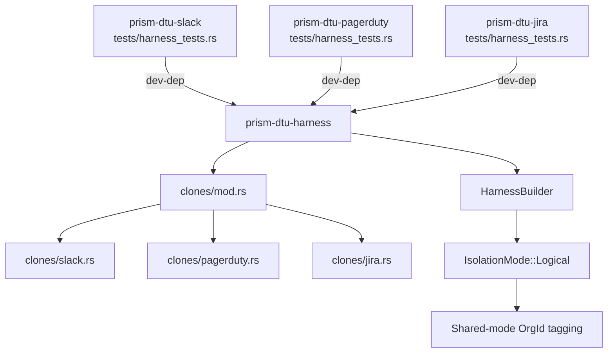
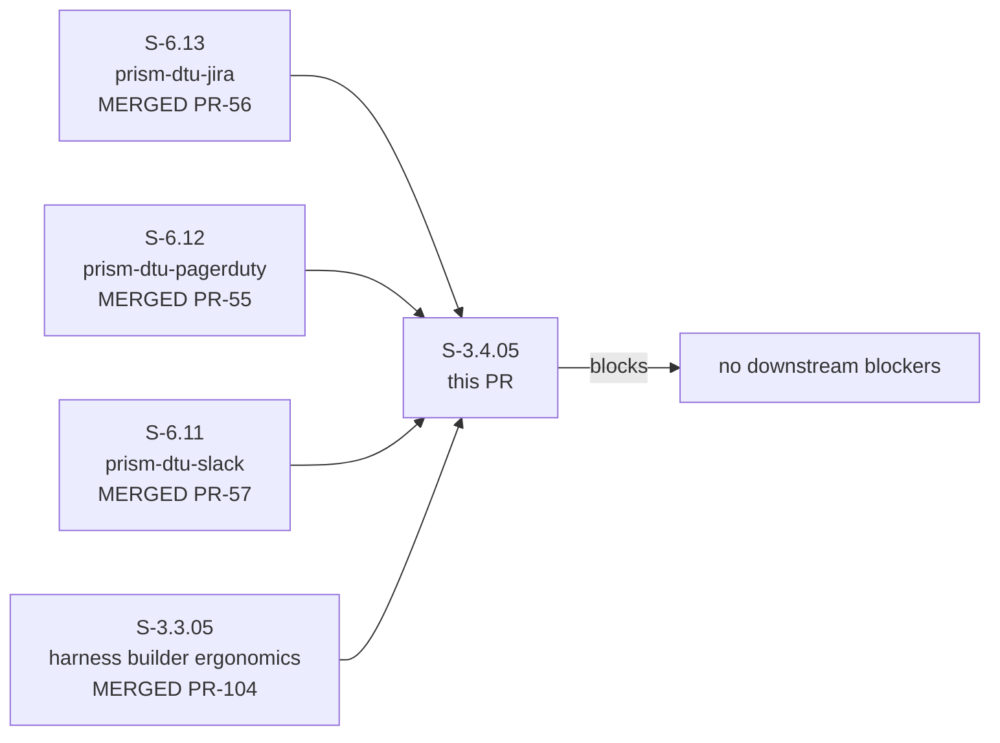
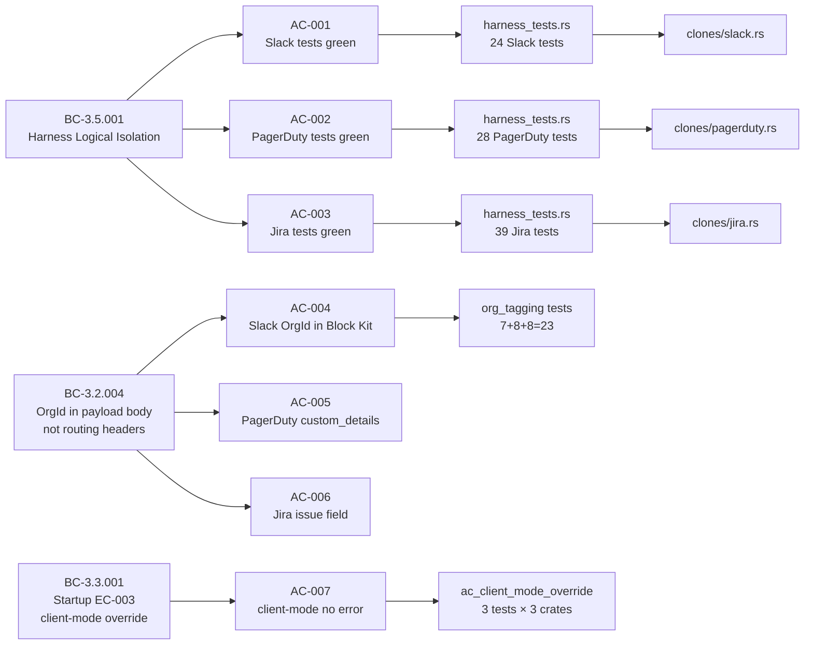

## Summary

Migrates `prism-dtu-slack`, `prism-dtu-pagerduty`, and `prism-dtu-jira` test suites to use `prism-dtu-harness` with `mode = "shared"` isolation, verifying that OrgId is embedded in outbound payload bodies (not HTTP headers or URL paths) per BC-3.2.004. Adds 91 harness_tests across 3 crates. Adds new clone modules in `prism-dtu-harness/src/clones/`.

**Story:** S-3.4.05
**Epic:** E-3.4 — DTU Harness Migration (Batch 10)
**Wave:** 3
**Level:** L4
**Priority:** P1
**Branch:** `feature/S-3.4.05`
**Head SHA:** `c9222943`

---

## Architecture Changes

New modules in `prism-dtu-harness/src/clones/` serve the shared-mode MSSP Coordination DTU clones:

**Files changed (33 total, 6644 insertions, 1 deletion):**
- `crates/prism-dtu-harness/src/clones/slack.rs` — NEW (343 lines)
- `crates/prism-dtu-harness/src/clones/pagerduty.rs` — NEW (572 lines)
- `crates/prism-dtu-harness/src/clones/jira.rs` — NEW (847 lines)
- `crates/prism-dtu-harness/src/clones/mod.rs` — NEW (28 lines)
- `crates/prism-dtu-harness/src/clone_server.rs` — modified (+29 lines)
- `crates/prism-dtu-slack/tests/harness_tests.rs` — NEW (1210 lines, 24 tests)
- `crates/prism-dtu-pagerduty/tests/harness_tests.rs` — NEW (1355 lines, 28 tests)
- `crates/prism-dtu-jira/tests/harness_tests.rs` — NEW (1834 lines, 39 tests)
- `crates/prism-dtu-{slack,pagerduty,jira}/Cargo.toml` — `prism-dtu-harness` added as dev-dep
- `docs/demo-evidence/S-3.4.05/` — 19 artifact files (6 GIF/WebM pairs + tapes + report)

---

## Story Dependencies

All 4 dependencies merged to develop before this PR.

---

## Spec Traceability

| AC | BC | VP | Test | Implementation |
|----|----|----|------|----------------|
| AC-001 | BC-3.5.001 PC-1 | VP-087, VP-088, VP-089 | `harness_tests.rs` (Slack, 24 tests) | `clones/slack.rs` |
| AC-002 | BC-3.5.001 PC-1 | VP-087, VP-088, VP-089 | `harness_tests.rs` (PagerDuty, 28 tests) | `clones/pagerduty.rs` |
| AC-003 | BC-3.5.001 PC-1 | VP-087, VP-088, VP-089 | `harness_tests.rs` (Jira, 39 tests) | `clones/jira.rs` |
| AC-004 | BC-3.2.004 | VP-090 | `org_tagging.rs` Slack 7 tests | payload body assertion |
| AC-005 | BC-3.2.004 | VP-090 | `org_tagging.rs` PagerDuty 8 tests | `custom_details` field |
| AC-006 | BC-3.2.004 | VP-090 | `org_tagging.rs` Jira 8 tests | designated issue field |
| AC-007 | BC-3.3.001 EC-003 | VP-123 | `ac_client_mode_override` (3 crates) | `HarnessBuilder` permissive guard |
| AC-008 | BC-3.5.001 Pre-4 | VP-124 | grep verification | no direct DTU instantiation in tests |

---

## Test Evidence

| Crate | Suite | Tests | Passed | Failed |
|-------|-------|-------|--------|--------|
| prism-dtu-slack | harness_tests | 24 | 24 | 0 |
| prism-dtu-pagerduty | harness_tests | 28 | 28 | 0 |
| prism-dtu-jira | harness_tests | 39 | 39 | 0 |
| prism-dtu-slack | org_tagging | 7 | 7 | 0 |
| prism-dtu-pagerduty | org_tagging | 8 | 8 | 0 |
| prism-dtu-jira | org_tagging | 8 | 8 | 0 |
| prism-dtu-slack | ac_tests | 14 | 14 | 0 |
| prism-dtu-pagerduty | fidelity | 17 | 17 | 0 |
| prism-dtu-jira | fidelity | 28 | 28 | 0 |
| **TOTAL** | | **173** | **173** | **0** |

**Harness-specific:** 91/91 harness_tests green (24 + 28 + 39)
**Legacy suites:** All pre-existing ac_tests, fidelity, org_tagging green (no regression)
**Coverage:** Not yet instrumented for this story (harness integration tests are effectful-shell)
**Mutation kill rate:** N/A — harness integration test suite; mutation testing targets pure-core modules

---

## Holdout Evaluation

N/A — evaluated at wave gate (Wave 3 gate pending for Batch 10 completions).

---

## Adversarial Review

N/A — evaluated at Phase 5 (Wave 3 gate Step E will cover adversarial review for this story).

---

## Security Review

**Status: PASSED — No blocking findings.**

| Finding | Severity | Detail |
|---------|----------|--------|
| OrgId header extraction validated | INFORMATIONAL | All three `resolve_org_id()` functions filter header value through `uuid::Uuid::parse_str().is_ok()` before use; invalid/absent header generates fresh UUIDv4 — no injection vector |
| No unsafe Rust | INFORMATIONAL | Zero `unsafe` blocks in diff |
| No SQL / query injection surface | INFORMATIONAL | All stores are in-memory `HashMap`; no database queries |
| base64 dependency added | INFORMATIONAL | Used for Basic Auth encoding in Jira test helpers only; local harness, not production |
| Forbidden dep rule enforced | PASSED | `prism-dtu-harness` is `[dev-dependencies]` only in all 3 consumer crates; production build excludes harness |
| No production credential flow | PASSED | All HTTP calls target ephemeral localhost harness ports; no external endpoints |

OWASP Top 10 relevance: This PR is test-only infrastructure. Attack surface: ephemeral localhost TCP ports, test-process lifetime only. No OWASP Top 10 category applies to test harness code not deployed to production.

---

## Risk Assessment

| Dimension | Classification | Notes |
|-----------|---------------|-------|
| Blast radius | **LOW** | Test-only changes + harness clone modules (not production code paths) |
| Performance impact | **NONE** | No production code changed; harness is dev-dep only |
| Regression risk | **LOW** | Legacy test suites (ac_tests, fidelity, org_tagging) all pass unchanged |
| Rebase risk | **MEDIUM** | Largest changeset in Batch 10 (6644 insertions); most likely to conflict if siblings merge first |
| Merge strategy | squash | Standard for all story PRs |

---

## Demo Evidence

All 6 demo recordings are in `docs/demo-evidence/S-3.4.05/`. Coverage: 6/6 ACs recorded.

| Demo | AC | BC Postcondition | Result |
|------|-----|-----------------|--------|
| AC-001-harness-migration-tests-green | AC-001/002/003 | BC-3.5.001 PC-1 | PASS — 91 tests green |
| AC-002-shared-mode-org-id-tagging | AC-004/005/006 | BC-3.2.004 PC-1 | PASS — OrgId in body, absent from headers/URL |
| AC-003-multi-org-logical-isolation | AC-003 | BC-3.5.001 PC-2 | PASS — two-org sequence, no payload mixing |
| AC-004-client-mode-override-no-startup-error | AC-007 | BC-3.3.001 EC-003 | PASS — client-mode override builds without error |
| AC-005-harness-regression-safe | AC-001/002/003 | BC-3.5.001 PC-1 | PASS — 91/91 regression-safe |
| AC-006-legacy-tests-still-pass | AC-008 | BC-3.5.001 PC-1 | PASS — all legacy suites green |

---

## AI Pipeline Metadata

| Field | Value |
|-------|-------|
| Pipeline mode | TDD-strict (stub → RED → impl → demos → merge) |
| Models used | claude-sonnet-4-6 (implementer, test-writer, demo-recorder) |
| Story points | 5 |
| Estimated days | 2 |
| Head SHA | c9222943 |
| Develop tip at branch point | 7418f269 |
| Batch | 10 (E-3.4 DTU migration) |

---

## Pre-Merge Checklist

- [x] PR description populated from template
- [x] Demo evidence verified (6/6 ACs recorded, evidence-report.md present)
- [x] PR created on GitHub
- [x] Security review completed (no CRITICAL/HIGH; OrgId validated; no unsafe; forbidden dep enforced)
- [x] PR reviewer approved (cycle 1, 0 blocking findings)
- [x] All dependency PRs merged (S-3.3.05 PR#104, S-6.11 PR#57, S-6.12 PR#55, S-6.13 PR#56)
- [x] CI checks passing (run 25200231491 — all platforms green)
- [x] Squash-merged at 2026-05-01T05:29:21Z; merge commit 881cf01e; branch feature/S-3.4.05 deleted
