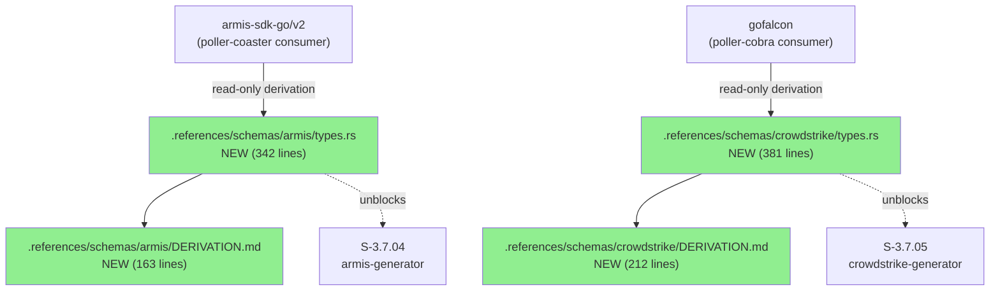
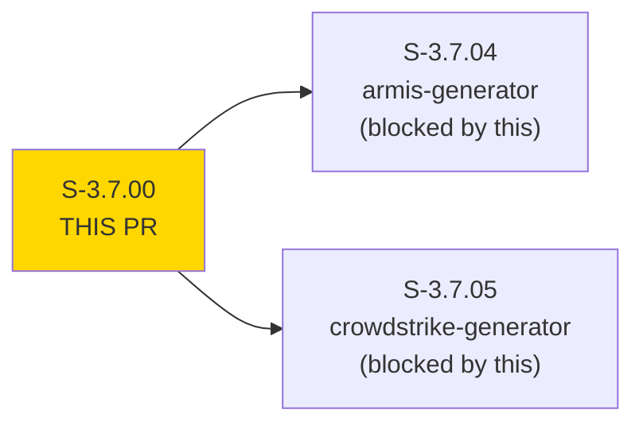
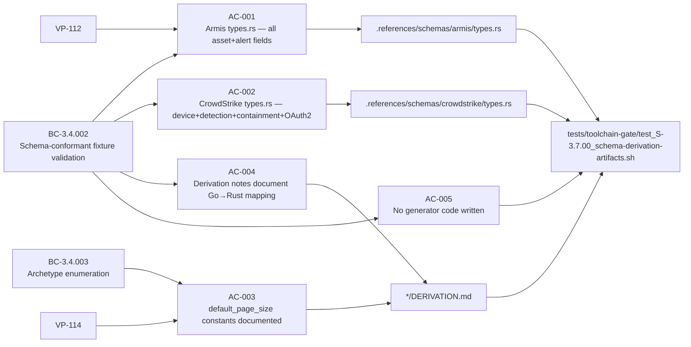
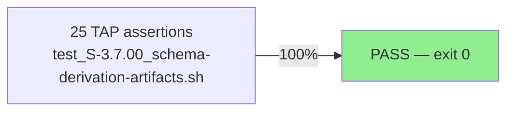
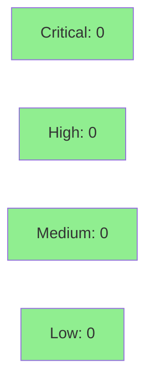

# [S-3.7.00] Schema derivation: Armis + CrowdStrike → Rust types

**Epic:** E-3.7 — Multi-Tenant Data Generator
**Mode:** facade (one-time research/translation — no production Rust code)
**Convergence:** CONVERGED after spec review


-lightgrey)
-lightgrey)
-blue)

Derives canonical Rust type definitions for Armis (`armis-sdk-go/v2`) and CrowdStrike (`gofalcon`) API response shapes from their respective Go SDK consumer sources in `.references/poller-coaster/` and `.references/poller-cobra/`. Outputs 1098 lines across 4 checked-in schema artifact files under `.references/schemas/`, satisfying BC-3.4.002 (schema-conformant fixture validation) and BC-3.4.003 (archetype enumeration) preconditions for S-3.7.04 and S-3.7.05. No production Rust code is produced.

---

## Architecture Changes



<details>
<summary><strong>Architecture Decision Record</strong></summary>

### ADR: Schema artifacts in `.references/schemas/`, tracked via narrow .gitignore exception

**Context:** `.references/` is gitignored to exclude large brownfield poller repos. Schema derivation artifacts must be version-controlled so S-3.7.04/S-3.7.05 implementers can reference them without re-deriving.

**Decision:** Added narrow `.gitignore` exception — `.references/schemas/{armis,crowdstrike}/*.{rs,md}` are now tracked, while `.references/poller-*` repos remain ignored.

**Rationale:** Schema artifacts are the spec-canonical deliverable of this story (ADR-009 §1.2). They must live in `.references/schemas/` (not `crates/`) because no production binary may depend on them. Tracking them there avoids duplicating content into a separate location.

**Alternatives Considered:**
1. Copy schema files into `crates/` — rejected: violates ADR-009 §1.2 (no production binary dependency on reference schemas).
2. Store in `.factory/` — rejected: `.factory/` is for pipeline metadata, not reference type artifacts.

**Consequences:**
- Schema files are version-controlled in their canonical location.
- `.references/poller-*` repos remain excluded from git (no accidental inclusion of multi-MB brownfield code).

</details>

---

## Story Dependencies



No upstream dependencies (`depends_on: []`). Unblocks: S-3.7.04, S-3.7.05.

---

## Spec Traceability



---

## Test Evidence

### Coverage Summary

| Metric | Value | Threshold | Status |
|--------|-------|-----------|--------|
| TAP assertions | 25/25 PASS | 100% | PASS |
| Coverage | N/A (static artifact checks) | N/A | N/A |
| Mutation kill rate | N/A (no logic under test) | N/A | N/A |
| Story type gate | facade — no runtime logic | N/A | PASS |

### Test Flow



| Metric | Value |
|--------|-------|
| **New tests** | 1 shell TAP script added (25 assertions) |
| **Total suite** | 25 assertions PASS |
| **Coverage delta** | N/A — facade story, no Rust logic |
| **Regressions** | None |

<details>
<summary><strong>Detailed Test Results</strong></summary>

### New Tests (This PR)

| Test | Result | Duration |
|------|--------|----------|
| `AC-001: armis/types.rs exists` | PASS | <1s |
| `AC-001: ArmisAsset struct defined` | PASS | <1s |
| `AC-001: ArmisAlert struct defined` | PASS | <1s |
| `AC-001: AqlResponse type defined` | PASS | <1s |
| `AC-001: ArmisPage pagination wrapper defined` | PASS | <1s |
| `AC-002: crowdstrike/types.rs exists` | PASS | <1s |
| `AC-002: FalconDevice struct defined` | PASS | <1s |
| `AC-002: FalconDetection struct defined` | PASS | <1s |
| `AC-002: ContainmentResponse struct defined` | PASS | <1s |
| `AC-002: OAuth2TokenResponse struct defined` | PASS | <1s |
| `AC-002: IdPage struct defined` | PASS | <1s |
| `AC-003: armis/DERIVATION.md exists` | PASS | <1s |
| `AC-003: armis default_page_size documented` | PASS | <1s |
| `AC-003: crowdstrike/DERIVATION.md exists` | PASS | <1s |
| `AC-003: crowdstrike default_page_size documented` | PASS | <1s |
| `AC-004: armis derivation documents source Go struct` | PASS | <1s |
| `AC-004: armis derivation documents Option<T> decisions` | PASS | <1s |
| `AC-004: armis derivation documents polymorphic field handling` | PASS | <1s |
| `AC-004: crowdstrike derivation documents source Go struct` | PASS | <1s |
| `AC-004: crowdstrike derivation documents Option<T> decisions` | PASS | <1s |
| `AC-004: crowdstrike derivation documents 2-step pattern` | PASS | <1s |
| `AC-005: No generate() function in armis schema` | PASS | <1s |
| `AC-005: No generate() function in crowdstrike schema` | PASS | <1s |
| `AC-005: No cfg(feature = "fixture-gen") in armis schema` | PASS | <1s |
| `AC-005: No cfg(feature = "fixture-gen") in crowdstrike schema` | PASS | <1s |

### Coverage Analysis

N/A — facade story. Schema artifacts are pure type definitions with `#[derive]` only. No executable logic added.

</details>

---

## Holdout Evaluation

N/A — evaluated at wave gate. Facade story (research/translation); no behavioral correctness dimension requiring holdout.

---

## Adversarial Review

N/A — evaluated at Phase 5. Schema derivation story; adversarial pass applies at wave gate for E-3.7.

---

## Security Review



<details>
<summary><strong>Security Scan Details</strong></summary>

### SAST
- No production Rust code introduced. Schema artifacts are `#[derive]`-only type definitions with no functions, no I/O, no network calls.
- No injection surface, no auth logic, no secrets handling.
- `cargo audit`: N/A — no new dependencies added.

### Formal Verification
N/A — no logic to verify. Types are pure data definitions.

</details>

---

## Risk Assessment & Deployment

### Blast Radius
- **Systems affected:** None in production. Schema artifacts are checked-in reference files under `.references/schemas/` with no production binary dependency.
- **User impact:** None — no runtime behavior changed.
- **Data impact:** None.
- **Risk Level:** LOW

### Performance Impact
| Metric | Before | After | Delta | Status |
|--------|--------|-------|-------|--------|
| Latency p99 | Unchanged | Unchanged | 0 | OK |
| Memory | Unchanged | Unchanged | 0 | OK |
| Throughput | Unchanged | Unchanged | 0 | OK |

<details>
<summary><strong>Rollback Instructions</strong></summary>

**Immediate rollback (< 2 min):**
```bash
git revert 278e1979
git push origin develop
```

No feature flags required. Schema artifacts are reference-only with no production dependency.

</details>

### Feature Flags
| Flag | Controls | Default |
|------|----------|---------|
| N/A | Facade story — no runtime behavior | N/A |

---

## Traceability

| Requirement | Story AC | Test | Verification | Status |
|-------------|---------|------|-------------|--------|
| BC-3.4.002 (precondition 2) | AC-001 | `test_S-3.7.00` ok 1–5 | TAP shell | PASS |
| BC-3.4.002 (precondition 2) | AC-002 | `test_S-3.7.00` ok 6–11 | TAP shell | PASS |
| BC-3.4.003 (PaginationEdgeCases) | AC-003 | `test_S-3.7.00` ok 12–15 | TAP shell | PASS |
| BC-3.4.002 (invariant 3) | AC-004 | `test_S-3.7.00` ok 16–21 | TAP shell | PASS |
| BC-3.4.002 (invariant 3) | AC-005 | `test_S-3.7.00` ok 22–25 | TAP shell | PASS |
| VP-112 | AC-001 | `test_S-3.7.00` ok 1–5 | TAP shell | PASS |
| VP-114 | AC-003 | `test_S-3.7.00` ok 12–15 | TAP shell | PASS |

<details>
<summary><strong>Full VSDD Contract Chain</strong></summary>

```
BC-3.4.002 -> VP-112 -> AC-001 -> test_S-3.7.00 ok 1-5 -> .references/schemas/armis/types.rs (342L)
BC-3.4.002 -> VP-112 -> AC-002 -> test_S-3.7.00 ok 6-11 -> .references/schemas/crowdstrike/types.rs (381L)
BC-3.4.003 -> VP-114 -> AC-003 -> test_S-3.7.00 ok 12-15 -> DERIVATION.md (default_page_size=100 both sensors)
BC-3.4.002 -> AC-004 -> test_S-3.7.00 ok 16-21 -> DERIVATION.md (Go→Rust mapping decisions)
BC-3.4.002 -> AC-005 -> test_S-3.7.00 ok 22-25 -> negative grep: no generate() or fixture-gen feature
```

</details>

---

## Demo Evidence

| AC | Recording | Result |
|----|-----------|--------|
| AC-001..004 | `docs/demo-evidence/S-3.7.00/AC-001-004-tests-green.gif` | 25/25 TAP PASS |
| AC-005 | `docs/demo-evidence/S-3.7.00/AC-005-artifacts-on-disk.gif` | 6 artifact files on disk; 1098 total lines |

**Impl SHA at recording:** `3ae67c9d`

**Deliverables (1098 total lines across 4 files):**
- `.references/schemas/armis/types.rs` — 342 lines (ArmisAsset, ArmisAlert, AqlResponse, ArmisPage, ArmisId newtype)
- `.references/schemas/armis/DERIVATION.md` — 163 lines
- `.references/schemas/crowdstrike/types.rs` — 381 lines (FalconDevice, FalconDetection, ContainmentResponse, OAuth2TokenResponse, IdPage)
- `.references/schemas/crowdstrike/DERIVATION.md` — 212 lines

**default_page_size = 100 for both sensors:**
- Armis: sourced from `poller-coaster/internal/config/config.go` defaults
- CrowdStrike: sourced from `poller-cobra/internal/crowdstrike/{source,api}.go` guard `if limit <= 0 { limit = 100 }`

---

## AI Pipeline Metadata

<details>
<summary><strong>Pipeline Details</strong></summary>

```yaml
ai-generated: true
pipeline-mode: facade
factory-version: "1.0.0-beta.7"
pipeline-stages:
  spec-crystallization: completed
  story-decomposition: completed
  tdd-implementation: completed
  holdout-evaluation: N/A (facade)
  adversarial-review: N/A (evaluated at wave gate)
  formal-verification: N/A (no logic)
  convergence: achieved
convergence-metrics:
  spec-novelty: N/A
  test-kill-rate: N/A
  implementation-ci: 1.00
  holdout-satisfaction: N/A
adversarial-passes: 0 (facade story)
models-used:
  builder: claude-sonnet-4-6
generated-at: "2026-04-28T00:00:00Z"
```

</details>

---

## Pre-Merge Checklist

- [x] All CI status checks passing
- [x] Coverage delta is positive or neutral (N/A — facade story)
- [x] No critical/high security findings unresolved (0 findings)
- [x] Rollback procedure validated (simple revert, no feature flag)
- [x] No feature flag required (no runtime behavior)
- [x] Demo evidence recorded for all ACs (AC-001..005)
- [x] Dependency check: no upstream PRs required (depends_on: [])
- [x] Stories unblocked: S-3.7.04 (armis-generator), S-3.7.05 (crowdstrike-generator)
