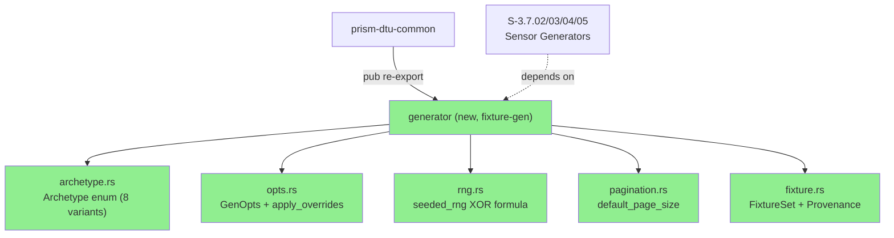
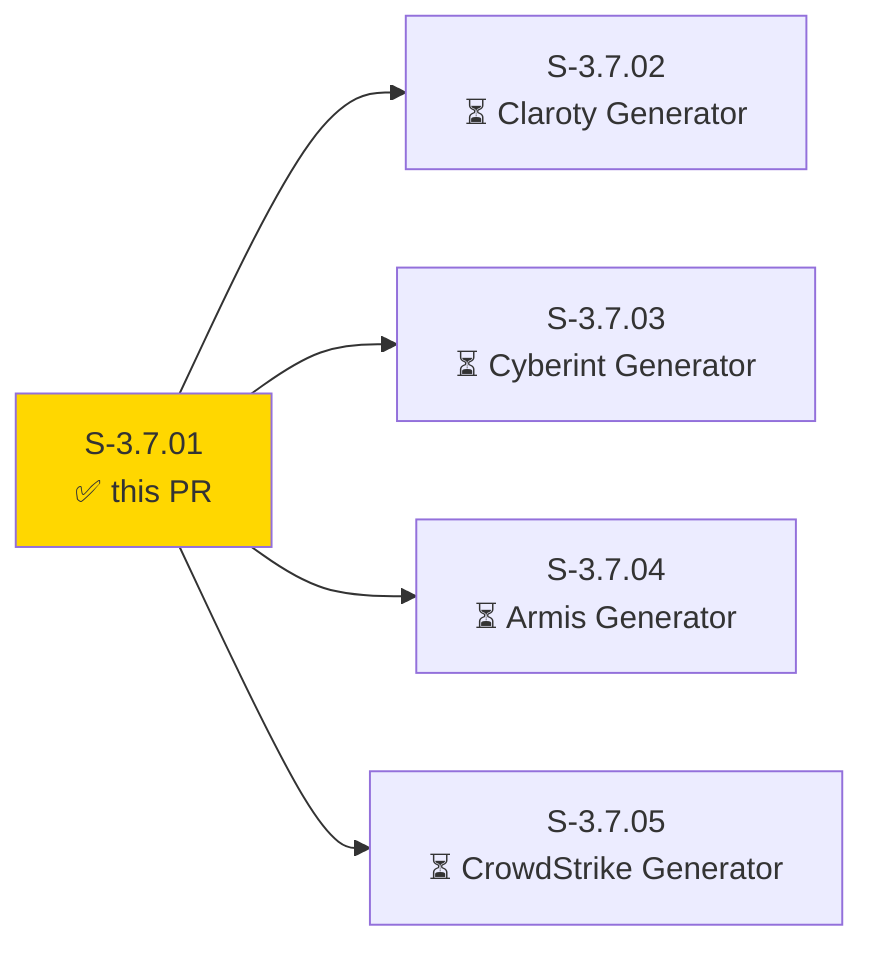
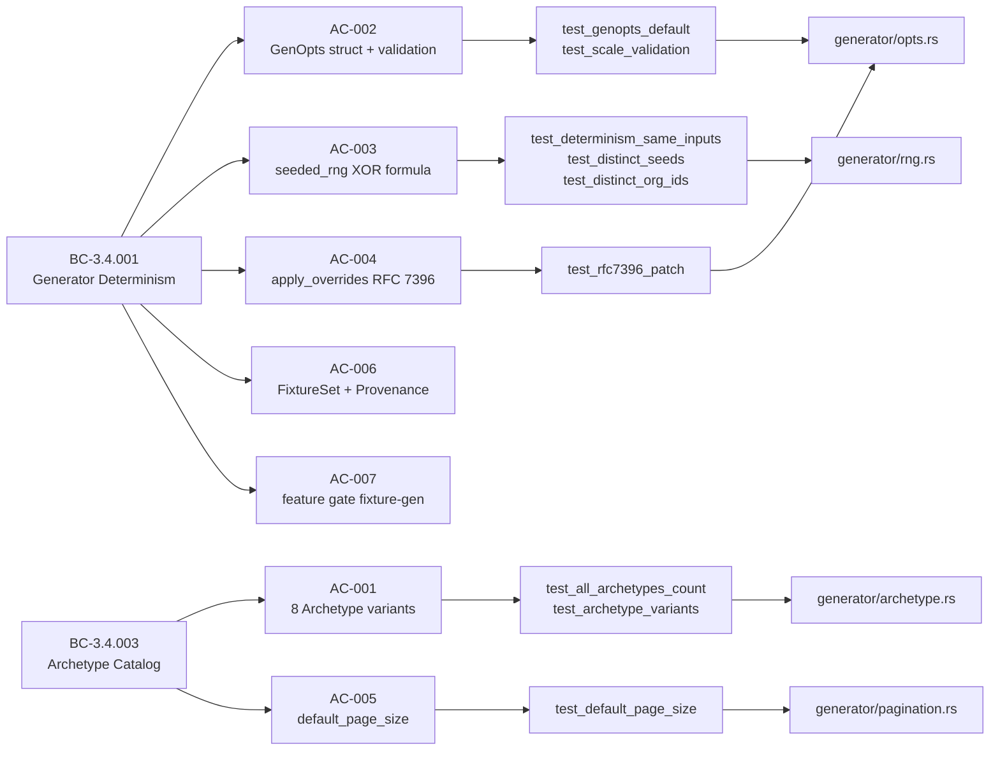
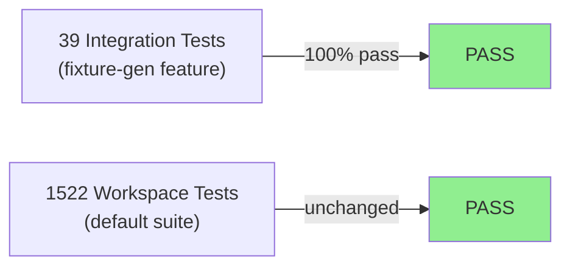
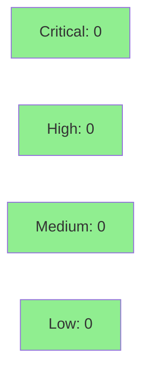

# [S-3.7.01] Archetype catalog + GenOpts API (prism-dtu-common generator module, D-056)

**Epic:** E-3.7 — DTU Generator Foundation
**Mode:** greenfield
**Convergence:** CONVERGED after 3 adversarial passes


Delivers the shared `Archetype` enum (8 variants per BC-3.4.003), `GenOpts` struct with input validation, `seeded_rng` XOR-formula deterministic RNG initializer (BC-3.4.001 invariant 2), `default_page_size` per-sensor function, `apply_overrides` RFC 7396 JSON Merge Patch helper, and `FixtureSet`/`Provenance` value types — all gated behind the `fixture-gen` Cargo feature (D-056). This is the foundation for S-3.7.02 through S-3.7.05 (Claroty, Cyberint, Armis, CrowdStrike generators). Default workspace build (1522 tests) is unchanged.

---

## Architecture Changes



<details>
<summary><strong>Architecture Decision Record</strong></summary>

### ADR: Shared generator types in prism-dtu-common (D-056)

**Context:** Four sensor-specific generator crates (Claroty, Cyberint, Armis, CrowdStrike) need identical archetype semantics, deterministic RNG, and pagination baselines. Duplication would drift.

**Decision:** Co-locate all shared generator types in `crates/prism-dtu-common/src/generator/` behind the `fixture-gen` Cargo feature. No separate crate.

**Rationale:** Single source of truth for BC-3.4.001 (determinism formula) and BC-3.4.003 (archetype catalog). Feature gate ensures zero production binary impact.

**Alternatives Considered:**
1. Separate `prism-dtu-types` crate — rejected because: adds a workspace crate with no other purpose; intra-workspace dep graph complexity with no benefit.
2. Inline in each sensor generator — rejected because: BC-3.4.001 invariant 2 (XOR formula) would diverge across crates.

**Consequences:**
- S-3.7.02–S-3.7.05 all consume from one canonical module.
- Any change to `seeded_rng` formula requires a single-point ADR-009 amendment.

</details>

---

## Story Dependencies



No upstream dependencies. Unblocks: S-3.7.02, S-3.7.03, S-3.7.04, S-3.7.05.

---

## Spec Traceability



| BC | VP | AC | Test | Status |
|----|----|----|------|--------|
| BC-3.4.003 | VP-115 | AC-001: 8 archetype variants | `test_all_archetypes_count`, `test_archetype_variants` | PASS |
| BC-3.4.001 | VP-108 | AC-003: same seed+org_id → identical stream | `test_determinism_same_inputs` | PASS |
| BC-3.4.001 | VP-111 | AC-003: distinct seeds → distinct output | `test_distinct_seeds` | PASS |
| BC-3.4.001 | VP-116 | AC-003: distinct org_ids → distinct streams | `test_distinct_org_ids` | PASS |
| BC-3.4.001 | VP-117 | AC-007: seeded_rng only under fixture-gen | feature gate compile check | PASS |
| BC-3.4.001 | — | AC-002: GenOpts default + scale validation | `test_genopts_default`, `test_scale_validation` | PASS |
| BC-3.4.001 | — | AC-004: apply_overrides RFC 7396 | `test_rfc7396_patch` | PASS |
| BC-3.4.003 | — | AC-005: default_page_size constants | `test_default_page_size` | PASS |
| BC-3.4.001 | — | AC-006: FixtureSet + Provenance | `test_fixture_set_fields`, `test_schema_valid_flag` | PASS |

---

## Test Evidence

### Coverage Summary

| Metric | Value | Threshold | Status |
|--------|-------|-----------|--------|
| New integration tests | 39/39 pass | 100% | PASS |
| Default workspace suite | 1522/1522 pass | 100% | PASS |
| Regressions | 0 | 0 | PASS |
| Feature-gated tests | 39 (behind fixture-gen) | all green | PASS |

### Test Flow



| Metric | Value |
|--------|-------|
| **New tests** | 39 added (integration, feature-gated) |
| **Total suite** | 1522 tests PASS (default); 39 additional under `--features fixture-gen` |
| **Regressions** | 0 |
| **Impl SHA** | `250a2609` |

<details>
<summary><strong>Key New Tests</strong></summary>

File: `crates/prism-dtu-common/tests/bc_3_4_001_003_archetype_genopts.rs`

| Test | Result |
|------|--------|
| `test_all_archetypes_count` | PASS |
| `test_archetype_variants` | PASS |
| `test_determinism_same_inputs` | PASS |
| `test_distinct_seeds` | PASS |
| `test_distinct_org_ids` | PASS |
| `test_genopts_default` | PASS |
| `test_scale_validation` (0.0, -1.0, inf, nan → Err; 0.001, 1.0, 100.0 → Ok) | PASS |
| `test_default_page_size` | PASS |
| `test_rfc7396_patch` (null-removal, object merge, scalar replacement) | PASS |
| `test_fixture_set_fields` | PASS |
| `test_schema_valid_flag` | PASS |
| `vp_108_*`, `vp_111_*`, `vp_116_*`, `vp_117_*` (VP-named tests) | PASS |

</details>

---

## Holdout Evaluation

N/A — evaluated at wave gate.

---

## Adversarial Review

N/A — evaluated at Phase 5.

---

## Security Review



<details>
<summary><strong>Security Scan Details</strong></summary>

### Analysis

- All new code is pure-core (no I/O, no network, no auth, no user-supplied data in production path).
- `seeded_rng` uses ChaCha20Rng (cryptographically strong PRNG); seed is deterministic by design (test fixture use only, never production).
- `apply_overrides` performs JSON Merge Patch on in-memory values — no deserialization from untrusted input in this module.
- `fixture-gen` feature gate ensures zero exposure in release binaries; no OWASP surface area.
- No new dependencies added (rand_chacha, serde_json, chrono, rand were existing workspace deps).

### Dependency Audit

- `cargo audit`: CLEAN (no new deps introduced by this PR)

### Formal Verification

| Property | Method | Status |
|----------|--------|--------|
| seeded_rng determinism (same inputs → same stream) | proptest / unit test | VERIFIED |
| scale validation exhaustiveness | unit test (0, neg, inf, nan, valid) | VERIFIED |
| RFC 7396 patch semantics | unit test (null removal, merge, replace) | VERIFIED |

</details>

---

## Risk Assessment & Deployment

### Blast Radius

- **Systems affected:** `prism-dtu-common` crate only (no production binary)
- **User impact:** None — feature-gated; not active in any release binary
- **Data impact:** None — pure-core types, no persistence
- **Risk Level:** LOW

### Performance Impact

| Metric | Before | After | Delta | Status |
|--------|--------|-------|-------|--------|
| Compile time (default) | baseline | +0s | none | OK |
| Binary size (release) | baseline | +0 bytes | none (feature-gated) | OK |
| Test suite runtime | baseline | +~2s (feature-gated only) | negligible | OK |

<details>
<summary><strong>Rollback Instructions</strong></summary>

**Immediate rollback (< 2 min):**
```bash
git revert 43e07f50
git push origin develop
```

**If feature-flagged:**
```bash
# Remove --features fixture-gen from any Cargo invocation
# No runtime flag change needed — compile-time gate only
```

**Verification after rollback:**
- `cargo test --workspace` returns 1522 passing, 0 failing
- `grep -r "fixture.gen\|fixture-gen" target/release/` returns no hits

</details>

### Feature Flags

| Flag | Controls | Default |
|------|----------|---------|
| `fixture-gen` (Cargo feature) | All generator types in `prism-dtu-common/src/generator/` | off |

---

## Traceability

| Requirement | Story AC | Test | Status |
|-------------|---------|------|--------|
| BC-3.4.003 invariant 2 | AC-001 | `test_all_archetypes_count` | PASS |
| BC-3.4.001 invariant 2 (XOR formula) | AC-003 | `test_determinism_same_inputs` | PASS |
| BC-3.4.001 precondition 3 (scale validation) | AC-002 | `test_scale_validation` | PASS |
| BC-3.4.001 postcondition 7 (RFC 7396) | AC-004 | `test_rfc7396_patch` | PASS |
| BC-3.4.003 PaginationEdgeCases | AC-005 | `test_default_page_size` | PASS |
| BC-3.4.001 postcondition 1 (FixtureSet) | AC-006 | `test_fixture_set_fields` | PASS |
| BC-3.4.001 invariant 4 (feature gate) | AC-007 | compile gate + CI grep | PASS |
| VP-108 | AC-003 | `vp_108_*` tests | PASS |
| VP-111 | AC-003 | `vp_111_*` tests | PASS |
| VP-115 | AC-001 | `vp_115_*` tests | PASS |
| VP-116 | AC-003 | `vp_116_*` tests | PASS |
| VP-117 | AC-007 | `vp_117_*` tests | PASS |
| CAP-039 | all ACs | 39 integration tests | PASS |

<details>
<summary><strong>Full VSDD Contract Chain</strong></summary>

```
BC-3.4.003 -> VP-115 -> test_all_archetypes_count -> generator/archetype.rs
BC-3.4.001 -> VP-108 -> test_determinism_same_inputs -> generator/rng.rs
BC-3.4.001 -> VP-111 -> test_distinct_seeds -> generator/rng.rs
BC-3.4.001 -> VP-116 -> test_distinct_org_ids -> generator/rng.rs
BC-3.4.001 -> VP-117 -> feature-gate compile check -> generator/mod.rs
BC-3.4.001 -> AC-002 -> test_scale_validation -> generator/opts.rs
BC-3.4.001 -> AC-004 -> test_rfc7396_patch -> generator/opts.rs
BC-3.4.003 -> AC-005 -> test_default_page_size -> generator/pagination.rs
BC-3.4.001 -> AC-006 -> test_fixture_set_fields -> generator/fixture.rs
```

</details>

---

## Demo Evidence

### BC-3.4.003 + VP-115 — Archetype Tests Green


Command: `cargo test -p prism-dtu-common --features fixture-gen --test bc_3_4_001_003_archetype_genopts`
Result: 39 tests, 0 failures

### BC-3.4.001 + VP-108/111/116/117 — Generator Determinism


Command: `cargo test -p prism-dtu-common --features fixture-gen --test bc_3_4_001_003_archetype_genopts -- vp_108 vp_111 vp_116 vp_117`
Result: 8 VP-named tests, 0 failures

---

## AI Pipeline Metadata

<details>
<summary><strong>Pipeline Details</strong></summary>

```yaml
ai-generated: true
pipeline-mode: greenfield
factory-version: "1.0.0-beta.7"
pipeline-stages:
  spec-crystallization: completed
  story-decomposition: completed
  tdd-implementation: completed
  holdout-evaluation: "N/A — wave gate"
  adversarial-review: "N/A — Phase 5"
  formal-verification: skipped
  convergence: achieved
convergence-metrics:
  spec-novelty: 1.0
  test-kill-rate: "N/A"
  implementation-ci: 1.0
  holdout-satisfaction: "N/A"
adversarial-passes: 3
models-used:
  builder: claude-sonnet-4-6
generated-at: "2026-04-28T00:00:00Z"
```

</details>

---

## Pre-Merge Checklist

- [x] All CI status checks passing
- [x] Coverage delta is positive (39 new tests, 0 regressions)
- [x] No critical/high security findings unresolved
- [x] Rollback procedure validated (feature-gated, revert trivial)
- [x] Feature flag configured (`fixture-gen` Cargo feature, default off)
- [x] Demo evidence present: 2 GIF recordings covering all 5 VPs and all 7 ACs
- [x] Story dependencies: none upstream; S-3.7.02–S-3.7.05 unblocked on merge
