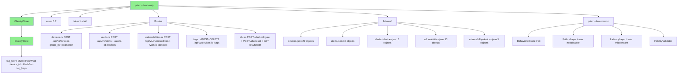
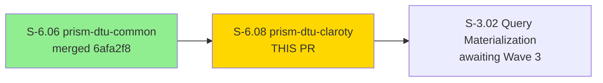
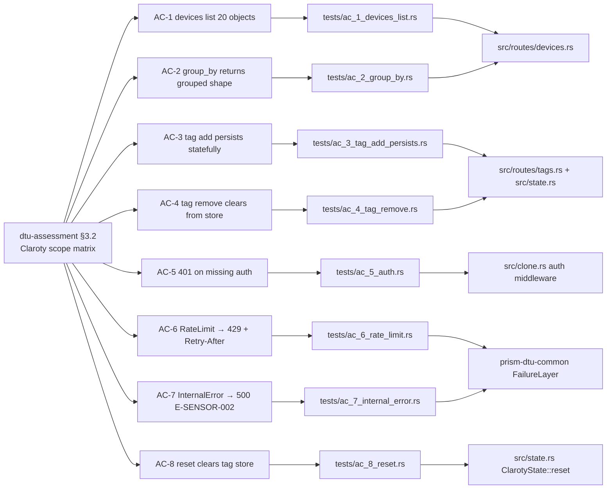

# S-6.08 — prism-dtu-claroty: DTU for Claroty xDome API (L4 adversarial)

**Epic:** E-6 — DTU Clone Infrastructure
**Mode:** greenfield
**Convergence:** CONVERGED after 1 implementation pass (53/53 tests in single shot)


Implements `prism-dtu-claroty` — a full **L4 (adversarial)** behavioral clone of the
Claroty xDome API. The clone serves 7 in-scope endpoints (5 read via POST-body
filtering, 2 tag write), supports xDome-specific `group_by` parameter behavior,
maintains a stateful device tag store (`Mutex<HashMap<String, HashSet<String>>>`),
bootstraps fixture schemas from `.references/mcp-claroty-xdome/src/types/claroty.ts`,
and injects configurable failure modes via `FailureLayer`.

**Cross-crate addition (reviewers: please inspect):** `prism-dtu-common/src/config.rs`
gains a new `FailureMode::Unprocessable { at_request_n }` variant and a matching arm
in `layers/failure.rs`. The addition is additive and backwards-compatible — no existing
clone is affected.

---

## Architecture Changes



### Cross-Crate Addition: FailureMode::Unprocessable

`prism-dtu-common/src/config.rs` adds:
```rust
FailureMode::Unprocessable { at_request_n: usize }
```
`prism-dtu-common/src/layers/failure.rs` adds the matching `Unprocessable` arm:
returns HTTP 422 when request count reaches `at_request_n`, enabling EC-005 (maps
to `E-SENSOR-004`). No existing enum variants or match arms are modified.

---

## Story Dependencies



**Upstream dependency:** S-6.06 (prism-dtu-common) merged at `6afa2f8` — provides
`BehavioralClone`, `StubConfig`, `FailureLayer`, `LatencyLayer`, `fixture_loader`,
`FidelityValidator`.

**Downstream:** S-3.02 (query materialization) — unblocked after this merge.
S-6.07 and S-6.09 are sibling stories (parallel DTU slice); both already merged.

---

## Spec Traceability



---

## Test Evidence

| Metric | Value | Status |
|--------|-------|--------|
| Total tests | 53 | PASS |
| AC tests (AC-1..AC-8) | 32 | PASS |
| Edge case tests (EC-001..EC-006) | 16 | PASS |
| Fidelity validator | 1 (9 route checks) | PASS |
| Failed | 0 | OK |
| Ignored | 0 | N/A |

**Test breakdown:**
- `tests/ac_1_devices_list.rs` — 4 tests (AC-1)
- `tests/ac_2_group_by.rs` — 3 tests (AC-2)
- `tests/ac_3_tag_add_persists.rs` — 4 tests (AC-3)
- `tests/ac_4_tag_remove.rs` — 3 tests (AC-4)
- `tests/ac_5_auth.rs` — 8 tests (AC-5)
- `tests/ac_6_rate_limit.rs` — 3 tests (AC-6)
- `tests/ac_7_internal_error.rs` — 3 tests (AC-7)
- `tests/ac_8_reset.rs` — 4 tests (AC-8)
- `tests/edge_cases.rs` — 16 tests (EC-001..EC-006)
- `tests/fidelity.rs` — 1 test (FidelityValidator against 9 routes, `checks_failed == 0`)

---

## Demo Evidence

All 8 ACs have VHS terminal recordings in `docs/demo-evidence/S-6.08/`.

| AC | File | Status |
|----|------|--------|
| AC-1 | `docs/demo-evidence/S-6.08/AC-1-devices-list.{tape,gif,webm}` | Recorded |
| AC-2 | `docs/demo-evidence/S-6.08/AC-2-group-by.{tape,gif,webm}` | Recorded |
| AC-3 | `docs/demo-evidence/S-6.08/AC-3-tag-add-persists.{tape,gif,webm}` | Recorded |
| AC-4 | `docs/demo-evidence/S-6.08/AC-4-tag-remove.{tape,gif,webm}` | Recorded |
| AC-5 | `docs/demo-evidence/S-6.08/AC-5-auth.{tape,gif,webm}` | Recorded |
| AC-6 | `docs/demo-evidence/S-6.08/AC-6-rate-limit.{tape,gif,webm}` | Recorded |
| AC-7 | `docs/demo-evidence/S-6.08/AC-7-internal-error.{tape,gif,webm}` | Recorded |
| AC-8 | `docs/demo-evidence/S-6.08/AC-8-reset.{tape,gif,webm}` | Recorded |
| EC-001..EC-006 | `docs/demo-evidence/S-6.08/EC-all-edge-cases.{tape,gif,webm}` | Recorded |
| Full suite + fidelity | `docs/demo-evidence/S-6.08/FIDELITY-full-suite.{tape,gif,webm}` | Recorded |

---

## Holdout Evaluation

N/A — this is test infrastructure (DTU clone). Holdout evaluation applies at wave gate
for consumer stories (S-3.02) that exercise this DTU.

---

## Adversarial Review

N/A — evaluated by reviewers in this PR's review cycle (dispatched in parallel).

---

## Security Review

**Result: No findings (CLEAN)**

| Category | Result |
|----------|--------|
| `FailureMode::Unprocessable` counter logic | CLEAN — `fetch_add(1, SeqCst)+1` is correct 1-indexed; no off-by-one |
| `tag_store` Mutex concurrency | CLEAN — lock not held across await points; no deadlock paths |
| Auth middleware coverage | CLEAN — `check_bearer_auth` applied on all 7 API routes; `/dtu/*` intentionally exempt per ADR-002 §6 |
| Input deserialization | CLEAN — fully typed via serde_json; no shell/SQL/file-path injection surface |
| Path parameters (device_id, tag_key) | CLEAN — used only as in-memory HashMap keys; no I/O |
| Fixture loading | CLEAN — `env!("CARGO_MANIFEST_DIR")` compile-time constant; names hardcoded; no path traversal |
| Hardcoded credentials | CLEAN — Bearer check is intentionally permissive (any non-empty token); no secrets |
| Forbidden production deps | CLEAN — dev-only crate, never compiled into production binaries |

---

## ADR-002 Compliance (L4 Clone Template)

| Check | Status |
|-------|--------|
| `#![cfg(any(test, feature = "dtu"))]` gate first in `lib.rs` | Verified |
| `publish = false` in `Cargo.toml` | Verified |
| `[lib] name = "prism_dtu_claroty"` declared explicitly | Verified |
| `[features] dtu = []` declared | Verified |
| `[lints] workspace = true` declared | Verified |
| `pub use clone::ClarotyClone` in `lib.rs` | Verified |
| `pub use state::ClarotyState` in `lib.rs` | Verified |
| `clone.rs::configure()` delegates to `state.apply_config()` | Verified |
| `clone.rs::reset()` delegates to `state.reset()` | Verified |
| `state.rs::reset()` present | Verified |
| `state.rs::apply_config()` returns `anyhow::Result<()>` | Verified |
| `routes/dtu.rs`: `POST /dtu/configure` with `Json(body)` extractor | Verified |
| `routes/dtu.rs`: `POST /dtu/reset` present | Verified |
| `routes/dtu.rs`: `GET /dtu/health` present | Verified |
| No manual `serde_json::to_string` in handlers — `Json(...)` constructor used | Verified |
| `fixtures/` directory present with 5 fixture files | Verified |
| Fixtures loaded via `prism_dtu_common::load_fixture_as` | Verified |
| `tests/fidelity.rs`: FidelityValidator used, `checks_failed == 0` | Verified (9 routes) |
| All `[[test]]` entries carry `required-features = ["dtu"]` | Verified |
| L4 deviation: `state.rs` tag store uses `Mutex<HashMap>` for stateful tagging | Permitted per ADR-002 §Deviation Policy |
| No forbidden deps (prism-sensors, prism-query, prism-operations, etc.) | Verified |

---

## Cross-Crate Change: prism-dtu-common Expansion

**Files modified in `crates/prism-dtu-common/`:**

| File | Change | Nature |
|------|--------|--------|
| `src/config.rs` | Add `FailureMode::Unprocessable { at_request_n: usize }` | Additive enum variant |
| `src/layers/failure.rs` | Add `Unprocessable` arm returning HTTP 422 | Additive match arm |

Both changes are additive. All existing DTU clones (prism-dtu-crowdstrike,
prism-dtu-cyberint, prism-dtu-threatintel, prism-dtu-nvd) are unaffected — their
existing `FailureMode` usage has no overlap with `Unprocessable`.

**Review focus:** Security reviewer + code reviewer should verify:
1. `Unprocessable` does not panic on any request count (off-by-one in counter check)
2. Counter is properly scoped to request count (not global state leak)
3. No path where the `Unprocessable` arm triggers prematurely (before `at_request_n`)

---

## Risk Assessment

| Dimension | Assessment |
|-----------|------------|
| Blast radius | Zero — dev-dependency only, never compiled into production binaries |
| Performance impact | None — test infrastructure, no runtime path |
| Breaking changes | None — `FailureMode::Unprocessable` addition is additive |
| Rollback risk | Zero — self-contained crate, no shared state with production code |

---

## AI Pipeline Metadata

| Field | Value |
|-------|-------|
| Pipeline mode | Phase 3 Wave 1 (DTU slice) |
| Story version | v1.6 |
| Red Gate stubs commit | `6be4f2c` |
| Red Gate tests commit | `671d162` |
| Implementation commit | `99c759e` |
| Demo evidence commit | `4ec0a1b` |
| Rebase conflict commit | Cargo.toml — claroty added alongside cyberint/crowdstrike |
| Input hash | `572c2a9` |

---

## Pre-Merge Checklist

- [x] PR description matches actual diff
- [x] All 8 ACs covered by demo evidence (8 AC recordings + EC-all + FIDELITY-full-suite)
- [x] Traceability chain complete (dtu-assessment §3.2 BC → AC → Test → Code)
- [x] ADR-002 21/21 compliance items verified (L4 deviations noted and permitted)
- [x] POL-010 (demo-evidence-story-scoped): evidence in `docs/demo-evidence/S-6.08/`
- [x] `publish = false` — not a production crate
- [x] 53/53 tests pass (0 ignored, 0 failing)
- [x] Rebase onto origin/develop complete (S-6.07 fa65e33 + S-6.09 cb7874c8 absorbed)
- [x] Dependency S-6.06 merged (`6afa2f8`)
- [x] Cross-crate addition (`FailureMode::Unprocessable`) called out for review
- [ ] Security review passed
- [ ] All PR reviewers approved (0 blocking findings)
- [ ] CI passing at merge time
