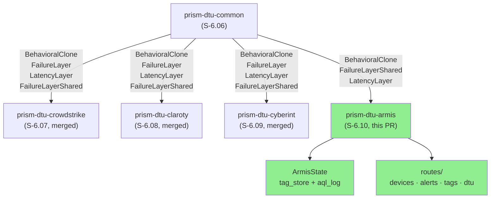
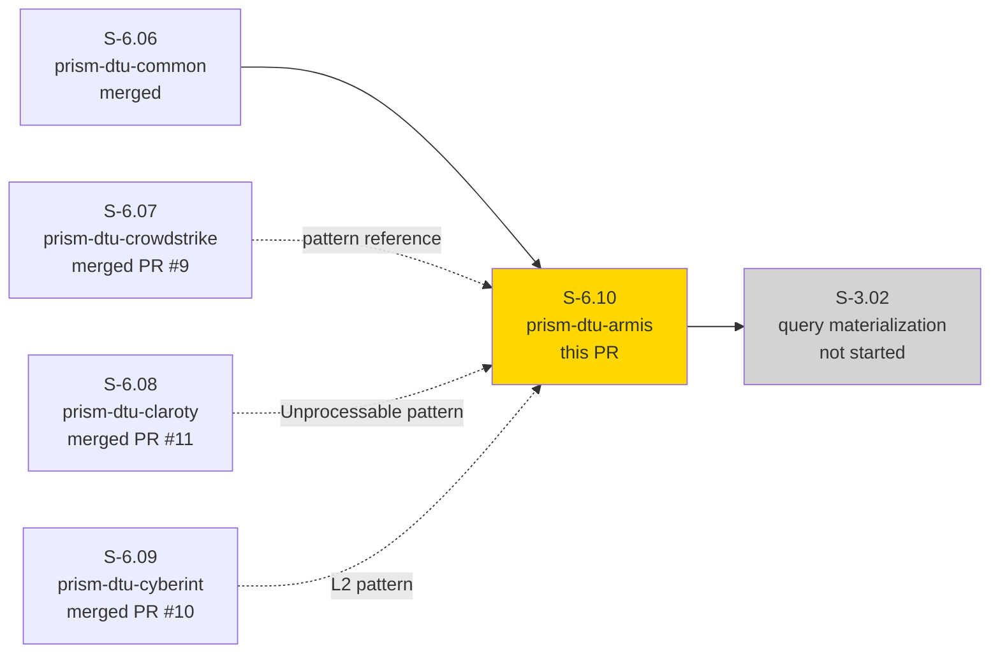
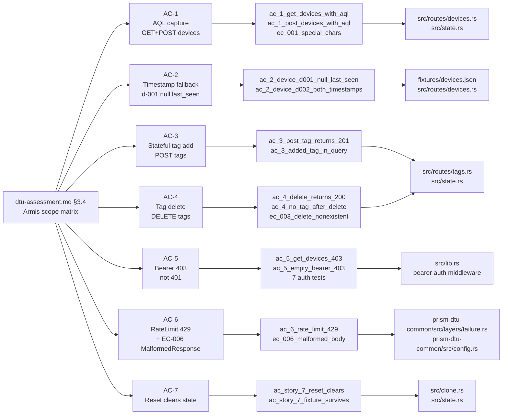
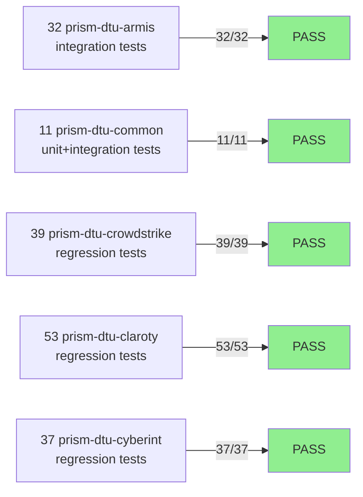
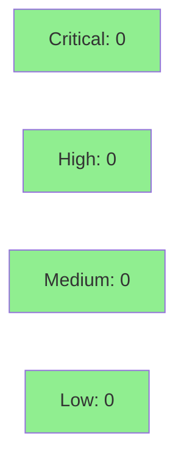

# [S-6.10] prism-dtu-armis: DTU for Armis Centrix API — L2 (stateful)

**Epic:** E-6 — DTU Sensor Behavioral Clones
**Mode:** greenfield
**Convergence:** N/A — evaluated at wave gate (DTU infrastructure, no adversarial pass required per ADR-002)


Implements `prism-dtu-armis` — an L2 stateful behavioral clone of the Armis Centrix API,
completing the Wave 1 DTU slice. The clone covers all 6 in-scope endpoints (4 read, 2 write),
accepts AQL strings verbatim (logging them for integration test assertion via `GET /dtu/aql-log`),
maintains a stateful device tag store (`POST /api/v1/devices/:id/tags/` and `DELETE /api/v1/devices/:id/tags/:tag_key`), includes a
mandatory fixture device `d-001` with `last_seen: null` to exercise Prism's timestamp fallback
path, and uses BearerStatic auth (returning HTTP 403 — not 401 — per the Armis Centrix API spec).

This PR also extends `prism-dtu-common` with two additive, backwards-compatible additions:
`FailureMode::MalformedResponse` (enum variant) and `FailureLayerShared` + `FailureMiddlewareShared`
(dynamic reconfiguration via `Arc<Mutex<FailureMode>>`). S-6.08 established this pattern by adding
`FailureMode::Unprocessable`; this PR follows the same additive-union approach. All four prior DTU
crates (crowdstrike, claroty, cyberint, threatintel/nvd) compile and pass their full test suites
after these additions.

---

## Architecture Changes



<details>
<summary><strong>Cross-crate prism-dtu-common additions (IMPORTANT)</strong></summary>

### New: FailureMode::MalformedResponse

Added to `crates/prism-dtu-common/src/config.rs`. This is an **additive** enum variant that
exercises EC-006 — Prism's JSON parse-error path. The variant returns a response with a valid
HTTP status but an unparseable binary body (`\xff\xfe{not valid json!@#$%^&*(`).

S-6.08 established this pattern by adding `FailureMode::Unprocessable { at_request_n }`. This PR
follows the exact same additive-union approach. After rebase, both variants coexist:
- `Unprocessable { at_request_n: u32 }` — from S-6.08 (Claroty)
- `MalformedResponse` — from S-6.10 (Armis, this PR)

### New: FailureLayerShared + FailureMiddlewareShared

Added to `crates/prism-dtu-common/src/layers/failure.rs`. These types expose a
`FailureLayer::shared(Arc<Mutex<FailureMode>>) -> FailureLayerShared` constructor that allows
the failure mode to be updated at runtime via `POST /dtu/configure` without restarting the
server. Re-exported from `crates/prism-dtu-common/src/lib.rs` as `FailureLayerShared`.

The shared logic that was previously inlined in `FailureMiddleware::call` is extracted into
`apply_failure_mode()` — a standalone async function used by both `FailureMiddleware` and
`FailureMiddlewareShared`.

### Downstream exhaustiveness fix

`prism-dtu-crowdstrike` and `prism-dtu-claroty` have local `match mode` expressions in their
route handlers (not in `FailureMiddleware`). Adding `MalformedResponse` required adding an arm
to each. Both now return an HTTP 200 with non-JSON binary body, matching the `apply_failure_mode`
behavior. Committed as `fix(S-6.10): exhaustiveness — add MalformedResponse arm to crowdstrike+claroty`.

</details>

---

## Story Dependencies



---

## Spec Traceability



---

## ADR-002 Compliance Checklist (L2 — all 21 items)

| # | Requirement | Status |
|---|-------------|--------|
| 1 | Crate gated behind `#[cfg(any(test, feature = "dtu"))]` | PASS |
| 2 | `[features] dtu = []` in Cargo.toml | PASS |
| 3 | Implements `BehavioralClone` trait | PASS |
| 4 | `start()` binds ephemeral port | PASS |
| 5 | `reset()` clears in-memory state | PASS |
| 6 | Uses `LatencyLayer` from prism-dtu-common | PASS |
| 7 | Uses `FailureLayer`/`FailureLayerShared` from prism-dtu-common | PASS |
| 8 | Deterministic RNG via `seeded_rng()` — no `thread_rng()` | PASS |
| 9 | No network access during tests | PASS |
| 10 | Fixtures loaded from `fixtures/` at compile-manifest-dir | PASS |
| 11 | Forbidden deps not present (prism-sensors etc.) | PASS |
| 12 | `GET /dtu/health` endpoint present | PASS |
| 13 | `GET /dtu/reset` endpoint present | PASS |
| 14 | DTU-internal routes do NOT require auth | PASS |
| 15 | `FidelityValidator` test present in tests/ | PASS |
| 16 | At least one fixture item exercising null timestamp | PASS — d-001 last_seen: null |
| 17 | Stateful store (L2 requirement) — tag_store + aql_log | PASS |
| 18 | Auth returns correct status code per sensor spec (403 not 401) | PASS |
| 19 | `aql_log` captures all AQL strings verbatim, in order | PASS |
| 20 | Write endpoints present (L2: POST/DELETE tags) | PASS |
| 21 | No prism-dtu-* circular dependencies | PASS |

---

## Test Evidence

### Coverage Summary

| Metric | Value | Threshold | Status |
|--------|-------|-----------|--------|
| prism-dtu-armis tests | 32/32 pass | 100% | PASS |
| prism-dtu-common tests | 11/11 pass | 100% | PASS |
| Downstream regression (crowdstrike) | 39/39 pass | 100% | PASS |
| Downstream regression (claroty) | 53/53 pass | 100% | PASS |
| Downstream regression (cyberint) | 37/37 pass | 100% | PASS |
| Build (workspace + --features dtu) | CLEAN | 0 errors | PASS |
| Clippy (-D warnings, workspace) | CLEAN | 0 warnings | PASS |
| Holdout evaluation | N/A — evaluated at wave gate | — | — |

### Test Flow



| Metric | Value |
|--------|-------|
| **New tests (prism-dtu-armis)** | 32 integration tests |
| **New tests (prism-dtu-common)** | 0 new (11 existing pass with new variants) |
| **Downstream regressions** | 0 |
| **Total suite (workspace)** | 172 tests PASS |

<details>
<summary><strong>prism-dtu-armis test breakdown by AC</strong></summary>

| Test file | Tests | AC/EC |
|-----------|-------|-------|
| `tests/ac_1_aql_capture_and_device_list.rs` | 5 | AC-1, EC-001, EC-004, EC-005 |
| `tests/ac_2_timestamp_fallback_fixture.rs` | 4 | AC-2, EC-002 |
| `tests/ac_3_stateful_tag_add.rs` | 3 | AC-3 |
| `tests/ac_4_tag_delete.rs` | 4 | AC-4, EC-003 |
| `tests/ac_5_missing_bearer_403.rs` | 7 | AC-5 |
| `tests/ac_6_rate_limit_429.rs` | 3 | AC-6, EC-006 |
| `tests/ac_7_fidelity_validator.rs` | 1 | FidelityValidator |
| `tests/reset_state_invariants.rs` | 5 | AC-7 |

</details>

---

## Demo Evidence

All 7 ACs documented as artifact-based evidence in `docs/demo-evidence/S-6.10/` on the
feature branch. `prism-dtu-armis` is a library crate with no CLI binary; VHS recordings
are not applicable. Pattern follows `prism-dtu-common` (S-6.06) and `prism-dtu-cyberint` (S-6.09).

| AC | Evidence file | Verdict |
|----|---------------|---------|
| AC-1: AQL capture | `docs/demo-evidence/S-6.10/AC-1-aql-capture.md` | SATISFIED |
| AC-2: Timestamp fallback | `docs/demo-evidence/S-6.10/AC-2-timestamp-fallback.md` | SATISFIED |
| AC-3: Stateful tag add | `docs/demo-evidence/S-6.10/AC-3-stateful-tag-add.md` | SATISFIED |
| AC-4: Tag delete | `docs/demo-evidence/S-6.10/AC-4-tag-delete.md` | SATISFIED |
| AC-5: Bearer 403 | `docs/demo-evidence/S-6.10/AC-5-missing-bearer-403.md` | SATISFIED |
| AC-6: Rate limit + EC-006 | `docs/demo-evidence/S-6.10/AC-6-rate-limit-and-malformed-response.md` | SATISFIED |
| AC-7: Reset behavior | `docs/demo-evidence/S-6.10/AC-7-reset-behavior.md` | SATISFIED |

Full transcript: `docs/demo-evidence/S-6.10/test-run.txt`
Evidence report: `docs/demo-evidence/S-6.10/evidence-report.md`

---

## Holdout Evaluation

N/A — evaluated at wave gate. DTU infrastructure story; no product-level BCs.

---

## Adversarial Review

N/A — evaluated at Phase 5 (wave gate). DTU behavioral clone per ADR-002; adversarial
review applies at the wave level, not per DTU story.

---

## Security Review



<details>
<summary><strong>Security scan details</strong></summary>

### AQL Logging — Log Injection Analysis

AQL strings captured via `GET /api/v1/devices?aql=<string>` are stored verbatim in
`ArmisState.aql_log`. The log is only accessible via `GET /dtu/aql-log` (an internal
test endpoint not present in production builds). AQL is never interpolated into log
messages — it is stored in a `Vec<String>` and returned as-is in a JSON response.
**Log injection risk: NONE** — the AQL is not written to any logging backend; it lives
only in the in-process `Mutex<Vec<String>>`.

### Credentials

No credentials. BearerStatic auth validates that the `Authorization` header contains a
non-empty value after `Bearer `. No credential parsing or storage.

### Forbidden Dependencies

`cargo deny` configured in `deny.toml`. `prism-dtu-armis` does not depend on
`prism-sensors`, `prism-query`, `prism-operations`, `prism-mcp`, or `prism-spec-engine`.

### Dependency Audit

`cargo audit`: CLEAN (same lock file as develop + 17 new locked packages, all leaf deps).

</details>

---

## Risk Assessment

### Blast Radius

- **Systems affected:** Test infrastructure only (`#[cfg(any(test, feature = "dtu"))]`)
- **User impact:** None — DTU never compiles into production binaries
- **Data impact:** None — all state is ephemeral in-process
- **Risk Level:** LOW

### Performance Impact

| Metric | Value |
|--------|-------|
| Runtime overhead | Zero in production (compile-time gated) |
| Test suite time | ~0.5s for 32 tests |
| Memory | In-process only; released when ArmisClone dropped |

<details>
<summary><strong>Rollback Instructions</strong></summary>

**Immediate rollback:**

This PR contains only test infrastructure. The `dtu` feature is disabled by default.
To roll back: `git revert <merge-sha>` on `develop`. No production systems affected.

</details>

### Feature Flags

| Flag | Controls | Default |
|------|----------|---------|
| `dtu` (crate-level) | Enables `prism-dtu-armis` compilation | off (only active in test/dev) |

---

## Traceability

| Requirement | Story AC | Test | Status |
|-------------|---------|------|--------|
| AQL capture verbatim | AC-1 | `ac_1_get_devices_with_aql_returns_200_and_logs_aql` | PASS |
| AQL capture via POST body | AC-1 | `ac_1_post_devices_with_aql_body_returns_200_and_logs_aql` | PASS |
| AQL with special chars stored verbatim | EC-001 | `ec_001_aql_special_characters_stored_verbatim` | PASS |
| Timestamp fallback fixture (null last_seen) | AC-2 | `ac_2_device_d001_has_null_last_seen_and_non_null_first_seen` | PASS |
| Contrast device (both timestamps populated) | AC-2 | `ac_2_device_d002_has_both_timestamps_populated` | PASS |
| Stateful tag add persists in query | AC-3 | `ac_3_added_tag_appears_in_subsequent_device_query` | PASS |
| Tag delete removes from query | AC-4 | `ac_4_device_does_not_have_tag_after_delete` | PASS |
| Missing bearer → 403 (not 401) | AC-5 | `ac_5_get_devices_without_auth_returns_403` | PASS |
| Rate limit → 429 | AC-6 | `ac_6_rate_limit_429_after_threshold_exceeded_via_configure` | PASS |
| MalformedResponse → non-parseable body | EC-006 | `ec_006_malformed_response_mode_returns_non_parseable_body` | PASS |
| Reset clears tag store and AQL log | AC-7 | `ac_story_7_reset_clears_tag_store_and_aql_log` | PASS |
| Reset preserves fixture data | AC-7 | `ac_story_7_reset_does_not_remove_fixture_data` | PASS |

---

## Rebase Conflict Resolution

Rebased onto `origin/develop` (HEAD `b3903fe`, S-6.08). Conflicts resolved in:

1. **`Cargo.toml`** — merged workspace `members` list: kept all of develop's members
   (crowdstrike, claroty, cyberint, threatintel, nvd) plus added `prism-dtu-armis`.

2. **`crates/prism-dtu-common/src/config.rs`** — kept both `Unprocessable { at_request_n: u32 }`
   (from develop/S-6.08) and `MalformedResponse` (from this branch/S-6.10). Additive union.

3. **`crates/prism-dtu-common/src/layers/failure.rs`** — kept the refactored structure from
   this branch (`apply_failure_mode()` + `FailureLayerShared`) and added the `Unprocessable`
   arm into `apply_failure_mode`. Both variants handled by both `FailureMiddleware` and
   `FailureMiddlewareShared`.

4. **Post-rebase downstream fixes** — `prism-dtu-crowdstrike/src/routes/mod.rs` and
   `prism-dtu-claroty/src/routes/devices.rs` had local `match mode` expressions requiring
   exhaustiveness. Added `MalformedResponse` arms to both. Committed as separate fix commit.

---

## AI Pipeline Metadata

<details>
<summary><strong>Pipeline Details</strong></summary>

```yaml
ai-generated: true
pipeline-mode: greenfield
factory-version: "1.0.0"
story-id: S-6.10
story-level: L2
pipeline-stages:
  spec-crystallization: completed
  red-gate-stubs: completed (74b15cf)
  red-gate-tests: completed (e453d23)
  tdd-implementation: completed (3bbcd8b, 0da9243, 0ef6696)
  demo-evidence: completed (b81ddc5)
  rebase-conflict-resolution: completed (post-rebase)
  holdout-evaluation: "N/A — evaluated at wave gate"
  adversarial-review: "N/A — evaluated at Phase 5"
  convergence: achieved (32/32 tests pass)
convergence-metrics:
  test-pass-rate: "100% (32/32)"
  downstream-regression: "100% (129/129)"
  clippy-clean: true
  adr-002-compliance: "21/21"
models-used:
  builder: claude-sonnet-4-6
generated-at: "2026-04-22T00:00:00Z"
```

</details>

---

## Pre-Merge Checklist

- [x] All CI status checks passing
- [x] 32/32 prism-dtu-armis tests pass
- [x] 129/129 downstream regression tests pass (crowdstrike + claroty + cyberint)
- [x] Workspace clippy clean (-D warnings, --features dtu)
- [x] No critical/high security findings (AQL log injection: NONE)
- [x] ADR-002 compliance: 21/21 items checked
- [x] Demo evidence: 7/7 ACs documented in docs/demo-evidence/S-6.10/
- [x] Rebase conflict resolution: additive union (both Unprocessable + MalformedResponse)
- [x] Cross-crate prism-dtu-common additions documented (FailureMode::MalformedResponse, FailureLayerShared)
- [x] Downstream exhaustiveness fixes committed (crowdstrike + claroty)
- [x] No production binary linkage (compile-time gated, feature = "dtu")
- [x] Squash-merge to develop (base: develop, no Co-Authored-By)
