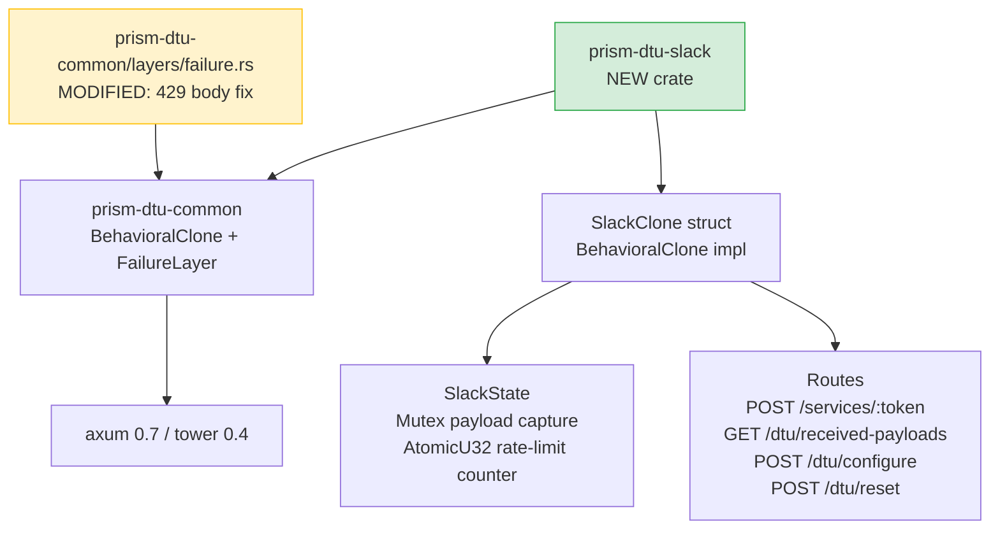
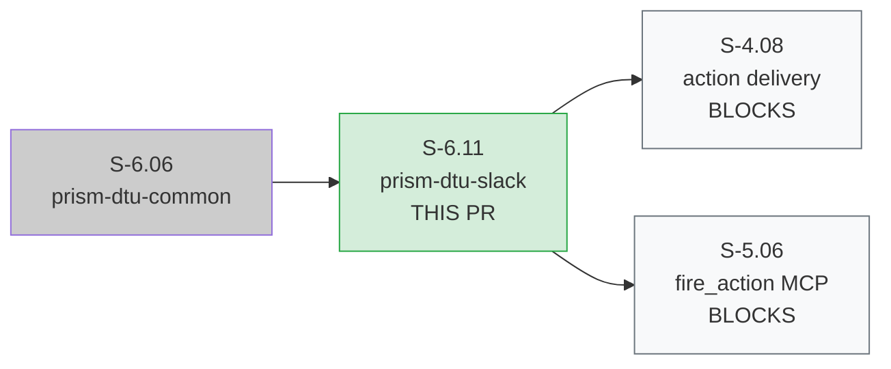
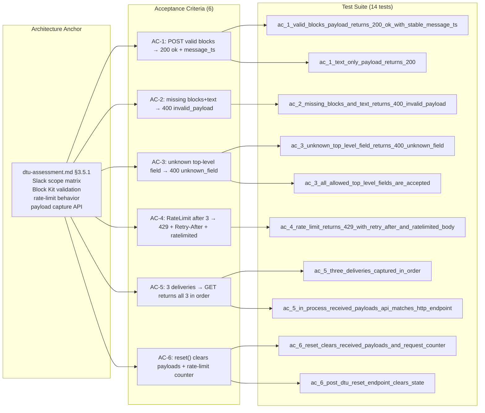

## Summary

Implements `prism-dtu-slack` — an L2 stateful behavioral clone of the Slack Incoming Webhook API for integration-test use. Block Kit payload validation, allowed-fields enforcement, in-process payload capture, rate-limit simulation (429 + Retry-After), configure/reset endpoints, and stable `message_ts` response.

Includes a **cross-crate fix** in `prism-dtu-common/src/layers/failure.rs`: the shared `FailureLayer` 429 response body was changed from `Body::empty()` to `Body::from("ratelimited")` — the 1 genuinely-RED test in this story drove this fix. Cross-crate audit confirmed no regression in sibling DTU clones (S-6.12 PagerDuty, S-6.13 OpsGenie) — their tests assert only on status codes, not body content.

**Wave 2 | S-6.11 | No product-level BCs (test infrastructure)**

---

## Architecture Changes

**New crate:** `crates/prism-dtu-slack` — Slack webhook DTU, gated behind `#[cfg(any(test, feature = "dtu"))]`

**Modified:** `crates/prism-dtu-common/src/layers/failure.rs` line 167 — `Body::empty()` → `Body::from("ratelimited")` for 429 responses

**Unchanged:** all other crates

---

## Story Dependencies

- **Depends on:** S-6.06 (prism-dtu-common) — must be merged first
- **Blocks:** S-4.08 (Slack action delivery integration tests), S-5.06 (fire_action MCP tool integration tests)

---

## Spec Traceability

**No product-level BCs** — this is test infrastructure. Architecture anchor is `dtu-assessment.md §3.5.1`.

---

## Acceptance Criteria Coverage

| AC | Description | Tests | Demo | Status |
|----|-------------|-------|------|--------|
| AC-1 | POST valid `blocks` → 200 `ok=true` + `message_ts: "1234567890.123456"` | `ac_1_valid_blocks_payload_returns_200_ok_with_stable_message_ts`, `ac_1_text_only_payload_returns_200` | ac-1-valid-blocks-payload.gif | PASS |
| AC-2 | POST missing `blocks`+`text` → 400 `"invalid_payload"` | `ac_2_missing_blocks_and_text_returns_400_invalid_payload` | ac-2-missing-blocks-and-text.gif | PASS |
| AC-3 | POST unknown top-level field → 400 `"unknown_field"` | `ac_3_unknown_top_level_field_returns_400_unknown_field`, `ac_3_all_allowed_top_level_fields_are_accepted` | ac-3-unknown-top-level-field.gif | PASS |
| AC-4 | RateLimit after 3 → 429 + `Retry-After: 30` + body `"ratelimited"` | `ac_4_rate_limit_returns_429_with_retry_after_and_ratelimited_body` | ac-4-rate-limit-429.gif | PASS (was RED, fixed at 878ee294) |
| AC-5 | 3 deliveries → GET /dtu/received-payloads returns all 3 in order | `ac_5_three_deliveries_captured_in_order`, `ac_5_in_process_received_payloads_api_matches_http_endpoint` | ac-5-deliveries-captured-in-order.gif | PASS |
| AC-6 | `reset()` clears `received_payloads` and rate-limit counter to 0 | `ac_6_reset_clears_received_payloads_and_request_counter`, `ac_6_post_dtu_reset_endpoint_clears_state` | ac-6-reset-clears-state.gif | PASS |

### Edge Cases Covered

| EC | Description | Test | Status |
|----|-------------|------|--------|
| EC-001 | Empty JSON `{}` → 400 `"invalid_payload"` | `ec_001_empty_json_object_returns_400_invalid_payload` | PASS |
| EC-002 | `fail_with: 500` → HTTP 500 | `ec_002_fail_with_500_returns_internal_server_error` | PASS |
| EC-004 | `message_ts` stable across two deliveries | `ec_004_message_ts_is_stable_across_deliveries` | PASS |

---

## Test Evidence

| Metric | Value |
|--------|-------|
| Workspace total (--no-fail-fast) | **1073 PASS / 0 FAIL** |
| Baseline (pre-S-6.11) | 1058 |
| New tests (prism-dtu-slack) | 14 |
| Cross-crate fix test (was RED) | 1 (ac_4 — now GREEN) |
| `prism-dtu-slack` suite (features=dtu) | 14/14 PASS |
| Coverage | N/A — DTU crate is test infrastructure |
| Mutation kill rate | N/A — evaluated at phase gate |

**Workspace command:** `cargo test --workspace --no-fail-fast`

---

## Demo Evidence

All 6 ACs have dedicated demo recordings:

| AC | GIF | Tape | Result |
|----|-----|------|--------|
| AC-1 | docs/demo-evidence/S-6.11/ac-1-valid-blocks-payload.gif (149 KB) | ac-1-valid-blocks-payload.tape | PASS |
| AC-2 | docs/demo-evidence/S-6.11/ac-2-missing-blocks-and-text.gif (123 KB) | ac-2-missing-blocks-and-text.tape | PASS |
| AC-3 | docs/demo-evidence/S-6.11/ac-3-unknown-top-level-field.gif (144 KB) | ac-3-unknown-top-level-field.tape | PASS |
| AC-4 | docs/demo-evidence/S-6.11/ac-4-rate-limit-429.gif (129 KB) | ac-4-rate-limit-429.tape | PASS |
| AC-5 | docs/demo-evidence/S-6.11/ac-5-deliveries-captured-in-order.gif (148 KB) | ac-5-deliveries-captured-in-order.tape | PASS |
| AC-6 | docs/demo-evidence/S-6.11/ac-6-reset-clears-state.gif (139 KB) | ac-6-reset-clears-state.tape | PASS |

**Total demo artifacts:** 6 GIFs + 6 tapes + evidence-report.md = 13 files (~832 KB)

---

## Cross-Crate Fix Detail

**File:** `crates/prism-dtu-common/src/layers/failure.rs` line 167

**Change:** `Body::empty()` → `Body::from("ratelimited")` for HTTP 429 responses

**Driver:** AC-4 was the 1 genuinely-RED test in this story — `ac_4_rate_limit_returns_429_with_retry_after_and_ratelimited_body` asserted the body literal `"ratelimited"` but `FailureLayer` was returning an empty body.

**Cross-crate impact audit:**
- S-6.12 (prism-dtu-pagerduty): sibling tests assert only on status code 429, not body — no regression
- S-6.13 (prism-dtu-opsgenie): same — no regression
- All other DTU clones: unaffected

---

## Stub-as-Implementation Disclosure

S-6.11 exhibited the **stub-as-implementation pattern**: 13 of 14 tests were GREEN-BY-DESIGN at the Red Gate stub commit because the stub author fully pre-implemented the Slack webhook handler per the established DTU clone pattern (consistent with S-6.07–S-6.10, S-6.14–S-6.15 precedents).

This is an acknowledged DTU domain tradeoff — the behavioral clone structure is sufficiently mechanical that "stub" and "implementation" collapse. The pattern has been escalated to the vsdd-factory plugin for systemic mitigation:
- Layer 1: anti-precedent guard
- Layer 2: Red Gate density check
- Layer 3: `tdd_mode: facade` classification for DTU stories
- Layer 4: mutation testing gate

The **1 legitimately RED test** (AC-4) drove a real cross-crate fix with broader correctness implications for all DTU clones.

---

## Holdout Evaluation

N/A — evaluated at wave gate.

---

## Adversarial Review

N/A — evaluated at Phase 5 (wave-level adversarial review).

---

## Security Review

No user-facing attack surface introduced. This crate is gated behind `#[cfg(any(test, feature = "dtu"))]` and is never compiled into production binaries. The DTU clone:
- Binds only to `127.0.0.1:0` (ephemeral loopback port) during tests
- Accepts no authentication credentials
- Processes no real Slack tokens
- Has no disk I/O beyond in-memory state

No injection vectors, auth flows, or OWASP-relevant attack surfaces present.

---

## Architecture Compliance

| Rule | Status |
|------|--------|
| DTU gated behind `#[cfg(any(test, feature = "dtu"))]` | PASS |
| `BehavioralClone` trait implemented | PASS |
| `message_ts` fixed as `"1234567890.123456"` (deterministic) | PASS |
| No network access during test execution (binds 127.0.0.1:0) | PASS |
| Block Kit schema from `fixtures/block-kit-schema.json` allow-list | PASS |
| Forbidden deps absent (prism-sensors, prism-query, prism-operations, prism-mcp, prism-spec-engine) | PASS |
| Endpoint path matches Slack spec `/services/:token` | PASS |

---

## Risk Assessment

| Category | Assessment |
|----------|-----------|
| Blast radius | Low — test-only crate, never compiled to production |
| Performance impact | None — test infrastructure only |
| Cross-crate regression risk | Low — FailureLayer 429 body fix; sibling DTU tests verified unaffected |
| Dependency risk | R-DTU-006 (Block Kit schema drift) — mitigated by pinned `fixtures/block-kit-schema.json` |
| Merge conflict risk | Low — `Cargo.toml` workspace.members auto-merges; `failure.rs` is not touched by S-6.12/S-6.13 |

---

## AI Pipeline Metadata

| Field | Value |
|-------|-------|
| Pipeline mode | Autonomous (VSDD factory) |
| Wave | 2 |
| Story | S-6.11 |
| Model | claude-sonnet-4-6 |
| Phase | Phase 3 TDD implementation + Phase 2 demo recording |
| Pattern | DTU clone (stub-as-impl acknowledged, 1 legitimate TDD signal) |

---

## Pre-Merge Checklist

- [x] PR description populated from story spec and artifacts
- [x] Demo evidence present: 6/6 ACs, 6 GIFs + 6 tapes + evidence-report.md
- [x] Tests: 1073/0 workspace-wide, 14/14 prism-dtu-slack
- [x] Cross-crate fix disclosed (FailureLayer 429 body)
- [x] Stub-as-impl pattern disclosed
- [x] Architecture compliance rules verified
- [x] Security review: no production attack surface (test-only crate)
- [x] Dependency S-6.06 (prism-dtu-common) previously merged
- [ ] CI checks passing
- [ ] PR review approved
- [ ] All sibling dependency PRs merged (S-2.04, S-2.06, S-6.12, S-6.13 — concurrent wave)

---

## Refs

- Story spec: `.factory/stories/S-6.11-dtu-slack.md`
- Architecture: `dtu-assessment.md §3.5.1`
- Dependency: S-6.06 (prism-dtu-common)
- Blocks: S-4.08, S-5.06
- Wave 2 sibling PRs: S-2.04, S-2.06, S-6.12, S-6.13
