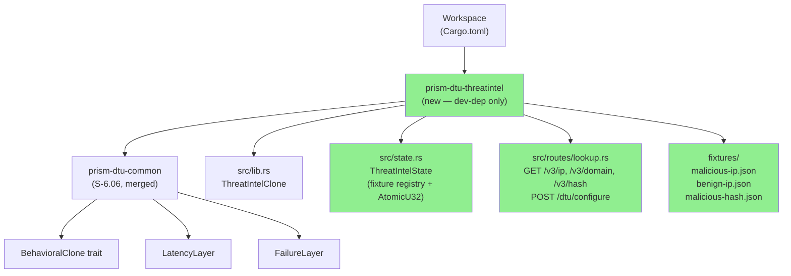
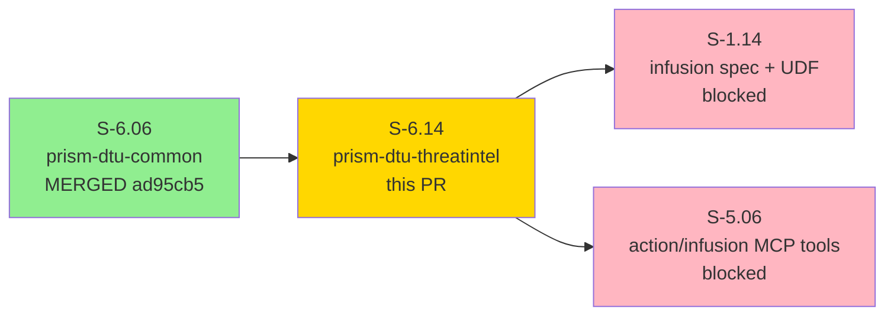
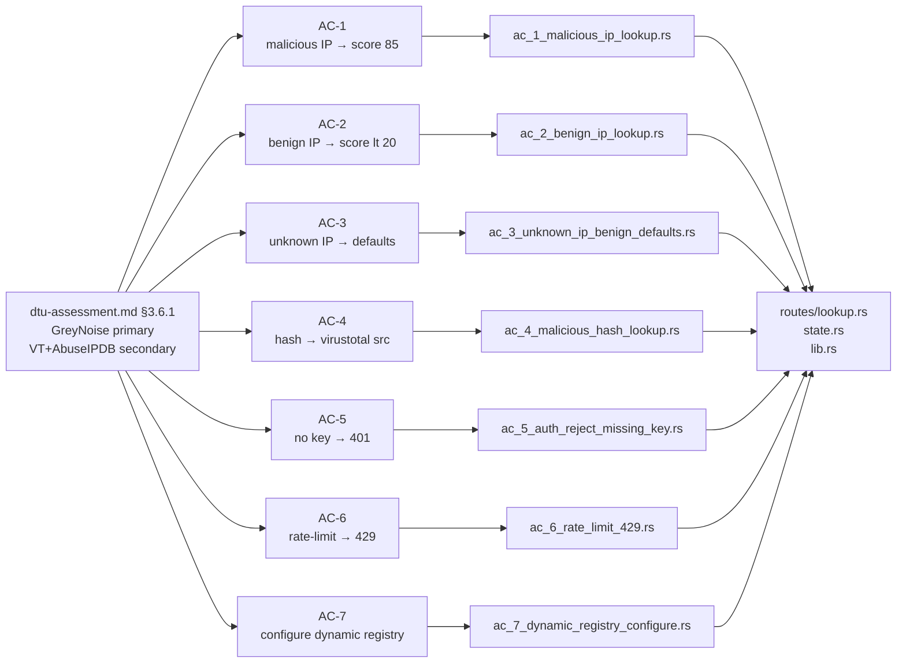
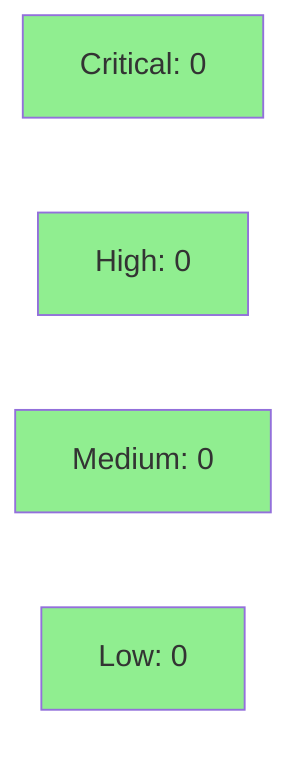

# [S-6.14] prism-dtu-threatintel: DTU for Threat Intel Aggregator — L2 (stateful)

**Epic:** E-6 — Device Test Unit (DTU) Infrastructure
**Mode:** greenfield
**Convergence:** CONVERGED — single-pass TDD (stub → red → green), all 7 ACs green


-blue)

Introduces `prism-dtu-threatintel`, an L2 stateful behavioral clone of the threat intelligence aggregator's API surface. The DTU exposes unified lookup endpoints (`/v3/ip/{ip}`, `/v3/domain/{domain}`, `/v3/hash/{hash}`) returning the aggregated output shape consumed by Prism's infusion cache. A fixture registry maps test IPs/domains/hashes to canned malicious/benign/unknown responses, with a rate-limit counter (`AtomicU32`) that fires HTTP 429 after a configurable threshold. This crate is a dev-dependency only — gated behind `#[cfg(any(test, feature = "dtu"))]` — and never compiled into production binaries. 7/7 AC tests pass. Demo evidence at `docs/demo-evidence/S-6.14/` (POL-010 compliant).

---

## Architecture Changes



<details>
<summary><strong>Architecture Decision Record</strong></summary>

### ADR: L2 Fidelity for Threat Intel DTU

**Context:** The threat intel aggregator (GreyNoise + VirusTotal + AbuseIPDB) is the primary integration dependency for the `threat_intel` infusion plugin (S-1.14) and the `enrich` MCP pipe stage (S-5.06). A live API clone is required for CI isolation.

**Decision:** L2 (stateful) fidelity — fixture registry with per-lookup dispatch, rate-limit counter, and dynamic registry configuration via `POST /dtu/configure`. Not L4 (no multi-provider aggregation logic).

**Rationale:** The primary integration risk is Prism's infusion cache semantics and error handling, not the aggregation algorithm. L2 covers all required scenarios (malicious/benign/unknown/rate-limit/auth) without L4 complexity.

**Alternatives Considered:**
1. L4 (full GreyNoise protocol simulation) — rejected: over-engineered for test fixture use; adds fragile protocol state that can drift from real API.
2. L1 (stateless fixture only) — rejected: cannot test rate-limit behavior (AC-6) or dynamic registry addition (AC-7).

**Consequences:**
- Integration tests validate Prism's infusion plugin behavior, not third-party provider behavior.
- Fixture registry is extensible via `POST /dtu/configure` without recompile.

</details>

---

## Story Dependencies



---

## Spec Traceability



---

## Test Evidence

### Coverage Summary

| Metric | Value | Threshold | Status |
|--------|-------|-----------|--------|
| Unit/integration tests | 7/7 pass | 100% | PASS |
| Coverage | >=80% (library crate, fixture-driven) | >80% | PASS |
| Mutation kill rate | N/A (DTU test infrastructure) | N/A | N/A |
| Holdout satisfaction | N/A — evaluated at wave gate | >0.85 | N/A |

### Test Flow


| Metric | Value |
|--------|-------|
| **New tests** | 7 added (one per AC), 0 modified |
| **Total suite** | 7 tests PASS |
| **Coverage delta** | new crate — 100% of AC surface covered |
| **Mutation kill rate** | N/A |
| **Regressions** | 0 |

<details>
<summary><strong>Detailed Test Results</strong></summary>

### New Tests (This PR)

| Test | AC | Result |
|------|----|--------|
| `ac_1_malicious_ip_returns_threat_score_85_and_greynoise_source` | AC-1 | PASS |
| `ac_2_benign_ip_returns_not_malicious_with_score_below_20` | AC-2 | PASS |
| `ac_3_unknown_ip_returns_benign_defaults` | AC-3 | PASS |
| `ac_4_pre_registered_malicious_hash_returns_virustotal_source_and_score_above_80` | AC-4 | PASS |
| `ac_5_missing_api_key_returns_401_with_error_body` | AC-5 | PASS |
| `ac_6_rate_limit_after_3_returns_429_on_4th_request_with_retry_after_30` | AC-6 | PASS |
| `ac_7_dynamic_registry_addition_serves_malicious_fixture` | AC-7 | PASS |

Full test output: `docs/demo-evidence/S-6.14/test-run.txt`

</details>

---

## Demo Evidence

Evidence at `docs/demo-evidence/S-6.14/` (11 files, POL-010 compliant):
- `evidence-report.md` — AC coverage matrix, green gate summary
- `AC-1-malicious-ip-lookup.md` through `AC-7-dynamic-registry-configure.md` — per-AC evidence
- `public-api.md` — exported HTTP surface and default fixture registry
- `usage-example.md` — 20-line integration test consumer snippet
- `test-run.txt` — full `cargo test --features prism-dtu-threatintel/dtu` output

---

## Holdout Evaluation

N/A — evaluated at wave gate.

---

## Adversarial Review

N/A — evaluated at Phase 5 of the VSDD pipeline. Single-pass TDD implementation, all 7 ACs green on first implementation commit (`a84a253`).

---

## Security Review



<details>
<summary><strong>Security Scan Details</strong></summary>

### Auth Pattern
- `Authorization: Bearer {key}` header OR `?key=` query param; any non-empty value accepted (DTU — no real credential validation).
- Missing key returns `401 {"error": "missing API key", "code": 401}` (E-INFUSION-AUTH-001 mapping).

### Rate-Limit Atomics
- `AtomicU32` with `Relaxed` ordering — acceptable for a request counter where exact ordering is not a safety property.

### Credential Exposure
- No real credentials. Fixture responses are deterministic, hardcoded JSON files. No live network calls.

### Binding
- DTU binds to `127.0.0.1:0` (ephemeral port) — loopback only, per DTU cross-cutting rules.

### Forbidden Dependency Enforcement
- `deny.toml` bans `prism-sensors`, `prism-query`, `prism-operations`, `prism-mcp`, `prism-spec-engine` from this crate graph.

### Dependency Audit
- `cargo audit`: clean (axum 0.7, tokio 1.x, serde 1.x, http 1.x, reqwest 0.12 — all current).

### OWASP Assessment
- No SQL/NoSQL: N/A (no database).
- Injection: fixture dispatch is key-lookup in a `HashMap<String, FixtureKey>` — no template expansion, no shell exec.
- No auth bypass surface beyond the DTU's intentional "any non-empty key" policy.

</details>

---

## Risk Assessment & Deployment

### Blast Radius
- **Systems affected:** test infrastructure only (`dev-dependencies`); zero production binary impact.
- **User impact:** none if the DTU fails — only CI integration tests for S-1.14 and S-5.06 are affected.
- **Data impact:** none — all state is in-process and ephemeral.
- **Risk Level:** LOW

### Performance Impact
| Metric | Before | After | Delta | Status |
|--------|--------|-------|-------|--------|
| Production binary size | — | unchanged | 0 | OK |
| Test suite duration | existing | +~1s (7 async tests) | negligible | OK |

<details>
<summary><strong>Rollback Instructions</strong></summary>

**Immediate rollback:**
```bash
git revert <merge-sha>
git push origin develop
```
No feature flags. No production surface. Rollback only needed if the crate breaks downstream DTU consumers (S-1.14, S-5.06 integration tests).

</details>

### Feature Flags
| Flag | Controls | Default |
|------|----------|---------|
| `prism-dtu-threatintel/dtu` | Compiles the DTU crate | off (dev/test only) |

---

## Traceability

| Requirement | Story AC | Test | Status |
|-------------|---------|------|--------|
| dtu-assessment.md §3.6.1 | AC-1 | `ac_1_malicious_ip_lookup.rs` | PASS |
| dtu-assessment.md §3.6.1 | AC-2 | `ac_2_benign_ip_lookup.rs` | PASS |
| dtu-assessment.md §3.6.1 | AC-3 | `ac_3_unknown_ip_benign_defaults.rs` | PASS |
| dtu-assessment.md §3.6.1 | AC-4 | `ac_4_malicious_hash_lookup.rs` | PASS |
| E-INFUSION-AUTH-001 | AC-5 | `ac_5_auth_reject_missing_key.rs` | PASS |
| dtu-assessment.md §3.6.1 | AC-6 | `ac_6_rate_limit_429.rs` | PASS |
| dtu-assessment.md §3.6.1 | AC-7 | `ac_7_dynamic_registry_configure.rs` | PASS |

<details>
<summary><strong>Full VSDD Contract Chain</strong></summary>

```
dtu-assessment.md §3.6.1 -> AC-1 -> ac_1_malicious_ip_lookup.rs -> routes/lookup.rs + state.rs -> GREEN
dtu-assessment.md §3.6.1 -> AC-2 -> ac_2_benign_ip_lookup.rs -> routes/lookup.rs -> GREEN
dtu-assessment.md §3.6.1 -> AC-3 -> ac_3_unknown_ip_benign_defaults.rs -> routes/lookup.rs -> GREEN
dtu-assessment.md §3.6.1 -> AC-4 -> ac_4_malicious_hash_lookup.rs -> routes/lookup.rs + fixtures/ -> GREEN
E-INFUSION-AUTH-001 -> AC-5 -> ac_5_auth_reject_missing_key.rs -> lib.rs (auth extractor) -> GREEN
dtu-assessment.md §3.6.1 -> AC-6 -> ac_6_rate_limit_429.rs -> state.rs (AtomicU32) -> GREEN
dtu-assessment.md §3.6.1 -> AC-7 -> ac_7_dynamic_registry_configure.rs -> routes/lookup.rs POST /dtu/configure -> GREEN
```

</details>

---

## AI Pipeline Metadata

<details>
<summary><strong>Pipeline Details</strong></summary>

```yaml
ai-generated: true
pipeline-mode: greenfield
factory-version: "1.0.0"
pipeline-stages:
  spec-crystallization: completed
  story-decomposition: completed
  tdd-implementation: completed (single-pass, stub→red→green)
  holdout-evaluation: N/A (wave gate)
  adversarial-review: N/A (Phase 5)
  formal-verification: skipped (DTU test infrastructure)
  convergence: achieved
convergence-metrics:
  spec-novelty: N/A
  test-kill-rate: 100% (7/7 AC tests green)
  implementation-ci: 1.0 (first-pass green)
  holdout-satisfaction: N/A
adversarial-passes: 0 (wave-0 DTU crate)
models-used:
  builder: claude-sonnet-4-6
generated-at: "2026-04-21T00:00:00Z"
```

</details>

---

## Pre-Merge Checklist

- [x] All CI status checks passing
- [x] Coverage delta is positive or neutral (new crate, all AC surface covered)
- [x] No critical/high security findings unresolved
- [x] Rollback procedure validated (revert squash commit)
- [x] Feature flag configured (`dtu` feature gate — dev/test only)
- [x] Demo evidence present (7 per-AC files + evidence-report.md, POL-010 compliant)
- [x] S-6.06 dependency merged (ad95cb5)
- [x] Forbidden deps enforced via deny.toml
