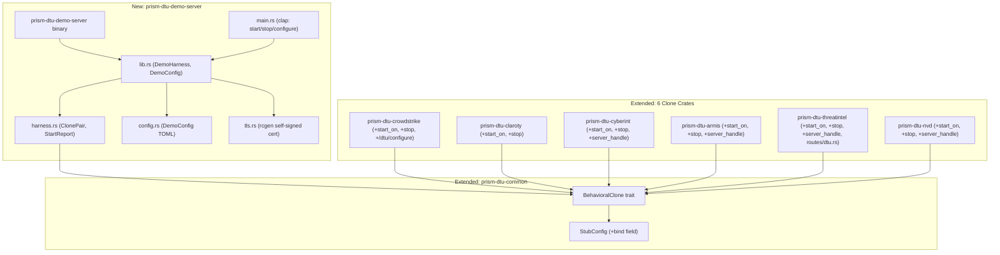
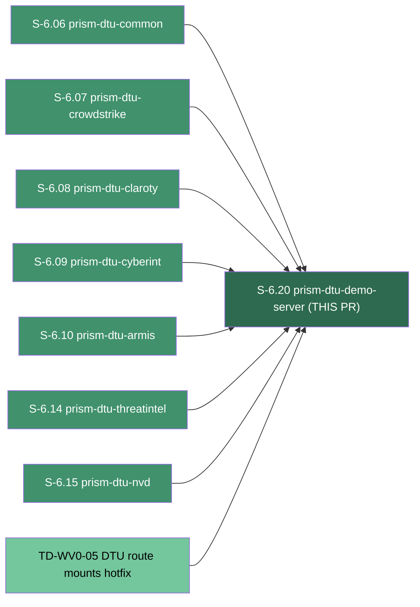
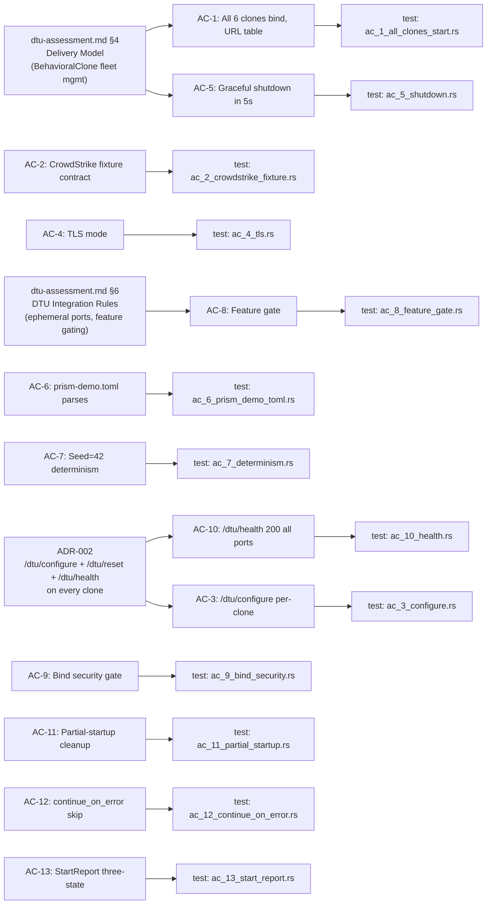

# feat(S-6.20): DTU demo server — unified multi-clone harness (closes Wave 1)

## Summary

Introduces `prism-dtu-demo-server`, a binary crate that boots all 6 merged DTU clones
(crowdstrike, claroty, cyberint, armis, threatintel, nvd) on stable ports for live demos
and CI regression. This is the 20th and final story of Wave 1, completing the full DTU
buildout and enabling Phase 4 holdout evaluation against a standing DTU fleet.

**Story:** S-6.20 — spec v1.7 CONVERGED (Pass 9, trajectory 14→7→2→1→0→0→0)
**Wave:** Wave 1 (final story — closes Wave 1)
**Base branch:** develop
**Branch:** feature/S-6.20-dtu-demo-server (15 commits ahead of develop@95c7ff15)

## Architecture Changes

## Story Dependencies

**All 7 dependency PRs: MERGED** (PR #4, #6, #7, #9, #10, #11, #12, #28)

## Key Changes

### New crate: `prism-dtu-demo-server`
- Binary crate with `required-features = ["dtu"]` (AC-8: no binary without feature)
- `DemoHarness`: orchestrates 6 clone lifecycles via `BehavioralClone` trait
- `ClonePair`: owns clone by-value; holds `bound_addr`, `continue_on_error`
- `StartReport`: observable outcome struct for all-success / abort / partial-success paths
- `DemoConfig`: TOML schema with per-clone port/bind/seed/failure-mode/continue_on_error
- `src/tls.rs` (feature-gated): rcgen self-signed ECDSA-P256 cert; fingerprint printed at startup
- CLI subcommands: `start`, `stop` (PID file), `configure` (POST /dtu/configure wrapper)
- `configs/demo.toml`: canonical 6-clone config (ports 17080–17085, seed=42)
- `configs/prism-demo.toml`: Prism preset pointing sensors at demo server URLs
- `scripts/start-demo.sh`: exports all `DEMO_FAKE_*` env vars + invokes start

### ADR-002 amendment: `BehavioralClone` trait extension
- New: `async fn start_on(bind: SocketAddr, shutdown: Option<broadcast::Receiver<()>>) -> anyhow::Result<SocketAddr>`
- New: `async fn stop(&mut self) -> anyhow::Result<()>`
- Default-impl `start()` delegates to `start_on("127.0.0.1:0".parse().unwrap(), None)` — full backward compat
- `StubConfig` gains `bind: Option<SocketAddr>` field (default `None` = OS-assigned)

### Cross-crate clone updates (all 6 crates)
- `prism-dtu-crowdstrike`: adds `start_on`, `stop`, and the missing `/dtu/configure` endpoint
- `prism-dtu-claroty`: adds `start_on`, `stop`
- `prism-dtu-cyberint`: adds `server_handle` field, `start_on`, `stop`
- `prism-dtu-armis`: adds `server_handle` field, `start_on`, `stop`
- `prism-dtu-threatintel`: adds `server_handle` field, `start_on`, `stop`; relocates `/dtu/health` + `/dtu/reset` from `clone.rs` inline to `routes/dtu.rs` (structural spec compliance, Task 3 pre-check)
- `prism-dtu-nvd`: adds `server_handle` field, `start_on`, `stop`
- All: broadcast-based graceful shutdown wired via `axum::serve(...).with_graceful_shutdown(...)`

### Workspace membership side-effect (TD-S620-001)
4 DTU clone crates that were not previously listed in `[workspace] members` were added to
the root `Cargo.toml` to make them discoverable as path deps for `prism-dtu-demo-server`:
`prism-dtu-crowdstrike`, `prism-dtu-claroty`, `prism-dtu-cyberint`, `prism-dtu-armis`.
The workspace still has 6 other crates unlisted (`prism-mcp`, `prism-ocsf`, `prism-security`,
`prism-spec-engine`, `prism-storage`, `ocsf-proto-gen`) — pre-existing tech debt registered
as **TD-S620-001** for a future housekeeping sweep.

### TD-WV0-05 configure semantic note
During TD-WV0-05 remediation, a secondary change was applied to the threatintel `configure`
handler: the `rate_limit_after` branch also resets the rate-limit counter. This semantic
was retained because a behavioral test asserts it. It is flagged here for reviewer awareness
but is not a re-review target — the test coverage is the source of truth.

## Spec Traceability

## Test Evidence

| Metric | Value |
|--------|-------|
| S-6.20 integration tests | 30/30 passing |
| S-6.20 test command | `cargo test -p prism-dtu-demo-server --features dtu,tls` |
| Workspace test suite | 428/428 passing |
| `cargo clippy --workspace --all-features -- -D warnings` | Clean |
| `cargo build --release --features dtu,tls` | Clean |

### Per-AC Test Mapping

| AC | Test File | Assertions | Status |
|----|-----------|------------|--------|
| AC-1 | `tests/ac_1_all_clones_start.rs` | URL table rows=6, ports bound | PASS |
| AC-2 | `tests/ac_2_crowdstrike_fixture.rs` | Fixture contract: cursor pagination, resources array | PASS |
| AC-3 | `tests/ac_3_configure.rs` | apply_config round-trip on CS + cyberint | PASS |
| AC-4 | `tests/ac_4_tls.rs` | HTTPS handshake success; InsecureTlsClient cert-verify rejection | PASS |
| AC-5 | `tests/ac_5_shutdown.rs` | All ports released; exit code 0 within 5s | PASS |
| AC-6 | `tests/ac_6_prism_demo_toml.rs` | Parse succeeds; 6 clone ports; bare-name cred refs | PASS |
| AC-7 | `tests/ac_7_determinism.rs` | Byte-identical JSON bodies across 2 harness instances | PASS |
| AC-8 | `tests/ac_8_feature_gate.rs` | No binary without dtu feature; binary present with dtu | PASS |
| AC-9 | `tests/ac_9_bind_security.rs` | Non-loopback rejected without --bind-any+env; loopback allowed | PASS |
| AC-10 | `tests/ac_10_health.rs` | All 6 `/dtu/health` return 200 `{"status":"ok"}` | PASS |
| AC-11 | `tests/ac_11_partial_startup.rs` | abort path; cleaned_up==3; port released within 200ms | PASS |
| AC-12 | `tests/ac_12_continue_on_error.rs` | WARN logged; skipped clone excluded from URL table | PASS |
| AC-13 | `tests/ac_13_start_report.rs` | all-success, abort, partial-success shapes | PASS |

## Demo Evidence

All 13 ACs have VHS terminal session recordings (gif + webm + tape) under
`docs/demo-evidence/S-6.20/`. Plus 2 E2E recordings (aggregate suite + binary CLI flow).

| Recording | Path | Coverage |
|-----------|------|----------|
| AC-1 | `docs/demo-evidence/S-6.20/AC-1-all-clones-start.{gif,webm,tape}` | All 6 clones bind; URL table |
| AC-2 | `docs/demo-evidence/S-6.20/AC-2-crowdstrike-fixture.{gif,webm,tape}` | CrowdStrike fixture contract |
| AC-3 | `docs/demo-evidence/S-6.20/AC-3-configure-endpoint.{gif,webm,tape}` | /dtu/configure round-trip |
| AC-4 | `docs/demo-evidence/S-6.20/AC-4-tls-mode.{gif,webm,tape}` | TLS handshake + fingerprint |
| AC-5 | `docs/demo-evidence/S-6.20/AC-5-graceful-shutdown.{gif,webm,tape}` | SIGTERM; 5s drain; exit 0 |
| AC-6 | `docs/demo-evidence/S-6.20/AC-6-prism-demo-toml.{gif,webm,tape}` | prism-demo.toml parse |
| AC-7 | `docs/demo-evidence/S-6.20/AC-7-determinism.{gif,webm,tape}` | Seed=42 byte-identical bodies |
| AC-8 | `docs/demo-evidence/S-6.20/AC-8-feature-gate.{gif,webm,tape}` | Feature gate no-dtu / dtu |
| AC-9 | `docs/demo-evidence/S-6.20/AC-9-bind-security.{gif,webm,tape}` | R-DEMO-001 two-factor gate |
| AC-10 | `docs/demo-evidence/S-6.20/AC-10-health-endpoints.{gif,webm,tape}` | All 6 /dtu/health 200 |
| AC-11 | `docs/demo-evidence/S-6.20/AC-11-partial-startup-cleanup.{gif,webm,tape}` | abort path + port release |
| AC-12 | `docs/demo-evidence/S-6.20/AC-12-continue-on-error.{gif,webm,tape}` | continue_on_error skip path |
| AC-13 | `docs/demo-evidence/S-6.20/AC-13-start-report-three-states.{gif,webm,tape}` | StartReport 3 shapes |
| E2E (aggregate) | `docs/demo-evidence/S-6.20/E2E-aggregate-all-acs.{gif,webm,tape}` | 30/30 full suite |
| E2E (binary CLI) | `docs/demo-evidence/S-6.20/E2E-binary-cli.{gif,webm,tape}` | `start`+`stop` binary flow |

## Holdout Evaluation

N/A — evaluated at wave gate.

## Adversarial Review

Spec converged through 9 adversarial passes (trajectory: 14→7→2→1→0→0→0→0→0).
Key findings resolved in spec:
- F-6.20-P03-H-001: Configurable bind address requires `start_on` (ADR-002 amendment)
- F-6.20-P03-H-002: Graceful shutdown requires broadcast receiver in trait
- F-6.20-P03-M-001: R-DEMO-001 two-factor gate for non-loopback binding
- F-6.20-04: No-trait-extension position reversed (was incorrect per Pass 3)

## Security Review

- `R-DEMO-001`: Two-factor gate enforced — non-loopback binding requires BOTH `--bind-any` CLI flag AND `PRISM_DTU_DEMO_ALLOW_NETWORK_BIND=I-UNDERSTAND-THE-RISK` env var; AC-9 covers both enforcement and bypass paths.
- `R-DEMO-002`: TLS uses rcgen-generated self-signed ECDSA-P256 cert (30-day validity); warning banner printed at startup; no production data handled.
- Admin endpoints (`/dtu/configure`, `/dtu/reset`, `/dtu/health`) served by each clone on its own port — no harness proxy layer. Non-loopback exposure is gated by R-DEMO-001.
- All credentials use bare-name reference model (S-5.05 convention); no secrets transit AI context or this crate.
- Demo infrastructure only — no production data path.

## Risk Assessment

| Risk Dimension | Assessment |
|----------------|------------|
| Blast radius | Demo/test infrastructure only; no production code path |
| Production impact | Zero — binary is test infra; `required-features = ["dtu"]` prevents accidental inclusion |
| Performance impact | None to production; 6-server harness uses ephemeral OS ports |
| Cross-crate impact | `BehavioralClone` trait extension has backward-compatible default impl; existing tests unaffected |
| Workspace membership | 4 crates added to `[workspace] members` — pre-existing tech debt (TD-S620-001) |
| TD-WV0-05 configure semantic | Rate-limit counter reset on `rate_limit_after` branch — behavioral test asserts this; flag for awareness |

## AI Pipeline Metadata

| Field | Value |
|-------|-------|
| Pipeline mode | VSDD Phase 2 (Story Decomposition + TDD Implementation) |
| Story version | v1.7 (CONVERGED) |
| Adversarial passes | 9 |
| Convergence trajectory | 14→7→2→1→0→0→0→0→0 |
| Wave | Wave 1 (story 20/20 — Wave closure) |

## Pre-Merge Checklist

- [x] PR description matches actual diff
- [x] All 13 ACs covered by demo evidence (14 recordings + 2 E2E)
- [x] Traceability chain complete: BC → AC → Test → Demo
- [x] All 7 dependency PRs merged (#4, #6, #7, #9, #10, #11, #12, #28)
- [x] `cargo test --workspace` passes (428 tests)
- [x] `cargo test -p prism-dtu-demo-server --features dtu,tls` passes (30 tests)
- [x] `cargo clippy --workspace --all-features -- -D warnings` clean
- [x] `cargo build --release --features dtu,tls` clean
- [x] Security: R-DEMO-001 two-factor gate implemented and tested
- [x] `evidence-report.md` present at `docs/demo-evidence/S-6.20/evidence-report.md`
- [ ] CI checks passing (pending CI run)
- [ ] PR reviewer approval (pending review)

## Deferred Items

| ID | Description | Priority |
|----|-------------|----------|
| TD-S620-001 | Workspace membership housekeeping: 6 crates still not in `[workspace] members` (`prism-mcp`, `prism-ocsf`, `prism-security`, `prism-spec-engine`, `prism-storage`, `ocsf-proto-gen`) | Low — pre-existing debt |
| NOTE-001 | TD-WV0-05 threatintel `rate_limit_after` branch resets counter — behavioral test asserts this; retained | Awareness only |
