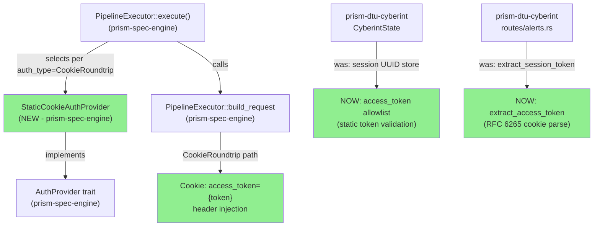
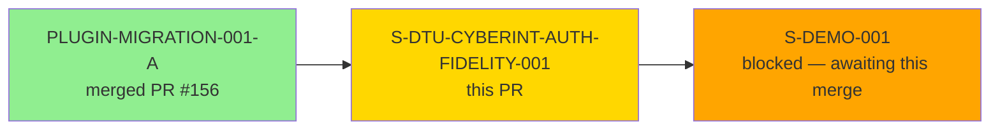
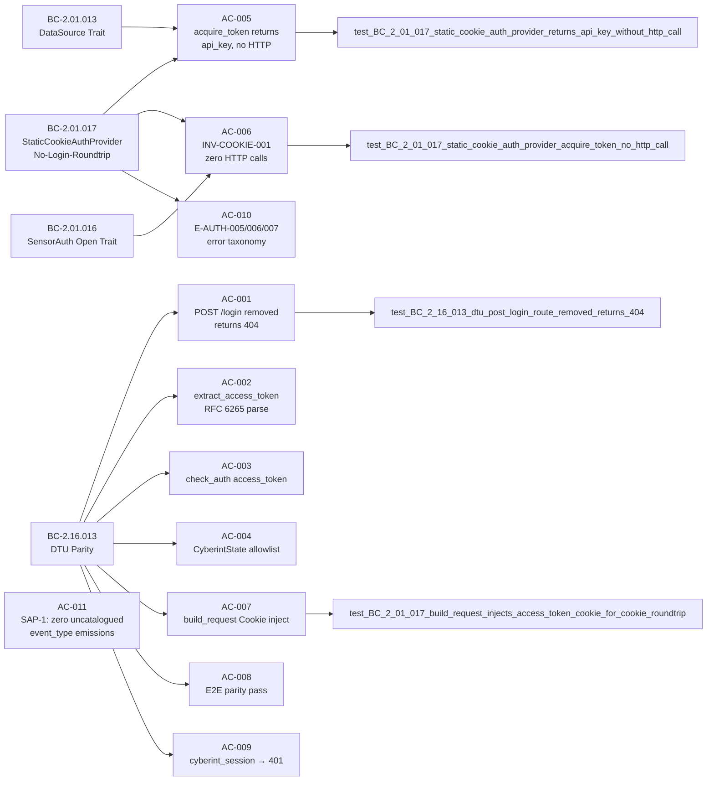

# [S-DTU-CYBERINT-AUTH-FIDELITY-001] Cyberint DTU Auth Fidelity — StaticCookieAuthProvider + access_token cookie model

**Epic:** E-DTU-FIDELITY — DTU Clone Fidelity
**Mode:** brownfield
**Convergence:** CONVERGED after 17 LOCAL adversarial passes (streak 3/3, D-881)

This PR delivers the Cyberint DTU auth fidelity correction: removes the incorrect `POST /login` route from `prism-dtu-cyberint`, rewrites session-UUID-based auth to static access_token allowlist validation, implements `StaticCookieAuthProvider` in `prism-spec-engine` (no HTTP call during `acquire_token`), and wires `PipelineExecutor::build_request` to inject `Cookie: access_token={token}` for `CookieRoundtrip` sensors. The fix is grounded in the real Cyberint API behavior from `poller-express/cookieTransport` (ADR-031). Also **bundled**: develop@72baf413 sensor-spec fidelity fixes (CrowdStrike detection_id rename + Claroty devices table/column/path + audit_log path corrections).

---

## Architecture Changes

> **Scope note — prism-bin/src/boot.rs:** The diff for `boot.rs` contains only cargo-fmt import-regrouping (no functional change). `StaticCookieAuthProvider::new()` is never called outside tests; the production boot path constructs only `PluginAuthProvider`. Cookie-roundtrip auth provider selection is delivered at the **pipeline layer** — `PipelineExecutor::execute()` selects the provider per the sensor spec's `auth_type`, and `build_request` injects the `Cookie` header — validated end-to-end by AC-007 (wiremock). Boot-time (binary `prism start`) routing of `cookie_roundtrip` sensors is out of this story's scope and deferred to S-DEMO-001 (GAP-002-A-gated); no AC claims boot-level wiring.

<strong>Architecture Decision Record — ADR-031: DTU=true-DTU Fidelity Principle</strong>

### ADR-031: DTU=true-DTU Fidelity Principle

**Context:** The Cyberint DTU clone accepted `POST /login → Set-Cookie: cyberint_session={uuid}` but the real Cyberint API uses `Cookie: access_token={api_key}` with no login step. A DTU that accepts a cookie name the real API does not use proves prism can talk to its own DTU, not that prism can talk to Cyberint.

**Decision:** DTU clones must precisely model the real third-party API authentication behavior. `prism-dtu-cyberint` removes `POST /login` and validates `access_token` cookie. `StaticCookieAuthProvider` in `prism-spec-engine` injects the correct cookie name without any HTTP login call.

**Rationale:** Pre-demo blocking requirement. A passing demo against an incorrect DTU has zero evidentiary value. ADR-031 supersedes ADR-028 §D12 which had incorrectly accepted the divergence.

**Alternatives Considered:**
1. Keep `POST /login` as a no-op stub returning 200 — rejected: no-op stub hides future misuse and misrepresents the real API surface.
2. Defer to post-demo — rejected: per user directive 2026-05-29, "the cyberint fix needs to happen pre-demo."

**Consequences:**
- All existing DTU tests that used `POST /login → cyberint_session` cookie model required full rewrite (109 tests updated).
- `StaticCookieAuthProvider` establishes the pattern for other no-login-roundtrip sensors.

---

## Story Dependencies

**Dependency satisfied:** PLUGIN-MIGRATION-001-A merged (PR #156) — AuthProvider trait surface stable.
**Blocks:** S-DEMO-001 (Cyberint auth path in AC-003/AC-009 requires corrected DTU per ADR-031 §D3-c).

---

## Spec Traceability

---

## Test Evidence

### Coverage Summary

| Metric | Value | Threshold | Status |
|--------|-------|-----------|--------|
| prism-dtu-cyberint tests (--features dtu) | 109/109 pass | 100% | PASS |
| prism-spec-engine tests | 492/492 pass | 100% | PASS |
| Red Gate tests | 7/7 pass | 7 required | PASS |
| All-crate `just check` | 3839/3839 pass | 100% | PASS |
| Mutation kill rate | N/A (not run this story) | >90% | N/A |
| Holdout satisfaction | N/A — evaluated at wave gate | >0.85 | N/A |

### Red Gate Tests (BC-5.39.001 required)

| Test Name | AC | Crate | Result |
|-----------|----|-------|--------|
| `test_BC_2_16_013_dtu_post_login_route_removed_returns_404` | AC-001 | prism-dtu-cyberint | PASS |
| `test_BC_2_01_017_dtu_extract_access_token_parses_cookie_header` | AC-002 | prism-dtu-cyberint | PASS |
| `test_BC_2_16_013_dtu_check_auth_requires_access_token_cookie_not_session` | AC-003 | prism-dtu-cyberint | PASS |
| `test_BC_2_16_013_dtu_state_access_token_allowlist_not_session_uuid` | AC-004 | prism-dtu-cyberint | PASS |
| `test_BC_2_01_017_static_cookie_auth_provider_returns_api_key_without_http_call` | AC-005 | prism-spec-engine | PASS |
| `test_BC_2_01_017_static_cookie_auth_provider_acquire_token_no_http_call` | AC-006 | prism-spec-engine | PASS |
| `test_BC_2_01_017_build_request_injects_access_token_cookie_for_cookie_roundtrip` | AC-007 | prism-spec-engine | PASS |

---

## Demo Evidence

All 11 ACs evidenced in `docs/demo-evidence/S-DTU-CYBERINT-AUTH-FIDELITY-001/` (POL-10 compliant, story-scoped subdirectory). Feature HEAD `b3aa0970`.

| AC | Evidence File | Type | Status |
|----|---------------|------|--------|
| AC-001 | AC-001-no-login-route.txt | Red Gate integration test | PASS |
| AC-002 | AC-002-extract-access-token.txt | Red Gate unit test (5 cases) | PASS |
| AC-003 | AC-003-check-auth-access-token-cookie.txt | Red Gate integration test | PASS |
| AC-004 | AC-004-state-access-token-allowlist.txt | Red Gate unit test | PASS |
| AC-005 | AC-005-static-cookie-auth-provider.txt | Red Gate integration test (MockDI) | PASS |
| AC-006 | AC-006-acquire-token-no-http-call.txt | Red Gate integration test (structural) | PASS |
| AC-007 | AC-007-build-request-cookie-injection.txt | Red Gate integration test (wiremock) | PASS |
| AC-008 | AC-008-end-to-end-parity.txt | Parity infrastructure + multi_tenant HTTP | PASS |
| AC-009 | AC-009-negative-parity-cyberint-session.txt | AC-003 negative sub-case | PASS |
| AC-010 | AC-010-error-taxonomy-compliance.txt | Unit tests (5 error path tests) | PASS |
| AC-011 | AC-011-no-uncatalogued-event-type.txt | Code analysis (grep; zero results) | PASS |

---

## Holdout Evaluation

N/A — evaluated at wave gate per prism Phase 4 protocol.

---

## Adversarial Review

### LOCAL Cascade (Phase 3 sub-workflow)

- **Total passes:** 17
- **Fix-bursts:** 11
- **Findings closed:** 25
- **Convergence:** CLEAN (strict) at pass-15, streak 3/3 completed at pass-17 (D-881)
- **Lessons codified:** 57, 58, 59, 60
- **Policy added:** POL-32 (adversary grounding-truth preamble for DTU stories)

### PR-LEVEL Cascade

To be executed during this PR cycle per BC-5.39.001 + D-779 CLEAN(PR-merge) disambiguation.

---

## Security Review

To be executed during this PR cycle via `vsdd-factory:security-reviewer`.

**Pre-identified surface areas:**
- `StaticCookieAuthProvider::acquire_token` — credential store access (AD-017: no credential in AI context)
- Cookie injection header — `Cookie: access_token={token}` — token value is `AuthToken` newtype with redacted `Debug`
- DTU `check_auth` — static allowlist validation (no session state, no session fixation attack surface)
- `OrgSlug::new_unchecked` not used in production paths (test-helpers feature gate enforced)

---

## Risk Assessment

| Category | Assessment |
|----------|-----------|
| Blast radius | prism-dtu-cyberint (DTU clone, test-only in CI) + prism-spec-engine (auth path + pipeline executor) |
| Performance impact | None — StaticCookieAuthProvider eliminates HTTP call; net improvement vs former POST /login roundtrip |
| Breaking changes | DTU API surface change: `POST /login` removed. External callers of DTU clone that used POST /login must migrate to `Cookie: access_token=` model. All existing DTU tests updated. |
| Rollback risk | Low — DTU is a test infrastructure component; main branch is not affected until squash-merge |
| Bundled changes | develop@72baf413 sensor-spec fidelity fixes flow through this PR per D-829/D-846 user bundling decision |

---

## AI Pipeline Metadata

| Field | Value |
|-------|-------|
| Pipeline mode | brownfield |
| Story version | v1.8 |
| TDD mode | strict |
| LOCAL adversary passes | 17 |
| PR-LEVEL cascade | in flight (passes 4-9 complete; FB-PR4+FB-PR5 closed; streak 0/3; passes 10-12 next on HEAD 7d05cdb7) |
| Wave | 5 |
| Push authorization | USER AUTHORIZED 2026-05-30 |

---

## Bundled Commits (develop@72baf413)

This PR includes develop commits that are locally ahead of remote develop but NOT yet pushed to remote (per D-829/D-846 user bundling decision):

- `72baf413` — fix(sensor-specs): fidelity audit fixes — CrowdStrike detection_id + Claroty devices/column/path

These sensor-spec fidelity fixes (CrowdStrike detection_id rename, Claroty devices table/column/path correction, audit_log path corrections) flow through this PR diff naturally as the feature branch is based on develop@72baf413.

---

## Pre-Merge Checklist

- [x] Story spec v1.5 complete (S-DTU-CYBERINT-AUTH-FIDELITY-001)
- [x] All 11 ACs evidenced in demo-evidence/
- [x] 7/7 Red Gate tests pass
- [x] 3839/3839 all-crate tests pass (`just check` exit 0)
- [x] LOCAL adversary cascade: 17 passes, CONVERGED 3/3 streak (D-881)
- [x] BC-2.01.017 authored (PO, b8cf19e1, draft — auto-promotes at merge per POL-14)
- [x] Feature branch HEAD: b3aa0970
- [x] Dependency PLUGIN-MIGRATION-001-A: merged PR #156
- [ ] Push to remote origin (Step 1 — in progress)
- [ ] PR created (Step 3)
- [ ] CI green (Step 6)
- [ ] PR-LEVEL adversary cascade: 3 consecutive CLEAN(PR-merge) (Step 5)
- [ ] Security review: no CRIT/HIGH findings (Step 4)
- [ ] pr-reviewer: APPROVE (Step 5)
- [ ] Squash merge (Step 8)
- [ ] POL-14 auto-promote BC-2.01.017 + BC-2.16.013 draft → active (Step 9)
- [ ] State-manager post-merge burst (Step 9)
