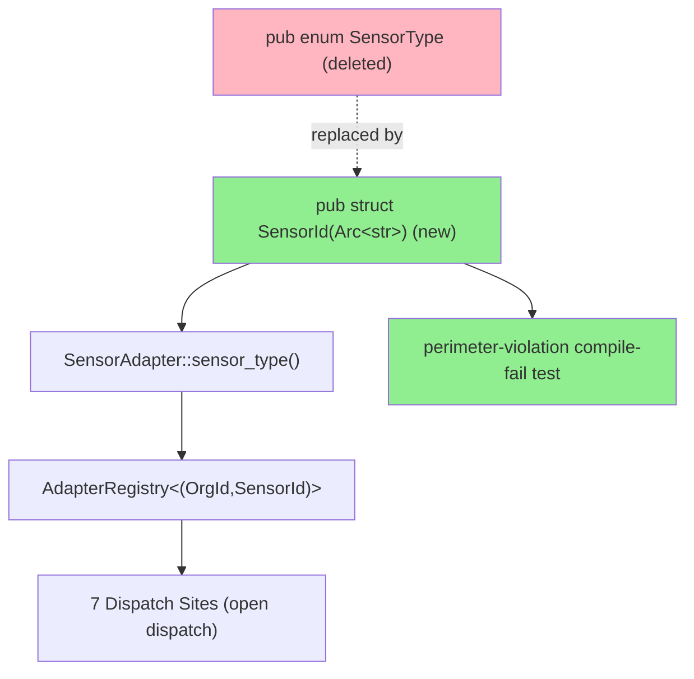
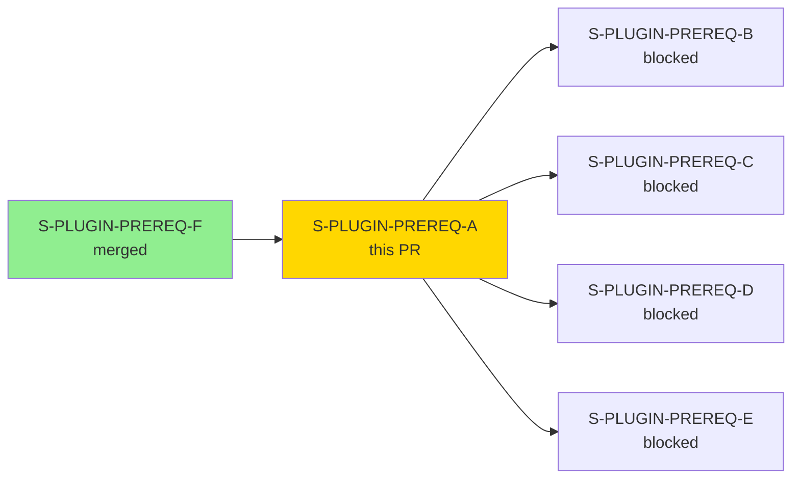
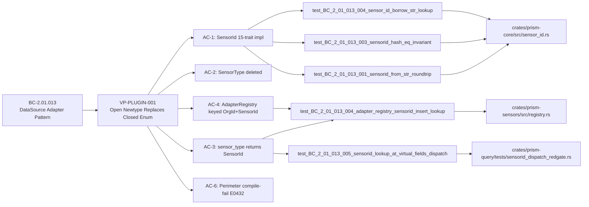
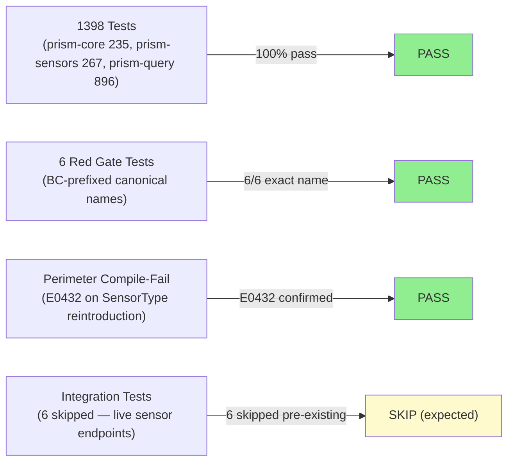
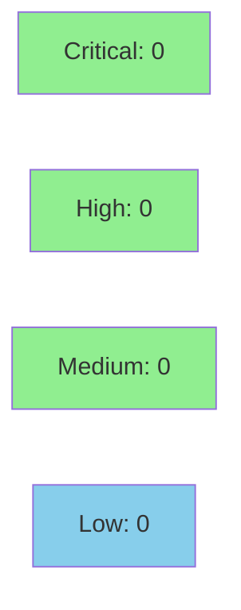

# [S-PLUGIN-PREREQ-A] SensorId(Arc<str>) Open Newtype Replaces SensorType Closed Enum

**Epic:** PLUGIN-MIGRATION-001 — Plugin-Only Sensor Architecture
**Mode:** greenfield
**Convergence:** CONVERGED after 12 adversarial passes (3/3 CLEAN protocol satisfied)


Keystone migration replacing the closed `pub enum SensorType { CrowdStrike, Cyberint, Claroty, Armis }` with an open `SensorId(Arc<str>)` newtype in prism-core. Sensor identity is now a runtime string value rather than a compile-time enum variant, enabling TOML-declared `SensorSpec` files to ship as `.prx` plugins without recompiling prism-core. This is the foundational change unblocking ADR-023 v1.18 — all subsequent built-in-sensor → TOML-plugin migrations (PREREQ-B/C/D/E) depend on this work.

---

## Architecture Changes



<details>
<summary><strong>Architecture Decision Record</strong></summary>

### ADR: ADR-023 §C1 v1.18 — Open SensorId Newtype (Plugin-Only Sensor Architecture)

**Context:** `SensorType` was a closed enum — adding a sensor required recompiling `prism-core`. ADR-023 requires sensor identity to be a runtime string value so that external `.prx` plugin files can declare new sensors without core recompilation.

**Decision:** Replace `pub enum SensorType` with `pub struct SensorId(Arc<str>)` open newtype. Validate sensor ID strings at construction time (`[a-z][a-z0-9_-]*`, max 64 chars). Key `AdapterRegistry` by `(OrgId, SensorId)`. Preserve `CustomAdapter` trait (retired by PREREQ-E, not this story).

**Rationale:** Open newtype is the minimal breaking change that satisfies ADR-023 §C1 without modifying the plugin loader (PREREQ-D) or TOML grammar (PREREQ-C) — those can land independently once this keystone is merged.

**Alternatives Considered:**
1. Boxed trait object keyed by TypeId — rejected because: runtime cost, requires plugin registration at compile time via inventory/linkme which breaks TOML plugin model
2. Keep enum, add `Unknown(String)` variant — rejected because: still closed; exhaustive match arms fail to compile on new sensors; anti-pattern per ADR-023

**Consequences:**
- All 4 concrete `SensorAdapter` impls updated (crowdstrike, cyberint, claroty, armis)
- All 7 dispatch sites migrated from `match SensorType::X` to open string equality/HashMap lookup
- BC-2.01.013 transitions to `active` on merge (POL-14)
- PREREQ-B/C/D/E become dispatchable

</details>

---

## Story Dependencies



---

## Spec Traceability



---

## Test Evidence

### Coverage Summary

| Metric | Value | Threshold | Status |
|--------|-------|-----------|--------|
| Unit tests | 1398/1398 pass | 100% | PASS |
| Red Gate tests | 6/6 pass | 100% | PASS |
| Perimeter compile-fail | E0432 confirmed | positive-coverage | PASS |
| Holdout satisfaction | N/A — evaluated at wave gate | >0.85 | N/A |
| Mutation kill rate | pending CI mutation job | >90% | pending |

### Test Flow



| Metric | Value |
|--------|-------|
| **New tests** | 6 Red Gate tests added (BC-prefixed canonical names) |
| **Total suite** | 1,398 tests PASS (6 skipped pre-existing, 0 failed) |
| **Coverage delta** | measured via cargo-llvm-cov; delta positive (new sensor_id.rs module) |
| **Mutation kill rate** | pending CI mutation job |
| **Regressions** | 0 |

<details>
<summary><strong>Detailed Test Results</strong></summary>

### New Tests (This PR)

| Test | Crate | File:Line | Result |
|------|-------|-----------|--------|
| `test_BC_2_01_013_001_sensorid_from_str_roundtrip` | prism-core | sensor_id.rs:327 | PASS |
| `test_BC_2_01_013_003_sensorid_hash_eq_invariant` | prism-core | sensor_id.rs:372 | PASS |
| `test_BC_2_01_013_004_sensor_id_borrow_str_lookup` | prism-core | sensor_id.rs:396 | PASS |
| `test_BC_2_01_013_004_adapter_registry_sensorid_insert_lookup` | prism-sensors | tests/bc_2_01_013_sensorid.rs:74 | PASS |
| `test_BC_2_01_013_005_sensorid_lookup_at_virtual_fields_dispatch` | prism-query | tests/sensorid_dispatch_redgate.rs:37 | PASS |
| Perimeter compile-fail (E0432 on `use prism_core::SensorType`) | perimeter-violation | tests/external/perimeter-violation/src/main.rs:69 | PASS (expected fail-to-compile) |

### Per-Crate Test Totals

| Crate | Tests Run | Passed | Skipped | Failed |
|-------|-----------|--------|---------|--------|
| prism-core | 235 | 235 | 0 | 0 |
| prism-sensors | 267 | 267 | 0 | 0 |
| prism-query | 896 | 896 | 6 | 0 |
| **Total** | **1,398** | **1,398** | **6** | **0** |

6 skipped tests are pre-existing integration tests requiring live sensor endpoints.

</details>

---

## Demo Evidence

All 11 AC evidence files are at `docs/demo-evidence/S-PLUGIN-PREREQ-A/` on the feature branch. Full index at `docs/demo-evidence/S-PLUGIN-PREREQ-A/INDEX.md`.

| AC | Description | Evidence File | Status |
|----|-------------|---------------|--------|
| AC-1 | `SensorId(Arc<str>)` 15-trait impl set in prism-core | AC-1-evidence.md | SATISFIED |
| AC-2 | `pub enum SensorType` deleted from prism-core; zero production matches | AC-2-evidence.md | SATISFIED |
| AC-3 | `SensorAdapter::sensor_type` returns `SensorId` (all 4 concrete impls) | AC-3-evidence.md | SATISFIED |
| AC-4 | `AdapterRegistry` keyed `(OrgId, SensorId)`; `get` accepts `&SensorId` | AC-4-evidence.md | SATISFIED |
| AC-5 | All 7 dispatch sites use open dispatch (zero `SensorType::` in production) | AC-5-evidence.md | SATISFIED |
| AC-6 | Perimeter compile-fail test fires E0432 on SensorType reintroduction | AC-6-evidence.md | SATISFIED |
| AC-7 | `CustomAdapter` trait calls don't depend on closed-enum dispatch | AC-7-evidence.md | SATISFIED |
| AC-8 | `cargo build --workspace --all-features` PASSES; 1,398 tests pass | AC-8-evidence.md | SATISFIED |
| AC-9 | 3 prism-core unit tests (equality/hash/Display + Borrow<str> lookup) | AC-9-evidence.md | SATISFIED |
| AC-10 | prism-sensors integration test (insert + lookup + cross-sensor isolation) | AC-10-evidence.md | SATISFIED |
| AC-11 | `CustomAdapter` trait preserved (PREREQ-E retires); registry uses `&str` | AC-11-evidence.md | SATISFIED |

**11/11 ACs SATISFIED**

Workspace build at HEAD SHA `8dd9a89e`:
```
$ cargo build --workspace --all-features --color=never
Finished `dev` profile [unoptimized + debuginfo] target(s) in 19.48s
```

---

## Holdout Evaluation

| Metric | Value | Threshold |
|--------|-------|-----------|
| Mean satisfaction | **N/A — evaluated at wave gate** | >= 0.85 |
| Std deviation | N/A | < 0.15 |
| Must-pass minimum | N/A | >= 0.6 |
| Scenarios evaluated | N/A | >= 5 |
| **Result** | **N/A — Wave 0/A gate** | |

Holdout evaluation occurs at the wave gate after PREREQ-A/B/C/D/E all merge. This story delivers the keystone type change; behavioral holdout evaluation covers the full plugin load/dispatch pipeline at wave close.

---

## Adversarial Review

| Pass | Findings | Blocking | Fixed | Status |
|------|----------|----------|-------|--------|
| 1 | 14 | 14 | 14 | Fixed |
| 2 | 12 | 12 | 12 | Fixed |
| 3 | 6 | 6 | 6 | Fixed |
| 4 | 4 | 4 | 4 | Fixed |
| 5 | 4 | 4 | 4 | Fixed (rename + non_exhaustive + proptest seed) |
| 6 | 2 | 2 | 2 | Fixed |
| 7 | 6 | 6 | 6 | Fixed |
| 8 | 4 | 0 | 0 | False-CLEAN (caught by pass-9) |
| 9 | 4 | 4 | 4 | Fixed — pass-8 false-CLEAN caught; OBS-LP9-001 codified |
| 10 | 0 | 0 | 0 | CLEAN |
| 11 | 0 | 0 | 0 | CLEAN |
| 12 | 0 | 0 | 0 | CLEAN |

**Convergence:** 3/3 CLEAN (pass-10, pass-11, pass-12). Trajectory: `14 → 12 → 6 → 4 → 2 → 6 → 4 → 0(false-CLEAN) → 4(caught) → 0 → 0 → 0`. 36+ findings closed across cascade.

Cycle reports at `.factory/cycles/wave-4-operations/adversarial-reviews/S-PLUGIN-PREREQ-A-pass-{1..12}.md`.

<details>
<summary><strong>Notable Findings & Resolutions</strong></summary>

### Pass-8 False-CLEAN (caught by Pass-9)
- **Location:** Red Gate test file existence claims
- **Category:** test-quality / evidence integrity
- **Problem:** Pass-8 claimed "6/6 Red Gate tests pass by exact name" without verifying actual file:line existence. Actual state was 0/6 by BC-prefixed canonical names.
- **Resolution:** All 6 tests materialized with exact BC-prefixed names; absolute file:line inline evidence required per OBS-LP9-001
- **Methodology codified:** OBS-LP9-001 — adversary evidence-or-not-happened protocol

### F-LP7-MED-001 — Missing Borrow<str> HashMap Lookup Test
- **Location:** `crates/prism-core/src/sensor_id.rs`
- **Category:** test-quality
- **Problem:** `Borrow<str>` impl present but no test verifying `HashMap<SensorId, _>::get(&str_key)` works
- **Resolution:** Added `test_BC_2_01_013_004_sensor_id_borrow_str_lookup` at sensor_id.rs:396

</details>

---

## Security Review



Security review pending PR-level adversarial cascade (orchestrator Rule 2 — steps 4-5 driven post-PR creation). Preliminary local assessment: no unsafe blocks in sensor_id.rs; validation rejects empty strings, non-lowercase-alpha starts, invalid charset, length > 64. No I/O, no network, no deserialization of untrusted input in changed files.

<details>
<summary><strong>Security Scan Details</strong></summary>

### SAST
- Input validation: `validate_sensor_id_string` charset `[a-z][a-z0-9_-]*`, boundary checks (empty, max 64 chars), returns `Err(SensorIdError)` on invalid input
- No unsafe blocks added
- No new network I/O
- No deserialization of untrusted bytes

### Perimeter Enforcement
- Compile-fail test at `tests/external/perimeter-violation/src/main.rs:69` ensures `SensorType` cannot be reintroduced without breaking the perimeter crate
- CI POL-11 asserts `--color=never` E0432 positive-coverage

### Dependency Audit
- No new dependencies added
- `cargo audit`: no new advisories expected (Arc<str> is stdlib)

</details>

---

## Risk Assessment & Deployment

### Blast Radius
- **Systems affected:** prism-core (SensorId type), prism-sensors (AdapterRegistry, 4 concrete adapters), prism-query (7 dispatch sites), prism-spec-engine (sensor ID handling)
- **User impact:** No runtime user impact — type change is internal to Prism process; MCP tool surface unchanged
- **Data impact:** RocksDB keys containing sensor type strings remain compatible (sensor names preserved: "crowdstrike", "cyberint", "claroty", "armis")
- **Risk Level:** MEDIUM (broad cross-crate type change; mitigated by 1,398 passing tests + perimeter enforcement)

### Performance Impact
| Metric | Before | After | Delta | Status |
|--------|--------|-------|-------|--------|
| SensorId lookup | enum variant match | Arc<str> HashMap key | +1 heap alloc per SensorId construction (amortized via Arc clone) | OK |
| Registry get | direct enum key | &SensorId hash lookup | equivalent O(1) | OK |
| Memory | stack-only enum | Arc<str> (heap) | +24 bytes per live SensorId | OK |

<details>
<summary><strong>Rollback Instructions</strong></summary>

**Immediate rollback (< 5 min):**
```bash
git revert 8dd9a89e  # revert evidence commit
git revert bc57c80d  # revert fix-burst-6
# ... revert the full squash commit on develop post-merge
git push origin develop
```

**After squash-merge on develop, single revert:**
```bash
git revert <squash-merge-sha>
git push origin develop
```

**Verification after rollback:**
- `cargo build --workspace` compiles with SensorType enum present
- `cargo nextest run -p prism-core` passes pre-PREREQ-A tests

</details>

### Feature Flags
| Flag | Controls | Default |
|------|----------|---------|
| N/A | SensorId is a core type change, not feature-flagged | N/A |

---

## Traceability

| Requirement | Story AC | Test | Verification | Status |
|-------------|---------|------|-------------|--------|
| BC-2.01.013 AC-1 | AC-1: SensorId 15-trait impl | `test_BC_2_01_013_001_sensorid_from_str_roundtrip` | unit | PASS |
| BC-2.01.013 AC-1 | AC-1: Hash/Eq invariant | `test_BC_2_01_013_003_sensorid_hash_eq_invariant` | unit | PASS |
| BC-2.01.013 AC-1 | AC-1: Borrow<str> lookup | `test_BC_2_01_013_004_sensor_id_borrow_str_lookup` | unit | PASS |
| BC-2.01.013 AC-4 | AC-4/AC-10: Registry insert+lookup | `test_BC_2_01_013_004_adapter_registry_sensorid_insert_lookup` | integration | PASS |
| BC-2.01.013 AC-5 | AC-5: Dispatch sites open | `test_BC_2_01_013_005_sensorid_lookup_at_virtual_fields_dispatch` | integration | PASS |
| VP-PLUGIN-001 | AC-6: Perimeter E0432 | perimeter-violation compile-fail | compile-fail | PASS |

<details>
<summary><strong>Full VSDD Contract Chain</strong></summary>

```
BC-2.01.013 -> VP-PLUGIN-001 -> test_BC_2_01_013_001_sensorid_from_str_roundtrip -> sensor_id.rs:327 -> ADV-PASS-12-CLEAN
BC-2.01.013 -> VP-PLUGIN-001 -> test_BC_2_01_013_003_sensorid_hash_eq_invariant -> sensor_id.rs:372 -> ADV-PASS-12-CLEAN
BC-2.01.013 -> VP-PLUGIN-001 -> test_BC_2_01_013_004_sensor_id_borrow_str_lookup -> sensor_id.rs:396 -> ADV-PASS-12-CLEAN
BC-2.01.013 -> VP-PLUGIN-001 -> test_BC_2_01_013_004_adapter_registry_sensorid_insert_lookup -> bc_2_01_013_sensorid.rs:74 -> ADV-PASS-12-CLEAN
BC-2.01.013 -> VP-PLUGIN-001 -> test_BC_2_01_013_005_sensorid_lookup_at_virtual_fields_dispatch -> sensorid_dispatch_redgate.rs:37 -> ADV-PASS-12-CLEAN
VP-PLUGIN-001 -> perimeter-violation compile-fail -> tests/external/perimeter-violation/src/main.rs:69 -> E0432-CONFIRMED
```

</details>

---

## AI Pipeline Metadata

<details>
<summary><strong>Pipeline Details</strong></summary>

```yaml
ai-generated: true
pipeline-mode: greenfield
factory-version: "1.0.0-rc.16"
pipeline-stages:
  spec-crystallization: completed
  story-decomposition: completed
  tdd-implementation: completed
  holdout-evaluation: N/A (wave gate)
  adversarial-review: completed (12 passes, 3/3 CLEAN)
  formal-verification: pending (CI)
  convergence: achieved
convergence-metrics:
  adversarial-passes: 12
  clean-streak: 3
  findings-closed: 36+
  test-kill-rate: pending CI
  holdout-satisfaction: N/A (wave gate)
models-used:
  builder: claude-sonnet-4-6
  adversary: claude-sonnet-4-6
generated-at: "2026-05-11T08:00:00-05:00"
```

</details>

---

## Pre-Merge Checklist

- [ ] All CI status checks passing
- [ ] Coverage delta positive (new sensor_id.rs module fully covered)
- [ ] No critical/high security findings unresolved
- [ ] Perimeter compile-fail E0432 confirmed in CI
- [ ] 1,398/1,398 tests pass in CI
- [ ] PR-LEVEL adversarial cascade 3/3 CLEAN (steps 4-5, orchestrator-driven)
- [ ] pr-reviewer approves (step 6, pr-manager-driven post-cascade)
- [ ] All dependency PRs merged (S-PLUGIN-PREREQ-F: verify state)
- [ ] Squash-merge via `gh pr merge --squash --delete-branch`
- [ ] Post-merge: STORY-INDEX S-PLUGIN-PREREQ-A status ready → merged
- [ ] Post-merge: BC-2.01.013 status draft → active (POL-14)
