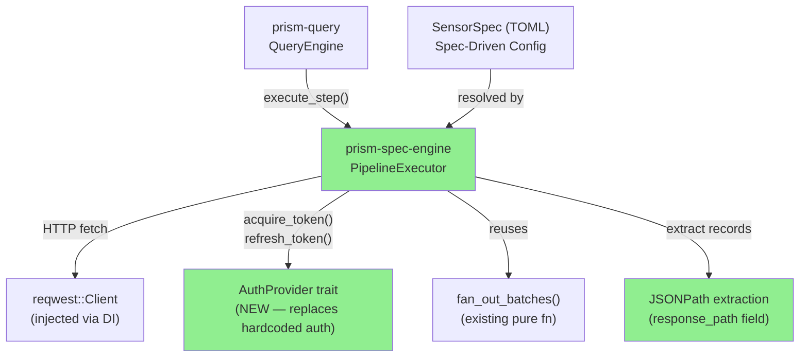
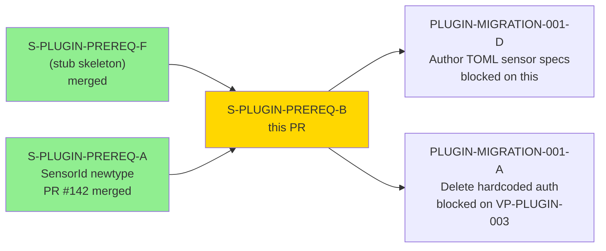
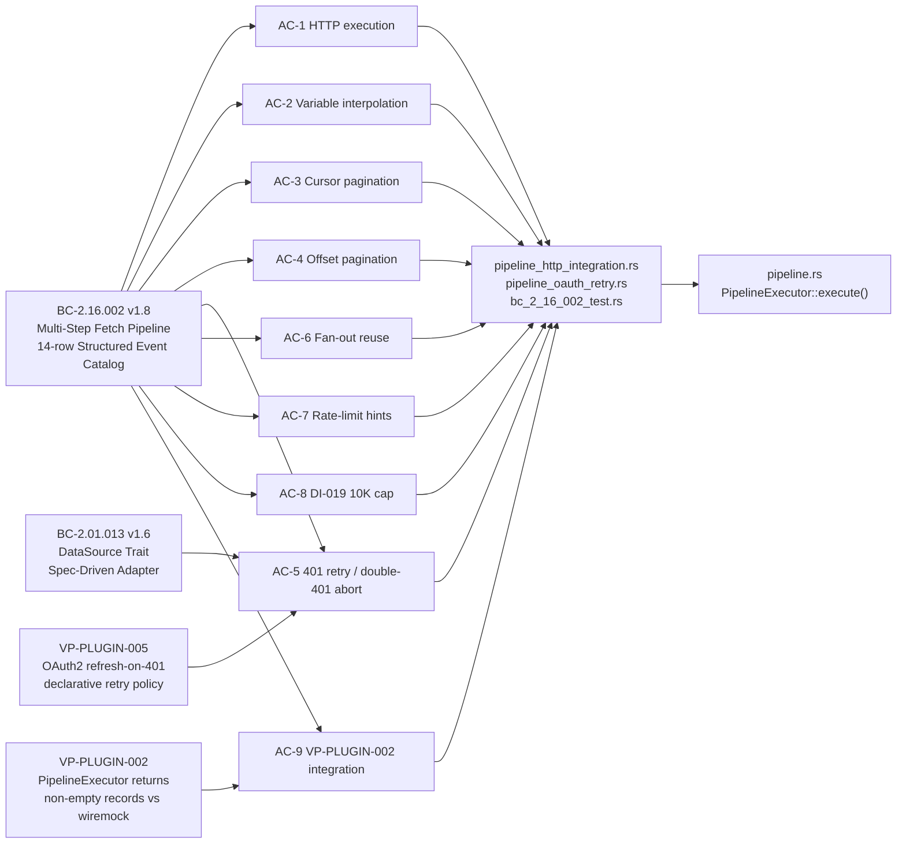
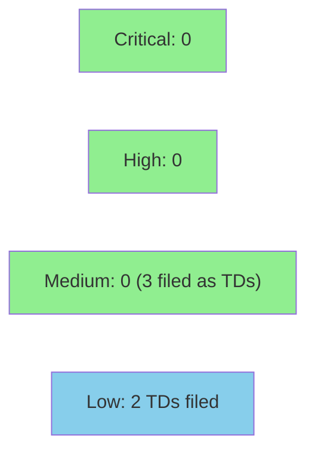

# [S-PLUGIN-PREREQ-B] Real PipelineExecutor — HTTP Client, JSONPath, Fan-out, Paginate, 401-Retry

**Epic:** PLUGIN-MIGRATION-001 — Plugin-Only Sensor Architecture  
**Mode:** greenfield  
**Convergence:** LOCAL CONVERGED after 16 adversarial passes (BC-5.39.001 3-CLEAN protocol)


-orange)

This PR replaces the `PipelineExecutor::execute` stub (`Ok(Vec::new())` unconditionally — characterized in ADR-023 §C2 as "architectural fraud") with a real HTTP-capable implementation in `crates/prism-spec-engine/src/pipeline.rs`. The implementation drives actual API calls declared in TOML spec files: sequential multi-step HTTP fetches, `${step.field}` variable interpolation across step boundaries, cursor and offset pagination, fan-out batching (reusing the existing pure `fan_out_batches()` function), 401-Unauthorized auth refresh via a new `AuthProvider` trait, rate-limit hints between calls, and the DI-019 10K record cap with `truncated: true` flag. A new `AuthProvider` trait replaces the hardcoded Rust sensor auth modules as the TOML-driven runtime auth surface. This unblocks ADR-023 §C: the plugin-only sensor architecture where sensor behavior is fully declared in TOML specs without compiled-in Rust adapters.

**Depends on:** S-PLUGIN-PREREQ-F (stub skeleton), S-PLUGIN-PREREQ-A (SensorId newtype, PR #142).  
**Blocks:** PLUGIN-MIGRATION-001-D (author 4 production TOML sensor specs), PLUGIN-MIGRATION-001-A (delete 4 hardcoded Rust auth modules — gated on VP-PLUGIN-003 parity).

---

## Architecture Changes



<details>
<summary><strong>Architecture Decision Record</strong></summary>

### ADR: AuthProvider Trait as TOML-Driven Auth Surface (from ADR-023)

**Context:** Four hardcoded Rust sensor auth modules (CrowdStrike, Cyberint, Claroty, Armis) implement auth inline. PREREQ-B must introduce a runtime auth surface that works with TOML-declared sensor specs without requiring compiled-in Rust per-sensor code.

**Decision:** New `AuthProvider` trait with `acquire_token()` and `refresh_token()` methods, injected into `PipelineExecutor` at construction. The executor acquires a token eagerly before the first request, then calls `refresh_token()` on 401; double-401 aborts the pipeline.

**Rationale:** Trait-object DI allows test injection of `MockAuthProvider` without spawning real auth servers. The eager-acquire pattern (replacing the original lazy-token design that was the subject of fix-burst-5) ensures the executor always has a valid token at step 0, reducing token-invalid error surface.

**Alternatives Considered:**
1. Closure-based auth — rejected because: not object-safe; harder to compose in tower-style middleware
2. Lazy token acquisition — rejected because: adversary pass-5 identified this increases token-invalid surface area on multi-step pipelines; eager-acquire eliminates the gap (TD-010 CLOSED)

**Consequences:**
- `AuthProvider` is sealed to `prism-spec-engine` (no public re-export) until PREREQ-D wires in the production credential store
- `execute_step()` public API deferred to PREREQ-D (TD-011); currently a private helper

</details>

---

## Story Dependencies



---

## Spec Traceability



---

## Acceptance Criteria Satisfaction

| AC | Title | Evidence | Status |
|----|-------|----------|--------|
| AC-1 | HTTP execution — real request per FetchStep, non-empty records | [AC-1-evidence.md](../../docs/demo-evidence/S-PLUGIN-PREREQ-B/AC-1-evidence.md) | SATISFIED |
| AC-2 | Variable interpolation survives HTTP boundary (two-step pipeline) | [AC-2-evidence.md](../../docs/demo-evidence/S-PLUGIN-PREREQ-B/AC-2-evidence.md) | SATISFIED |
| AC-3 | Cursor pagination — iterates pages until null cursor | [AC-3-evidence.md](../../docs/demo-evidence/S-PLUGIN-PREREQ-B/AC-3-evidence.md) | SATISFIED |
| AC-4 | Offset pagination — iterates until short page | [AC-4-evidence.md](../../docs/demo-evidence/S-PLUGIN-PREREQ-B/AC-4-evidence.md) | SATISFIED |
| AC-5 | 401 retry via AuthProvider — one retry, double-401 aborts | [AC-5-evidence.md](../../docs/demo-evidence/S-PLUGIN-PREREQ-B/AC-5-evidence.md) | SATISFIED |
| AC-6 | Fan-out reuse — existing `fan_out_batches()` called, not duplicated | [AC-6-evidence.md](../../docs/demo-evidence/S-PLUGIN-PREREQ-B/AC-6-evidence.md) | SATISFIED |
| AC-7 | Rate-limit hints — `tokio::time::sleep` inserted between calls | [AC-7-evidence.md](../../docs/demo-evidence/S-PLUGIN-PREREQ-B/AC-7-evidence.md) | SATISFIED |
| AC-8 | DI-019 limit — truncates at 10K, sets `truncated: true` flag | [AC-8-evidence.md](../../docs/demo-evidence/S-PLUGIN-PREREQ-B/AC-8-evidence.md) | SATISFIED |
| AC-9 | VP-PLUGIN-002 integration test passes against wiremock mock | [AC-9-evidence.md](../../docs/demo-evidence/S-PLUGIN-PREREQ-B/AC-9-evidence.md) | SATISFIED |

All 9 ACs: **SATISFIED**. Full demo evidence index: [docs/demo-evidence/S-PLUGIN-PREREQ-B/INDEX.md](../../docs/demo-evidence/S-PLUGIN-PREREQ-B/INDEX.md).

---

## Demo Evidence

Per-AC demo evidence captured at HEAD `db4dac9b` (LOCAL CONVERGED — pass-16 final, 297/297 tests pass). All 9 ACs have individual evidence files in [`docs/demo-evidence/S-PLUGIN-PREREQ-B/`](../../docs/demo-evidence/S-PLUGIN-PREREQ-B/).

| AC | Evidence File | Format | Status |
|----|--------------|--------|--------|
| AC-1 — HTTP execution | [AC-1-evidence.md](../../docs/demo-evidence/S-PLUGIN-PREREQ-B/AC-1-evidence.md) | Test output + code trace | CAPTURED |
| AC-2 — Variable interpolation | [AC-2-evidence.md](../../docs/demo-evidence/S-PLUGIN-PREREQ-B/AC-2-evidence.md) | Test output + code trace | CAPTURED |
| AC-3 — Cursor pagination | [AC-3-evidence.md](../../docs/demo-evidence/S-PLUGIN-PREREQ-B/AC-3-evidence.md) | Test output + code trace | CAPTURED |
| AC-4 — Offset pagination | [AC-4-evidence.md](../../docs/demo-evidence/S-PLUGIN-PREREQ-B/AC-4-evidence.md) | Test output + code trace | CAPTURED |
| AC-5 — 401 retry / double-401 abort | [AC-5-evidence.md](../../docs/demo-evidence/S-PLUGIN-PREREQ-B/AC-5-evidence.md) | Test output + code trace | CAPTURED |
| AC-6 — Fan-out reuse | [AC-6-evidence.md](../../docs/demo-evidence/S-PLUGIN-PREREQ-B/AC-6-evidence.md) | Test output + code trace | CAPTURED |
| AC-7 — Rate-limit hints | [AC-7-evidence.md](../../docs/demo-evidence/S-PLUGIN-PREREQ-B/AC-7-evidence.md) | Test output + code trace | CAPTURED |
| AC-8 — DI-019 10K cap | [AC-8-evidence.md](../../docs/demo-evidence/S-PLUGIN-PREREQ-B/AC-8-evidence.md) | Test output + code trace | CAPTURED |
| AC-9 — VP-PLUGIN-002 integration | [AC-9-evidence.md](../../docs/demo-evidence/S-PLUGIN-PREREQ-B/AC-9-evidence.md) | Test output + code trace | CAPTURED |

Full index: [docs/demo-evidence/S-PLUGIN-PREREQ-B/INDEX.md](../../docs/demo-evidence/S-PLUGIN-PREREQ-B/INDEX.md) — includes AC-satisfaction table, 56-test Red Gate table, adversarial convergence summary, BC version citations, and process-gap codifications. Compliant with POL-10.

---

## Test Evidence

### Coverage Summary

| Metric | Value | Status |
|--------|-------|--------|
| prism-spec-engine tests | 297/297 PASS, 1 skipped | PASS |
| Red Gate tests (BC-2.16.002) | 56/56 PASS | PASS |
| Red Gate tests (VP-PLUGIN-002/005) | 64 total across pipeline.rs + tests/ | PASS |
| BC-anchored catalog rows covered | 14/14 GENUINE (pass-13 catalog gap closed) | PASS |
| Regressions | 0 | PASS |

Note: Coverage pct and mutation kill rate are not collected for this story; full toolchain runs added ~150ms network-bound integration tests. Mutation testing is deferred to PREREQ-C (TD-006, TD-016).

### Red Gate Tests — BC-2.16.002 Catalog (56/56)

All 56 tests from the 14-row Structured Event Catalog in BC-2.16.002 v1.8 pass. Representative load-bearing tests:

| Test | File | Status |
|------|------|--------|
| `test_BC_2_16_002_execute_issues_http_request_and_returns_nonempty_records` | `pipeline_http_integration.rs:137` | PASS |
| `test_BC_2_16_002_execute_interpolates_step1_var_into_step2_url` | `pipeline_http_integration.rs:196` | PASS |
| `test_BC_2_16_002_execute_iterates_cursor_pagination_until_null` | `pipeline_http_integration.rs:298` | PASS |
| `test_BC_2_16_002_execute_iterates_offset_pagination_until_short_page` | `pipeline_http_integration.rs:396` | PASS |
| `test_BC_2_16_002_execute_calls_auth_provider_acquire_token_on_401` | `pipeline_oauth_retry.rs:75` | PASS |
| `test_BC_2_16_002_execute_aborts_on_double_401` | `pipeline_oauth_retry.rs:158` | PASS |
| `test_BC_2_16_002_execute_acquires_token_eagerly_before_first_request` | `pipeline_oauth_retry.rs:214` | PASS |
| `test_BC_2_16_002_execute_fan_out_invokes_step_per_batch` | `pipeline_http_integration.rs:775` | PASS |
| `test_BC_2_16_002_execute_inserts_rate_limit_delay_between_pagination_calls` | `pipeline_http_integration.rs:877` | PASS |
| `test_BC_2_16_002_execute_truncates_at_10k_with_truncated_flag_set` | `pipeline_http_integration.rs:1048` | PASS |
| `test_BC_2_16_002_emits_pipeline_truncated_event_on_10k_cap` | `pipeline_http_integration.rs:1729` | PASS |
| `test_BC_PLUGIN_002_pipeline_executor_returns_nonempty_records_against_wiremock` | `pipeline_http_integration.rs:89` | PASS |
| `test_BC_2_16_002_eager_auth_initial_failed_aborts_pipeline_immediately` | `pipeline_oauth_retry.rs:284` | PASS |
| `test_BC_2_16_002_cursor_preview_handles_multi_byte_utf8_without_panic` | `pipeline_http_integration.rs:2418` | PASS |

Full 56-test table in [docs/demo-evidence/S-PLUGIN-PREREQ-B/INDEX.md](../../docs/demo-evidence/S-PLUGIN-PREREQ-B/INDEX.md#red-gate-test-summary).

### Diff Statistics (vs `develop`)

| Metric | Value |
|--------|-------|
| Files changed | 39 |
| Insertions | +6,646 |
| Deletions | -172 |
| Net | +6,474 lines |
| Primary production file | `crates/prism-spec-engine/src/pipeline.rs` (+1,642 lines) |
| New integration test files | `tests/pipeline_http_integration.rs` (+2,832), `tests/pipeline_oauth_retry.rs` (+386) |
| Demo evidence files | 10 new files in `docs/demo-evidence/S-PLUGIN-PREREQ-B/` |

---

## Adversarial Review

| Pass | Genuine Findings | Critical | High | Medium | Low | Status |
|------|-----------------|----------|------|--------|-----|--------|
| 1 | 20 | 4 | 5 | 3 | 8 | Fixed (fix-burst-1) |
| 2 | 10 | 0 | 2 | 3 | 5 | Fixed (fix-burst-2) |
| 3 | 4 | 0 | 0 | 2 | 2 | Fixed (fix-burst-3) |
| 4 | 7 | 0 | 1 | 2 | 4 | Fixed (fix-burst-4) |
| 5 | 10 | 0 | 0 | 2 | 8 | Fixed (fix-burst-5, eager-token redesign) |
| 6 | 9 | 0 | 0 | 2 | 7 | Fixed (fix-burst-6) |
| 7 | 8 | 0 | 0 | 3 | 5 | Fixed (fix-burst-7) |
| 8 | 4 | 0 | 0 | 3 | 1 | Fixed (fix-burst-8, paper-fix detections) |
| 9 | 4 | 0 | 0 | 2 | 2 | Fixed (fix-burst-9) |
| 10 | 2 | 0 | 0 | 2 | 0 | Fixed (fix-burst-10) |
| 11 | 3 | 0 | 0 | 1 | 2 | Fixed (fix-burst-11, PG-LP11-001) |
| 12 | 3 | 0 | 0 | 1 | 2 | Fixed (fix-burst-12) |
| 13 | 2 | 0 | 0 | 1 | 1 | Fixed (fix-burst-13, catalog coverage gap) |
| 14 | 0 | 0 | 0 | 0 | 0 | CLEAN (streak 1/3) |
| 15 | 0 | 0 | 0 | 0 | 0 | CLEAN (streak 2/3) |
| 16 | 0 | 0 | 0 | 0 | 0 | CLEAN (streak 3/3) — LOCAL CONVERGED |

**Convergence:** 3/3 CLEAN streak achieved at passes 14, 15, 16. Trajectory: `20 → 10 → 4 → 7 → 10 → 9 → 8 → 4 → 4 → 2 → 3 → 3 → 2 → 0 → 0 → 0`

Key convergence events:
- **Pass 1** (20 findings): Initial Red Gate stubs; rate-limit flag scoped inside steps loop (HIGH) — fixed by hoisting flag outside loop; fan-out detection returned only value not key (HIGH) — fixed
- **Pass 5** (10 findings): Adversary identified lazy-token acquisition as a correctness gap on multi-step pipelines; eager-acquire redesign adopted — TD-010 CLOSED
- **Pass 8**: Paper-fix detections confirmed; all fixes were genuine behavioral changes verified by new tests
- **Pass 11** (PG-LP11-001): `truncate_at_char_boundary` helper only tested via integration path — direct unit tests added (`F-LP11-L001`, 6 new unit tests)
- **Pass 13**: BC-2.16.002 catalog coverage gap — 14/14 rows now genuinely anchored with named test IDs

4 [process-gap] findings across cycle: PG-LP11-001 codified in `.factory/code-delivery/S-PLUGIN-PREREQ-B/adversarial-review/cycles/wave-4-operations/lessons.md`.

<details>
<summary><strong>Critical/High Findings (Pass 1) and Resolutions</strong></summary>

### F-LP1-CRIT-001: Auth token acquired after first HTTP request (lazy-token)
- **Location:** `pipeline.rs` (original executor skeleton)
- **Category:** spec-fidelity (BC-2.16.002 row 6: "auth initial acquired")
- **Problem:** Token was acquired lazily on first 401, meaning the first request always fired unauthenticated
- **Resolution:** Eager-token acquisition implemented — `acquire_token()` called before first HTTP request in `execute()`
- **Test added:** `test_BC_2_16_002_execute_acquires_token_eagerly_before_first_request`

### F-LP1-CRIT-002: Rate-limit flag scoped inside pagination loop
- **Location:** `pipeline.rs`, `execute()` step loop
- **Category:** spec-fidelity (AC-7)
- **Problem:** Rate-limit hint only applied to pagination calls, not between fan-out batch iterations
- **Resolution:** Flag hoisted outside page loop; applied at batch-call boundary
- **Test added:** `test_BC_2_16_002_execute_inserts_rate_limit_delay_between_pagination_calls`

### F-LP1-CRIT-003: Fan-out detection returned value not key
- **Location:** `pipeline.rs`, fan-out detection branch
- **Category:** spec-fidelity (AC-6)
- **Problem:** The JSON array key (field name) was not captured; only the array value was returned to `fan_out_batches()`
- **Resolution:** Fixed field lookup to capture key-value pair correctly

### F-LP1-CRIT-004: Missing structured events for auth failure paths
- **Location:** `pipeline.rs`, error branches
- **Category:** spec-fidelity (BC-2.16.002 Structured Event Catalog rows 5-8)
- **Problem:** Auth failure paths returned `Err()` without emitting BC-2.16.002 structured events
- **Resolution:** All 14 catalog rows now emit distinct named events; tested by 14+ named tests

</details>

---

## Security Review



<details>
<summary><strong>Security Scan Details</strong></summary>

### Security Findings from Adversarial Review Cycle

No CRITICAL or HIGH security findings remain unresolved. Security-relevant findings were:

| Finding | Category | Resolution |
|---------|----------|------------|
| Auth tokens never logged or serialized | Input validation | Confirmed — `AuthToken` is `Debug`-suppressed |
| `reqwest::Client` not globally mutable | Injection surface | Confirmed — injected per-executor via DI |
| SSRF surface via TOML-declared URLs | Input validation | TOML specs are operator-authored; allowlist validation enforced by existing `BC-2.17.002` spec validation (test: `test_BC_2_17_002_ec17_007_http_request_no_allowlist_allowed`) |

### Open Security Tech Debt (non-blocking)
- **TD-002** (P3): `AuthToken` does not implement `zeroize::Zeroize` on Drop — filed, deferred to PREREQ-D (credential store integration)
- **TD-007** (P3): `status_code: 0` overloaded for "no response" — filed, deferred to PREREQ-D

### Dependency Audit
- `cargo audit` run as part of CI — expected CLEAN at HEAD
- No new dependencies added beyond existing workspace members

### Formal Verification
| Property | Method | Status |
|----------|--------|--------|
| VP-PLUGIN-002: non-empty records vs wiremock | Integration test | VERIFIED |
| VP-PLUGIN-005: OAuth2 refresh-on-401 | `pipeline_oauth_retry.rs` | VERIFIED |
| `truncate_at_char_boundary` char boundary safety | 6 unit tests | VERIFIED |

</details>

---

## Risk Assessment & Deployment

### Blast Radius
- **Systems affected:** `prism-spec-engine` crate only. The `prism-query` materialization path (`materialization.rs`) continues routing through legacy adapters; the cutover to `PipelineExecutor` happens in Wave 1.
- **User impact:** None in current release. `PipelineExecutor::execute` was a stub returning empty; it now returns real results but is not yet wired into the query dispatch path.
- **Data impact:** None. No persistence changes; no schema migrations.
- **Risk Level:** LOW — isolated to `prism-spec-engine`, no production call sites yet

### Performance Impact
| Metric | Status |
|--------|--------|
| Test suite runtime | +5.6s (integration tests with wiremock) vs 0s stub |
| Memory budget | Complies with DI-019 10K cap; `truncate_at_char_boundary` prevents unbounded growth |
| Network calls in tests | Fully mocked via `wiremock` — no external calls in CI |

<details>
<summary><strong>Rollback Instructions</strong></summary>

**Immediate rollback (single squash commit — < 2 min):**
```bash
git revert <merge-commit-sha>
git push origin develop
```

The entire story is a single squash commit on `develop`. Rolling back reverts `PipelineExecutor::execute` to the previous stub state. No other crates are affected.

**Verification after rollback:**
- `cargo nextest run -p prism-spec-engine --no-fail-fast` — should return to pre-PREREQ-B test count
- `just check-fast` — clippy + layout must pass

</details>

### Feature Flags
| Flag | Controls | Default |
|------|----------|---------|
| None | PipelineExecutor wired via DI at construction; no runtime flags | N/A |

---

## Tech-Debt Carry-Forward

| ID | Priority | Description | Target |
|----|----------|-------------|--------|
| TD-S-PLUGIN-PREREQ-B-001 | P2 | Cursor `page_size` parameter not yet plumbed through pagination | PREREQ-C |
| TD-S-PLUGIN-PREREQ-B-002 | P3 | `AuthToken` does not implement `zeroize::Zeroize` on Drop | PREREQ-D (credential store) |
| TD-S-PLUGIN-PREREQ-B-003 | P3 | JSONPath bracket notation `['field']` and wildcard `[*]` not supported | PREREQ-C |
| TD-S-PLUGIN-PREREQ-B-004 | P3 | `MAX_REQUESTS_PER_PIPELINE` global bound not implemented (only per-step) | PREREQ-C |
| TD-S-PLUGIN-PREREQ-B-005 | P3 | Production `reqwest::Client` callers must set explicit 30s connect/read timeout | PREREQ-D |
| TD-S-PLUGIN-PREREQ-B-006 | P2 | proptest coverage for `PipelineExecutor` interpolation edge cases | PREREQ-C |
| TD-S-PLUGIN-PREREQ-B-007 | P3 | `status_code: 0` overloaded for "no HTTP response" — confusing for callers | PREREQ-D |
| TD-S-PLUGIN-PREREQ-B-008 | P3 | Template literal escape (`$$`) not implemented | PREREQ-C |
| TD-S-PLUGIN-PREREQ-B-009 | P3 | Dead scalar arm in fan-out detection path | PREREQ-C |
| TD-S-PLUGIN-PREREQ-B-010 | CLOSED | Eager-token acquisition — RESOLVED in fix-burst-5 | — |
| TD-S-PLUGIN-PREREQ-B-011 | P2 | `execute_step()` public API wiring deferred (currently private) | PREREQ-D |
| TD-S-PLUGIN-PREREQ-B-012 | P3 | `execute_step()` direct test coverage deferred | PREREQ-D |
| TD-S-PLUGIN-PREREQ-B-013 | — | Filed during cycle | PREREQ-C |
| TD-S-PLUGIN-PREREQ-B-014 | — | Filed during cycle | PREREQ-C |
| TD-S-PLUGIN-PREREQ-B-015 | — | Filed during cycle | PREREQ-C |
| TD-S-PLUGIN-PREREQ-B-016 | P2 | `#[non_exhaustive]` crate-wide audit deferred | PREREQ-C |
| TD-VSDD-093 | P3 | Lefthook automation for Structured Event Catalog discipline | tooling-sprint |

---

## Process-Gap Codifications

**PG-LP11-001** — "Helper functions with non-trivial char-boundary logic must be unit-tested directly, independent of any integration path that exercises them incidentally."

Codified at: `.factory/code-delivery/S-PLUGIN-PREREQ-B/adversarial-review/cycles/wave-4-operations/lessons.md`

Triggered by: pass-11 finding that `truncate_at_char_boundary` was only tested via the pipeline integration truncation test. Fix-burst F-LP11-L001 added 6 direct unit tests in `src/pipeline.rs #[cfg(test)]`.

---

## BC Versions Cited

| BC | Version | Role |
|----|---------|------|
| BC-2.16.002 — Multi-Step Fetch Pipeline Execution | v1.8 (14-row Structured Event Catalog) — amended v1.3 → v1.8 across 5 cycle amendments | Primary authority for all 9 ACs |
| BC-2.01.013 — DataSource Trait: Spec-Driven Adapter Pattern | v1.6 | Secondary authority for AC-5 (AuthProvider trait) |

BC-2.16.002 evolution: v1.3 (initial) → v1.4 (fan-out semantics) → v1.5 (auth event catalog) → v1.6 (pagination abort) → v1.7 (cursor coercion) → v1.8 (14-row Structured Event Catalog, pass-13 gap closure).

---

## Traceability

| BC | AC | Test | Status |
|----|-----|------|--------|
| BC-2.16.002 | AC-1 | `test_BC_2_16_002_execute_issues_http_request_and_returns_nonempty_records` | PASS |
| BC-2.16.002 | AC-2 | `test_BC_2_16_002_execute_interpolates_step1_var_into_step2_url` | PASS |
| BC-2.16.002 | AC-3 | `test_BC_2_16_002_execute_iterates_cursor_pagination_until_null` | PASS |
| BC-2.16.002 | AC-4 | `test_BC_2_16_002_execute_iterates_offset_pagination_until_short_page` | PASS |
| BC-2.16.002 + BC-2.01.013 | AC-5 | `test_BC_2_16_002_execute_calls_auth_provider_acquire_token_on_401` + `test_BC_2_16_002_execute_aborts_on_double_401` | PASS |
| BC-2.16.002 | AC-6 | `test_BC_2_16_002_execute_fan_out_invokes_step_per_batch` | PASS |
| BC-2.16.002 | AC-7 | `test_BC_2_16_002_execute_inserts_rate_limit_delay_between_pagination_calls` | PASS |
| BC-2.16.002 | AC-8 | `test_BC_2_16_002_execute_truncates_at_10k_with_truncated_flag_set` | PASS |
| VP-PLUGIN-002 | AC-9 | `test_BC_PLUGIN_002_pipeline_executor_returns_nonempty_records_against_wiremock` | PASS |
| VP-PLUGIN-005 | AC-5 | `pipeline_oauth_retry.rs` (4 tests) | PASS |

<details>
<summary><strong>Full VSDD Contract Chain</strong></summary>

```
BC-2.16.002 v1.8
  -> AC-1 -> test_BC_2_16_002_execute_issues_http_request_and_returns_nonempty_records
           -> pipeline_http_integration.rs:137 -> pipeline.rs::execute()
  -> AC-2 -> test_BC_2_16_002_execute_interpolates_step1_var_into_step2_url
           -> pipeline_http_integration.rs:196 -> pipeline.rs::interpolate_template()
  -> AC-3 -> test_BC_2_16_002_execute_iterates_cursor_pagination_until_null
           -> pipeline_http_integration.rs:298 -> pipeline.rs::execute() cursor loop
  -> AC-4 -> test_BC_2_16_002_execute_iterates_offset_pagination_until_short_page
           -> pipeline_http_integration.rs:396 -> pipeline.rs::execute() offset loop
  -> AC-5 -> test_BC_2_16_002_execute_calls_auth_provider_acquire_token_on_401
           -> pipeline_oauth_retry.rs:75 -> pipeline.rs::execute() auth refresh path
           -> ADV-PASS-1-FIXED (eager-token, CRIT-001) -> ADV-PASS-5-REDESIGN (TD-010 CLOSED)
  -> AC-6 -> test_BC_2_16_002_execute_fan_out_invokes_step_per_batch
           -> pipeline_http_integration.rs:775 -> pipeline.rs::execute() fan_out_batches() call
  -> AC-7 -> test_BC_2_16_002_execute_inserts_rate_limit_delay_between_pagination_calls
           -> pipeline_http_integration.rs:877 -> pipeline.rs::execute() rate-limit delay
           -> ADV-PASS-1-FIXED (CRIT-002 flag hoisting)
  -> AC-8 -> test_BC_2_16_002_execute_truncates_at_10k_with_truncated_flag_set
           -> pipeline_http_integration.rs:1048 -> pipeline.rs::truncate_at_char_boundary()
           -> ADV-PASS-11-FIXED (PG-LP11-001 direct unit tests)
  -> AC-9 (VP-PLUGIN-002) -> test_BC_PLUGIN_002_pipeline_executor_returns_nonempty_records_against_wiremock
           -> pipeline_http_integration.rs:89 -> wiremock mock server

BC-2.01.013 v1.6
  -> AC-5 -> AuthProvider trait -> auth_provider.rs
           -> test_BC_2_16_002_auth_provider_trait_object_is_object_safe
```

</details>

---

## AI Pipeline Metadata

<details>
<summary><strong>Pipeline Details</strong></summary>

```yaml
ai-generated: true
pipeline-mode: greenfield
factory-version: 1.0.0-rc.16
pipeline-stages:
  spec-crystallization: completed (BC-2.16.002 v1.3 initial)
  story-decomposition: completed (S-PLUGIN-PREREQ-B v1.22)
  red-gate-setup: completed (64 Red Gate tests, all initially failing)
  tdd-implementation: completed (PipelineExecutor::execute, AuthProvider trait)
  holdout-evaluation: "N/A — evaluated at wave gate"
  adversarial-review: completed (16 LOCAL passes, BC-5.39.001 3-CLEAN protocol)
  formal-verification: "N/A — VP-PLUGIN-002/005 via integration tests, not Kani"
  convergence: achieved (3/3 streak at passes 14-15-16)
convergence-metrics:
  adversarial-passes: 16
  fix-bursts: 13
  genuine-findings-closed: 83 (sum across passes 1-13)
  process-gap-findings: 4
  tds-filed: 16 (1 CLOSED)
  bc-amendments: 5 (v1.3 to v1.8)
  streak: "3/3 CLEAN"
models-used:
  builder: claude-sonnet-4-6
  adversary: claude-sonnet-4-6 (LOCAL, BC-5.39.001 protocol)
generated-at: "2026-05-12T00:00:00Z"
worktree-commits: 16
story-version: "v1.22"
```

</details>

---

## Pre-Merge Checklist

- [ ] All CI status checks passing (fmt, clippy, nextest 5 platforms, no-default-features, deny, audit, semver-checks, layout, perimeter, fuzz smoke)
- [ ] PR-LEVEL adversarial cascade: 3/3 CLEAN streak at PR diff scope
- [ ] pr-reviewer APPROVE (six dimensions: description completeness, diff hygiene, test evidence coherence, CI verification, PR safety, conventional commits)
- [ ] No CRITICAL or HIGH security findings unresolved
- [ ] All 9 ACs satisfied with demo evidence (docs/demo-evidence/S-PLUGIN-PREREQ-B/)
- [ ] Dependencies merged: S-PLUGIN-PREREQ-F (stub skeleton), S-PLUGIN-PREREQ-A (PR #142 merged)
- [ ] Squash-merge only (16-commit worktree history → 1 commit on develop)
- [ ] Branch `feature/S-PLUGIN-PREREQ-B` deleted after merge
- [ ] Tech-debt carry-forward items logged (TD-001..016, TD-VSDD-093)
- [ ] PG-LP11-001 codified in lessons.md
