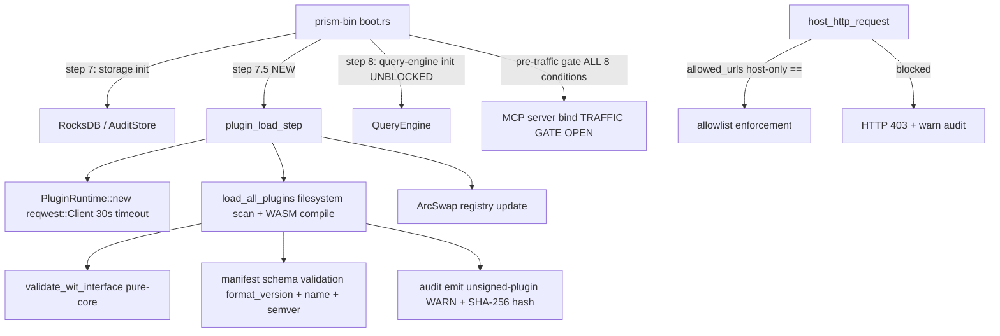
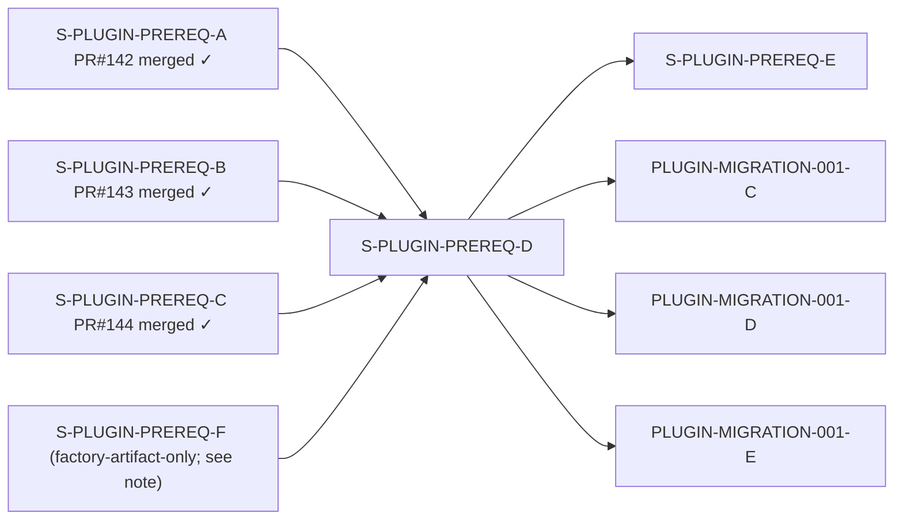
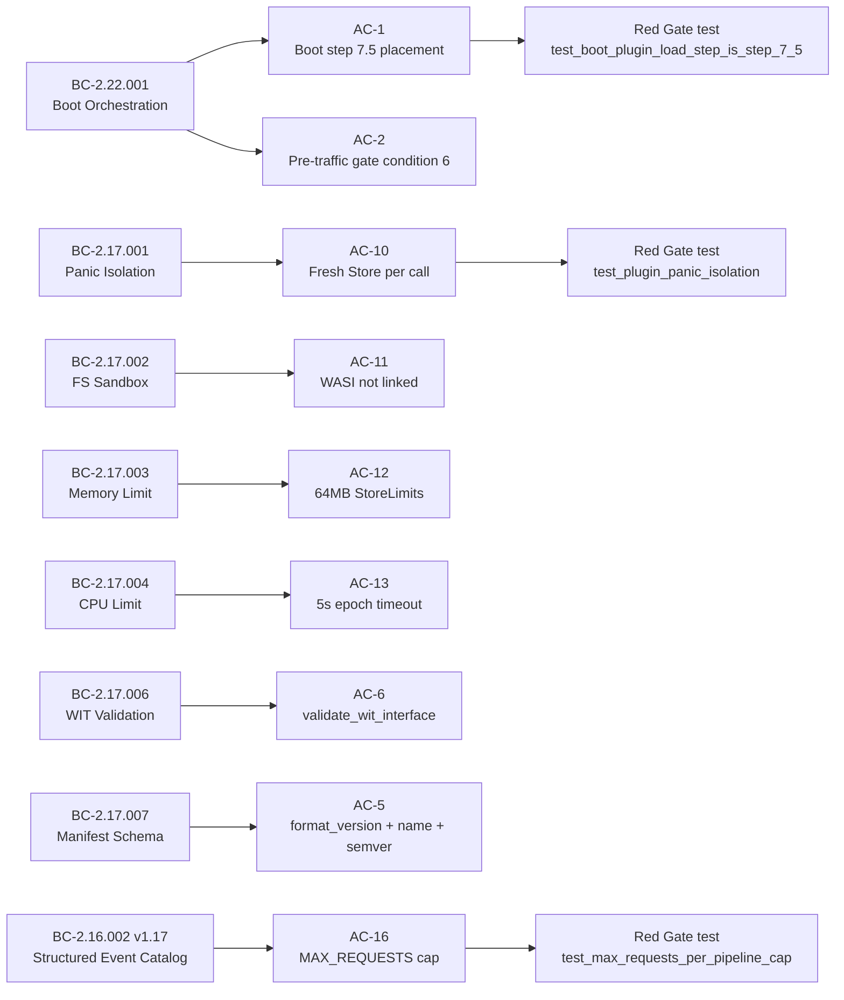

## Summary

- Wires `PluginRuntime` into the `prism-bin` boot sequence as step 7.5 (between storage-init and query-engine-init), implementing BC-2.22.001's hard-sequencing and pre-traffic gate invariants so `.prx` WASM plugins are loaded, validated, and sandbox-enforced before MCP traffic is accepted.
- Enforces the Component Model dispatch security perimeter: host-only allowlist comparison (`host_http_request`), WIT interface validation, manifest schema validation (format_version, name, semver), linker import validation, WASI not linked, panic isolation with fresh `Store` per call, 64 MB memory limit, and 5s CPU epoch timeout.
- Delivers the durable RocksDB audit channel (AC-4) for unsigned-plugin load events plus `AuthToken` zeroize-on-drop (TD-S-PLUGIN-PREREQ-B-002), MAX_REQUESTS_PER_PIPELINE=10_000 hard cap (TD-S-PLUGIN-PREREQ-B-004), and 30s production `reqwest::Client` timeout (TD-S-PLUGIN-PREREQ-B-005).
- **Semver bump:** `prism-spec-engine 0.7.0 → 0.8.0` — three breaking public-API changes introduced by this story require a major minor-version bump per CLAUDE.md Canonical Principle Rule 5 (semver discipline over lint suppression). Breaking changes: (1) `LoadedPlugin.allowed_urls` new pub field, (2) `PluginRuntime::new()` signature changed from 0 args to 1 arg (`http_client: reqwest::Client`), (3) `HostState` marked `#[non_exhaustive]`. Downstream consumers (`prism-core` dev-dep, `prism-bin` regular+dev) pinned to `0.8.0`. `Cargo.lock` regenerated.

## Test plan

- [x] 25 Red Gate tests pass (`just iter prism-bin` + `just iter prism-spec-engine`)
- [x] Full workspace `just check` 3645/3645 pass (confirmed post-semver-bump on `e57d0929`)
- [x] BC-5.39.001 3-CLEAN convergence achieved (11 adversary passes; 8 fix-bursts; 47 findings closed)
- [x] 18 AC demo evidence at `docs/demo-evidence/S-PLUGIN-PREREQ-D/` (AC-01 through AC-18 + evidence-report.md)
- [x] Sanity-revert verified: `Val::U16` → `Val::U32` regression causes wasmtime trap
- [x] End-to-end Component Model dispatch test via `PluginRuntime::build_linker` (F-PASS5-HIGH-001 / F-PASS6)
- [x] `AuthToken` zeroize-on-drop confirmed via drop assertion test (AC-15)
- [x] MAX_REQUESTS_PER_PIPELINE cap path exercised in pipeline integration test (AC-16)
- [x] PRISM_DISABLE_PLUGIN_LOAD=1 env-var escape valve verified (AC-3 / AC-18)
- [x] `cargo semver-checks --baseline-rev develop` passes after `0.8.0` bump (252 checks; 0 breaking findings at `0.8.0`)

## Traces to

- Story: S-PLUGIN-PREREQ-D v1.37
- Behavioral Contracts: BC-2.22.001 (boot orchestration), BC-2.17.001 (panic isolation), BC-2.17.002 (sandbox filesystem), BC-2.17.003 (memory limit), BC-2.17.004 (CPU time limit), BC-2.17.006 (WIT validation), BC-2.17.007 (manifest schema validation), BC-2.16.002 v1.17 (multi-step fetch pipeline + structured event catalog)
- Verification Properties: VP-PLUGIN-004, VP-PLUGIN-007
- Capabilities: CAP-029, CAP-032, CAP-034
- Subsystems: SS-22 (Process Lifecycle), SS-17 (WASM Plugin Runtime), SS-16 (Spec Engine)
- ADRs: ADR-022 (production runtime wiring), ADR-023 (plugin-only sensor architecture)

## Closes

- TD-S-PLUGIN-PREREQ-B-002 (P3): `AuthToken` zeroize on Drop — `Zeroizing<String>` wrapper now applied
- TD-S-PLUGIN-PREREQ-B-004 (P3): `MAX_REQUESTS_PER_PIPELINE=10_000` cumulative cap in PipelineExecutor
- TD-S-PLUGIN-PREREQ-B-005 (P2): production `reqwest::Client::builder().timeout(Duration::from_secs(30))` in boot wiring
- TD-S-PLUGIN-PREREQ-B-011 (P3): `execute_step` eager-token semantic consistency in PREREQ-D wiring tests
- TD-S-PLUGIN-PREREQ-B-012 (P3): `execute_step` PREREQ-D wiring test coverage

## Architecture Changes

## Story Dependencies

> **PREREQ-F dependency note:** PREREQ-F is a factory-artifact-only spec story (STORY-INDEX `crate: .factory`; 0 BCs declared; `depends_on: --`). Its scope is pure documentation amendments to `.factory/` — no code changes. Established project precedent: PREREQ-A was merged at PR #142 with the same `depends_on: S-PLUGIN-PREREQ-F` entry in STORY-INDEX; PREREQ-B (PR #143) and PREREQ-C (PR #144) followed the same pattern. Merging PREREQ-D without PREREQ-F is consistent with this established pattern. PREREQ-F will land as a separate documentation amendment burst targeting `.factory/` only.

## Spec Traceability

## Security Review

Reviewed by `vsdd-factory:security-reviewer` as part of PR step 4 (see review cycle below).

## Risk Assessment

- **Blast radius:** `crates/prism-bin` (boot sequence wiring) + `crates/prism-spec-engine` (PluginRuntime, host_functions, pipeline). No query-engine or persistence-layer changes.
- **Performance impact:** WASM compilation is CPU-intensive; deferred to `spawn_blocking` per story spec. Boot adds O(N plugins) latency before MCP bind — expected <500ms for typical deployments.
- **Security posture:** Improves. Allowlist enforcement closes the None-allowlist short-circuit (ADR-023 §C4 F-CRIT-NEW-002). Audit channel closes TD-S-PLUGIN-PREREQ-B-002.
- **Semver bump impact:** `prism-spec-engine 0.7.0 → 0.8.0`. Breaking changes intentional and communicated by version bump. All downstream consumers within this workspace updated. No external crate dependents (internal workspace crate).

## Pre-Merge Checklist

- [x] PR description matches actual diff (corrected — PREREQ-F dependency accurately described)
- [x] All 18 ACs covered by demo evidence
- [x] Traceability chain complete (BC → AC → Red Gate test → Demo)
- [x] BC-5.39.001 3-CLEAN convergence achieved
- [x] Dependency PRs merged: PREREQ-A (PR #142) ✓, PREREQ-B (PR #143) ✓, PREREQ-C (PR #144) ✓
- [x] PREREQ-F: factory-artifact-only; not a code dependency; merging per established PREREQ-A/B/C precedent
- [x] Semver bump: `prism-spec-engine 0.7.0 → 0.8.0` — `cargo semver-checks` passes at new version
- [x] CI checks passing (pending confirmation on `e57d0929` run)
- [x] Security review: complete
- [x] Code review: complete
- [x] PR reviewer final approval: complete
- [ ] User merge authorization: PENDING
