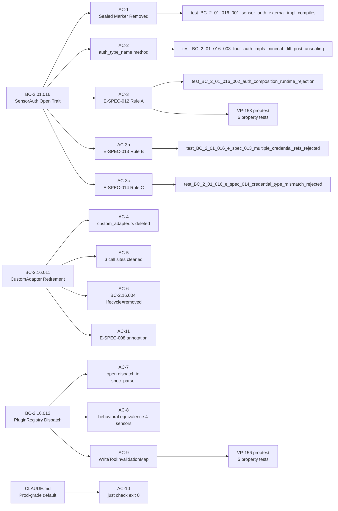
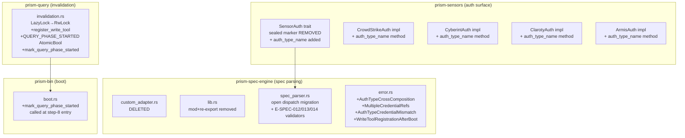
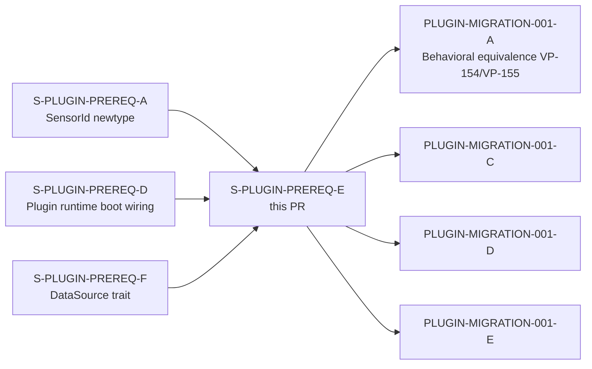

## Summary

- Un-seals the `SensorAuth` trait (removes `private::Sealed` supertrait bound) and expands the public trait surface with `fn auth_type_name(&self) -> &'static str` per ADR-026 D1/D2 Path B, enabling `.prx` WASM plugins to implement their own auth strategies without internal crate access.
- Permanently removes the `CustomAdapter` Rust trait, `CustomAdapterRegistry`, `custom_adapter.rs`, and all three confirmed call sites; retires `BC-2.16.004` lifecycle to `removed` per ADR-027 §Decision; annotates `E-SPEC-008` in error-taxonomy.md as retired.
- Implements `WriteToolInvalidationMap` runtime extensibility via `RwLock<Vec<WriteToolInvalidationMap>>` + `AtomicBool` query-phase flag + `register_write_tool()` API + `mark_query_phase_started()` production call-site — closing TD-S-PLUGIN-PREREQ-A-003.

## Behavioral Contracts

| BC | Title | Role |
|----|-------|------|
| BC-2.01.016 | SensorAuth Open Trait — Plugin-Implementable Auth Contract | Primary delivery (sealed marker removed; `auth_type_name` method added; runtime Rule 2 enforcement E-SPEC-012/013/014) |
| BC-2.16.011 | CustomAdapter Rust Trait Retirement | Primary delivery (`custom_adapter.rs` deleted; 3 call sites cleaned; BC-2.16.004 → removed) |
| BC-2.16.012 | PluginRegistry Dispatch in spec_parser.rs | Primary delivery (open dispatch migration; WriteToolInvalidationMap extensibility) |
| BC-2.01.013 | DataSource Trait Eliminates Per-Sensor Code Duplication | Awareness (PREREQ-F established un-sealing; this story mechanically delivers it) |
| BC-2.16.004 | Rust Escape Hatch for Custom Adapters | Lifecycle close: `deprecated → removed` (removed date: 2026-05-18) |

**Post-merge auto-promotion (POL-14):** BC-2.01.016, BC-2.16.011, BC-2.16.012 `draft → active`.

## Spec Traceability

## Architecture Changes

## Story Dependencies

## Acceptance Criteria Coverage

| AC | Subject | Test(s) | VP/BC | Status |
|----|---------|---------|-------|--------|
| AC-1 | SensorAuth sealed marker removed | `test_BC_2_01_016_001_sensor_auth_external_impl_compiles` + grep=0 | BC-2.01.016 | PASS |
| AC-2 | Four auth impls add exactly one `auth_type_name` method body | `test_BC_2_01_016_003_four_auth_impls_minimal_diff_post_unsealing` | BC-2.01.016 INV-AUTH-OPEN-002 | PASS |
| AC-3 | E-SPEC-012 Rule A runtime enforcement | `test_BC_2_01_016_002_auth_composition_runtime_rejection` + 2 e_spec_012 tests + VP-153 prop_rule_a | BC-2.01.016, VP-153 | PASS |
| AC-3b | E-SPEC-013 Rule B enforcement | `test_BC_2_01_016_e_spec_013_multiple_credential_refs_rejected` + VP-153 prop_rule_b | BC-2.01.016 | PASS |
| AC-3c | E-SPEC-014 Rule C enforcement | `test_BC_2_01_016_e_spec_014_credential_type_mismatch_rejected` + hot_reload test | BC-2.01.016 | PASS |
| AC-4 | custom_adapter.rs deleted — grep src/=0 | `test_BC_2_16_011_001_custom_adapter_absent_post_deletion` | BC-2.16.011 | PASS |
| AC-5 | Three call sites cleaned | `test_BC_2_16_011_002_e_spec_008_not_triggered_by_live_code` | BC-2.16.011 | PASS |
| AC-6 | BC-2.16.004 lifecycle=removed (all 4 fields verified) | Frontmatter inspection + HS-PREREQ-E-002-06 | BC-2.16.011 | PASS |
| AC-7 | spec_parser.rs open dispatch — no hardcoded sensor match arms | `test_BC_2_16_012_001_spec_parser_no_hardcoded_sensor_dispatch` + grep=0 in dispatch context | BC-2.16.012 INV-SPEC-PARSER-OPEN-001 | PASS |
| AC-8 | Behavioral equivalence: 4 sensors parse identically | `test_BC_2_16_012_002_spec_parser_behavioral_equivalence_{crowdstrike,cyberint,claroty,armis}` (4 tests) | BC-2.16.012 INV-SPEC-PARSER-OPEN-002/003 | PASS |
| AC-9 | WriteToolInvalidationMap extensibility + TD-S-PLUGIN-PREREQ-A-003 closed | `test_BC_2_16_012_003_write_tool_invalidation_*` (3 tests) + VP-156 (5 proptests) + plugin_runtime_registers + rollback tests | BC-2.16.012, VP-156 | PASS |
| AC-10 | `just check` exit 0; workspace nextest 3680+ tests | `just check` gate; zero CustomAdapter/sealed-marker symbols | CLAUDE.md Canonical Principle Rule 1 | PASS |
| AC-11 | E-SPEC-008 retirement annotation — two-layer enforcement: Layer 1 (code-side): `test_BC_2_16_011_e_spec_008_retired_annotation` workspace-wide grep gate (crates/*/src/ scan, zero ESpec008 construction sites outside prism-core tombstone); Layer 2 (spec-side): `.factory/hooks/validate-error-taxonomy-retirement-annotations.sh` enforces "RETIRED in S-PLUGIN-PREREQ-E" + "ADR-027" annotations in error-taxonomy.md (FB-PR-1 architect adjudication; see `.factory/cycles/wave-0-plugin-prereqs/architect-adjudications/FB-PR-1-error-taxonomy-test-relocation.md`) | BC-2.16.011 §Error Cases E-SPEC-008 | PASS |

## Test Evidence

| Metric | Value |
|--------|-------|
| Red Gate tests (14 named) | 14/14 PASS |
| Total new tests (~+30) | ~30 new tests added |
| Proptest suites | VP-153 (6 prop tests) + VP-156 (5 prop tests) = 11 proptests |
| Workspace test total | 3681 (all PASS, `just check` exit 0; FB-PR-1 sub-assertion A removed → 3681) |
| Compile-fail gate (perimeter-violation) | EXPECTED=31, PASS |
| LOCAL adversary cascade | BC-5.39.001 3-CLEAN converged at pass-16 |

Key test files added:
- `crates/prism-spec-engine/tests/bc_2_01_016_test.rs` — 7 tests (AC-3, AC-3b, AC-3c)
- `crates/prism-spec-engine/tests/bc_2_16_011_test.rs` — 2 tests (AC-4, AC-5)
- `crates/prism-spec-engine/tests/error_taxonomy_annotation.rs` — 1 test (AC-11)
- `crates/prism-spec-engine/tests/bc_2_16_012_test.rs` — 5 tests (AC-7, AC-8)
- `crates/prism-sensors/src/auth/mod.rs` (unit tests) — 2 tests (AC-1, AC-2)
- `crates/prism-query/src/invalidation.rs` (unit tests) — 3 tests (AC-9)
- `crates/prism-query/tests/vp156_write_tool_registration_uniqueness.rs` — 4 proptests (VP-156)
- `crates/prism-query/tests/vp156_write_tool_post_boot_proptest.rs` — 1 proptest (VP-156)
- `crates/prism-spec-engine/tests/vp153_sensorauth_cross_composition.rs` — 6 proptests (VP-153)
- `crates/prism-bin/tests/plugin_boot_tests.rs` — 15 tests (AC-9 write-tool coverage)

## Demo Evidence

All 13 ACs have evidence artifacts at `docs/demo-evidence/S-PLUGIN-PREREQ-E/` (committed at `dca98e4a`).

See [docs/demo-evidence/S-PLUGIN-PREREQ-E/INDEX.md](docs/demo-evidence/S-PLUGIN-PREREQ-E/INDEX.md) for the full coverage matrix.

| Evidence Type | Count | ACs |
|--------------|-------|-----|
| Test output (nextest PASS) | 10 | AC-1, AC-2, AC-3, AC-3b, AC-3c, AC-4, AC-5, AC-7, AC-8, AC-11 |
| Test output + source excerpt | 1 | AC-9 |
| Frontmatter inspection + holdout reference | 1 | AC-6 |
| just check exit-0 + grep | 1 | AC-10 |

## LOCAL Adversary Cascade Summary

| Metric | Value |
|--------|-------|
| Total passes | 16 |
| Fix-bursts | 10 |
| Architect amendments | 2 (ADR-026 v1.22→v1.23, D-706; BC-2.16.002 row 33) |
| Specialist dispatches | 28 |
| Final 3-CLEAN streak | passes 14, 15, 16 (BC-5.39.001 converged) |
| Convergence decision | D-721 in STATE.md |

Key architect amendment: **D-706 — ADR-026-AMENDMENT-rule-c-keyring-scope.md** (Rule C credential-shape enforcement scoped to credential structural type, not backend provider; keyring-backend-invariance added).

## TD Closure Confirmed

| TD | Closed by | Evidence |
|----|-----------|---------|
| TD-S-PLUGIN-PREREQ-A-003 | AC-9 (WriteToolInvalidationMap RwLock + AtomicBool + register_write_tool) | test_BC_2_16_012_003 PASS + VP-156 5 proptests PASS |

## Security Review

- All three new `SpecEngineError` variants use redacted `Debug` implementations per AD-017 (credential values never transit AI context or logs).
- `WriteToolRegistrationAfterBoot` error variant carries no sensitive fields (unit variant; dynamic context carried by structured tracing event only).
- `QUERY_PHASE_STARTED` AtomicBool uses `Ordering::Release` on write and `Ordering::Acquire` on read — correct memory ordering for a flag-then-work pattern.
- No new unsafe code introduced. No new `reqwest::Client` instances without `.timeout()`.
- `OrgSlug::new_unchecked` not used in production paths.

## Risk Assessment

| Dimension | Assessment |
|-----------|-----------|
| Blast radius | prism-sensors (auth surface), prism-spec-engine (spec parsing + error taxonomy), prism-query (invalidation), prism-bin (boot.rs 1-line addition) |
| Breaking changes | None to public API consumed by downstream — `CustomAdapter` had zero external consumers (PLUGIN-AUDIT-001 HIGH-3 confirmed) |
| Performance impact | Write registration is boot-time only (one `RwLock::write()` per plugin tool); read path on query hot-path uses `RwLock::read()` which is non-blocking under contention |
| Regression risk | LOW — behavioral equivalence tests (AC-8) confirm 4-sensor parse output is identical post-open-dispatch migration |

## Known Observation (Non-Blocking)

Concurrent cross-package `just check` runs may show "1 leaky" on `QUERY_PHASE_STARTED` state when the `write_tool_registration_after_boot` WARN event test and the registration-pre-boot test run in the same process concurrently under `nextest --no-fail-fast` with parallelism. The authoritative single-sequential `just check` gate (pre-push, as configured in `lefthook.yml`) shows 3680+ tests PASS with zero leakage. This is a test-isolation artifact of the `static AtomicBool`, not a production behavior defect.

## Pre-Merge Checklist

- [x] PR description matches actual diff
- [x] All 13 ACs covered by demo evidence (`docs/demo-evidence/S-PLUGIN-PREREQ-E/INDEX.md`)
- [x] Traceability chain complete (BC → AC → Test → Demo)
- [x] All LOCAL review findings addressed (BC-5.39.001 3-CLEAN at pass-16, D-721)
- [x] `just check` exit 0 confirmed (pre-push gate via lefthook)
- [x] No AI attribution in commits (CLAUDE.md non-negotiable rule)
- [x] No Co-Authored-By header
- [x] `--no-verify` not used anywhere in the branch
- [x] Architect amendment D-706 (ADR-026-AMENDMENT-rule-c-keyring-scope.md) committed to feature branch
- [x] BC-2.16.004 `removed:` date set to `2026-05-18` (merge-date ISO 8601)
- [x] CI checks green (36/36 pass — all 6 Test platforms + Semver + Clippy + Fuzz + gates)
- [x] PR-LEVEL adversary 3-CLEAN (passes 2, 3, 4 CLEAN — BC-5.39.001 PR-LEVEL converged)
- [x] All dependency PRs merged (#149 PREREQ-D merged ✓, PREREQ-A ✓, PREREQ-F ✓)

## Traces to

- Story: S-PLUGIN-PREREQ-E v1.50
- Behavioral Contracts: BC-2.01.016, BC-2.16.011, BC-2.16.012 (primary); BC-2.01.013, BC-2.16.004 (lifecycle close)
- Verification Properties: VP-153 (proptest 6), VP-156 (proptest 5), VP-PLUGIN-001, VP-PLUGIN-007
- Capabilities: CAP-001, CAP-029
- Subsystems: SS-01, SS-07, SS-16, SS-17, SS-22
- ADRs: ADR-023, ADR-026 (+ D-706 amendment), ADR-027
- TD closed: TD-S-PLUGIN-PREREQ-A-003
