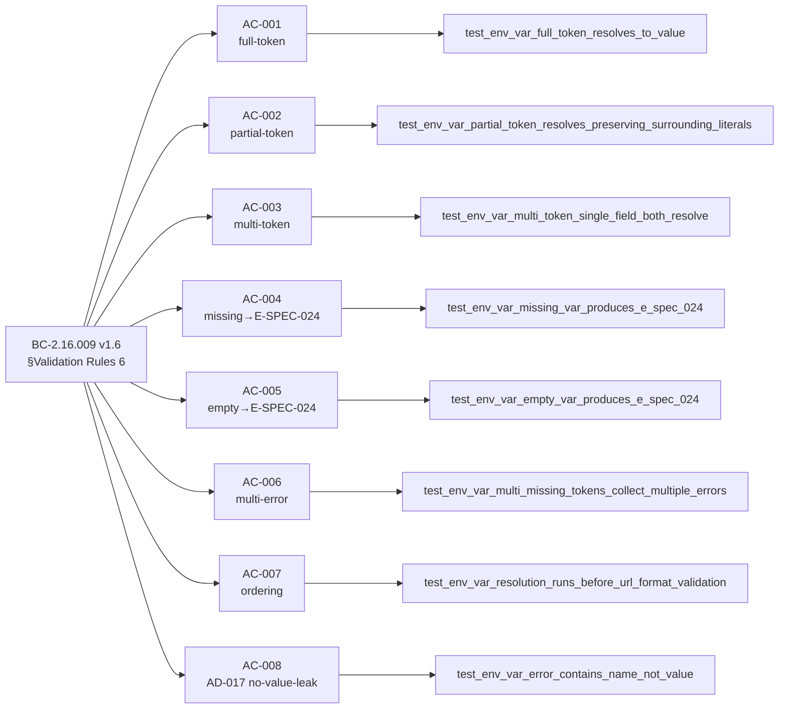
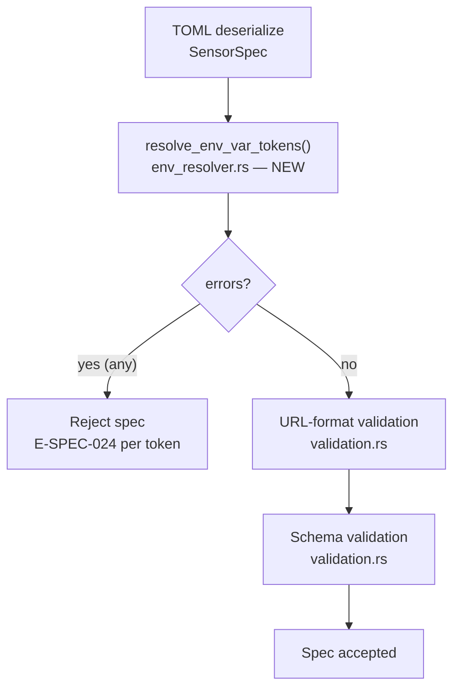
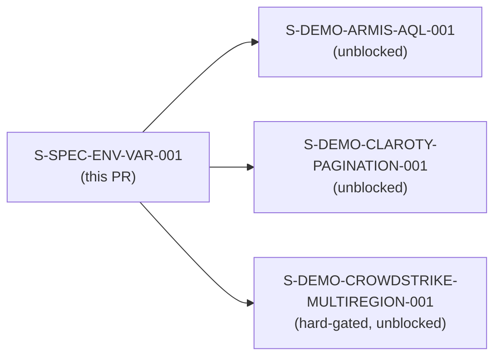

## S-SPEC-ENV-VAR-001: `${env.VAR}` interpolation resolution in sensor-spec string fields

Adds a post-TOML-parse env-var token resolver to `prism-spec-engine`. Three production sensor
specs (`armis.sensor.toml`, `claroty.sensor.toml`, `cyberint.sensor.toml`) use `${env.VAR_NAME}`
tokens in `base_url`; without this resolver they fail URL-format validation with the misleading
`E-SPEC-001` error instead of the actionable `E-SPEC-024`. This story closes that gap and
unblocks the three downstream demo-fidelity lanes.

---

## Traceability

```
BC-2.16.009 v1.6 §Validation Rules 6 (AC-6)
    └─ AC-001  Full-token resolution (var set)          → test_env_var_full_token_resolves_to_value
    └─ AC-002  Partial-token interpolation              → test_env_var_partial_token_resolves_preserving_surrounding_literals
    └─ AC-003  Multi-token single field                 → test_env_var_multi_token_single_field_both_resolve
    └─ AC-004  Missing var → E-SPEC-024                 → test_env_var_missing_var_produces_e_spec_024
    └─ AC-005  Empty var → E-SPEC-024 (empty == absent) → test_env_var_empty_var_produces_e_spec_024
    └─ AC-006  Multi-error collection, no fail-fast     → test_env_var_multi_missing_tokens_collect_multiple_errors
    └─ AC-007  Resolution ordering: pre-URL-format      → test_env_var_resolution_runs_before_url_format_validation
    └─ AC-008  AD-017 no-value-leak (NAME not VALUE)    → test_env_var_error_contains_name_not_value
```



---

## Architecture Changes

New module `crates/prism-spec-engine/src/env_resolver.rs` inserted into the spec-load pipeline.
Call site: `parse_and_validate_spec_toml()` in `add_sensor_spec.rs`. Resolution runs after TOML
deserialization, before URL-format validation.



**Files changed:**

| File | Change |
|------|--------|
| `crates/prism-spec-engine/src/env_resolver.rs` | NEW — 325 lines; `resolve_env_var_tokens()` + `resolve_field()` |
| `crates/prism-spec-engine/src/error.rs` | ADD `SpecEngineError::EnvVarNotSet` variant (E-SPEC-024) |
| `crates/prism-spec-engine/src/add_sensor_spec.rs` | MODIFY — call resolver in `parse_and_validate_spec_toml()` |
| `crates/prism-spec-engine/src/overlay.rs` | MODIFY — wire resolver into overlay `base_url` path (EC-009-007) |
| `crates/prism-spec-engine/src/lib.rs` | ADD `pub mod env_resolver` |
| `crates/prism-spec-engine/Cargo.toml` | ADD `regex`, `once_cell` / `LazyLock` workspace deps |
| `crates/prism-core/src/error.rs` | ADD 14 lines — E-SPEC-024 category constants |
| `crates/prism-spec-engine/tests/env_var_resolution_tests.rs` | NEW — 869 lines; 10 tests (8 Red Gate + 2 production-path) |
| `crates/prism-spec-engine/tests/overlay_loading_tests.rs` | NEW — 217 lines; overlay EC-009-007 coverage |
| `docs/demo-evidence/S-SPEC-ENV-VAR-001/` | NEW — 11 files (8 AC + no-regression + evidence-report.md) |

---

## Story Dependencies



**depends_on:** `[]` (leaf prerequisite — no upstream story dependencies)

**blocks:** S-DEMO-ARMIS-AQL-001, S-DEMO-CLAROTY-PAGINATION-001, S-DEMO-CROWDSTRIKE-MULTIREGION-001

---

## Test Evidence

| Metric | Value |
|--------|-------|
| Red Gate tests (one per AC) | 8 / 8 PASS |
| Adversary-added production-path ordering tests | 2 / 2 PASS |
| Total env-var-resolution tests | 10 / 10 PASS |
| Full prism-spec-engine suite | 508 / 508 PASS, 0 failures |
| Tests skipped (`#[ignore]` DTU integration) | 10 (external-service gate per SID-1) |
| Workspace regression check (`just check`) | GREEN |

---

## Demo Evidence

**Demo mode:** LIBRARY (test-harness nextest capture — `prism-spec-engine` is a library crate
with no CLI surface; Red Gate tests exercise the production code path at the function boundary)

| AC | Evidence File | Test | Verdict |
|----|--------------|------|---------|
| AC-001 | `docs/demo-evidence/S-SPEC-ENV-VAR-001/AC-001-full-token-resolution.txt` | `test_env_var_full_token_resolves_to_value` | PASS |
| AC-002 | `docs/demo-evidence/S-SPEC-ENV-VAR-001/AC-002-partial-token-interpolation.txt` | `test_env_var_partial_token_resolves_preserving_surrounding_literals` | PASS |
| AC-003 | `docs/demo-evidence/S-SPEC-ENV-VAR-001/AC-003-multi-token-field.txt` | `test_env_var_multi_token_single_field_both_resolve` | PASS |
| AC-004 | `docs/demo-evidence/S-SPEC-ENV-VAR-001/AC-004-missing-var-e-spec-024.txt` | `test_env_var_missing_var_produces_e_spec_024` | PASS |
| AC-005 | `docs/demo-evidence/S-SPEC-ENV-VAR-001/AC-005-empty-var-e-spec-024.txt` | `test_env_var_empty_var_produces_e_spec_024` | PASS |
| AC-006 | `docs/demo-evidence/S-SPEC-ENV-VAR-001/AC-006-multi-error-collection.txt` | `test_env_var_multi_missing_tokens_collect_multiple_errors` | PASS |
| AC-007 | `docs/demo-evidence/S-SPEC-ENV-VAR-001/AC-007-resolution-ordering.txt` | `test_env_var_resolution_runs_before_url_format_validation` + 2 production-path tests | PASS |
| AC-008 | `docs/demo-evidence/S-SPEC-ENV-VAR-001/AC-008-ad017-no-value-leak.txt` | `test_env_var_error_contains_name_not_value` | PASS |
| (regression) | `docs/demo-evidence/S-SPEC-ENV-VAR-001/no-regression-full-suite.txt` | All 508 prism-spec-engine tests | PASS |

**AD-017 no-value-leak:** AC-008 evidence file explicitly asserts the sentinel value
`"https://secret.internal.sentinel-value-do-not-log"` does NOT appear in `Display` or `Debug`
representation of the `E-SPEC-024` error even after the var was set to that sentinel.
`SpecEngineError::EnvVarNotSet` variant carries only `var_name`, `toml_path`, and `file_path` —
no field capable of holding a resolved value by construction.

---

## LOCAL Adversary Convergence

**Protocol:** BC-5.39.001 — 3-CLEAN convergence required (strict: zero findings of any severity)

| Pass | Findings | Blocking | Streak |
|------|----------|----------|--------|
| 1 | 3 (1 CRIT, 1 HIGH, 1 MED) | yes | 0/3 |
| 2 | 1 (MED — doc comment narrow) | yes | 0/3 |
| 3 | 0 | no | 1/3 |
| 4 | 0 | no | 2/3 |
| 5 | 0 | no | **3/3 CONVERGED** |

**Pass 1 findings closed:**
- F-LOCAL-P1-CRIT-001: overlay `base_url` path not wired through resolver (EC-009-007) — fixed in commit `500b8a51`
- F-LOCAL-P1-HIGH-001: AC-007 ordering test used test-only path, not production `parse_and_validate_spec_toml()` — fixed in commit `dac84d0e`
- F-LOCAL-P1-MED-001: E-SPEC-024 Display had spurious `"E-SPEC-024: "` prefix not matching taxonomy v1.56 — fixed in commit `6cf96a33`

**Pass 2 finding closed:**
- F-LOCAL-P2-MED-001 (F-LOCAL-P1-MED-002): resolver doc comment said "all String fields" but implemented scoped field list — narrowed in commit `c9e95331`; de-dup overlay message in commit `872b9e07`

---

## Security Review

To be completed by security-reviewer on this PR. Story is security-relevant:
- Env-var resolution touches the `std::env` API (potential for injection if token format not strictly bounded)
- `E-SPEC-024` error construction discipline is an AD-017 / credential-safety concern
- SSRF surface: `base_url` is the field being resolved; resolved values are passed to URL-format validation

---

## Risk Assessment

| Dimension | Assessment |
|-----------|-----------|
| Blast radius | LOW — pure new code path in `prism-spec-engine`; no existing logic modified |
| Performance impact | NEGLIGIBLE — single regex scan over string fields at spec-load time (one-time cost) |
| Security surface | MEDIUM — env-var API + credential-adjacent field; AD-017 enforced by construction + tests |
| Rollback | Safe — resolver is a new step; removing it reverts to prior behavior (E-SPEC-001 on token strings) |

---

## Holdout Evaluation

N/A — evaluated at wave gate.

---

## AI Pipeline Metadata

| Field | Value |
|-------|-------|
| Pipeline mode | brownfield / Phase 3 TDD |
| Wave | wave-5-e-demo-fidelity |
| Story points | 5 |
| LOCAL adversary passes | 5 (3-CLEAN at passes 3/4/5) |
| PR-LEVEL adversary cascade | pending (orchestrator-driven) |

---

## Pre-Merge Checklist

- [x] PR description matches actual diff
- [x] All 8 ACs covered by demo evidence (one file per AC)
- [x] Traceability chain complete: BC-2.16.009 → AC-001..008 → Red Gate tests → demo evidence
- [x] LOCAL adversary 3-CLEAN converged (passes 3/4/5 clean, BC-5.39.001)
- [x] `just check` GREEN (508/508 prism-spec-engine, no workspace regressions)
- [x] No AI attribution in commits or PR body
- [x] No force-push to develop/main
- [x] depends_on: [] (no dependency PRs to wait for)
- [ ] CI passing
- [ ] Security review complete
- [ ] PR-LEVEL adversary 3-CLEAN cascade complete (orchestrator-driven)
- [ ] Orchestrator merge authorization
