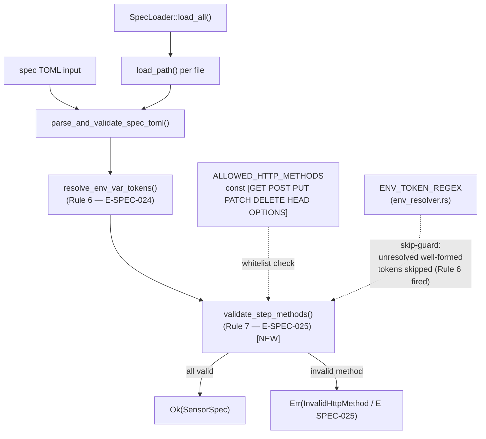
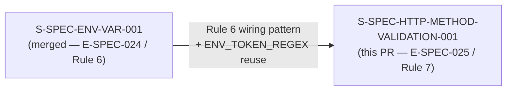
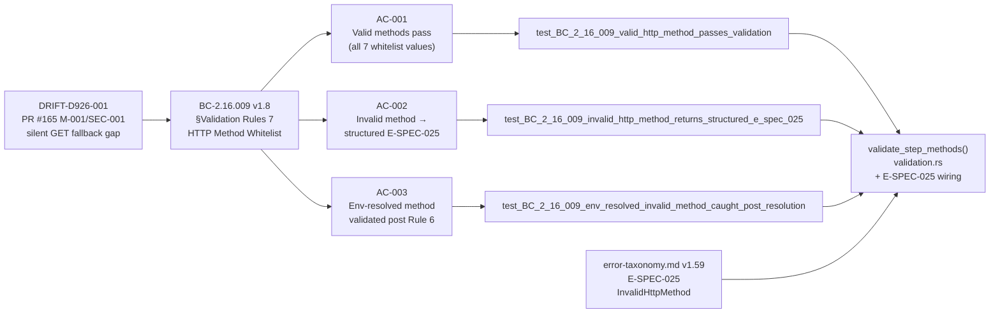

## Summary

Implements BC-2.16.009 v1.8 §Validation Rule 7: HTTP-method whitelist validation in sensor spec load paths. Invalid or unsupported `step.method` values (`CONNECT`, `TRACE`, `get`, typos) now produce a structured `E-SPEC-025` error at spec-load time rather than silently falling back to GET. Wired into both load paths (`parse_and_validate_spec_toml` and `SpecLoader::load_all`) post env-resolver (Rule 6 → Rule 7 ordering per BC-2.16.009 v1.8). Anchors and resolves **DRIFT-D926-001**.

**Subsystem:** SS-16 (Spec Engine) — `crates/prism-spec-engine/src/validation.rs`
**Wave:** wave-5-e-demo-fidelity
**Story:** S-SPEC-HTTP-METHOD-VALIDATION-001 v1.2
**Priority:** P2 (hardening — NOT a vulnerability; `_ => GET` belt-and-suspenders fallback retained in `PipelineExecutor`)

---

## Architecture Changes



**Files changed:**
- `crates/prism-spec-engine/src/validation.rs` — `validate_step_methods()` fn + `ALLOWED_HTTP_METHODS` const + Rule 7 wiring in both load paths
- `crates/prism-spec-engine/src/error.rs` — `SpecEngineError::InvalidHttpMethod` variant + `SpecErrorCode::E_SPEC_025` mapping
- `crates/prism-spec-engine/src/spec_parser.rs` — `SpecErrorCode` channel wiring (E-SPEC-025 propagation through `load_path` / `load_all`)
- `crates/prism-spec-engine/tests/` — 38 new http_method_whitelist_tests (3 Red Gate + 35 coverage/edge-case)
- `docs/demo-evidence/S-SPEC-HTTP-METHOD-VALIDATION-001/` — per-AC demo recordings (library-mode)

**No new dependencies added.** `ALLOWED_HTTP_METHODS` is a compile-time `const &[&str]`; no external crate required.

---

## Story Dependencies



`depends_on: []` — no unmerged upstream PRs. S-SPEC-ENV-VAR-001 is the implementation precedent (same validation.rs insertion point, same multi-error pattern, reuses `ENV_TOKEN_REGEX` as the skip-guard). DRIFT-D926-001 RESOLVED by this merge.

---

## Spec Traceability



| BC | Version | Section | AC | Red Gate Test |
|----|---------|---------|-----|---------------|
| BC-2.16.009 | v1.8 | §Validation Rules 7 — HTTP Method Whitelist | AC-001 | `test_BC_2_16_009_valid_http_method_passes_validation` |
| BC-2.16.009 | v1.8 | §Error Conditions — E-SPEC-025 | AC-002 | `test_BC_2_16_009_invalid_http_method_returns_structured_e_spec_025` |
| BC-2.16.009 | v1.8 | §Validation Rules 7 — Rule 6→7 ordering | AC-003 | `test_BC_2_16_009_env_resolved_invalid_method_caught_post_resolution` |
| error-taxonomy.md | v1.59 | E-SPEC-025 message template (POL-24 byte-verbatim) | AC-002 | `test_BC_2_16_009_e_spec_025_display_matches_error_taxonomy_v1_59_template_byte_for_byte` |

**E-SPEC-025 error message (byte-verbatim per POL-24 / error-taxonomy.md v1.59):**
```
Step '<step_name>' in '<sensor_id>.<table_name>' declares method '<method_value>' which is not a supported HTTP method. Supported: GET, POST, PUT, PATCH, DELETE, HEAD, OPTIONS
```

---

## Test Evidence

| Metric | Value |
|--------|-------|
| Full workspace test suite | 3982/3982 PASS |
| Pre-push gate (`just check`) | 218s PASS |
| `#[non_exhaustive]` compile-fail gate | 49/49 PASS |
| BC-2.16.009 test suite | 84/84 PASS (38 new + 46 preexisting, zero regressions) |
| New http_method_whitelist_tests | 38 tests (3 Red Gate + 35 edge-case/coverage) |
| Red Gate tests GREEN | 3/3 |
| Bundled sensor specs pass Rule 7 | 4/4 (CrowdStrike, Armis, Claroty, Cyberint) |

**Edge cases covered:**
- EC-009-010..016: valid GET/POST, CONNECT/TRACE/typo/lowercase/empty rejections
- EC-009-017: absent `step.method` — no error (defaults to GET in pipeline)
- EC-009-018: multi-error collection (INV-ERR-003 no-fail-fast): CONNECT + TRACE → 2 errors
- EC-009-019: env-resolved invalid method (Rule 6 resolves `${env.M}` → `"CONNECT"` → Rule 7 fires)
- EC-009-020: unresolved well-formed token (`${env.METHOD}`) — Rule 7 skips (Rule 6 already fired E-SPEC-024)
- F-LOCAL-P3-MED-002: malformed pseudo-tokens (`${env.lower}`, `${env.foo-bar}`, `${env.}`) NOT skipped by Rule 7
- F-LOCAL-P4-MED-001: duplicate step names carry correct enumerate index (not name-reverse-lookup)

---

## Demo Evidence

**Evidence mode:** LIBRARY (nextest capture) — `prism-spec-engine` is a library crate with no CLI binary surface. Follows S-SPEC-ENV-VAR-001 / S-PLUGIN-PREREQ-D precedent.

**Evidence location (on feature branch):** `docs/demo-evidence/S-SPEC-HTTP-METHOD-VALIDATION-001/`

| AC | Evidence File | Status |
|----|---------------|--------|
| AC-001: Valid methods pass | `AC-001-valid-http-methods-pass-validation.txt` | PASS |
| AC-002: Invalid method → E-SPEC-025 | `AC-002-invalid-method-returns-e-spec-025.txt` | PASS |
| AC-003: Env-resolved method validated post-resolution | `AC-003-env-resolved-method-validated-post-resolution.txt` | PASS |
| Full BC-2.16.009 suite | `full-suite-BC-2-16-009.txt` | 84/84 PASS |
| Source excerpt | `source-excerpt-validate-step-methods.txt` | — |

---

## LOCAL Adversary Cascade Summary

**Result:** CONVERGED 3/3 strict at commit `b1b81cd0`

| Pass | Cycles | Status | Notable findings caught + fixed |
|------|--------|--------|----------------------------------|
| Pass 1 | 1 fix-burst | Finding | F-LOCAL-P1-OBS-001 (missing load_path regression test) + F-LOCAL-P1-MED-001 (E-SPEC-025 not wired through SpecErrorCode channel in load_path) |
| Pass 2 | 1 fix-burst | Finding | F-LOCAL-P2-MED-001 (numeric-index toml_path missing in load_all E-SPEC-025) |
| Pass 3 | 2 fix-bursts | Finding | F-LOCAL-P3-MED-002 (malformed env pseudo-tokens incorrectly skipped by Rule 7) + F-LOCAL-P3-MED-001 (load_all second-step index test non-load-bearing) |
| Pass 4 | 1 fix-burst | Finding | F-LOCAL-P4-MED-001 (duplicate-step-name index mis-attribution: name-reverse-lookup→enumerate) |
| Pass 5 | 0 | CLEAN (strict) 1/3 | — |
| Pass 6 | 0 | CLEAN (strict) 2/3 | — |
| Pass 7 | 0 | CLEAN (strict) 3/3 | CONVERGED |

**4 genuine bugs caught and fixed by LOCAL cascade:**
1. Dual-path wiring gap — E-SPEC-025 not flowing through load_path SpecErrorCode channel
2. Malformed pseudo-token over-skip — `${env.lower}` / `${env.foo-bar}` / `${env.}` incorrectly skipped by Rule 7 skip-guard
3. Non-load-bearing index test — load_all second-step test was testing string formatting, not actual step index carry
4. Duplicate-step-name index mis-attribution — code used name-reverse-lookup instead of enumerate() index

---

## Holdout Evaluation

N/A — evaluated at wave gate.

---

## Adversarial Review (PR-Level)

Pending — orchestrator-driven (Standing Rule 2). PR-level adversarial 3-CLEAN cascade has not yet run. Merge is gated on PR-level cascade convergence + security review + pr-reviewer approval + CI green.

---

## Security Review

Pending — orchestrator-driven (post-PR-creation). No credential handling in this change; `step.method` values are config text (not credentials per AD-017); method value safe to echo in error messages per story spec §Architecture Compliance Rules.

---

## Risk Assessment

| Dimension | Assessment |
|-----------|-----------|
| Blast radius | `prism-spec-engine` only (SS-16). No changes to `PipelineExecutor`, sensor adapters, or query engine. |
| Behavior change for valid specs | None — all 4 bundled sensor TOML specs pass Rule 7 (test: `test_BC_2_16_009_validates_all_4_bundled_specs`) |
| Behavior change for invalid specs | New structured error at spec-load time instead of silent GET fallback. This is the intended hardening. |
| `_ => GET` fallback | Retained in `PipelineExecutor` (belt-and-suspenders per BC-2.16.009 v1.8 §Validation Rules 7). Not removed. |
| Regression risk | LOW — 46 preexisting BC-2.16.009 tests pass; 3982/3982 workspace tests pass. |
| Performance impact | Negligible — `const` whitelist lookup (7-element slice); runs once per step at spec-load time, not per query. |

---

## AI Pipeline Metadata

| Field | Value |
|-------|-------|
| Pipeline mode | brownfield (Phase 3 TDD) |
| Wave | wave-5-e-demo-fidelity |
| Story points | 3 |
| Estimated days | 0.5 |
| LOCAL adversary passes | 7 (4 fix-bursts, converged 3/3 strict at pass 7) |
| PR-level adversary passes | pending (orchestrator-driven) |
| DRIFT resolved | DRIFT-D926-001 (PR #165 M-001/SEC-001 disposition) |

---

## Pre-Merge Checklist

- [x] PR description matches actual diff
- [x] All 3 ACs covered by demo evidence (1 recording per AC)
- [x] Traceability chain complete: BC-2.16.009 v1.8 → AC-001/002/003 → Red Gate tests → `validate_step_methods()` implementation
- [x] LOCAL adversary cascade CONVERGED 3/3 strict
- [x] `just check` 3982/3982 PASS (218s)
- [x] `#[non_exhaustive]` gate 49/49 PASS
- [x] `depends_on: []` — no upstream PR dependency blocks
- [x] No AI attribution in commits or PR body
- [ ] PR-level adversarial cascade (pending — orchestrator-driven)
- [ ] Security review (pending — orchestrator-driven)
- [ ] pr-reviewer approval (pending — orchestrator-driven)
- [ ] CI checks green (pending — triggers on PR creation)
