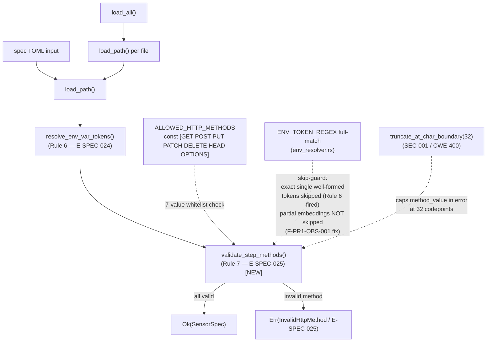
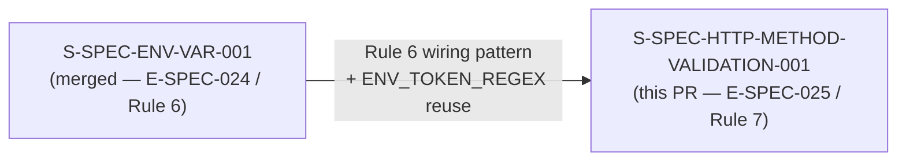
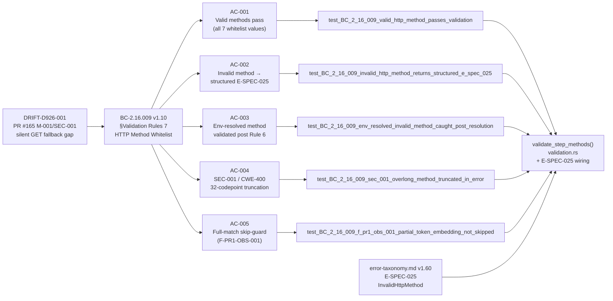

## Summary

Implements BC-2.16.009 v1.10 §Validation Rule 7: HTTP-method whitelist validation in sensor spec load paths. Invalid or unsupported `step.method` values (`CONNECT`, `TRACE`, `get`, typos) now produce a structured `E-SPEC-025` error at spec-load time rather than silently falling back to GET. Wired into both load paths (`load_path()` and `load_all()`) post env-resolver (Rule 6 → Rule 7 ordering per BC-2.16.009 v1.10). Includes SEC-001 / CWE-400 32-codepoint truncation of oversized method values in error output, and a full-match skip-guard preventing partial env-token embeddings from bypassing validation (F-PR1-OBS-001). Anchors and resolves **DRIFT-D926-001**.

**Subsystem:** SS-16 (Spec Engine) — `crates/prism-spec-engine/src/validation.rs`
**Wave:** wave-5-e-demo-fidelity
**Story:** S-SPEC-HTTP-METHOD-VALIDATION-001 v1.4
**BC:** BC-2.16.009 v1.10
**Error taxonomy:** error-taxonomy.md v1.60 (E-SPEC-025)
**Priority:** P2 (hardening — NOT a vulnerability; `_ => GET` belt-and-suspenders fallback retained in `PipelineExecutor`)

---

## Architecture Changes



**Files changed:**
- `crates/prism-spec-engine/src/validation.rs` — `validate_step_methods()` fn + `ALLOWED_HTTP_METHODS` const + Rule 7 wiring in both load paths + SEC-001 truncation + full-match skip-guard (F-PR1-OBS-001)
- `crates/prism-spec-engine/src/error.rs` — `SpecEngineError::InvalidHttpMethod` variant + `SpecErrorCode::E_SPEC_025` mapping
- `crates/prism-spec-engine/src/spec_parser.rs` — `SpecErrorCode` channel wiring (E-SPEC-025 propagation through `load_path` / `load_all`)
- `crates/prism-spec-engine/src/validation.rs` (`#[cfg(test)] mod http_method_whitelist_tests`) — 35 tests covering 10 Red Gate + edge cases; `crates/prism-spec-engine/tests/bc_2_16_009_test.rs` — 26 tests; bundled-spec validation — 5 tests; proofs::spec_validator — 10 tests; write_endpoint_tests — 17 tests
- `docs/demo-evidence/S-SPEC-HTTP-METHOD-VALIDATION-001/` — per-AC demo recordings (library-mode), all 5 ACs

**No new dependencies added.** `ALLOWED_HTTP_METHODS` is a compile-time `const &[&str]`; no external crate required.

---

## Story Dependencies



`depends_on: []` — no unmerged upstream PRs. S-SPEC-ENV-VAR-001 is the implementation precedent (same `validation.rs` insertion point, same multi-error pattern, reuses `ENV_TOKEN_REGEX` as the skip-guard). DRIFT-D926-001 RESOLVED by this merge.

---

## Spec Traceability



| BC | Version | Section | AC | Red Gate Test |
|----|---------|---------|-----|---------------|
| BC-2.16.009 | v1.10 | §Validation Rules 7 — HTTP Method Whitelist | AC-001 | `test_BC_2_16_009_valid_http_method_passes_validation` |
| BC-2.16.009 | v1.10 | §Error Conditions — E-SPEC-025 | AC-002 | `test_BC_2_16_009_invalid_http_method_returns_structured_e_spec_025` |
| BC-2.16.009 | v1.10 | §Validation Rules 7 — Rule 6→7 ordering | AC-003 | `test_BC_2_16_009_env_resolved_invalid_method_caught_post_resolution` |
| BC-2.16.009 | v1.10 | §VR7 Point-3 — SEC-001 truncation (CWE-400) | AC-004 | `test_BC_2_16_009_sec_001_overlong_method_truncated_in_error` |
| BC-2.16.009 | v1.10 | §VR7 Point-3 — full-match skip-guard (F-PR1-OBS-001) | AC-005 | `test_BC_2_16_009_f_pr1_obs_001_partial_token_embedding_not_skipped` |
| error-taxonomy.md | v1.60 | E-SPEC-025 message template (POL-24 byte-verbatim) | AC-002 | `test_BC_2_16_009_e_spec_025_display_matches_error_taxonomy_template_byte_for_byte` |

**E-SPEC-025 error message (byte-verbatim per POL-24 / error-taxonomy.md v1.60):**
```
Step '<step_name>' in '<sensor_id>.<table_name>' declares method '<method_value>' which is not a supported HTTP method. Supported: GET, POST, PUT, PATCH, DELETE, HEAD, OPTIONS
```

---

## Test Evidence

| Metric | Value |
|--------|-------|
| BC-2.16.009 test suite | 93/93 PASS — zero regressions |
| Per-module breakdown (sums to 93) | `http_method_whitelist_tests` (src/validation.rs): 35 · `bc_2_16_009_test` (tests/): 26 · bundled-spec validation: 5 · `proofs::spec_validator`: 10 · `write_endpoint_tests`: 17 |
| Red Gate tests GREEN | 10/10 |
| Bundled sensor specs pass Rule 7 | 4/4 (CrowdStrike, Armis, Claroty, Cyberint) |
| `#[non_exhaustive]` compile-fail gate | 49/49 PASS |
| Pre-push gate (`just check`) | PASS |

**Red Gate tests (10):**

| # | Test Name | AC | What It Proves |
|---|-----------|-----|----------------|
| RG-001 | `test_BC_2_16_009_valid_http_method_passes_validation` | AC-001 | All 7 whitelist values produce zero errors |
| RG-002 | `test_BC_2_16_009_invalid_http_method_returns_structured_e_spec_025` | AC-002 | CONNECT → exactly 1 InvalidHttpMethod; all 4 fields verified |
| RG-003 | `test_BC_2_16_009_e_spec_025_display_matches_error_taxonomy_template_byte_for_byte` | AC-002 | `error.to_string()` == exact E-SPEC-025 template byte-for-byte (POL-24) |
| RG-004 | `test_BC_2_16_009_env_resolved_invalid_method_caught_post_resolution` | AC-003 | Rule 6 resolves `${env.M}`→"CONNECT", Rule 7 fires E-SPEC-025 on resolved value |
| RG-005 | `test_BC_2_16_009_ec009_020_unresolved_env_token_skipped_by_rule_7` | AC-003 | Unresolved `${env.SENSOR_STEP_METHOD}` (Rule 6 failed) → Rule 7 skips |
| RG-006 | `test_BC_2_16_009_malformed_env_lowercase_var_name_produces_e_spec_025` | AC-003 | `${env.lower}` NOT skipped → E-SPEC-025 (F-LOCAL-P3-MED-002) |
| RG-007 | `test_BC_2_16_009_sec_001_overlong_method_truncated_in_error` | AC-004 | 33-char method → `method_value.len() ≤ 32` in error (SEC-001 / CWE-400) |
| RG-008 | `test_BC_2_16_009_sec_001_exactly_32_chars_not_truncated` | AC-004 | 32-char method → preserved at cap (not truncated) |
| RG-009 | `test_BC_2_16_009_sec_001_normal_length_method_not_truncated` | AC-004 | 7-char "CONNECT" → `method_value == "CONNECT"` byte-exact (POL-24 non-regression) |
| RG-010 | `test_BC_2_16_009_f_pr1_obs_001_partial_token_embedding_not_skipped` | AC-005 | `"GET${env.X}"` is NOT skipped → E-SPEC-025 (suffix embedding) |

**Edge cases covered:**
- EC-009-010..016: valid GET/POST, CONNECT/TRACE/typo/lowercase/empty rejections
- EC-009-017: absent `step.method` — no error (defaults to GET in pipeline)
- EC-009-018: multi-error collection (INV-ERR-003 no-fail-fast): CONNECT + TRACE → 2 errors
- EC-009-019: env-resolved invalid method (Rule 6 resolves `${env.M}` → `"CONNECT"` → Rule 7 fires)
- EC-009-020: unresolved well-formed token (`${env.SENSOR_STEP_METHOD}`) — Rule 7 skips (Rule 6 already fired E-SPEC-024)
- F-LOCAL-P3-MED-002: malformed pseudo-tokens (`${env.lower}`, `${env.foo-bar}`, `${env.}`) NOT skipped by Rule 7
- F-LOCAL-P4-MED-001: duplicate step names carry correct enumerate index (not name-reverse-lookup)
- F-PR1-OBS-001: partial embeddings (`GET${env.X}`, `${env.X}GET`, `${env.A}${env.B}`) NOT skipped — full-match required
- AC-005 non-regression: exact single tokens (`${env.X}`, `${env.VALID_NAME}`, `${env.A1_B2}`) still correctly skipped

---

## Demo Evidence

**Evidence mode:** LIBRARY (nextest capture) — `prism-spec-engine` is a library crate with no CLI binary surface. Follows S-SPEC-ENV-VAR-001 / S-PLUGIN-PREREQ-D precedent.

**Evidence location (on feature branch):** `docs/demo-evidence/S-SPEC-HTTP-METHOD-VALIDATION-001/`

| AC | Evidence File | Red Gate Test | Status |
|----|---------------|---------------|--------|
| AC-001: Valid methods pass (all 7 whitelist values) | `AC-001-valid-http-methods-pass-validation.txt` | `test_BC_2_16_009_valid_http_method_passes_validation` | PASS |
| AC-002: Invalid method → structured E-SPEC-025 | `AC-002-invalid-method-returns-e-spec-025.txt` | `test_BC_2_16_009_invalid_http_method_returns_structured_e_spec_025` | PASS |
| AC-003: Env-resolved method validated post Rule 6 | `AC-003-env-resolved-method-validated-post-resolution.txt` | `test_BC_2_16_009_env_resolved_invalid_method_caught_post_resolution` | PASS |
| AC-004: Overlong method truncated to 32 codepoints (SEC-001 / CWE-400) | `AC-004-overlong-method-value-truncated.txt` | `test_BC_2_16_009_sec_001_overlong_method_truncated_in_error` | PASS |
| AC-005: Full-match skip-guard — partial embeddings produce E-SPEC-025 (F-PR1-OBS-001) | `AC-005-full-match-skip-guard.txt` | `test_BC_2_16_009_f_pr1_obs_001_partial_token_embedding_not_skipped` | PASS |
| Full BC-2.16.009 suite | `full-suite-BC-2-16-009.txt` | — | 93/93 PASS |
| Source excerpt | `source-excerpt-validate-step-methods.txt` | — | — |

---

## LOCAL Adversary Cascade Summary

**Result:** CONVERGED 3/3 strict at commit `b1b81cd0`

| Pass | Cycles | Status | Notable findings caught + fixed |
|------|--------|--------|----------------------------------|
| Pass 1 | 1 fix-burst | Finding | F-LOCAL-P1-OBS-001 (missing load_path regression test) + F-LOCAL-P1-MED-001 (E-SPEC-025 not wired through SpecErrorCode channel in load_path) |
| Pass 2 | 1 fix-burst | Finding | F-LOCAL-P2-MED-001 (numeric-index toml_path missing in load_all E-SPEC-025) |
| Pass 3 | 2 fix-bursts | Finding | F-LOCAL-P3-MED-002 (malformed env pseudo-tokens incorrectly skipped by Rule 7) + F-LOCAL-P3-MED-001 (load_all second-step index test non-load-bearing) |
| Pass 4 | 1 fix-burst | Finding | F-LOCAL-P4-MED-001 (duplicate-step-name index mis-attribution: name-reverse-lookup→enumerate) |
| Pass 5 | 0 | CLEAN (strict) 1/3 | — |
| Pass 6 | 0 | CLEAN (strict) 2/3 | — |
| Pass 7 | 0 | CLEAN (strict) 3/3 | CONVERGED |

**4 genuine bugs caught and fixed by LOCAL cascade:**
1. Dual-path wiring gap — E-SPEC-025 not flowing through load_path SpecErrorCode channel
2. Malformed pseudo-token over-skip — `${env.lower}` / `${env.foo-bar}` / `${env.}` incorrectly skipped by Rule 7 skip-guard
3. Non-load-bearing index test — load_all second-step test was testing string formatting, not actual step index carry
4. Duplicate-step-name index mis-attribution — code used name-reverse-lookup instead of enumerate() index

---

## Holdout Evaluation

N/A — evaluated at wave gate.

---

## Adversarial Review (PR-Level)

Orchestrator-driven merge gate. PR-level adversarial cascade (BC-5.39.001 3-CLEAN protocol) and security review are running as part of the orchestrated delivery pipeline. Merge is gated on cascade convergence, security review clearance, and pr-reviewer approval.

---

## Security Review

Orchestrator-driven merge gate. This change introduces SEC-001 / CWE-400 mitigation (32-codepoint truncation of method_value in E-SPEC-025 error output). No credential handling; `step.method` values are config text (not credentials per AD-017). Method value safe to echo in error messages per story spec §Architecture Compliance Rules.

---

## Risk Assessment

| Dimension | Assessment |
|-----------|-----------|
| Blast radius | `prism-spec-engine` only (SS-16). No changes to `PipelineExecutor`, sensor adapters, or query engine. |
| Behavior change for valid specs | None — all 4 bundled sensor TOML specs pass Rule 7 (test: `test_BC_2_16_009_validates_all_4_bundled_specs`) |
| Behavior change for invalid specs | New structured error at spec-load time instead of silent GET fallback. This is the intended hardening. |
| `_ => GET` fallback | Retained in `PipelineExecutor` (belt-and-suspenders per BC-2.16.009 v1.10 §Validation Rules 7). Not removed. |
| Regression risk | LOW — 93/93 BC-2.16.009 tests pass (zero regressions); full workspace suite passes. |
| Performance impact | Negligible — `const` whitelist lookup (7-element slice); runs once per step at spec-load time, not per query. |

---

## AI Pipeline Metadata

| Field | Value |
|-------|-------|
| Pipeline mode | brownfield (Phase 3 TDD) |
| Wave | wave-5-e-demo-fidelity |
| Story points | 3 |
| Story version | v1.4 |
| BC version | BC-2.16.009 v1.10 |
| Error taxonomy | error-taxonomy.md v1.60 |
| LOCAL adversary passes | 7 (4 fix-bursts, converged 3/3 strict at pass 7) |
| PR-level adversary cascade | orchestrator-driven merge gate |
| DRIFT resolved | DRIFT-D926-001 (PR #165 M-001/SEC-001 disposition) |

---

## Pre-Merge Checklist

- [x] PR description matches actual diff (5 ACs, 10 Red Gate, 93/93 test suite — all counts consistent)
- [x] All 5 ACs covered by demo evidence (1 recording per AC: AC-001..AC-005)
- [x] Traceability chain complete: BC-2.16.009 v1.10 → AC-001..AC-005 → 10 Red Gate tests → `validate_step_methods()` implementation
- [x] LOCAL adversary cascade CONVERGED 3/3 strict (7 passes, 4 fix-bursts)
- [x] `#[non_exhaustive]` gate 49/49 PASS
- [x] `depends_on: []` — no upstream PR dependency blocks
- [x] No AI attribution in commits or PR body
- [ ] CI checks green (running on HEAD `3923711c`)
- [ ] PR-level adversarial cascade (orchestrator-driven merge gate)
- [ ] Security review (orchestrator-driven merge gate)
- [ ] pr-reviewer approval (orchestrator-driven merge gate)
