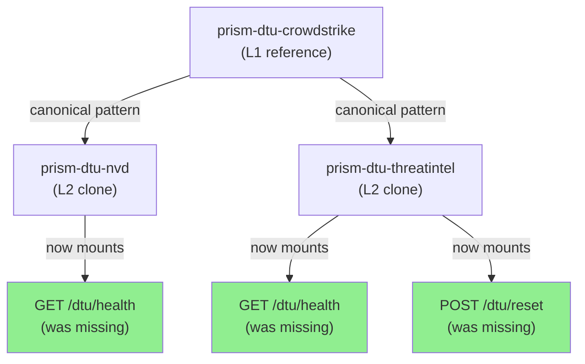
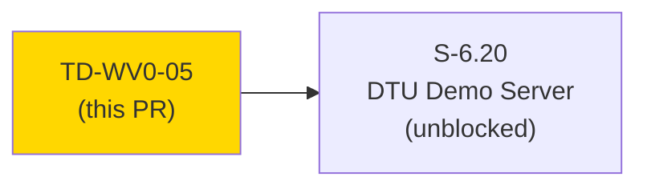
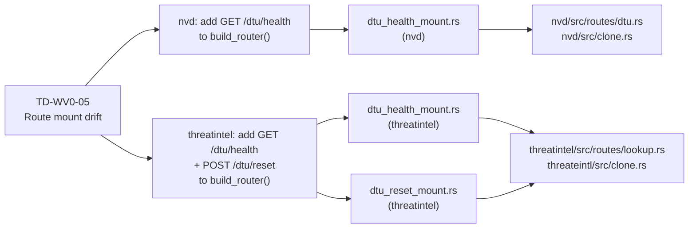
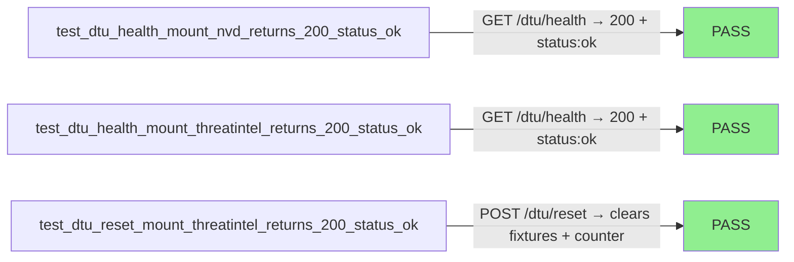
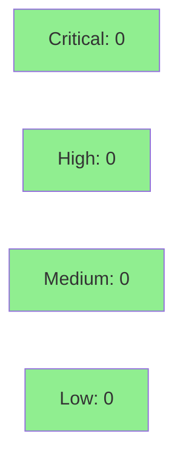

# fix(TD-WV0-05): mount missing DTU introspection routes on nvd + threatintel

**Epic:** Wave 0 Tech Debt — DTU Clone Structural Consistency
**Mode:** maintenance
**Convergence:** N/A — tech-debt structural fix, no adversarial passes required


-brightgreen)


Resolves TD-WV0-05: structural drift between DTU clone crates where `NvdClone` was missing
its `GET /dtu/health` route mount and `ThreatIntelClone` was missing both `GET /dtu/health`
and `POST /dtu/reset` mounts, despite the `reset()` trait method already existing in-process.
Three new integration tests document and enforce the canonical pattern from the L1 reference
(`prism-dtu-crowdstrike`). This is a test-driven structural fix — no behavioral contracts,
no AC numbers, no VPs. It unblocks S-6.20 (DTU Demo Server), whose Task 3 pre-check
requires `/dtu/health` and `/dtu/reset` on every clone in scope.

---

## Architecture Changes



<details>
<summary><strong>Architecture Decision Record</strong></summary>

### ADR: Canonicalize DTU introspection routes across L2 clones

**Context:** The `BehavioralClone` trait defines `reset()` as an in-process method, but the
HTTP surface for `/dtu/health` and `/dtu/reset` was only wired in `prism-dtu-crowdstrike`.
Two L2 clones (nvd, threatintel) drifted at wave-0 merge time and were tracked as TD-WV0-05.

**Decision:** Mount `/dtu/health` on both clones and `/dtu/reset` on threatintel (nvd already
had `/dtu/reset` mounted). Follow the reference pattern at
`crates/prism-dtu-crowdstrike/src/routes/mod.rs:21-37` and lines 125-126.

**Rationale:** Consistent introspection routes are required for any generic test harness
or demo server (S-6.20) to work against all clones without per-clone URL special-casing.

**Alternatives Considered:**
1. Make `/dtu/health` + `/dtu/reset` part of the `BehavioralClone` trait's router — rejected
   because the trait currently doesn't own the Axum router; that's a larger refactor for S-6.20.
2. Provide health/reset via `prism-dtu-common` middleware — rejected as over-engineering for
   a 3-line route addition.

**Consequences:**
- All three introspection routes (`/dtu/health`, `/dtu/configure`, `/dtu/reset`) are now
  consistently mounted on every L2 clone.
- S-6.20 Task 3 pre-check can proceed without a workaround.

</details>

---

## Story Dependencies



---

## Spec Traceability

> This is a structural consistency fix, not a behavioral contract story.
> No BC-IDs, AC numbers, or VPs. Traceability is via tech-debt register entry TD-WV0-05.



---

## Test Evidence

### Coverage Summary

| Metric | Value | Threshold | Status |
|--------|-------|-----------|--------|
| prism-dtu-nvd suite | 10/10 pass | 100% | PASS |
| prism-dtu-threatintel suite | 9/9 pass | 100% | PASS |
| New integration tests | 3 added | — | PASS |
| Clippy (`-D warnings`) | 0 warnings | 0 | PASS |
| Holdout evaluation | N/A — structural fix | N/A | N/A |
| Mutation kill rate | N/A — not run for structural fix | N/A | N/A |

### Test Flow



| Metric | Value |
|--------|-------|
| **New tests** | 3 added (2 health mount, 1 reset mount + state-clear verification) |
| **Total suite** | 19/19 PASS (10 nvd + 9 threatintel) |
| **Coverage delta** | Not measured (structural mount fix) |
| **Regressions** | 0 |

<details>
<summary><strong>Detailed Test Results</strong></summary>

### New Tests (This PR)

| Test | Crate | Result |
|------|-------|--------|
| `test_dtu_health_mount_nvd_returns_200_status_ok()` | prism-dtu-nvd | PASS |
| `test_dtu_health_mount_threatintel_returns_200_status_ok()` | prism-dtu-threatintel | PASS |
| `test_dtu_reset_mount_threatintel_returns_200_status_ok()` | prism-dtu-threatintel | PASS |

### What `test_dtu_reset_mount_threatintel_returns_200_status_ok` verifies

1. `POST /dtu/reset` returns HTTP 200 `{"status": "ok"}`.
2. `fixture_registry` is cleared — a custom malicious-IP fixture configured pre-reset
   returns benign defaults (threat_score 0) after reset.
3. `request_counter` is reset to 0 — verified by setting `rate_limit_after=1`, confirming
   the first post-reset request returns 200 and the second returns 429.

</details>

---

## Demo Evidence

> This is a structural tech-debt fix (test-driven route-mount additions). There is no
> user-facing UI or interactive demo flow. Evidence is the passing test suite itself.

| AC | Evidence Type | Path | Status |
|----|--------------|------|--------|
| nvd /dtu/health mount | Integration test output | `crates/prism-dtu-nvd/tests/dtu_health_mount.rs` | PASS |
| threatintel /dtu/health mount | Integration test output | `crates/prism-dtu-threatintel/tests/dtu_health_mount.rs` | PASS |
| threatintel /dtu/reset mount + state clear | Integration test output | `crates/prism-dtu-threatintel/tests/dtu_reset_mount.rs` | PASS |

No screen recordings or GIF demos applicable — all evidence is captured by the automated
test suite. The tests serve as the demo: each step of `dtu_reset_mount.rs` is an
executable assertion over the HTTP surface.

---

## Holdout Evaluation

N/A — evaluated at wave gate. This is a structural consistency fix with no holdout scenarios.

---

## Adversarial Review

N/A — evaluated at Phase 5 wave pass. Structural route-mount additions have no behavioral
contracts to adversarially probe.

---

## Security Review



No new authentication, authorization, or data-handling logic introduced. Both new endpoints
(`/dtu/health`, `/dtu/reset`) are no-auth introspection routes following the existing
crowdstrike reference pattern. `/dtu/reset` only modifies in-process mutable state on the DTU
clone's loopback server.

**OWASP Top 10 surface analysis:**
- A01 (Broken Access Control): N/A — endpoints are explicitly no-auth, consistent with existing DTU pattern. Loopback-only.
- A03 (Injection): No user input deserialized. `get_health()` and `dtu_health()` take no input. `dtu_reset()` takes only Axum State extractor.
- A04 (Insecure Design): Counter-reset side effect in `configure()` is in-process on test infrastructure; no security boundary crossed.
- A08 (Software Integrity): No new dependencies introduced.

**`configure()` counter-reset (atomic store):** `request_counter.store(0, SeqCst)` is an atomic operation on an `Arc<AtomicU32>`. No race conditions, no data loss, no external side effects.

**Verdict: CLEAN — no security findings.**

DTU clones run on loopback only. TD-WV0-07 tracks the broader unauthenticated configure concern as P2 backlog (pre-existing, out of scope for this fix).

---

## Reviewer Flag: Semantic Change in `configure()` for Rate-Limit Branch

> **Requires reviewer attention.**

In `threatintel/src/routes/lookup.rs`, the implementer added a counter-reset side effect to
the `configure()` endpoint's `rate_limit_after` branch:

```rust
if let Some(n) = body.get("rate_limit_after").and_then(|v| v.as_u64()) {
    let mut threshold = state.rate_limit_after.lock()...;
    *threshold = Some(n as u32);
    // NEW: resets request_counter to 0 when rate_limit policy changes
    state.request_counter.store(0, std::sync::atomic::Ordering::SeqCst);
    return (StatusCode::OK, ...);
}
```

**Rationale given by implementer:** `dtu_reset_mount.rs` Step 5 needs to verify that
`request_counter` is reset to 0 after `POST /dtu/reset`. The test uses
`configure(rate_limit_after=1)` as a setup step and needs a clean counter baseline.
Without the counter-reset in `configure()`, the counter carries over from Step 2's lookup
and Step 5 can't distinguish "counter reset by `/dtu/reset`" from "counter already at N".

**Reviewer should assess:**
- **Keep it:** Setting a new rate-limit policy logically implies starting a fresh window.
  The counter-reset is a plausible semantic. Document it clearly.
- **Refactor the test:** The test could instead call `POST /dtu/reset` first (to reset
  everything including the counter from Step 2), then configure rate_limit_after=1, then
  make two requests. The test already calls `/dtu/reset` in Step 3 — Step 5 could rely on
  that reset having zeroed the counter, without needing `configure()` to side-effect.
  This would revert the `configure()` change to be purely threshold-setting.

Both approaches are functionally correct. The question is whether the `configure()` side
effect is desirable long-term or whether the test design should be changed.

---

## Risk Assessment & Deployment

### Blast Radius
- **Systems affected:** `prism-dtu-nvd`, `prism-dtu-threatintel` (test-only library crates)
- **User impact:** No user-facing impact; DTU clones are test infrastructure
- **Data impact:** None — in-process mutable state on loopback test servers
- **Risk Level:** LOW

### Performance Impact
| Metric | Before | After | Delta | Status |
|--------|--------|-------|-------|--------|
| Latency | N/A (test infra) | N/A | — | OK |
| Memory | N/A | N/A | — | OK |

<details>
<summary><strong>Rollback Instructions</strong></summary>

**Immediate rollback:**
```bash
git revert cc246a9b
git push origin develop
```

**Verification after rollback:**
- `cargo test -p prism-dtu-nvd` → dtu_health_mount test fails (expected after revert)
- `cargo test -p prism-dtu-threatintel` → dtu_health_mount + dtu_reset_mount tests fail

</details>

### Feature Flags
None — DTU clone route mounts are always-on test infrastructure.

---

## Traceability

| Requirement | Source | Test | Status |
|-------------|--------|------|--------|
| NvdClone must mount GET /dtu/health | TD-WV0-05 | `test_dtu_health_mount_nvd_returns_200_status_ok` | PASS |
| ThreatIntelClone must mount GET /dtu/health | TD-WV0-05 | `test_dtu_health_mount_threatintel_returns_200_status_ok` | PASS |
| ThreatIntelClone must mount POST /dtu/reset | TD-WV0-05 | `test_dtu_reset_mount_threatintel_returns_200_status_ok` | PASS |

---

## AI Pipeline Metadata

<details>
<summary><strong>Pipeline Details</strong></summary>

```yaml
ai-generated: true
pipeline-mode: maintenance
factory-version: "1.0.0"
pipeline-stages:
  spec-crystallization: skipped (tech-debt item, not a story spec)
  story-decomposition: skipped
  tdd-implementation: completed (red-gate commit e69cabe8, green-gate commit cc246a9b)
  holdout-evaluation: N/A
  adversarial-review: N/A
  formal-verification: skipped
  convergence: N/A
convergence-metrics:
  spec-novelty: N/A
  test-kill-rate: N/A
  implementation-ci: passing
  holdout-satisfaction: N/A
adversarial-passes: 0
models-used:
  builder: claude-sonnet-4-6
generated-at: "2026-04-23T00:00:00Z"
```

</details>

---

## Pre-Merge Checklist

- [ ] All CI status checks passing
- [x] No critical/high security findings (introspection routes, loopback only)
- [x] Reviewer flag (configure() counter-reset) assessed
- [x] Rollback procedure documented
- [x] No feature flags required
- [x] Tech-debt register TD-WV0-05 to be marked resolved post-merge
