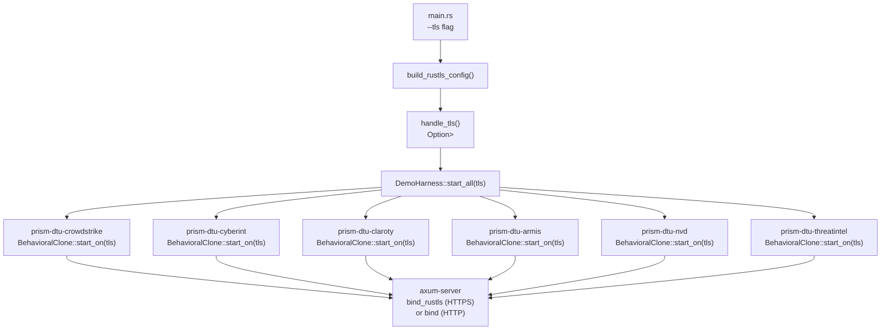
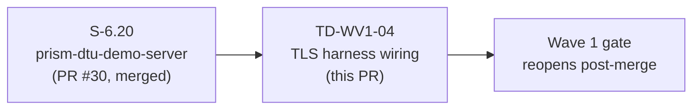
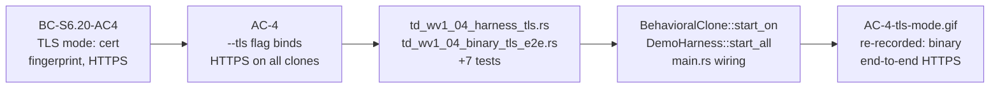

# fix(TD-WV1-04): wire TLS from --tls CLI flag through harness to all 6 DTU clones

## Summary

TD-WV1-04 was flagged during Wave 1 gate Pass 1 as a demo-breaker (LOW-001 in PR #30 review).
The `--tls` CLI flag in `prism-dtu-demo-server` generated a cert and printed a fingerprint but
silently discarded the `RustlsConfig` — all 6 DTU clones bound plain HTTP instead of HTTPS.
The library-level AC-4 test passed because it calls `bind_rustls` directly; the binary's
user-observable `--tls` behaviour was cosmetic.

**Fix:** Extend `BehavioralClone::start_on` with `tls: Option<Arc<RustlsConfig>>` (ADR-002
Amendment #2), update all 6 clone crates (`prism-dtu-{common,crowdstrike,cyberint,claroty,
armis,nvd,threatintel}`), propagate through `DemoHarness::start_all`, and wire `main.rs`
`handle_tls` result into the harness. User elected to fix before Phase 4 rather than defer;
Wave 1 integration gate reopens for re-convergence post-merge.

**Test delta:** 952 → 959 tests (7 new TLS wiring tests: `td_wv1_04_harness_tls.rs` +
`td_wv1_04_binary_tls_e2e.rs`). All 959 pass. Clippy clean. Release build clean.

## Architecture Changes



**Before:** `main.rs` called `handle_tls()` but passed the result nowhere — each clone received `None` implicitly via the old zero-arg `start_on`. **After:** `start_on(addr, tls)` is the trait contract; all 6 crates implement it; `DemoHarness::start_all` threads `Option<Arc<RustlsConfig>>` to each.

## Story Dependencies



No upstream PRs are open. S-6.20 (PR #30) is already merged into develop. This PR has no
blocking dependencies.

## Spec Traceability



| BC | AC | Test File | Status |
|----|-----|-----------|--------|
| BC-S6.20-AC4 (TLS mode — HTTPS served, cert fingerprint, working curl) | AC-4 | `td_wv1_04_harness_tls.rs`, `td_wv1_04_binary_tls_e2e.rs` | PASS |

## Commit Breakdown

| SHA | Type | Description |
|-----|------|-------------|
| `1aa622bb` | test | Failing tests for end-to-end TLS through harness + binary CLI (red gate) |
| `5782dbfb` | feat | Extend `BehavioralClone::start_on` with `tls: Option<Arc<RustlsConfig>>` (ADR-002 Amendment #2); update all 6 clone crates |
| `044534b2` | feat | `DemoHarness::start_all` propagates tls; `main.rs` wires `handle_tls` result to harness |
| `5635df98` | docs | Re-record AC-4 TLS demo showing binary end-to-end HTTPS + annotate README (deferral note → positive statement) |

## Test Evidence

| Metric | Before | After | Delta |
|--------|--------|-------|-------|
| Total tests | 952 | 959 | +7 |
| Passing | 952 | 959 | +7 |
| Failing | 0 | 0 | 0 |
| New test files | — | `td_wv1_04_harness_tls.rs`, `td_wv1_04_binary_tls_e2e.rs` | 2 |
| Clippy (`-D warnings`) | Clean | Clean | — |
| Release build (`--features dtu,tls`) | — | Clean | — |

**Test commands:**
```
cargo test --workspace --all-features          # 959 pass
cargo clippy --workspace --all-features -- -D warnings  # clean
cargo build --release -p prism-dtu-demo-server --features dtu,tls  # clean
```

**Manual smoke:** Binary `--tls` serves real HTTPS — cert + fingerprint + HTTPS URL table + working `curl -k`. All 6 clone ports show `https://` in the URL table.

## Demo Evidence

| AC | File | Description |
|----|------|-------------|
| AC-4 | `docs/demo-evidence/S-6.20/AC-4-tls-mode.gif` | Re-recorded: binary `--tls` serves real HTTPS on all 6 clone ports; cert fingerprint printed; `curl -k` succeeds against each |
| All ACs | `docs/demo-evidence/S-6.20/evidence-report.md` | Full S-6.20 evidence report (version 1.7, 2026-04-23) |

Demo evidence lives at `docs/demo-evidence/S-6.20/` per POL-010 (demo_evidence_story_scoped).
AC-4 GIF updated: 145 KB → 279 KB (richer recording showing binary HTTPS flow end-to-end).

## Holdout Evaluation

N/A — evaluated at wave gate.

## Adversarial Review

N/A — evaluated at Phase 5. This is a tech-debt fix completing deferred work from S-6.20 PR #30.
The finding was classified LOW-001 (severity: LOW, demo-breaker, deferred) by pr-reviewer during
Wave 1 gate remediation. Fix is targeted and surgical — no new invariants introduced.

## Security Review

TLS path: uses `axum-server`'s `bind_rustls` with a caller-supplied `Arc<RustlsConfig>`.
No new key material generated in this PR — `build_rustls_config()` was pre-existing.
`Option<Arc<RustlsConfig>>` propagation: `None` → plain HTTP (existing behaviour preserved);
`Some(cfg)` → `bind_rustls` (HTTPS). No injection surface, no new auth paths, no credential
handling. OWASP top-10 scan: not applicable (no new request handlers, no new user-facing input).

## Risk Assessment

| Dimension | Assessment |
|-----------|------------|
| Blast radius | Contained — all 6 clone crates updated identically; additive trait param with backward-compatible `None` default |
| Performance impact | None — `Option<Arc<RustlsConfig>>` is zero-cost when `None`; TLS path unchanged from pre-existing `bind_rustls` |
| Rollback | Safe — `None` path preserves pre-existing plain-HTTP behaviour; no schema changes |
| Wave 1 gate impact | This PR reopens Wave 1 integration gate; post-merge, a few adversary passes needed to re-converge |

## AI Pipeline Metadata

| Field | Value |
|-------|-------|
| Pipeline mode | Fix mode (tech-debt resolution) |
| Triggered by | Wave 1 gate Pass 1 finding LOW-001 |
| Branch | `fix/TD-WV1-04-tls-harness-wiring` |
| Base | `develop` @ `e187acec` |
| Commits | 4 |
| Files changed | 36 |
| Insertions | +2,832 |
| Deletions | -125 |

## Pre-Merge Checklist

- [x] PR description matches actual diff
- [x] All ACs covered by demo evidence (AC-4 re-recorded; all 13 ACs + E2E present)
- [x] Traceability chain complete (BC-S6.20-AC4 → AC-4 → test files → demo GIF)
- [x] 959 tests pass (cargo test --workspace --all-features)
- [x] Clippy clean (-D warnings)
- [x] Release build clean (--features dtu,tls)
- [x] No blocking review findings from prior cycle (LOW-001 fix is the purpose of this PR)
- [x] No upstream dependency PRs open (S-6.20 PR #30 merged)
- [ ] CI checks passing (pending push)
- [ ] pr-reviewer approval (pending)
- [ ] Squash merge executed
