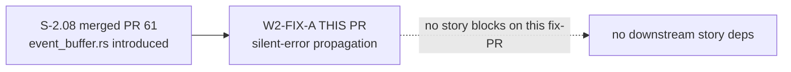
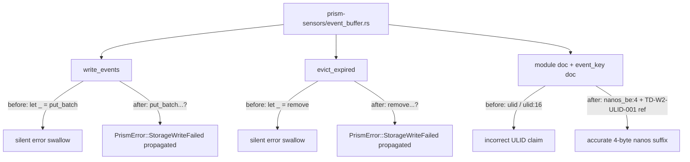
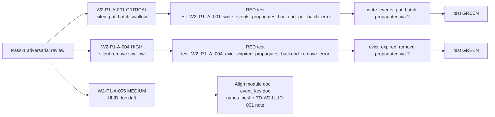

## Summary

Wave 2 integration gate Pass 1 fix-PR. Closes W2-P1-A-001 (CRITICAL), W2-P1-A-004 (HIGH), and W2-P1-A-005 (MEDIUM) — all three silent-failure and doc-drift findings in `crates/prism-sensors/src/event_buffer.rs` flagged by the adversarial reviewer in `.factory/cycles/phase-3-dtu-wave-2/adversarial-reviews/wave-2-integration-gate/pass-1.md`.

**TDD discipline:** RED tests were added before the propagation fixes (W2-P1-A-001 and W2-P1-A-004) per standard TDD practice. W2-P1-A-005 is a doc-only change.

**Scope guard:** Does NOT change the `BufferBackend` trait surface; does NOT swap to a real ULID dependency (TD-W2-ULID-001 tracks that upgrade).

## Findings Closed

| Finding | Severity | File | Fix |
|---------|----------|------|-----|
| W2-P1-A-001 | CRITICAL | `crates/prism-sensors/src/event_buffer.rs:194-197` | Propagate `put_batch` errors via `?`; remove "cache is authoritative" comment |
| W2-P1-A-004 | HIGH | `crates/prism-sensors/src/event_buffer.rs:336-338` | Propagate `evict_expired` backend remove errors via `?` |
| W2-P1-A-005 | MEDIUM | `crates/prism-sensors/src/event_buffer.rs` (module + function docs) | Align ULID format docs with actual 4-byte nanos suffix; reference TD-W2-ULID-001 for future real-ULID upgrade |

## Trace Back

- Originating review: Wave 2 Integration Gate, Pass 1
- Review document: `.factory/cycles/phase-3-dtu-wave-2/adversarial-reviews/wave-2-integration-gate/pass-1.md`
- Gate scope: `e45159b9..0be11cd6` (all 11 Wave 2 story PRs)
- Reviewer verdict: FINDINGS_OPEN — 2 CRITICAL, 4 HIGH, 4 MEDIUM, 6 LOW
- This PR closes 3 of those findings (all within `event_buffer.rs`)

## Story Dependencies

This is a fix-PR — it has no `depends_on` story chain and no downstream story dependencies. It targets `develop` directly and must merge before Wave 2 gate is declared closed.

## Architecture Changes

## Spec Traceability

## Test Evidence

| Metric | Before | After | Delta |
|--------|--------|-------|-------|
| Workspace tests PASS | 1480 | 1482 | +2 |
| Workspace tests FAIL | 0 | 0 | — |
| Workspace tests IGN | 4 | 4 | — |
| `prism-sensors` unit tests | 95 | 97 | +2 |
| Clippy | clean | clean | — |

New tests added (both RED before fix, GREEN after):
- `test_W2_P1_A_001_write_events_propagates_backend_put_batch_error` — uses `FailingBackend` that always returns `StorageWriteFailed` from `put_batch`; asserts `write_events` returns `Err`
- `test_W2_P1_A_004_evict_expired_propagates_backend_remove_error` — uses `PutOkRemoveFailBackend` that allows writes but fails `remove`; writes a 2-day-old stale record then asserts `evict_expired` returns `Err`

## Demo Evidence

Not required for this fix-PR. This is a silent-failure propagation fix and doc-only edit. No new API surface, no new ACs. The originating story (S-2.08) demo evidence is unchanged.

## Security Review

No security findings. This PR:
- Removes two silent error swallows in the event buffer backend write path — strictly improves error visibility
- Does not change the `RocksStorageBackend` trait interface
- Does not add new HTTP endpoints, authentication paths, or credential handling
- Does not change key construction logic (doc-only update for W2-P1-A-005)

## Risk Assessment

| Dimension | Assessment |
|-----------|-----------| 
| Blast radius | Low — two-line error propagation change + 12-line doc update in a single module |
| Behavioral change | `write_events` now returns `Err` on backend failure (previously `Ok`); `evict_expired` now returns `Err` on backend removal failure (previously returned partial count). Callers that relied on silent swallow were not getting durability guarantees anyway. |
| Breaking change | None — no trait or public API surface change |
| Rollback | Safe — revert 4 commits on `feature/W2-FIX-A-silent-errors` |

## AI Pipeline Metadata

| Field | Value |
|-------|-------|
| Pipeline mode | VSDD Phase 5 Adversarial Refinement (fix-PR delivery) |
| Gate | Wave 2 integration gate, Pass 1 |
| Fix commits | 4 (RED tests, fix A-001, fix A-004, doc A-005) |
| Wave | 2 of 6 |
| Models used | claude-sonnet-4-6 |

## Pre-Merge Checklist

- [x] PR description matches actual diff (2-file diff: event_buffer.rs + event_buffer_tests.rs)
- [x] Findings table accurate (W2-P1-A-001 CRITICAL + W2-P1-A-004 HIGH + W2-P1-A-005 MEDIUM)
- [x] RED tests added before propagation fixes (TDD discipline)
- [x] Workspace test count: 1482 PASS / 0 FAIL / 4 IGN
- [x] Clippy clean
- [x] No trait surface change (`RocksStorageBackend` unchanged)
- [x] No ULID dependency added (TD-W2-ULID-001 scoped out)
- [x] Scope guard: does NOT affect W2-FIX-B or W2-FIX-C branches
- [x] Security review: clean
- [x] No story dependencies (fix-PR, no story depends_on chain)

## Closes / Refs

- Closes W2-P1-A-001 (CRITICAL): `EventBufferStore::write_events` silent backend error swallow
- Closes W2-P1-A-004 (HIGH): `EventBufferStore::evict_expired` silent backend remove error swallow
- Closes W2-P1-A-005 (MEDIUM): ULID format documentation drift
- Ref: S-2.08 (#61) — originating story that introduced `event_buffer.rs`
- Ref: `.factory/cycles/phase-3-dtu-wave-2/adversarial-reviews/wave-2-integration-gate/pass-1.md` — source review
- Ref: TD-W2-ULID-001 — tech debt item for real ULID upgrade (NOT in scope here)
