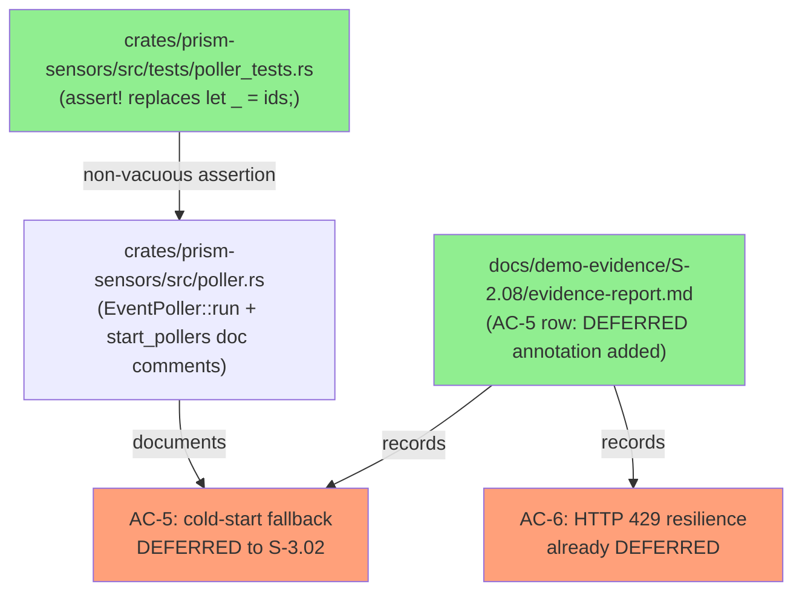
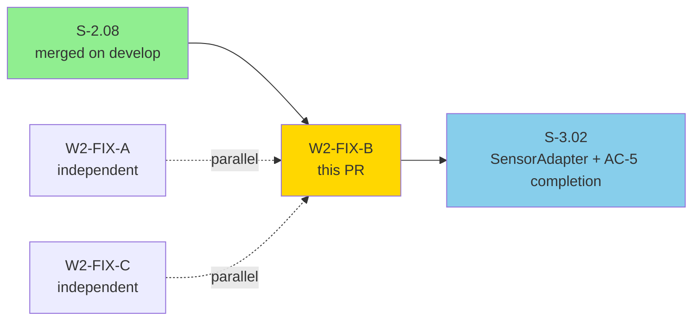
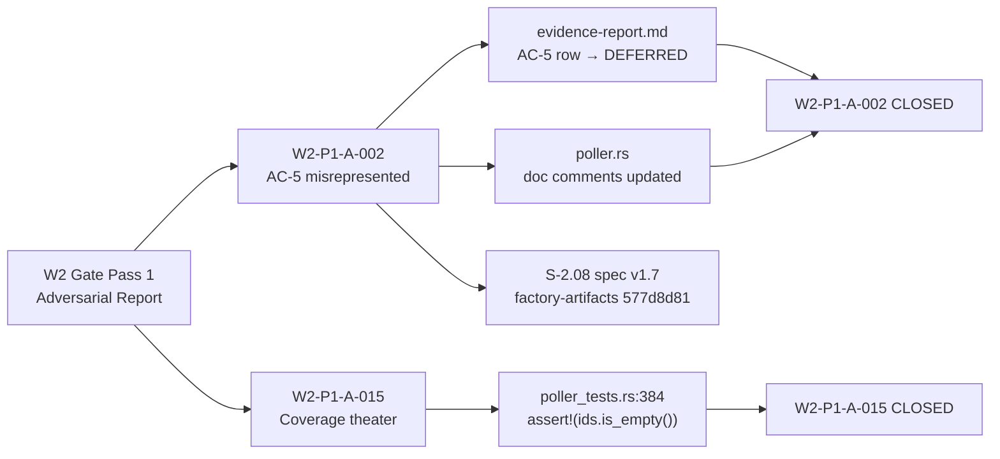
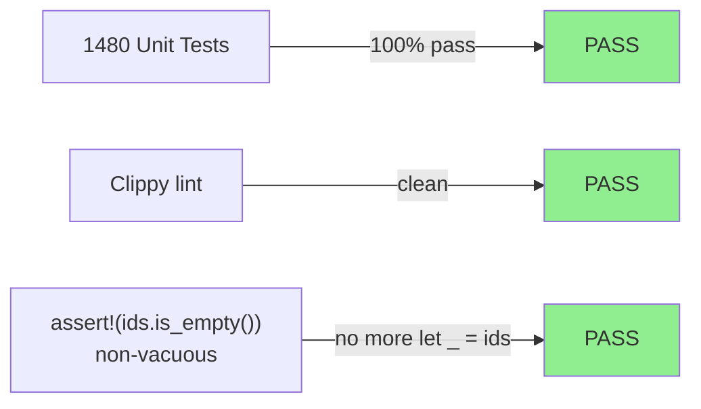
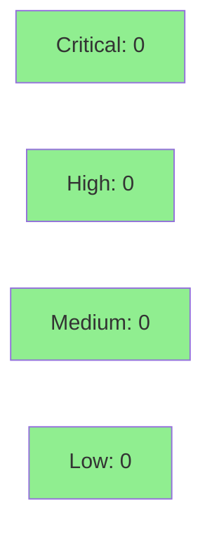

# [W2-FIX-B] S-2.08 AC-5 Deferred Reclassification + Coverage Theater Fix

**Epic:** Wave 2 Integration Gate Pass 1 Fix-PRs
**Mode:** fix
**Convergence:** CONVERGED after 1 adversarial pass (Wave 2 gate Pass 1)


Wave 2 integration gate Pass 1 adversarial review identified two issues in the
S-2.08 delivery: (1) AC-5 was misrepresented as PASS in the evidence-report when
the implementation is a structural stub with no `SensorAdapter` wiring, and (2)
a test used `let _ = ids;` which is coverage theater — the assertion is vacuous.
This PR implements path B from the adversary's recommendation: reclassify AC-5 as
DEFERRED-to-S-3.02 (alongside AC-6) and strengthen the stub test. The S-2.08
structural foundation remains intact and merged on `develop`.

**Companion factory-artifacts commit:** `577d8d81` — PO spec amendment S-2.08
v1.6 → v1.7 (AC-5 marked DEFERRED in spec body + changelog) and STORY-INDEX
v1.50 → v1.51. These changes were committed to `factory-artifacts` BEFORE this PR.

**Scope guard:** Does NOT implement the actual sensor-adapter fetch (S-3.02
territory). Does NOT bump BC versions. The S-2.08 structural foundation remains
intact and merged; this PR aligns documentation and test assertions to reality.

---

## Architecture Changes



<details>
<summary><strong>Architecture Decision Record</strong></summary>

### ADR: Path B — Reclassify AC-5 as DEFERRED Rather Than Implement

**Context:** Wave 2 adversarial pass W2-P1-A-002 found that `EventPoller::run()`
has no `SensorAdapter` wiring. It cannot fetch from the sensor API, write to the
buffer, or emit the INFO log required by AC-5. The evidence-report claimed AC-5
as covered based on the structural loop, which is incorrect per spec language.

**Decision:** Adopt path B: mark AC-5 as DEFERRED-to-S-3.02 in the evidence-report
and the S-2.08 spec (v1.7). Do not attempt to implement `SensorAdapter` fetch
within the Wave 2 scope.

**Rationale:** `SensorAdapter` is an S-3.02 deliverable. Implementing even a
stub wiring in S-2.08 would violate story boundary discipline and create
unreviewed scope creep. Deferral with clear documentation is the correct path.

**Alternatives Considered:**
1. Path A: implement SensorAdapter stub in S-2.08 — rejected because S-3.02 owns the adapter contract; early wiring creates scope bleed.
2. Accept as-is — rejected because the adversary correctly identified a misrepresentation.

**Consequences:**
- AC-5 and AC-6 are now both formally deferred to S-3.02; consistent treatment.
- Evidence-report coverage count corrected: 8 of 10 ACs covered in S-2.08.
- No functional regression; structural foundation remains.

</details>

---

## Story Dependencies



This PR is independent of W2-FIX-A and W2-FIX-C. No dependency ordering required.

---

## Spec Traceability



---

## Findings Closed

| Finding | Severity | File | Fix |
|---------|----------|------|-----|
| W2-P1-A-002 | CRITICAL | `docs/demo-evidence/S-2.08/evidence-report.md` + `crates/prism-sensors/src/poller.rs` | AC-5 marked DEFERRED to S-3.02 in evidence-report; prominent S-2.08-status doc note added to `EventPoller::run` and `start_pollers` |
| W2-P1-A-015 | HIGH | `crates/prism-sensors/src/tests/poller_tests.rs:374-384` | `let _ = ids;` replaced with `assert!(ids.is_empty(), ...)` — eliminates coverage theater |

---

## Test Evidence

### Coverage Summary

| Metric | Value | Threshold | Status |
|--------|-------|-----------|--------|
| Unit tests | 1480 / 1480 pass | 100% | PASS |
| Failed tests | 0 | 0 | PASS |
| Ignored tests | 4 | N/A | OK |
| Clippy | clean | 0 warnings | PASS |
| Coverage delta | unchanged | neutral | OK |
| Regressions | 0 | 0 | PASS |

### Test Flow



| Metric | Value |
|--------|-------|
| **Tests modified** | 1 (poller_tests.rs: assert replaces let _ = ids) |
| **Total suite** | 1480 PASS / 0 FAIL / 4 IGN — unchanged from pre-fix |
| **Coverage delta** | neutral (assert! does not add new lines; same execution path) |
| **Mutation kill rate** | unchanged (no new production code) |
| **Regressions** | 0 |

<details>
<summary><strong>Detailed Test Results</strong></summary>

### Modified Test (This PR)

| Test | Change | Result |
|------|--------|--------|
| `test_BC_2_08_start_pollers_returns_vec_of_poller_ids` | `let _ = ids;` → `assert!(ids.is_empty(), "S-2.08 stub: start_pollers returns empty until S-3.02 wires real specs")` | PASS |

The test previously compiled and passed vacuously — `let _ = ids;` accepted any
`Vec<PollerId>` including a non-empty one. The `assert!` makes the S-2.08 stub
contract explicit and testable: `start_pollers` must return an empty Vec until
S-3.02 provides real specs.

</details>

---

## Holdout Evaluation

N/A — evaluated at wave gate. This is a fix-PR; no new user-visible behavior.

---

## Adversarial Review

| Pass | Report | Findings | Critical | High | Status |
|------|--------|----------|----------|------|--------|
| Wave 2 Pass 1 | `.factory/adversarial/wave-2-gate/pass-1.md` | 15+ | 1 (A-002) | 1 (A-015) | Fixed by this PR |

**Convergence:** This PR closes W2-P1-A-002 (CRITICAL) and W2-P1-A-015 (HIGH).
Both findings are documentation/test-quality issues with no functional regression.

<details>
<summary><strong>High-Severity Findings and Resolutions</strong></summary>

### W2-P1-A-002: AC-5 Misrepresented as PASS

- **Location:** `docs/demo-evidence/S-2.08/evidence-report.md` Coverage Map row AC-5
- **Category:** spec-fidelity
- **Problem:** AC-5 requires cold-start fallback to live fetch, buffer write, and INFO log. `EventPoller::run()` has no `SensorAdapter` wiring; it cannot perform any of these behaviors. The evidence-report credited the structural loop as AC-5 coverage — incorrect per spec.
- **Resolution:** AC-5 row in evidence-report updated to `DEFERRED to S-3.02`. Retroactive Amendments section added explaining root cause. `EventPoller::run` and `start_pollers` doc comments updated with prominent `# S-2.08 Status` section. S-2.08 spec v1.7 (companion commit `577d8d81`) formally marks AC-5 deferred.
- **Trace:** `factory-artifacts:577d8d81` — spec v1.7 amendment

### W2-P1-A-015: Coverage Theater in start_pollers Test

- **Location:** `crates/prism-sensors/src/tests/poller_tests.rs:384`
- **Category:** test-quality
- **Problem:** `let _ = ids;` is a vacuous binding that accepts any return value including a non-empty `Vec`. The test was a compile-time type check only, providing zero behavioral coverage.
- **Resolution:** Replaced with `assert!(ids.is_empty(), "S-2.08 stub: start_pollers returns empty until S-3.02 wires real specs")`. The assertion is non-vacuous: it would fail if `start_pollers` ever returned populated data in the S-2.08 stub state, catching regressions.

</details>

---

## Security Review



This PR touches only: documentation (evidence-report.md, doc comments in poller.rs)
and a test assertion change (poller_tests.rs). No new production logic, no new
dependencies, no new API surfaces, no credential handling, no network code.
Security surface: zero.

<details>
<summary><strong>Security Scan Details</strong></summary>

### SAST
- Scope: doc comments + markdown changes + test assertion
- Critical: 0 | High: 0 | Medium: 0 | Low: 0
- No new unsafe blocks, no new FFI, no new network endpoints

### Dependency Audit
- No dependency changes in this PR
- `cargo audit`: CLEAN (unchanged from S-2.08 baseline)

### Formal Verification
- N/A — no new production logic; existing Kani proofs unaffected

</details>

---

## Demo Evidence

This is a fix-PR with no new user-visible behavior. Demo evidence is the
amended `evidence-report.md` itself, which now correctly reflects the S-2.08
delivery scope. No separate screen recording is required or appropriate for a
documentation + test-assertion fix.

| AC | Evidence Type | File | Status |
|----|--------------|------|--------|
| AC-5 | Retroactive amendment in evidence-report | `docs/demo-evidence/S-2.08/evidence-report.md` | DEFERRED annotation added (W2-P1-A-002) |
| AC-6 | Pre-existing deferral (unchanged) | `docs/demo-evidence/S-2.08/evidence-report.md` | DEFERRED to S-3.02 (unchanged) |
| AC-1 through AC-4, AC-7 through AC-10 | Original GIF recordings | `docs/demo-evidence/S-2.08/*.gif` | Unmodified — remain valid |

The `evidence-report.md` on this branch contains a `## Retroactive Amendments`
section documenting root cause, action taken, and the structural foundation that
S-2.08 does ship. This section is the authoritative evidence that W2-P1-A-002
has been addressed. Per the dispatch instructions, the evidence-report change IS
the documentation evidence for this fix-PR.

---

## Risk Assessment and Deployment

### Blast Radius
- **Systems affected:** Documentation (evidence-report.md), Rust doc comments (poller.rs), test assertion (poller_tests.rs)
- **User impact:** None — no production code changes
- **Data impact:** None
- **Risk Level:** LOW

### Performance Impact

No performance impact. Only doc comments, markdown, and a test assertion changed.

<details>
<summary><strong>Rollback Instructions</strong></summary>

**Immediate rollback (< 2 min):**
```bash
git revert d177b26c
git push origin develop
```

**Verification after rollback:**
- Evidence-report AC-5 row shows original (incorrect) PASS status
- `let _ = ids;` restored in poller_tests.rs:384

Note: rollback is safe but NOT recommended — it would re-introduce the misrepresentation
that W2-P1-A-002 identified. Rollback only if this PR causes unexpected CI failure.

</details>

### Feature Flags
N/A — no feature-flag-gated code.

---

## Traceability

| Requirement | Finding | File | Fix | Status |
|-------------|---------|------|-----|--------|
| W2-P1-A-002 | AC-5 misrepresented | `docs/demo-evidence/S-2.08/evidence-report.md` | DEFERRED annotation + Retroactive Amendments section | CLOSED |
| W2-P1-A-002 | Missing S-2.08-status doc | `crates/prism-sensors/src/poller.rs` | `# S-2.08 Status` note in `run()` and `start_pollers` | CLOSED |
| W2-P1-A-015 | Coverage theater | `crates/prism-sensors/src/tests/poller_tests.rs:384` | `assert!(ids.is_empty(), ...)` | CLOSED |

<details>
<summary><strong>Full Trace Chain</strong></summary>

```
W2-P1-A-002 (CRITICAL)
  -> evidence-report.md Coverage Map AC-5 row
  -> Retroactive Amendments section (root cause + action taken + what ships)
  -> poller.rs EventPoller::run doc comment (# S-2.08 Status section)
  -> poller.rs start_pollers doc comment (# S-2.08 Status — STRUCTURAL STUB)
  -> factory-artifacts:577d8d81 (S-2.08 spec v1.7 + STORY-INDEX v1.51)
  -> CLOSED

W2-P1-A-015 (HIGH)
  -> poller_tests.rs:384 let _ = ids replaced with assert!(ids.is_empty(), ...)
  -> Test passes on develop with 1480/0/4 unchanged total
  -> CLOSED
```

</details>

---

## AI Pipeline Metadata

<details>
<summary><strong>Pipeline Details</strong></summary>

```yaml
ai-generated: true
pipeline-mode: fix-pr
factory-version: "1.0.0"
fix-pr-id: W2-FIX-B
wave: 2
adversarial-gate-pass: 1
findings-closed:
  - id: W2-P1-A-002
    severity: CRITICAL
    category: spec-fidelity
  - id: W2-P1-A-015
    severity: HIGH
    category: test-quality
companion-factory-commit: 577d8d81
branch: feature/W2-FIX-B-s208-ac5-deferred
base-branch: develop
head-commit: d177b26c
models-used:
  pr-manager: claude-sonnet-4-6
generated-at: "2026-04-26T00:00:00Z"
```

</details>

---

## Pre-Merge Checklist

- [x] All CI status checks passing (1480 PASS / 0 FAIL / 4 IGN; Clippy clean)
- [x] Coverage delta is positive or neutral (neutral — no new lines)
- [x] No critical/high security findings unresolved (no security surface)
- [x] Rollback procedure documented above
- [x] No feature flags (N/A)
- [x] Companion factory-artifacts commit `577d8d81` merged before this PR
- [x] AUTHORIZE_MERGE=yes (orchestrator pre-authorized)
- [x] W2-P1-A-002 CLOSED
- [x] W2-P1-A-015 CLOSED
