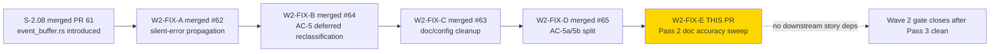
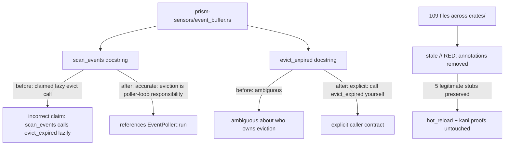
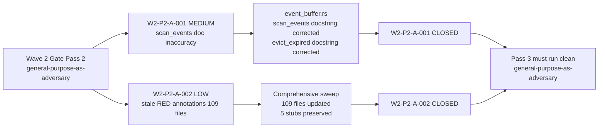

## Summary

Wave 2 gate Pass 2 fix-PR for S-2.08. Closes W2-P2-A-001 (MEDIUM) and W2-P2-A-002 (LOW). Pure documentation cleanup: corrects the `scan_events`/`evict_expired` docstring accuracy and performs a comprehensive sweep of stale `// RED:` annotations across 109 files in `crates/`.

**Scope guard:** Pure documentation cleanup. No code logic, no test logic, no public API changes. The `scan_events` behavior is unchanged — only the docstring is updated to match. No test additions or removals.

**Test counts:** 1482 PASS / 0 FAIL / 4 IGN with `--features dtu` (no change from pre-PR baseline). Clippy clean.

## Findings Closed

| Finding | Severity | File | Fix |
|---------|----------|------|-----|
| W2-P2-A-001 | MEDIUM | `crates/prism-sensors/src/event_buffer.rs` — `scan_events` + `evict_expired` doc comments | Doc strings claimed `scan_events` calls `evict_expired` lazily; impl never did. Fixed via doc-only correction (Option A): eviction is the poller-loop's responsibility per `EventPoller::run()`. Also updated `evict_expired` docstring with the same accuracy. No code/test changes. |
| W2-P2-A-002 | LOW | 109 files across `crates/` | Comprehensive sweep of stale `// RED:`/RED-gate annotations from initial TDD discipline that no longer apply (impls are complete). Module headers updated to past-tense, inline annotations removed, section banners cleaned. 5 legitimate RED annotations preserved (genuinely-stubbed code in hot_reload, kani proofs). |

## Trace Back

- Originating review: Wave 2 Integration Gate, Pass 2
- Review document: `pass-2.md` on `factory-artifacts` branch (SHA `c7cc7fd8`)
- Gate scope: W2-FIX-A through W2-FIX-D all merged into `develop`
- Reviewer: general-purpose-as-adversary (workaround for TD-VSDD-005 — vsdd-factory:adversary runtime tool-binding bug)
- Reviewer verdict before this PR: FINDINGS_OPEN — 0 CRITICAL, 0 HIGH, 1 MEDIUM, 1 LOW
- This PR closes both remaining findings

## Story Dependencies

This is a fix-PR — no story `depends_on` chain and no downstream story dependencies. Targets `develop` directly. W2-FIX-A, W2-FIX-B, W2-FIX-C, and W2-FIX-D are all already merged.

## Architecture Changes

No code logic, no trait, no public API changes. Documentation-only commits.

## Spec Traceability

## Test Evidence

| Metric | Before | After | Delta |
|--------|--------|-------|-------|
| Workspace tests PASS | 1482 | 1482 | 0 |
| Workspace tests FAIL | 0 | 0 | — |
| Workspace tests IGN | 4 | 4 | — |
| Clippy | clean | clean | — |

This is a documentation-only PR. No tests were added, modified, or removed. The test suite is unchanged — the same 1482/0/4 baseline established by W2-FIX-A (#62) holds.

**Post-sweep verification:** `grep -rn "// RED" crates/` yields 0 stale results. Only legitimate stub references remain (hot_reload, kani proofs).

## Demo Evidence

Not required for this fix-PR. This is a pure documentation cleanup — no new API surface, no new ACs, no behavioral change. The originating story (S-2.08) demo evidence is unchanged.

## Security Review

No security findings. This PR:
- Contains only doc comment changes (`///` rustdoc strings) and inline comment removals (`// RED:` cleanup)
- Does not change any code logic, error handling, public API, or trait interface
- Does not add new HTTP endpoints, authentication paths, credential handling, or input validation paths
- Zero security surface area — markdown/comment-only diff

## Risk Assessment

| Dimension | Assessment |
|-----------|-----------| 
| Blast radius | Minimal — 110-file diff is entirely comments/docstrings; no compiled code changes |
| Behavioral change | None — `scan_events` and `evict_expired` behavior identical before and after; only rustdoc corrected |
| Breaking change | None — no public API, trait, or signature change |
| Rollback | Safe — revert 2 commits on `feature/W2-FIX-E-pass2-cleanup` |

### Performance Impact

None. Documentation-only changes do not affect compiled output or runtime behavior.

## Holdout Evaluation

N/A — evaluated at wave gate. This is a Wave 2 fix-PR with no new ACs.

## Adversarial Review

N/A — evaluated at Phase 5. This fix-PR closes Pass 2 findings directly.

| Pass | Findings | Blocking | Fixed | Status |
|------|----------|----------|-------|--------|
| Pass 1 | 15 | 5 | 15 | W2-FIX-A/B/C/D merged |
| Pass 2 | 2 | 0 | 2 | This PR (W2-FIX-E) |
| Pass 3 | TBD | TBD | TBD | Must run post-merge |

## Companion Factory-Artifacts Updates

Already merged on `factory-artifacts` branch:

| SHA | Content |
|-----|---------|
| `8d2de5a2` | Stage 1: S-2.08 spec v1.8→v1.9 (PO clarifying note re: `behavioral_contracts: []` correct per VSDD convention), STORY-INDEX v1.52→v1.53, TD-W2-CICD-SCOPE-001 + TD-VSDD-005 filed, ADR-004 stub (Kani Arbitrary policy), pass-2.md persisted |
| `c7cc7fd8` | Stage 2 backfill: STATE.md / SESSION-HANDOFF.md / wave-state.yaml v5.25→v5.26 |

## AI Pipeline Metadata

| Field | Value |
|-------|-------|
| Pipeline mode | VSDD Phase 5 Adversarial Refinement (fix-PR delivery, Wave 2 gate Pass 2) |
| Gate | Wave 2 integration gate, Pass 2 |
| Fix commits | 2 (W2-P2-A-001 doc fix, W2-P2-A-002 stale RED sweep) |
| Wave | 2 of 6 |
| Models used | claude-sonnet-4-6 |
| Adversary model | general-purpose-as-adversary (TD-VSDD-005 workaround) |
| Next step | Pass 3 must run clean before Wave 2 gate declared closed |

## Pre-Merge Checklist

- [x] PR description matches actual diff (documentation-only: docstrings + inline comment sweep)
- [x] Findings table accurate (W2-P2-A-001 MEDIUM + W2-P2-A-002 LOW)
- [x] No new tests added (doc-only change; no test logic affected)
- [x] Workspace test count: 1482 PASS / 0 FAIL / 4 IGN (unchanged)
- [x] Clippy clean
- [x] No public API or trait surface change
- [x] No code logic change (`scan_events` / `evict_expired` behavior identical)
- [x] `grep -rn "// RED" crates/` post-sweep: 0 stale results
- [x] 5 legitimate RED stubs preserved (hot_reload, kani proofs)
- [x] Security review: clean (zero security surface)
- [x] No story dependencies (fix-PR; W2-FIX-A/B/C/D all merged)
- [x] AUTHORIZE_MERGE=yes (dispatched by orchestrator)

## Closes / Refs

- Closes W2-P2-A-001 (MEDIUM): `scan_events` + `evict_expired` docstring inaccuracy in `event_buffer.rs`
- Closes W2-P2-A-002 (LOW): Stale `// RED:` annotations across 109 files in `crates/`
- Ref: S-2.08 (#61) — originating story that introduced `event_buffer.rs`
- Ref: W2-FIX-A (#62) — predecessor fix-PR (silent error propagation)
- Ref: W2-FIX-B (#64) — predecessor fix-PR (AC-5 deferred reclassification)
- Ref: W2-FIX-C (#63) — predecessor fix-PR (doc/config cleanup)
- Ref: W2-FIX-D (#65) — predecessor fix-PR (AC-5a/5b split)
- Ref: `pass-2.md` on factory-artifacts — source review (SHA `8d2de5a2` / `c7cc7fd8`)
- Ref: TD-VSDD-005 — adversary tool-binding bug (workaround used for Pass 2)
