## Summary

Wave 2 gate Pass 5 fix-PR. Closes W2-P5-A-001 (LOW) and W2-P5-A-002 (LOW). Pure documentation cleanup: aligns the `redaction.rs` module rustdoc with the actual `[REDACTED]` sentinel constant, and sweeps stale `todo!()` narrative prose from 7 test files that were missed by W2-FIX-E's grep scope.

**Scope guard:** Pure documentation cleanup. No code logic, no test logic, no public API changes. The `redact()` function behavior is unchanged — only the module docstring is updated to match. No test additions or removals.

**Test counts:** 1482 PASS / 0 FAIL / 4 IGN with `--features dtu` (no change from pre-PR baseline). Clippy clean.

## Findings Closed

| Finding | Severity | File | Fix |
|---------|----------|------|-----|
| W2-P5-A-001 | LOW | `crates/prism-audit/src/redaction.rs:4` | Module rustdoc claimed the sentinel was `***REDACTED***`; the actual constant is `[REDACTED]`. PR #58 (S-2.04 v1.5) updated the constant + `lib.rs` + `audit_entry.rs` but missed this docstring. Fixed: docstring now reads `"[REDACTED]"`. |
| W2-P5-A-002 | LOW | 7 test files across `crates/prism-sensors/src/tests/` and `crates/prism-storage/src/tests/` | W2-FIX-E's stale-RED sweep grepped only `// RED` inline annotations. 7 test files retained stale `todo!()` narrative prose in doc comments — some self-contradictory ("function body is a todo!() stub … All tests pass"). Cleaned to past tense or stripped. |

Files fixed (W2-P5-A-002):
- `crates/prism-sensors/src/tests/bc_2_01_002.rs`
- `crates/prism-sensors/src/tests/bc_2_01_010.rs`
- `crates/prism-sensors/src/tests/bc_2_01_http_semaphore.rs`
- `crates/prism-sensors/src/tests/event_buffer_tests.rs`
- `crates/prism-storage/src/tests/audit_buffer_tests.rs`
- `crates/prism-storage/src/tests/decorator_tests.rs`
- `crates/prism-storage/src/tests/internal_table_tests.rs`

## Trace Back

- Originating review: Wave 2 Integration Gate, Pass 5
- Review document: `pass-5.md` on `factory-artifacts` branch (SHA on factory-artifacts at `74057c35`)
- Gate scope: W2-FIX-A through W2-FIX-E all merged into `develop`
- Reviewer: general-purpose-as-adversary (parallel with Pass 4; TD-VSDD-005 workaround)
- Reviewer verdict before this PR: FINDINGS_OPEN — 0 CRITICAL, 0 HIGH, 0 MEDIUM, 3 LOW
- This PR closes 2 of those findings (W2-P5-A-003 deferred as TD-W2-MUTATE-005)

## Story Dependencies

```mermaid
graph LR
    S208[S-2.08 merged PR 61\nevent_buffer.rs introduced] --> FIXA[W2-FIX-A merged #62\nsilent-error propagation]
    FIXA --> FIXB[W2-FIX-B merged #64\nAC-5 deferred reclassification]
    FIXB --> FIXC[W2-FIX-C merged #63\ndoc/config cleanup]
    FIXC --> FIXD[W2-FIX-D merged #65\nAC-5a/5b split]
    FIXD --> FIXE[W2-FIX-E merged #66\nPass 2 doc accuracy sweep]
    FIXE --> FIXF[W2-FIX-F THIS PR\nPass 5 doc cleanup]
    FIXF -.->|Pass 6 must converge clean| GATE[Wave 2 gate: 3 clean passes min\nPass 3 + Pass 4 already CONVERGED]
    style FIXF fill:#FFD700
```



This is a fix-PR — no story `depends_on` chain and no downstream story dependencies. Targets `develop` directly. W2-FIX-A through W2-FIX-E are all already merged.

## Architecture Changes

```mermaid
graph TD
    REDACT[prism-audit/src/redaction.rs] --> MODDOC[Module-level rustdoc :4]
    MODDOC -->|before: claimed sentinel was ***REDACTED***| WRONG[stale sentinel string in doc]
    MODDOC -->|after: matches actual REDACTED_VALUE constant| CORRECT["\"[REDACTED]\" — matches impl"]
    TESTS[7 test files in prism-sensors + prism-storage] --> PROSE[todo!() narrative prose in doc comments]
    PROSE -->|before: stale self-contradictory stub language| STALE[\"function body is a todo!() stub ... All tests pass\"]
    PROSE -->|after: past-tense or stripped| CLEAN[consistent with passing implementation]
```

No code logic, no trait, no public API changes. Documentation-only commits.

## Spec Traceability

```mermaid
flowchart LR
    PASS5[Wave 2 Gate Pass 5\ngeneral-purpose-as-adversary\nparallel with Pass 4] --> A001[W2-P5-A-001 LOW\nredaction.rs module doc sentinel drift]
    PASS5 --> A002[W2-P5-A-002 LOW\nstale todo narrative 7 test files]
    PASS5 --> A003[W2-P5-A-003 LOW\nS-2.06 RED ratio carve-out question]
    A001 --> DOCFIX1[redaction.rs:4\nmodule rustdoc updated\n***REDACTED*** -> [REDACTED]]
    A002 --> SWEEP[7 test files cleaned\ntodo narrative to past-tense or stripped]
    A003 --> TD[TD-W2-MUTATE-005 filed\nhousekeeping-pause decision deferred]
    DOCFIX1 --> CLOSE1[W2-P5-A-001 CLOSED]
    SWEEP --> CLOSE2[W2-P5-A-002 CLOSED]
    TD -.->|not in this PR| DEFER[deferred to housekeeping]
    CLOSE1 --> PASS6[Pass 6 must run clean\n3-clean-pass minimum:\nPass 3 + Pass 4 already CONVERGED]
    CLOSE2 --> PASS6
```

## Test Evidence

| Metric | Before | After | Delta |
|--------|--------|-------|-------|
| Workspace tests PASS | 1482 | 1482 | 0 |
| Workspace tests FAIL | 0 | 0 | — |
| Workspace tests IGN | 4 | 4 | — |
| Clippy | clean | clean | — |

This is a documentation-only PR. No tests were added, modified, or removed. The test suite is unchanged — the same 1482/0/4 baseline established by W2-FIX-A (#62) holds through W2-FIX-E (#66) and continues here.

**Verification command:** `cargo test --workspace --features dtu` → 1482 PASS / 0 FAIL / 4 IGN. `cargo clippy --workspace --all-targets -- -D warnings` → clean.

## Demo Evidence

Not required for this fix-PR. This is a pure documentation cleanup — no new API surface, no new ACs, no behavioral change. The originating stories (S-2.04, S-2.06, S-2.08) demo evidence is unchanged.

## Security Review

No security findings. This PR:
- Contains only doc comment changes (`///` rustdoc strings and narrative doc prose in test files)
- Does not change any code logic, error handling, public API, or trait interface
- Does not add new HTTP endpoints, authentication paths, credential handling, or input validation paths
- The `redaction.rs` change is a docstring only — the `REDACTED_VALUE` constant and `redact()` function are untouched
- Zero security surface area — doc/comment-only diff

## Risk Assessment

| Dimension | Assessment |
|-----------|-----------| 
| Blast radius | Minimal — 8-file diff is entirely doc comments; no compiled code changes |
| Behavioral change | None — `redact()` behavior identical before and after; only rustdoc corrected |
| Breaking change | None — no public API, trait, or signature change |
| Rollback | Safe — revert 2 commits on `feature/W2-FIX-F-pass5-cleanup` |

### Performance Impact

None. Documentation-only changes do not affect compiled output or runtime behavior.

## Holdout Evaluation

N/A — evaluated at wave gate. This is a Wave 2 fix-PR with no new ACs.

## Adversarial Review

N/A — evaluated at Phase 5. This fix-PR closes Pass 5 findings directly.

| Pass | Findings | Blocking | Fixed | Status |
|------|----------|----------|-------|--------|
| Pass 1 | 16 | 6 | 15 | W2-FIX-A/B/C/D merged; 1 deferred to TD |
| Pass 2 | 2 | 0 | 2 | W2-FIX-E merged #66 |
| Pass 3 | 0 | 0 | 0 | CONVERGED |
| Pass 4 | 0 | 0 | 0 | CONVERGED (parallel with Pass 5) |
| Pass 5 | 3 | 0 | 2 | This PR (W2-FIX-F); W2-P5-A-003 deferred |
| Pass 6 | TBD | TBD | TBD | Must run post-merge to complete 3-clean-pass minimum |

**Convergence note:** After this PR merges, Pass 6 must run and CONVERGE clean to satisfy the 3-consecutive-clean-passes minimum. Pass 3 and Pass 4 are both already CONVERGED. Pass 6 will complete the requirement.

## Companion Factory-Artifacts Updates

Already committed on `factory-artifacts` branch at `74057c35`:

| Content |
|---------|
| `pass-3.md` persisted |
| `pass-4.md` persisted |
| `pass-5.md` persisted |
| `TD-W2-MUTATE-005` filed (S-2.06 RED ratio carve-out question) |
| `STATE.md` / `SESSION-HANDOFF.md` / `wave-state.yaml` v5.26 → v5.27 |

## AI Pipeline Metadata

| Field | Value |
|-------|-------|
| Pipeline mode | VSDD Phase 5 Adversarial Refinement (fix-PR delivery, Wave 2 gate Pass 5) |
| Gate | Wave 2 integration gate, Pass 5 |
| Fix commits | 2 (W2-P5-A-001 redaction.rs doc fix, W2-P5-A-002 stale todo narrative sweep) |
| Wave | 2 of 6 |
| Models used | claude-sonnet-4-6 |
| Adversary model | general-purpose-as-adversary (TD-VSDD-005 workaround; parallel Pass 4/5) |
| Next step | Pass 6 must run clean; 3-clean-pass minimum (Pass 3 + Pass 4 CONVERGED + Pass 6) |

## Pre-Merge Checklist

- [x] PR description matches actual diff (documentation-only: module rustdoc + test narrative prose)
- [x] Findings table accurate (W2-P5-A-001 LOW + W2-P5-A-002 LOW)
- [x] No new tests added (doc-only change; no test logic affected)
- [x] Workspace test count: 1482 PASS / 0 FAIL / 4 IGN (unchanged)
- [x] Clippy clean (`cargo clippy --workspace --all-targets -- -D warnings`)
- [x] No public API or trait surface change
- [x] No code logic change (`redact()` behavior identical; only module docstring corrected)
- [x] 7 test files cleaned of stale `todo!()` narrative (self-contradictory prose resolved)
- [x] Security review: clean (zero security surface)
- [x] No story dependencies (fix-PR; W2-FIX-A through W2-FIX-E all merged)
- [x] AUTHORIZE_MERGE=yes (dispatched by orchestrator)
- [x] W2-P5-A-003 deferred: TD-W2-MUTATE-005 filed on factory-artifacts (`74057c35`)

## Closes / Refs

- Closes W2-P5-A-001 (LOW): `redaction.rs` module doc `***REDACTED***` sentinel drift (should be `[REDACTED]`)
- Closes W2-P5-A-002 (LOW): Stale `todo!()` narrative prose across 7 test files in `crates/`
- Defers W2-P5-A-003 (LOW): S-2.06 RED ratio carve-out question → TD-W2-MUTATE-005
- Ref: S-2.04 (#58) — originating story that introduced `redaction.rs` with `[REDACTED]` constant
- Ref: S-2.06 (#54) — originating story for affected sensor test files
- Ref: S-2.08 (#61) — originating story for affected event/storage test files
- Ref: W2-FIX-E (#66) — predecessor fix-PR (Pass 2 doc accuracy sweep)
- Ref: `pass-5.md` on factory-artifacts — source review (SHA `74057c35`)
- Ref: TD-W2-MUTATE-005 — S-2.06 RED ratio carve-out question (deferred)
