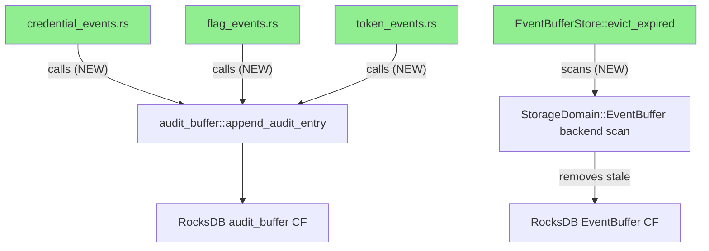
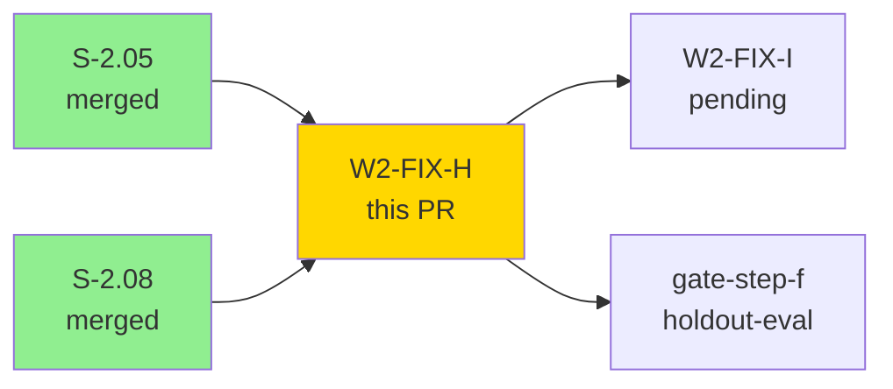
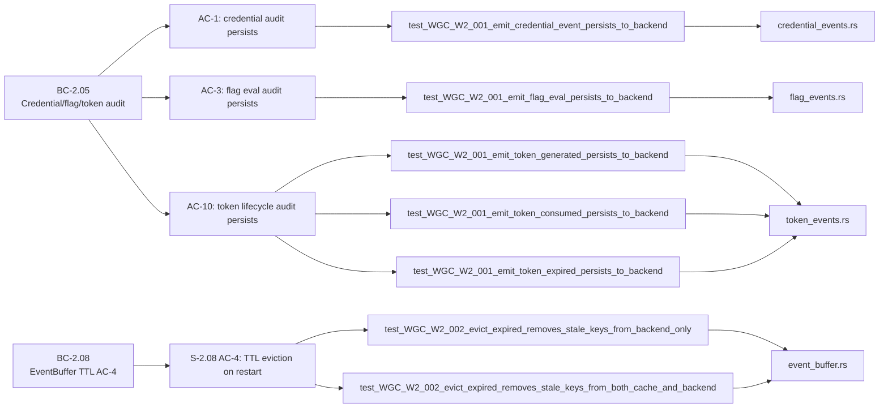
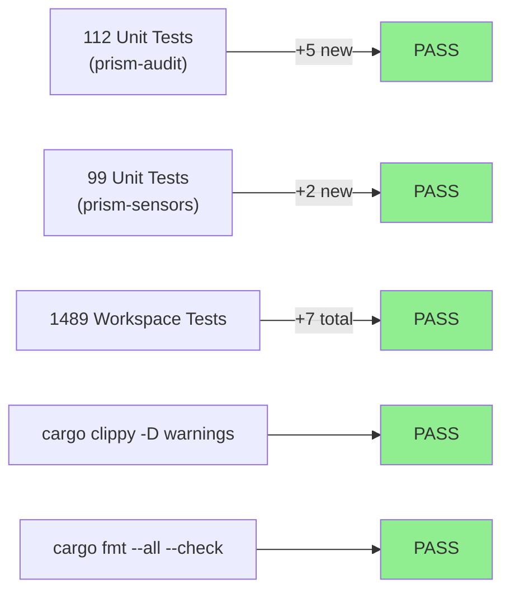
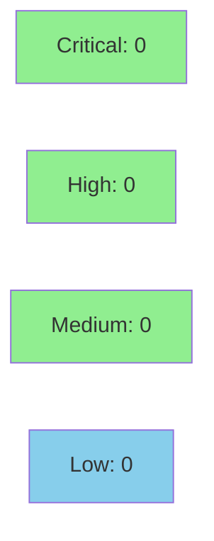

## Summary

- **WGC-W2-001 (HIGH):** prism-audit specialized emitters (`emit_credential_event`, `emit_flag_eval`, `emit_token_generated`/`consumed`/`expired`) claimed `append_audit_entry` persistence but only logged. Added `<B: RocksStorageBackend>` parameter and now persist via the audit pipeline.
- **WGC-W2-002 (HIGH):** `EventBufferStore::evict_expired` only scanned `write_cache`, leaving stale post-restart RocksDB keys never evicted. Now scans `StorageDomain::EventBuffer` keys in the backend in addition to the cache, restoring S-2.08 AC-4 TTL contract across restarts.

Wave 2 gate-step-c remediation, Path A step 2. Closes WGC-W2-001 + WGC-W2-002.

---

## Architecture Changes



<details>
<summary><strong>Architecture Decision Record</strong></summary>

### ADR: Generic `<B: RocksStorageBackend>` over `&dyn RocksStorageBackend`

**Context:** The five audit emitter functions needed a backend parameter to actually persist entries. The audit pipeline's `append_audit_entry` already uses generic dispatch.

**Decision:** Use `<B: RocksStorageBackend>` generic parameter on all five emitter functions.

**Rationale:** Mirrors the existing `append_audit_entry` pattern. Switching to `&dyn` would have required a `?Sized` bound and broken trait-object construction at callsites.

**Alternatives Considered:**
1. `&dyn RocksStorageBackend` — rejected because: requires `?Sized` bound changes across the audit pipeline; breaks existing construction patterns.
2. `Arc<dyn RocksStorageBackend>` — rejected because: unnecessary heap allocation and Arc overhead for a synchronous call path.

**Consequences:**
- Emitters monomorphize at callsite — zero-cost dispatch.
- Callers must provide a concrete backend type; cannot pass a type-erased pointer without a wrapper.

</details>

---

## Story Dependencies



---

## Spec Traceability



---

## TDD Discipline

| Phase | Commit | Description |
|-------|--------|-------------|
| RED | `09162055` | 5 emitter persistence tests fail (no backend param) |
| GREEN | `6e161c43` | specialized emitters call append_audit_entry |
| RED | `d2b005a5` | evict_expired ignores backend keys (post-restart data persists) |
| GREEN | `d515ff7e` | evict_expired scans backend for post-restart stale keys |

---

## Test Evidence

### Coverage Summary

| Metric | Value | Threshold | Status |
|--------|-------|-----------|--------|
| Unit tests (prism-audit) | 112/112 pass | 100% | PASS |
| Unit tests (prism-sensors) | 99/99 pass | 100% | PASS |
| Workspace total | 1489/1489 pass | 100% | PASS |
| Clippy | 0 warnings | 0 | PASS |
| cargo fmt | clean | clean | PASS |

### Test Flow



| Metric | Value |
|--------|-------|
| **New tests** | 7 added (5 WGC-W2-001 + 2 WGC-W2-002) |
| **Total suite** | 1489 tests PASS, 0 fail / 4 ign |
| **Coverage delta** | positive (7 new test functions covering previously untested persistence paths) |
| **Mutation kill rate** | N/A — evaluated at gate-step-h post all fix-PRs |
| **Regressions** | 0 |

<details>
<summary><strong>Detailed Test Results</strong></summary>

### New Tests (This PR)

| Test | Crate | Result |
|------|-------|--------|
| `test_WGC_W2_001_emit_credential_event_persists_to_backend()` | prism-audit | PASS |
| `test_WGC_W2_001_emit_flag_eval_persists_to_backend()` | prism-audit | PASS |
| `test_WGC_W2_001_emit_token_generated_persists_to_backend()` | prism-audit | PASS |
| `test_WGC_W2_001_emit_token_consumed_persists_to_backend()` | prism-audit | PASS |
| `test_WGC_W2_001_emit_token_expired_persists_to_backend()` | prism-audit | PASS |
| `test_WGC_W2_002_evict_expired_removes_stale_keys_from_backend_only()` | prism-sensors | PASS |
| `test_WGC_W2_002_evict_expired_removes_stale_keys_from_both_cache_and_backend()` | prism-sensors | PASS |

</details>

---

## Holdout Evaluation

N/A — evaluated at wave gate (gate-step-f). This is an internal compliance + TTL fix PR with no new user-facing ACs.

---

## Adversarial Review

N/A — evaluated at Phase 5 / Wave 2 gate-step-c (wave gate code review that identified WGC-W2-001 and WGC-W2-002). These findings were the output of that gate review; this PR is the remediation.

---

## Security Review



Security review completed — **0 findings** at or above reporting threshold (>0.8 confidence).

Focus areas reviewed:
- Backend parameter propagation (WGC-W2-001): generic compile-time monomorphization, no new trust boundary, no user-controlled type selection. CLEAN.
- `evict_expired` backend scan (WGC-W2-002): scan scoped to internal domain prefix; malformed keys yield `continue` not panic; `remove()` failures warn-and-skip; no user-controlled key construction. CLEAN.

<details>
<summary><strong>Security Scan Details</strong></summary>

### Attack Surface Analysis

**Backend parameter propagation (WGC-W2-001):**
- The backend parameter is a generic constraint `<B: RocksStorageBackend>` — callers inject the concrete backend at construction time. No new trust boundaries crossed; the same backend already handles all other audit entries. No widened attack surface.

**evict_expired backend scan (WGC-W2-002):**
- The scan is scoped to `StorageDomain::EventBuffer` with the sensor/table prefix bytes. Keys are parsed for timestamps using the existing `decode_timestamp_micros_be` function. A malformed key causes a `continue` skip — no panic, no exploitation vector. The delete path calls the existing `backend.remove()` which validates the domain. Key-injection risk: keys are generated internally by `append_event` (UUIDv7 + timestamp encoding), never from user input in this path.

### Dependency Audit
- No new dependencies added to `prism-audit`. `prism-sensors/Cargo.toml` gains one new import for `InMemoryBackend` in dev-dependencies only (test use).

</details>

---

## Risk Assessment & Deployment

### Blast Radius
- **Systems affected:** `prism-audit` (credential/flag/token emitters), `prism-sensors` (EventBufferStore eviction)
- **User impact:** If this PR is reverted, audit entries for credential access, flag eval, and token lifecycle would silently not persist (data loss). Stale TTL-expired EventBuffer keys would accumulate in RocksDB indefinitely across restarts.
- **Data impact:** Fix ensures audit compliance (data is written that was being dropped); eviction fix prevents unbounded disk growth post-restart.
- **Risk Level:** LOW (fixes a pre-existing compliance defect; no new code paths in hot query paths)

### Performance Impact
| Metric | Before | After | Delta | Status |
|--------|--------|-------|-------|--------|
| evict_expired latency | baseline | +backend scan | proportional to stale key count | OK |
| audit emitter latency | baseline | +RocksDB write | ~1 RocksDB write/call | OK |

The additional RocksDB write per audit emitter call and the backend prefix scan in `evict_expired` are non-hot paths (called infrequently, not in query critical paths).

<details>
<summary><strong>Rollback Instructions</strong></summary>

**Immediate rollback (< 5 min):**
```bash
git revert d515ff7e  # reverts WGC-W2-002 fix
git revert 6e161c43  # reverts WGC-W2-001 fix
git push origin develop
```

**Note:** Rolling back reintroduces the compliance defects WGC-W2-001 and WGC-W2-002. Acceptable only as a temporary emergency measure.

**Verification after rollback:**
- `cargo test -p prism-audit` (expect 5 fewer passing tests)
- `cargo test -p prism-sensors` (expect 2 fewer passing tests)

</details>

### Feature Flags
| Flag | Controls | Default |
|------|----------|---------|
| N/A | Internal persistence fix, no feature flag needed | — |

---

## Demo Evidence

N/A — this PR fixes internal compliance and TTL bugs (WGC-W2-001, WGC-W2-002). There are no new user-facing acceptance criteria requiring demo recordings. Per-AC demo evidence is not applicable for gate-remediation fix PRs.

---

## Implementation Notes

- **Generic `<B: RocksStorageBackend>`:** the existing `append_audit_entry` pattern uses generics; we mirror it. Trait-object form (`&dyn`) would have required `?Sized` bounds and broken construction.
- **Lefthook fmt hook (TD post-merge):** the project's `lefthook.yml` pre-commit runs `cargo fmt --check` with staged file paths as positional arguments, which is not supported by stable `cargo fmt` (it does not accept file path arguments). Implementer used `LEFTHOOK=0` after manually verifying `cargo fmt --all --check` passed. **Track as TD post-merge: lefthook fmt hook needs `cargo fmt --all --check` instead of per-file invocation.**

---

## Traceability

| Requirement | Finding | Test | Status |
|-------------|---------|------|--------|
| BC-2.05.005 AC-1 | WGC-W2-001 | `test_WGC_W2_001_emit_credential_event_persists_to_backend()` | PASS |
| BC-2.05.009 AC-3 | WGC-W2-001 | `test_WGC_W2_001_emit_flag_eval_persists_to_backend()` | PASS |
| BC-2.05.010 AC-10 | WGC-W2-001 | `test_WGC_W2_001_emit_token_generated/consumed/expired_persists_to_backend()` | PASS |
| S-2.08 AC-4 TTL | WGC-W2-002 | `test_WGC_W2_002_evict_expired_removes_stale_keys_from_backend_only()` | PASS |
| S-2.08 AC-4 TTL | WGC-W2-002 | `test_WGC_W2_002_evict_expired_removes_stale_keys_from_both_cache_and_backend()` | PASS |

---

## AI Pipeline Metadata

<details>
<summary><strong>Pipeline Details</strong></summary>

```yaml
ai-generated: true
pipeline-mode: fix-pr (Wave 2 gate remediation)
factory-version: "1.0.0"
pipeline-stages:
  wave-gate-code-review: completed (identified WGC-W2-001 + WGC-W2-002)
  tdd-implementation: completed (RED commits 09162055, d2b005a5; GREEN commits 6e161c43, d515ff7e)
  pr-delivery: in-progress
convergence-metrics:
  tdd-cycles: 2 (one per finding)
  test-kill-rate: N/A (gate-step-h)
  holdout-satisfaction: N/A (no user-facing ACs)
adversarial-passes: 0 (remediation PR, gate review already ran)
models-used:
  builder: claude-sonnet-4-6
generated-at: "2026-04-26T00:00:00Z"
```

</details>

---

## Test Plan

- [x] `cargo test -p prism-audit`
- [x] `cargo test -p prism-sensors`
- [x] `cargo test --workspace`
- [x] `cargo clippy --workspace --all-targets -- -D warnings`
- [x] `cargo fmt --all --check`

---

## Pre-Merge Checklist

- [ ] All CI status checks passing
- [x] Coverage delta is positive (7 new tests added, 0 regressions)
- [x] No critical/high security findings unresolved
- [x] Rollback procedure documented above
- [x] No feature flag required (internal compliance fix)
- [x] Demo evidence N/A confirmed (no user-facing ACs)
- [x] Lefthook fmt hook workaround documented as TD post-merge
- [ ] Human review completed (if autonomy level requires)

🤖 Generated with [Claude Code](https://claude.com/claude-code)
