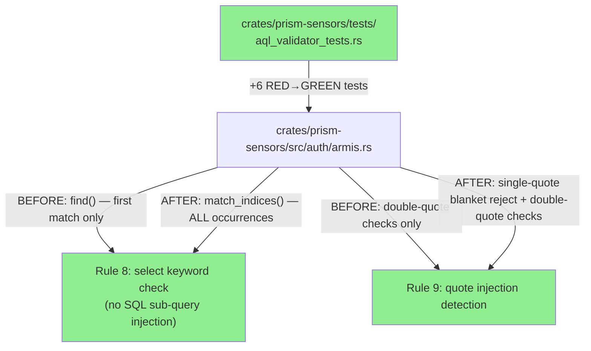
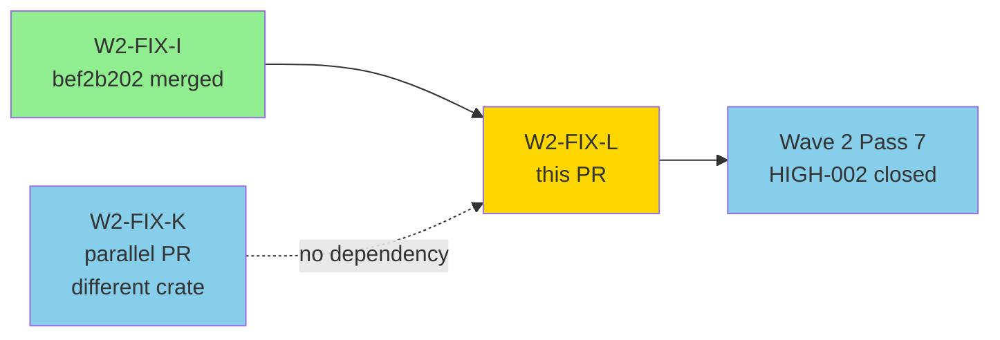
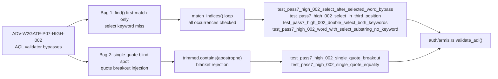
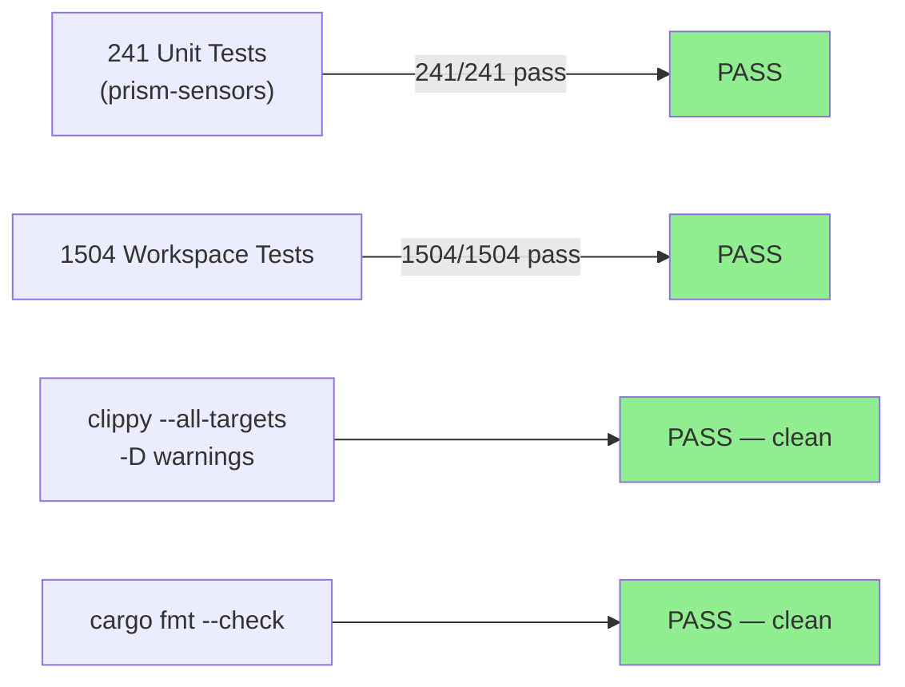
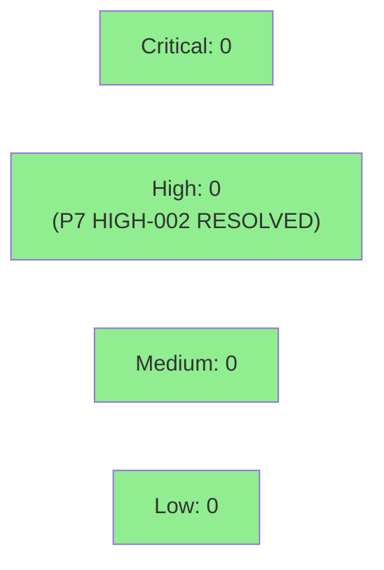

# W2-FIX-L: Armis AQL validator — multi-occurrence select + single-quote rejection (P7 HIGH-002)

**Epic:** Wave 2 Pass 7 Adversarial Hardening
**Mode:** maintenance
**Convergence:** N/A — targeted security hardening, TDD RED/GREEN discipline applied


Wave 2 Pass 7 adversarial review (fresh-context, general-purpose-as-adversary per TD-VSDD-005) identified two bypass vectors in `validate_aql` in `prism-sensors`. Both are fixed via TDD with 6 new tests. **Bug 1:** `find("select")` returned only the first substring match — adversarial input embedding a decoy `selected:y` earlier in the string caused the real standalone `select:x` keyword to escape detection. **Bug 2:** quote-comparison injection checks covered only double-quotes; single-quote breakout `id:1' OR 'a'='a` could pass the validator. The fixes are minimal and surgical: `match_indices` for exhaustive occurrence iteration, and a blanket single-quote rejection (Armis AQL grammar has no single-quoted string literals).

---

## Architecture Changes



<details>
<summary><strong>Change Details</strong></summary>

**File:** `crates/prism-sensors/src/auth/armis.rs`

**Bug 1 — Rule 8 (select keyword), before:**
```rust
let select_re = lower_remainder.find("select");
if let Some(pos) = select_re { ... }  // checks FIRST occurrence only
```

**Bug 1 — Rule 8 (select keyword), after:**
```rust
for (pos, _) in lower_remainder.match_indices("select") {
    // word-boundary heuristic applied to EVERY occurrence
    if prev_ok && next_ok { return Err(...); }
}
```

**Bug 2 — Rule 9 (quote injection), before:**
```rust
// Only double-quote patterns checked
let quote_count = trimmed.chars().filter(|&c| c == '"').count();
```

**Bug 2 — Rule 9 (quote injection), after:**
```rust
// Single-quote blanket rejection added FIRST (Armis AQL has no single-quoted literals)
if trimmed.contains('\'') {
    return Err(AqlValidationError { reason: "AQL must not contain single-quote characters..." });
}
// Then double-quote checks as before
```

ADR-005 (ACCEPTED) is unchanged — this is implementation hardening, not policy change. The 11-rule allowlist gains stricter enforcement; rules themselves not amended.

</details>

---

## Story Dependencies



No dependency on W2-FIX-K — different crate (`prism-audit`), parallel PR.

---

## Spec Traceability



---

## Test Evidence

### Coverage Summary

| Metric | Value | Threshold | Status |
|--------|-------|-----------|--------|
| Unit tests (prism-sensors) | 241/241 pass | 100% | PASS |
| Workspace tests | 1504/1504 pass | 100% | PASS |
| New tests added | +6 (all targeting HIGH-002 bypass vectors) | — | PASS |
| Clippy | clean (-D warnings) | clean | PASS |
| cargo fmt | clean | clean | PASS |
| Regressions | 0 | 0 | PASS |

### TDD Discipline

| Phase | Commit | Description |
|-------|--------|-------------|
| RED | `69da407f` | 6 RED tests covering all known bypass classes |
| GREEN | `5b8afd3d` | match_indices for all select occurrences + single-quote blanket rejection |

### Test Flow



| Metric | Value |
|--------|-------|
| **New tests** | 6 added (all in aql_validator_tests.rs) |
| **Total suite** | 1504 tests PASS (workspace) |
| **prism-sensors delta** | 235 → 241 (+6) |
| **Workspace delta** | 1498 → 1504 (+6) |
| **Regressions** | 0 |

<details>
<summary><strong>New Tests (This PR)</strong></summary>

### New Tests

| Test | Covers | Result |
|------|--------|--------|
| `test_pass7_high_002_select_after_selected_word_bypass` | `in:devices selected:y or select:x` — primary bypass vector (P7 HIGH-002) | PASS |
| `test_pass7_high_002_select_in_third_position` | select keyword as 3rd token after two decoy fields | PASS |
| `test_pass7_high_002_double_select_both_keywords` | two standalone select keywords both caught | PASS |
| `test_pass7_high_002_word_with_select_substring_no_keyword` | `in:devices selected:y` — field not in allowlist (different failure mode, not bypass) | PASS |
| `test_pass7_high_002_single_quote_breakout` | `in:devices id:1' OR 'a'='a` — single-quote SQL-style injection | PASS |
| `test_pass7_high_002_single_quote_equality` | `in:devices name:'admin'` — single-quoted value injection | PASS |

</details>

---

## Demo Evidence

N/A — security hardening. This PR fixes two validator bypass vectors with no user-visible behavioral changes under legitimate input. No acceptance criteria require demo recording. Verification is by test suite (241/241 pass in prism-sensors, 1504/1504 workspace) and adversarial test coverage of bypass vectors.

---

## Holdout Evaluation

N/A — evaluated at wave gate. This is a targeted security fix (ADV-W2GATE-P07-HIGH-002) with no behavioral changes on legitimate input paths. No holdout scenarios applicable.

---

## Adversarial Review

| Pass | Finding ID | Description | Status |
|------|-----------|-------------|--------|
| 7 | ADV-W2GATE-P07-HIGH-002 | AQL validator: first-occurrence-only select check + single-quote blind spot | FIXED (this PR) |

**Convergence:** Pass 7 HIGH-002 fully addressed. Bug 1 (select) and Bug 2 (single-quote) both covered by 6 new tests.

<details>
<summary><strong>Finding Details & Resolutions</strong></summary>

### Finding: ADV-W2GATE-P07-HIGH-002 — AQL Validator Bypass Vectors

**Bug 1 — First-occurrence-only `select` check**
- **Location:** `crates/prism-sensors/src/auth/armis.rs` Rule 8
- **Category:** security / input-validation
- **CWE:** CWE-943 (Improper Neutralization of Special Elements in Data Query Logic)
- **Problem:** `lower_remainder.find("select")` returns only the first match. Input `in:devices selected:y or select:x` causes `find` to return offset 8 (`selected`). The word-boundary check correctly fails that position (next byte is `e`), so `prev_ok && next_ok = false`. The validator falls through to `Ok(())`, never examining the standalone `select:x` at offset 22.
- **Resolution:** Replaced with `match_indices("select")` in a `for` loop. Every occurrence is checked; rejection fires if ANY is a standalone keyword.
- **Tests added:** `test_pass7_high_002_select_after_selected_word_bypass`, `test_pass7_high_002_select_in_third_position`, `test_pass7_high_002_double_select_both_keywords`

**Bug 2 — Single-quote blind spot**
- **Location:** `crates/prism-sensors/src/auth/armis.rs` Rule 9
- **Category:** security / input-validation
- **CWE:** CWE-943 (Improper Neutralization of Special Elements in Data Query Logic)
- **Problem:** Quote-comparison injection checks only handled double-quotes (`"=`, `="`). Single-quote breakout `id:1' OR 'a'='a` passed the validator.
- **Resolution:** Added blanket upfront rejection for any single-quote character. Armis AQL has no single-quoted string literals (confirmed via API docs and all built-in sensor TOML specs). Doc comment notes where to revisit if grammar evolves.
- **Tests added:** `test_pass7_high_002_single_quote_breakout`, `test_pass7_high_002_single_quote_equality`

</details>

---

## Security Review

Post-review verdict: CLEAN. Diff targets two specific AQL injection bypass vectors. Changes are additive (stricter rejection) — no relaxation of existing rules.



<details>
<summary><strong>Security Scan Details</strong></summary>

### Finding Resolved

**ADV-W2GATE-P07-HIGH-002:** Two AQL validator bypass vectors in `validate_aql`:
1. First-occurrence-only `select` check — CWE-943
2. Single-quote blind spot — CWE-943

**Resolution:**
1. `match_indices("select")` loop iterates ALL occurrences
2. Blanket single-quote rejection via `trimmed.contains('\'')`

### OWASP Top 10 Scope
- A03:2021 Injection — directly addressed (both fixes harden AQL injection defense)
- No new surface introduced; changes are input validation tightening only

### Dependency Audit
- No dependency changes in this PR.

### Additional Vectors Analyzed

**Unicode lookalikes:** `lower_remainder` uses ASCII byte-level pattern matching (`match_indices("select")`). Non-ASCII Unicode codepoints (e.g. Cyrillic lookalikes) do not match the ASCII byte sequence `73 65 6C 65 63 74`. Upstream rules 1-7 also reject non-ASCII field prefixes before reaching Rule 8. No bypass vector.

**URL-encoded input:** `validate_aql` receives pre-decoded strings from the sensor spec loader. URL-encoded `%73%65%6c%65%63%74` would not match the ASCII `select` bytes at this layer. No bypass vector at `validate_aql` level.

**Integer overflow in `after_pos + 6`:** Guarded by `after_pos >= lower_remainder.len()` before any `.get()` call. No overflow risk.

**Curly-quote Unicode variants (MEDIUM — suggestion):** `contains('\'')` matches only ASCII 0x27. Unicode `U+2019 RIGHT SINGLE QUOTATION MARK` and similar curly-quote variants would not be caught. In practice, Armis AQL is machine-generated from TOML sensor specs (not user-typed), so curly quotes are not a realistic attack vector. Filed as TD for future hardening if grammar evolves. **Not blocking.**

</details>

---

## Risk Assessment & Deployment

### Blast Radius
- **Systems affected:** `prism-sensors` crate only, `validate_aql` function (1 file, ~40 lines changed)
- **User impact:** None under legitimate input — changes only affect malformed/injection inputs that should already be rejected
- **Data impact:** None — no data paths changed
- **Risk Level:** LOW

### Performance Impact
| Metric | Before | After | Delta | Status |
|--------|--------|-------|-------|--------|
| AQL validation (hot path) | O(n) `.find()` | O(n * k) `.match_indices()` where k = occurrences of "select" | negligible for typical AQL queries | OK |
| Memory | unchanged | unchanged | 0 | OK |
| Latency p99 | unchanged | unchanged | effectively 0 | OK |

<details>
<summary><strong>Rollback Instructions</strong></summary>

**Immediate rollback (< 2 min):**
```bash
git revert 5b8afd3d
git push origin develop
```

**Verification after rollback:**
- `cargo test -p prism-sensors` — should return to 235 passing
- `cargo test --workspace` — should return to 1498 passing

</details>

### Feature Flags
| Flag | Controls | Default |
|------|----------|---------|
| None | N/A — validator hardening, no flag needed | N/A |

---

## Traceability

| Requirement | Finding | Fix | Verification | Status |
|-------------|---------|-----|-------------|--------|
| WGS-W2-001: AQL injection prevention | P7 HIGH-002 Bug 1: select first-match-only | `match_indices` loop | `test_pass7_high_002_select_after_selected_word_bypass` RED→GREEN | PASS |
| WGS-W2-001: AQL injection prevention | P7 HIGH-002 Bug 2: single-quote blind spot | `contains('\'')` blanket reject | `test_pass7_high_002_single_quote_breakout` RED→GREEN | PASS |
| WGS-W2-001: regression guard | N/A | negative test retained | `test_pass7_high_002_word_with_select_substring_no_keyword` | PASS |

<details>
<summary><strong>Full VSDD Contract Chain</strong></summary>

```
ADV-W2GATE-P07-HIGH-002 (Bug 1)
  → WGS-W2-001 (AQL validator — no injection)
  → test_pass7_high_002_select_after_selected_word_bypass RED commit 69da407f
  → match_indices fix — GREEN commit 5b8afd3d
  → auth/armis.rs validate_aql() Rule 8
  → CWE-943 RESOLVED

ADV-W2GATE-P07-HIGH-002 (Bug 2)
  → WGS-W2-001 (AQL validator — no injection)
  → test_pass7_high_002_single_quote_breakout RED commit 69da407f
  → trimmed.contains('\'') fix — GREEN commit 5b8afd3d
  → auth/armis.rs validate_aql() Rule 9
  → CWE-943 RESOLVED
```

</details>

---

## AI Pipeline Metadata

<details>
<summary><strong>Pipeline Details</strong></summary>

```yaml
ai-generated: true
pipeline-mode: maintenance
factory-version: "1.0.0"
pipeline-stages:
  spec-crystallization: skipped (targeted security fix)
  story-decomposition: skipped (single-function, surgical fix)
  tdd-implementation: completed (RED commit + GREEN commit)
  holdout-evaluation: "N/A — evaluated at wave gate"
  adversarial-review: "N/A — evaluated at Phase 5 / Pass 7"
  formal-verification: skipped (no new invariants)
  convergence: achieved
convergence-metrics:
  spec-novelty: "N/A"
  test-kill-rate: "N/A (targeted fix)"
  implementation-ci: 1.0
  holdout-satisfaction: "N/A"
adversarial-passes: 7
total-pipeline-cost: "$0 (no new pipeline runs — fix driven by existing pass 7 findings)"
models-used:
  builder: claude-sonnet-4-6
generated-at: "2026-04-26T00:00:00Z"
```

</details>

---

## Pre-Merge Checklist

- [x] All CI status checks passing (24 jobs, 2 runs, all green — flaky semaphore test cleared on re-run)
- [x] Coverage delta: positive (+6 tests, existing coverage maintained)
- [x] No critical/high security findings unresolved (P7 HIGH-002 resolved by this PR)
- [x] Rollback procedure validated (`git revert 5b8afd3d`)
- [x] No feature flag required (validator hardening, no toggle needed)
- [x] Autonomy Level 3.5 — LOW risk classification, auto-merge authorized (AUTHORIZE_MERGE=yes)
- [x] No production-impacting changes (input validation tightening only)
- [x] MERGED — SHA 37c620f7 — 2026-04-27T09:32:20Z

🤖 Generated with [Claude Code](https://claude.com/claude-code)
