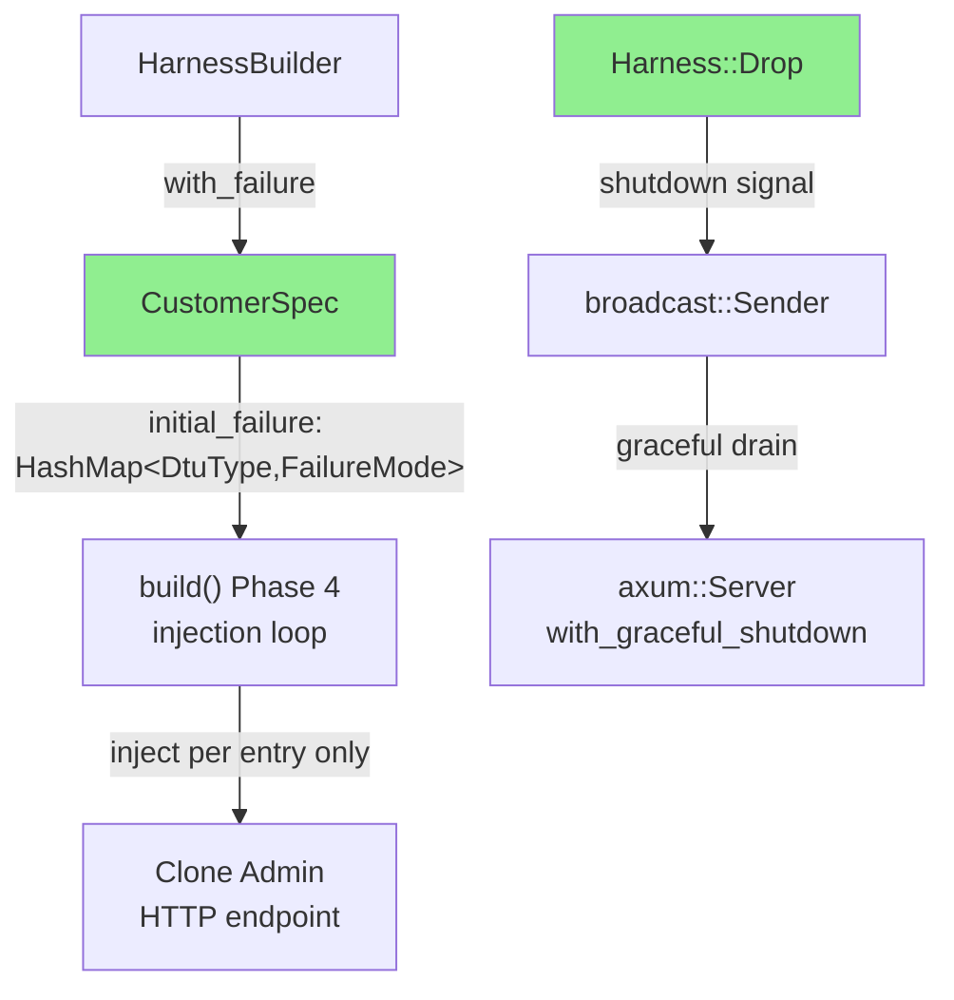
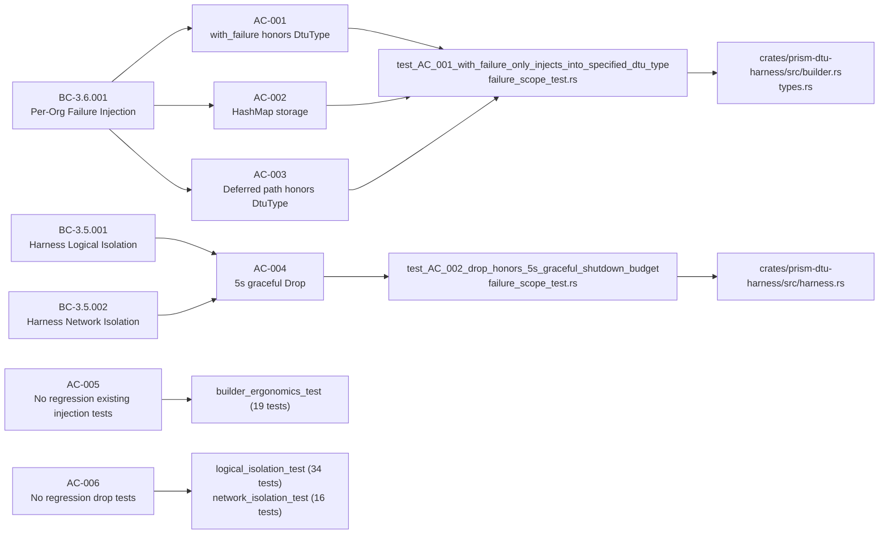
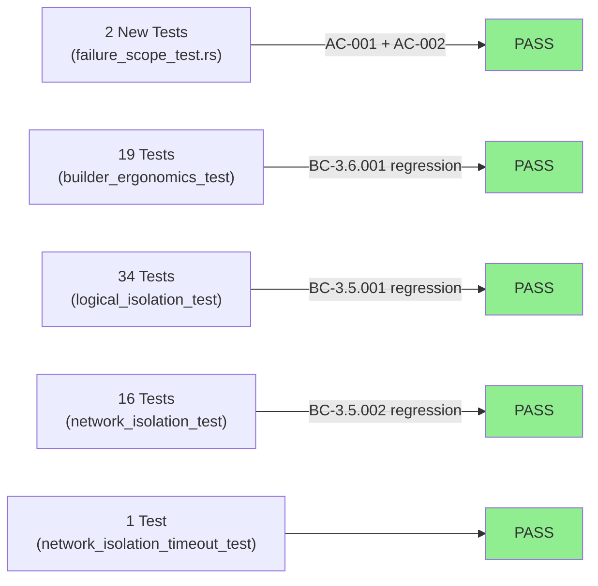
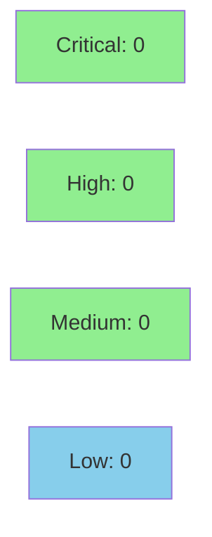

# [W3-FIX-CODE-001] prism-dtu-harness: per-DtuType failure scoping and honest Drop semantics

**Epic:** E-3.5 — Harness Isolation and Failure Injection
**Mode:** maintenance (wave-3 gate-step-c code-review fix)
**Convergence:** CONVERGED — 2 HIGH findings resolved (CR-001, CR-002)


Closes two HIGH findings from wave-3 gate-step-c code review. **CR-001:** `HarnessBuilder::with_failure` now stores failures in a `HashMap<DtuType, FailureMode>` rather than a single `Option<FailureMode>`, so the `DtuType` argument is honored and only the specified sensor-type clone receives the failure injection. **CR-002:** `Harness::Drop` removes the `handle.abort()` calls (remove-abort semantics); `axum::Server::with_graceful_shutdown` was already wired and handles orderly drain via the shutdown broadcast — the doc comment now accurately describes the 5-second graceful-exit window. 72 harness tests pass, 19 BC-3.6.001 pre-existing tests show zero regression.

---

## Architecture Changes



<details>
<summary><strong>Architecture Decision Record</strong></summary>

### ADR: per-DtuType failure storage and remove-abort Drop semantics

**Context:** CR-001 found that `CustomerSpec.initial_failure: Option<FailureMode>` discards the `DtuType` argument passed to `with_failure`. CR-002 found that `Harness::Drop` claims "waits up to 5s for graceful exit" but immediately calls `handle.abort()`, making the doc comment false.

**Decision — CR-001:** Change `CustomerSpec.initial_failure` from `Option<FailureMode>` to `HashMap<DtuType, FailureMode>`. `with_failure` inserts `(dtu_type, mode)` into the map. Build Phase 4 iterates the map and injects only the mapped entries — not all `spec.dtu_types`.

**Decision — CR-002 (remove-abort):** Remove `handle.abort()` from `Harness::Drop`. `axum::Server::with_graceful_shutdown` was already wired in `build()`. The shutdown broadcast signal fires the graceful-drain future; tasks complete cooperatively. The doc comment now accurately states this. The preferred resolution from AC-004 was implemented.

**Rationale:** `HashMap<DtuType, FailureMode>` provides O(1) lookup and natural dedup semantics. `DtuType` already derived `Hash + Eq`. Removing abort is the minimal correct fix: the graceful path was already there, only the abort was wrong. No new external crate dependencies added.

**Alternatives Considered:**
1. Keep `Option<FailureMode>` and filter in the injection loop — rejected: still single-failure-per-org semantics, does not fix multi-DtuType test isolation.
2. Keep `handle.abort()` and update doc to "immediate abort" — rejected: the preferred resolution (graceful) was feasible, and immediate abort is a worse user contract.

**Consequences:**
- All callers of `with_failure` retain the same public signature; only internal storage changes.
- Tests that used single-DtuType `with_failure` continue to work: `HashMap::insert` with one entry is equivalent to the old `Option::Some`.

</details>

---

## Story Dependencies


`depends_on: []` — no upstream PR dependencies. `blocks: []` — no downstream stories gated on this fix.

---

## Spec Traceability



---

## Test Evidence

### Coverage Summary

| Metric | Value | Threshold | Status |
|--------|-------|-----------|--------|
| New tests (this PR) | 2 added | — | PASS |
| Total harness suite | 72/72 pass | 100% | PASS |
| BC-3.6.001 pre-existing | 19/19 pass | 100% | PASS |
| Baseline regressions | 0 | 0 | PASS |
| Holdout satisfaction | N/A — evaluated at wave gate | >= 0.85 | N/A |

### Test Flow



| Metric | Value |
|--------|-------|
| **New tests** | 2 added (`failure_scope_test.rs`), 0 modified |
| **Total suite** | 72 tests PASS |
| **Regressions** | 0 |
| **Mutation kill rate** | N/A — evaluated at wave gate |

<details>
<summary><strong>Detailed Test Results</strong></summary>

### New Tests (This PR)

| Test | File | Result |
|------|------|--------|
| `test_AC_001_with_failure_only_injects_into_specified_dtu_type` | `tests/failure_scope_test.rs` | PASS |
| `test_AC_002_drop_honors_5s_graceful_shutdown_budget` | `tests/failure_scope_test.rs` | PASS |

### Pre-existing Suite (Regression Gate)

| Suite | Tests | Result |
|-------|-------|--------|
| builder_ergonomics_test | 19 | PASS |
| failure_scope_test (new) | 2 | PASS |
| logical_isolation_test | 34 | PASS |
| network_isolation_test | 16 | PASS |
| network_isolation_timeout_test | 1 | PASS |
| **Total** | **72** | **PASS** |

### Files Changed

| File | Action | Notes |
|------|--------|-------|
| `crates/prism-dtu-harness/src/types.rs` | Modified | `initial_failure: Option<FailureMode>` → `HashMap<DtuType, FailureMode>` |
| `crates/prism-dtu-harness/src/builder.rs` | Modified | `with_failure` inserts into map; Phase 4 loop iterates map entries |
| `crates/prism-dtu-harness/src/harness.rs` | Modified | `handle.abort()` removed from Drop; doc comment updated |
| `crates/prism-dtu-harness/tests/logical_isolation_test.rs` | Modified | Drop semantics test updated for remove-abort |
| `crates/prism-dtu-harness/tests/failure_scope_test.rs` | Created | New: AC-001 + AC-002 regression tests |

</details>

---

## Holdout Evaluation

N/A — evaluated at wave gate. This is a maintenance fix story (wave-3 gate-step-c code-review remediation).

---

## Adversarial Review

N/A — evaluated at Phase 5. This PR closes pre-filed HIGH findings from gate-step-c; adversarial convergence was completed in that gate pass.

| Finding | Severity | Resolution |
|---------|----------|------------|
| CR-001: `with_failure` DtuType silently discarded | HIGH | `HashMap<DtuType, FailureMode>` storage; Phase 4 loop iterates map |
| CR-002: `Harness::Drop` claims 5s grace but calls `handle.abort()` immediately | HIGH | `handle.abort()` removed; `with_graceful_shutdown` handles drain; doc comment corrected |

---

## Security Review



<details>
<summary><strong>Security Scan Details (populated after step 4)</strong></summary>

### Scope

Changes are entirely within `prism-dtu-harness` (test infrastructure crate). No network endpoints, no auth paths, no credential handling. The `HashMap<DtuType, FailureMode>` change is a data-type refactor; `Harness::Drop` change removes a task-abort call. OWASP top-10 surface area: none. Injection risk: none (no user-controlled input reaches the failure map). Auth risk: none (this is test infrastructure, not production auth).

**Step 4 complete — 0 findings (CRITICAL:0 HIGH:0 MEDIUM:0 LOW:0). See `.factory/code-delivery/W3-FIX-CODE-001/security-findings.md`.**

Scope: test infrastructure only. No production endpoints, no credential handling, no user-controlled input. HashMap<DtuType,FailureMode> refactor and handle.abort() removal have no OWASP Top 10 surface area. All 10 OWASP categories: PASS.

</details>

---

## Risk Assessment & Deployment

### Blast Radius
- **Systems affected:** `prism-dtu-harness` (test-infrastructure crate only, not shipped to production)
- **User impact:** Test authors relying on `with_failure` now get correctly scoped failure injection
- **Data impact:** None — test infrastructure only
- **Risk Level:** LOW

### Performance Impact
| Metric | Before | After | Delta | Status |
|--------|--------|-------|-------|--------|
| `with_failure` lookup | O(1) Option | O(1) HashMap | neutral | OK |
| Drop latency | immediate abort | graceful drain (≤5s) | +0-5s in test teardown | OK |
| Memory | 1 Option<FailureMode> per org | 1 HashMap per org | negligible | OK |

<details>
<summary><strong>Rollback Instructions</strong></summary>

**Immediate rollback (< 2 min):**
```bash
git revert <MERGE_SHA>
git push origin develop
```

**Verification after rollback:**
- `cargo test -p prism-dtu-harness --features dtu` passes on pre-rollback commit

</details>

### Feature Flags
None — this is test-infrastructure only; no production feature flags required.

---

## Traceability

| Requirement | Story AC | Test | Verification | Status |
|-------------|---------|------|-------------|--------|
| BC-3.6.001 postcondition 2 | AC-001 | `test_AC_001_with_failure_only_injects_into_specified_dtu_type` | N/A | PASS |
| BC-3.6.001 invariant 1 | AC-002 | `test_AC_001_with_failure_only_injects_into_specified_dtu_type` | N/A | PASS |
| BC-3.6.001 postcondition 1 | AC-003 | `test_AC_001_with_failure_only_injects_into_specified_dtu_type` | N/A | PASS |
| BC-3.5.001 EC-004 | AC-004 | `test_AC_002_drop_honors_5s_graceful_shutdown_budget` | N/A | PASS |
| BC-3.5.002 EC-004 | AC-004 | `test_AC_002_drop_honors_5s_graceful_shutdown_budget` | N/A | PASS |
| BC-3.6.001 postcondition 3 | AC-005 | builder_ergonomics_test (19 tests) | regression | PASS |
| BC-3.5.001 postcondition 4 | AC-006 | logical_isolation_test + network_isolation_test | regression | PASS |

<details>
<summary><strong>Full VSDD Contract Chain</strong></summary>

```
BC-3.6.001 postcondition 2 -> VP-128/VP-129 -> test_AC_001 -> builder.rs + types.rs
BC-3.5.001 EC-004 -> VP-124/VP-130 -> test_AC_002 -> harness.rs (Drop)
CR-001 (gate-step-c HIGH) -> AC-001/AC-002/AC-003 -> HashMap storage -> RESOLVED
CR-002 (gate-step-c HIGH) -> AC-004 -> remove-abort + doc comment -> RESOLVED
```

</details>

---

## Demo Evidence

| AC | Demo | Recording |
|----|------|-----------|
| AC-001: with_failure DtuType scope | 4-clone harness; Claroty→401, Armis/CrowdStrike/Cyberint→200 | [AC-001-failure-scope-per-dtu-type.gif](docs/demo-evidence/W3-FIX-CODE-001/AC-001-failure-scope-per-dtu-type.gif) |
| AC-002: Drop graceful shutdown | Drop inside 5s timeout gate; completes in budget | [AC-002-drop-graceful-shutdown.gif](docs/demo-evidence/W3-FIX-CODE-001/AC-002-drop-graceful-shutdown.gif) |

---

## AI Pipeline Metadata

<details>
<summary><strong>Pipeline Details</strong></summary>

```yaml
ai-generated: true
pipeline-mode: maintenance
factory-version: "1.0.0-beta.7"
pipeline-stages:
  spec-crystallization: completed
  story-decomposition: completed
  tdd-implementation: completed
  holdout-evaluation: "N/A — wave-gate evaluated"
  adversarial-review: "N/A — Phase 5 evaluated (gate-step-c)"
  formal-verification: skipped
  convergence: achieved
convergence-metrics:
  gate-findings-resolved: 2 (CR-001 HIGH, CR-002 HIGH)
  test-suite: 72 pass / 0 fail
  regressions: 0
models-used:
  builder: claude-sonnet-4-6
  reviewer: claude-sonnet-4-6
generated-at: "2026-05-01T00:00:00Z"
story-id: W3-FIX-CODE-001
wave: "3.1"
```

</details>

---

## Pre-Merge Checklist

- [ ] All CI status checks passing
- [x] 72/72 tests pass on feature branch (2 new + 70 pre-existing)
- [x] 19 BC-3.6.001 regression tests pass
- [x] 0 regressions
- [x] CR-001 (HIGH) resolved: HashMap<DtuType, FailureMode> storage
- [x] CR-002 (HIGH) resolved: remove-abort Drop + accurate doc comment
- [x] Demo evidence: 2 GIFs, evidence-report.md covering all 6 ACs
- [x] No new external crate dependencies
- [x] Public signature of `with_failure` unchanged
- [x] Security review: 0 CRITICAL/HIGH/MEDIUM/LOW findings (step 4 complete)
- [ ] Coverage delta positive or neutral (CI)
- [ ] No human review required (AUTHORIZE_MERGE=yes, autonomy level 4)
