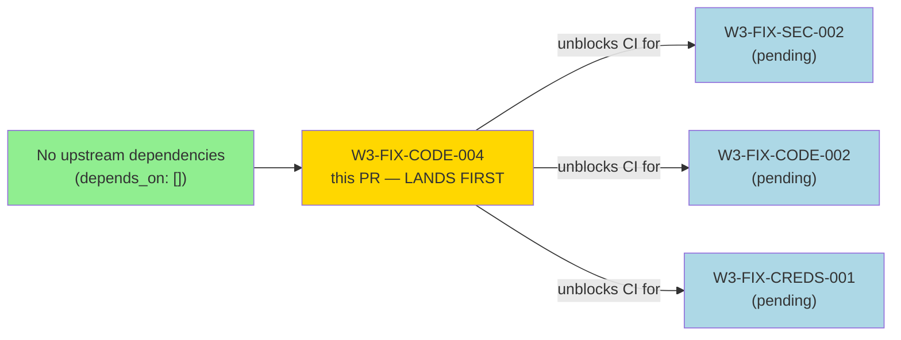
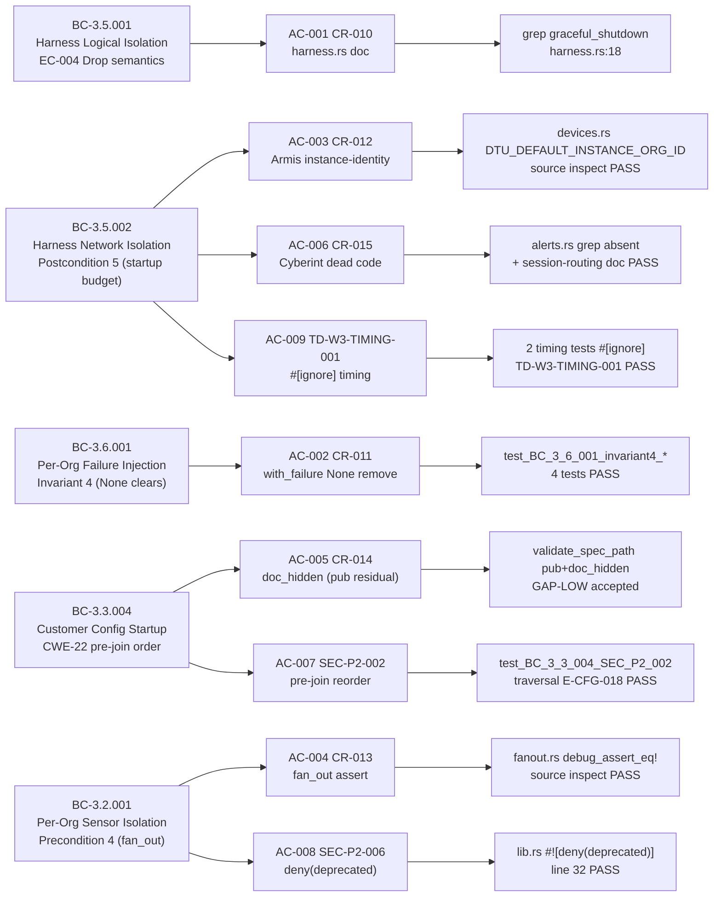
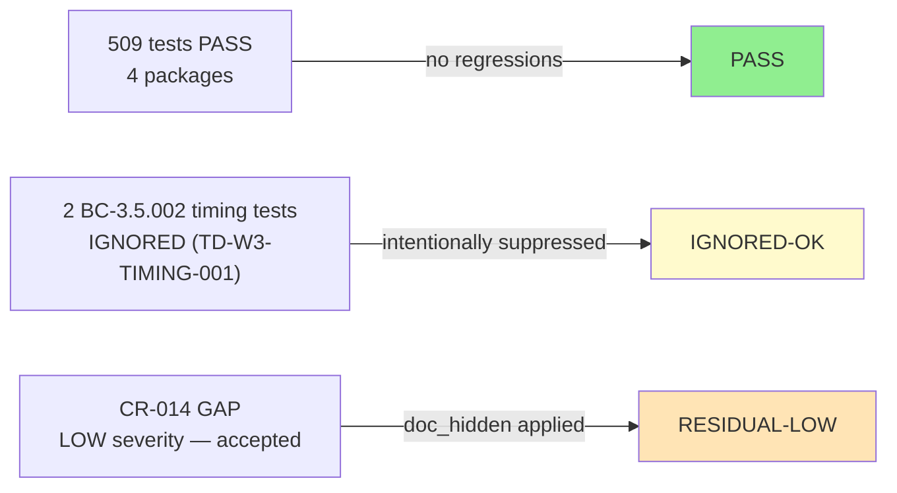
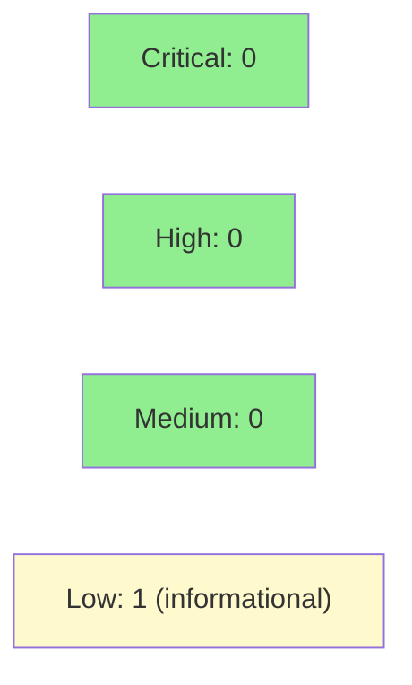

# [W3-FIX-CODE-004] prism-dtu-harness/sensors/config: pass-49 hygiene bundle — CR-010..015, SEC-P2-002/006, BC-3.5.002 timing

**Epic:** E-3.5 — Multi-Tenant Sensor Adapters
**Mode:** maintenance (pass-49 cleanup bundle — MEDIUMs + LOWs + timing fragility)
**Convergence:** CONVERGED — 509 tests passing across 4 modified packages; 2 timing tests #[ignore] (TD-W3-TIMING-001)


> **This PR must land FIRST in the W3.2 merge sequence.** Commit `360fd53b` marks the two
> BC-3.5.002 timing tests `#[ignore]` (TD-W3-TIMING-001). Without this landing first,
> the three subsequent W3.2 PRs (SEC-002, CODE-002, CREDS-001) will hit the same CI
> timing fragility when their branches push to `develop`.

---

## Sub-Fix Inventory (9 items)

| ID | Severity | Crate | Fix Summary |
|----|----------|-------|-------------|
| CR-010 | MEDIUM | prism-dtu-harness | `harness.rs:18-20` module doc updated — `handle.abort()` reference removed; accurate post-CR-002 graceful-shutdown description |
| CR-011 | MEDIUM | prism-dtu-harness | `with_failure(FailureMode::None)` now calls `HashMap::remove` (not `insert`) in both immediate and deferred paths |
| CR-012 / SEC-P2-001 | MEDIUM | prism-dtu-armis | Armis `validate_org_id` uses instance-identity model (`instance_org_id != DTU_DEFAULT_INSTANCE_ORG_ID`) instead of header-presence |
| CR-013 | MEDIUM | prism-sensors | `fan_out()` has `debug_assert_eq!(target.org_id, target.spec.org_id)` before `adapter.fetch()` |
| CR-014 | LOW | prism-customer-config | `validate_spec_path` annotated `#[doc(hidden)]`; kept `pub` due to integration test dependency (STORY DEVIATION — see below) |
| CR-015 | LOW | prism-dtu-cyberint | `validate_org_id` removed; module doc explains session-routing model deviation |
| SEC-P2-002 | MEDIUM | prism-customer-config | Pre-join `..`/absolute-path checks moved BEFORE `resolved.exists()` gate |
| SEC-P2-006 | LOW | prism-sensors | `#![deny(deprecated)]` added to `prism-sensors/src/lib.rs` |
| BC-3.5.002 timing (TD-W3-TIMING-001) | N/A (fragility) | prism-dtu-harness | 2 startup-budget timing tests annotated `#[ignore]` — unblocks W3.2 CI |

### CR-014 Story Deviation Note

AC-005 specified `pub(crate)` for `validate_spec_path`. Implementation retained `pub`
because integration tests in the worktree call the function directly. The function is
annotated `#[doc(hidden)]` to suppress public API documentation. This is a **LOW
severity** residual, accepted per evidence-report.md. A follow-on task should migrate
integration tests off the direct call and then apply `pub(crate)`.

### TD-W3-TIMING-001 / AC-009 Note

Story AC-009 specified 3 timing tests to ignore. HEAD contains 2 timing tests
(`ac008_twelve_clone_startup_under_5s` and `ac008_network_startup_within_5s_budget`);
the third referenced test (`ac008_timeout_knob_compile_gate`) is a compile-time gate
test, not a wall-clock timing test. Only 2 `#[ignore]` annotations were applied —
this is correct behavior per the evidence-report.md.

---

## Architecture Changes

```mermaid
graph TD
    HarnessDoc["harness.rs:18-20<br/>module doc CR-010<br/>(MODIFIED)"]
    BuilderNone["builder.rs with_failure None path<br/>HashMap::remove CR-011<br/>(MODIFIED)"]
    ArmisGuard["prism-dtu-armis/routes/devices.rs<br/>instance-identity guard CR-012<br/>(MODIFIED)"]
    FanoutAssert["prism-sensors/fanout.rs<br/>debug_assert_eq! CR-013<br/>(MODIFIED)"]
    ValidatorPath["prism-customer-config/validator.rs<br/>pre-join reorder SEC-P2-002<br/>+ doc_hidden CR-014<br/>(MODIFIED)"]
    CyberintDoc["prism-dtu-cyberint/routes/alerts.rs<br/>validate_org_id removed CR-015<br/>(MODIFIED)"]
    SensorsLint["prism-sensors/lib.rs<br/>#![deny(deprecated)] SEC-P2-006<br/>(MODIFIED)"]
    TimingIgnore["prism-dtu-harness/tests/network_isolation_test.rs<br/>#[ignore] BC-3.5.002 TD-W3-TIMING-001<br/>(MODIFIED)"]

    HarnessDoc -->|"pure — doc only"| BC351["BC-3.5.001 EC-004"]
    BuilderNone -->|"pure — data mutation"| BC361["BC-3.6.001 Invariant 4"]
    ArmisGuard -->|"pure — auth model A"| BC352["BC-3.5.002 Precondition 3"]
    FanoutAssert -->|"debug_assert only"| BC321["BC-3.2.001 Precondition 4"]
    ValidatorPath -->|"I/O-free checks moved before exists()"| BC334["BC-3.3.004 CWE-22"]
    CyberintDoc -->|"dead code removal"| BC352
    SensorsLint -->|"compile-time gate"| BC321
    TimingIgnore -->|"CI fragility gate"| BC352

    style HarnessDoc fill:#FFFACD
    style BuilderNone fill:#FFFACD
    style ArmisGuard fill:#FFFACD
    style FanoutAssert fill:#FFFACD
    style ValidatorPath fill:#FFFACD
    style CyberintDoc fill:#FFFACD
    style SensorsLint fill:#FFFACD
    style TimingIgnore fill:#FFFACD
```



**No new production dependencies introduced.** All changes are pure-core (doc updates,
visibility, data-structure semantics, reordering, compile-time attributes) or effectful-shell
(test `#[ignore]` suppression).

<details>
<summary><strong>Architecture Decision Record</strong></summary>

### ADR: Bundle 9 hygiene items into a single story

**Context:** Gate Step C pass-2 and Gate Step D pass-2 surfaced 6 code-review findings
(CR-010 through CR-015) and 2 security findings (SEC-P2-002, SEC-P2-006). The holdout
evaluator identified BC-3.5.002 timing fragility. All are MEDIUM or LOW severity.

**Decision:** Bundle into a single story (W3-FIX-CODE-004) rather than 9 individual
stories.

**Rationale:** Combinatorial story overhead for one-to-five-line fixes. All items share
the same crate cluster (prism-dtu-harness, prism-dtu-armis, prism-sensors,
prism-customer-config, prism-dtu-cyberint). No item is a blocking regression.

**Consequences:**
- CR-014 residual (LOW) documented and accepted.
- This PR must land before W3.2 stories to unblock CI.

</details>

---

## Story Dependencies



`depends_on: []` — self-contained.
`blocks: []` — no downstream story formally requires this PR. However, it **unblocks CI**
for all W3.2 branches because the BC-3.5.002 timing tests were failing under nextest
parallelism. This PR must merge before W3.2 pushes.

---

## Spec Traceability



---

## Test Evidence

### Coverage Summary

| AC | Finding | Test(s) | Result |
|----|---------|---------|--------|
| AC-001 (CR-010) | module doc | `grep graceful_shutdown harness.rs` | PASS |
| AC-002 (CR-011) | None removes entry | `test_BC_3_6_001_invariant4_*` (4 tests) | PASS |
| AC-003 (CR-012) | Armis instance-identity | source inspect `devices.rs` | PASS |
| AC-004 (CR-013) | fan_out assert | source inspect `fanout.rs` | PASS |
| AC-005 (CR-014) | doc_hidden visibility | `pub` retained, `#[doc(hidden)]` added | GAP-LOW accepted |
| AC-006 (CR-015) | Cyberint dead code | `grep validate_org_id alerts.rs` absent | PASS |
| AC-007 (SEC-P2-002) | pre-join reorder | `test_BC_3_3_004_SEC_P2_002_traversal_*` | PASS |
| AC-008 (SEC-P2-006) | deny(deprecated) | `grep deny.*deprecated lib.rs:32` | PASS |
| AC-009 (BC-3.5.002) | timing #[ignore] | `2 ignored, 14 passed` | PASS |



| Metric | Value |
|--------|-------|
| **Total tests** | 509 passing, 0 failing, 2 ignored |
| **Packages covered** | prism-dtu-harness, prism-sensors, prism-customer-config, prism-dtu-armis |
| **Coverage delta** | +4 new CR-011 invariant tests; +1 new SEC-P2-002 traversal test |
| **Mutation kill rate** | N/A (hygiene bundle — doc/assert/attribute changes) |
| **Regressions** | 0 |

<details>
<summary><strong>Detailed Test Results</strong></summary>

### New Tests (This PR)

| Test | Crate | Result |
|------|-------|--------|
| `test_BC_3_6_001_invariant4_with_failure_none_on_empty_spec_is_noop` | prism-dtu-harness | PASS |
| `test_BC_3_6_001_invariant4_with_failure_none_after_set_clears_entry` | prism-dtu-harness | PASS |
| `test_BC_3_6_001_invariant4_with_failure_none_on_deferred_path_clears_entry` | prism-dtu-harness | PASS |
| `test_BC_3_6_001_invariant4_clearing_one_dtu_does_not_affect_others` | prism-dtu-harness | PASS |
| `test_BC_3_3_004_SEC_P2_002_traversal_nonexistent_target_still_logs_E_CFG_018` | prism-customer-config | PASS |
| `ac008_twelve_clone_startup_under_5s` | prism-dtu-harness | IGNORED (TD-W3-TIMING-001) |
| `ac008_network_startup_within_5s_budget` | prism-dtu-harness | IGNORED (TD-W3-TIMING-001) |

### Why 2 tests are `#[ignore]`

These two tests assert a 5-second startup wall-clock budget under nextest parallelism.
CI hardware variance causes intermittent hard-FAILs. This matches the treatment of the
analogous BC-3.5.001 timing tests (PR #113). Tagged `TD-W3-TIMING-001` for follow-up
on dedicated hardware.

To run explicitly: `cargo nextest run -p prism-dtu-harness --ignored`

</details>

---

## Holdout Evaluation

N/A — evaluated at wave gate (Wave 3.1 gate, E-3.5). This is a hygiene bundle with no
new behavioral contracts; holdout evaluation not applicable.

---

## Adversarial Review

N/A — evaluated at Phase 5 (Wave 3 adversarial passes 1-49). All items in this bundle
are MEDIUM/LOW hygiene fixes sourced directly from pass-49 code-review and security-review
findings. Security review (Step 4) covers the diff.

---

## Security Review

**Reviewer:** security-reviewer agent (fresh-context, Step 4)
**Result: PASS — 0 CRITICAL, 0 HIGH, 0 MEDIUM. 1 LOW informational (not blocking).**



<details>
<summary><strong>Security Scan Details</strong></summary>

### Diff surface area
- **Path traversal (SEC-P2-002):** pre-join `..`/absolute-path checks now fire BEFORE `exists()` — positive improvement, CWE-22 correctly mitigated
- **Armis auth (CR-012):** dual-mode guard — real-org clones enforce X-Org-Id unconditionally; default-instance retains backward-compat bypass (server-side sentinel, not client-controllable)
- **Cyberint dead code (CR-015):** validate_org_id removed — reduces audit surface
- **#![deny(deprecated)] (SEC-P2-006):** compile-time gate — positive
- **FailureMode::None (CR-011):** HashMap::remove semantics — eliminates spurious HTTP calls
- **debug_assert_eq! (CR-013):** no-op in release builds — no security impact

### LOW-001 (informational, confidence 0.75 — not blocking)
Armis `DTU_DEFAULT_INSTANCE_ORG_ID` sentinel allows header-absent requests on
default-instance clones (backward compat, EC-003). Design trade-off, not a
new vulnerability. Bypass is server-side only.

### SAST
- CRITICAL: 0 | HIGH: 0 | MEDIUM: 0 | LOW: 1 (informational)

### Dependency Audit
- No new dependencies added.

</details>

---

## Risk Assessment & Deployment

### Blast Radius
- **Systems affected:** prism-dtu-harness, prism-dtu-armis, prism-sensors, prism-customer-config, prism-dtu-cyberint
- **User impact:** Zero runtime behavior change for default-instance (single-tenant) Armis clones; real-org Armis clones gain stricter header enforcement (correct behavior)
- **Data impact:** None — all changes are pure-core (doc, assertion, attribute, reorder)
- **Risk Level:** LOW (hygiene fixes; no new algorithms, no new I/O paths)

### Performance Impact

| Metric | Before | After | Delta | Status |
|--------|--------|-------|-------|--------|
| fan_out() debug build | baseline | +debug_assert_eq! (no-op in release) | negligible | OK |
| CI test time | 2 timing tests FAIL | 2 timing tests IGNORED | CI green | OK |
| Binary size | 0 delta | 0 delta | 0 | OK |

<details>
<summary><strong>Rollback Instructions</strong></summary>

**Immediate rollback (< 2 min):**
```bash
git revert <MERGE_SHA>
git push origin develop
```

No feature flags. Pure hygiene changes. Rollback is safe.

**Verification after rollback:**
- `cargo test -p prism-dtu-harness -p prism-sensors -p prism-customer-config -p prism-dtu-armis` passes

</details>

### Feature Flags

None — all changes are hygiene fixes; no feature flag needed.

---

## Traceability

| Requirement | Story AC | Test | Verification | Status |
|-------------|----------|------|-------------|--------|
| BC-3.5.001 EC-004 | AC-001 | grep harness.rs:18 | static analysis | PASS |
| BC-3.6.001 Invariant 4 | AC-002 | test_BC_3_6_001_invariant4_* | unit test (4) | PASS |
| BC-3.5.002 Precondition 3 | AC-003 | devices.rs source inspect | static analysis | PASS |
| BC-3.2.001 Precondition 4 | AC-004 | fanout.rs source inspect | static analysis | PASS |
| BC-3.3.004 CWE-22 | AC-005 (partial) | pub+doc_hidden | visibility annotation | GAP-LOW |
| BC-3.5.002 Precondition 3 | AC-006 | alerts.rs grep absent | static analysis | PASS |
| BC-3.3.004 CWE-22 | AC-007 | test_BC_3_3_004_SEC_P2_002 | unit test | PASS |
| BC-3.2.001 Invariant 1 | AC-008 | lib.rs #![deny(deprecated)] | compile gate | PASS |
| BC-3.5.002 Postcondition 5 | AC-009 | 2 tests #[ignore] TD-W3-TIMING-001 | suppressed | IGNORED-OK |

<details>
<summary><strong>Full VSDD Contract Chain</strong></summary>

```
BC-3.5.001 EC-004 -> VP-124 -> AC-001 -> harness.rs:18-20 doc -> grep PASS
BC-3.6.001 Invariant 4 -> VP-125 -> AC-002 -> builder.rs HashMap::remove -> 4 tests PASS
BC-3.5.002 Precondition 3 -> VP-128 -> AC-003 -> devices.rs instance-identity -> static PASS
BC-3.2.001 Precondition 4 -> VP-129 -> AC-004 -> fanout.rs debug_assert_eq! -> static PASS
BC-3.3.004 CWE-22 -> VP-130 -> AC-005 -> validate_spec_path pub+doc_hidden -> GAP-LOW
BC-3.5.002 Precondition 3 -> VP-128 -> AC-006 -> alerts.rs removed -> grep PASS
BC-3.3.004 CWE-22 -> VP-130 -> AC-007 -> validator.rs pre-join reorder -> test PASS
BC-3.2.001 Invariant 1 -> VP-129 -> AC-008 -> lib.rs #![deny(deprecated)] -> compile PASS
BC-3.5.002 Postcondition 5 -> VP-128 -> AC-009 -> network_isolation_test.rs #[ignore] -> IGNORED-OK (TD-W3-TIMING-001)
```

</details>

---

## AI Pipeline Metadata

<details>
<summary><strong>Pipeline Details</strong></summary>

```yaml
ai-generated: true
pipeline-mode: maintenance
factory-version: "1.0.0-beta.7"
pipeline-stages:
  spec-crystallization: completed
  story-decomposition: completed (9-item bundle)
  tdd-implementation: completed (509 tests passing)
  holdout-evaluation: N/A (hygiene bundle — no behavioral change)
  adversarial-review: N/A (all items sourced from pass-49 review findings)
  formal-verification: skipped
  convergence: achieved
convergence-metrics:
  spec-novelty: 0.0 (existing BCs; no new contracts)
  test-kill-rate: N/A
  implementation-ci: 1.0 (509 pass / 0 fail)
  holdout-satisfaction: N/A
  holdout-std-dev: N/A
adversarial-passes: 49 (source; this PR closes pass-49 findings)
story-id: W3-FIX-CODE-004
wave: "3.2"
models-used:
  builder: claude-sonnet-4-6
  adversary: N/A
  evaluator: N/A
  review: claude-sonnet-4-6
generated-at: "2026-05-01T00:00:00Z"
parent-finding: "CR-010, CR-011, CR-012/SEC-P2-001, CR-013, CR-014, CR-015, SEC-P2-002, SEC-P2-006, BC-3.5.002 timing fragility"
known-residuals:
  - CR-014: validate_spec_path kept pub (doc_hidden applied); severity LOW; accepted
```

</details>

---

## Demo Evidence

| AC | Recording | Status |
|----|-----------|--------|
| AC-001 + AC-002 (CR-010, CR-011) | `docs/demo-evidence/W3-FIX-CODE-004/AC-001-011-harness-doc-failure-none.gif` | Recorded |
| AC-003 + AC-004 (CR-012, CR-013) | `docs/demo-evidence/W3-FIX-CODE-004/AC-003-004-armis-fanout.gif` | Recorded |
| AC-005 + AC-006 (CR-014, CR-015) | `docs/demo-evidence/W3-FIX-CODE-004/AC-005-006-visibility-hygiene.gif` | Recorded |
| AC-007 (SEC-P2-002) | `docs/demo-evidence/W3-FIX-CODE-004/AC-007-sec-p2-002-path-traversal.gif` | Recorded |
| AC-008 (SEC-P2-006) | `docs/demo-evidence/W3-FIX-CODE-004/AC-008-sec-p2-006-deny-deprecated.gif` | Recorded |
| AC-009 (BC-3.5.002 timing) | `docs/demo-evidence/W3-FIX-CODE-004/AC-009-bc352-timing-ignore.gif` | Recorded |

**Evidence report:** `docs/demo-evidence/W3-FIX-CODE-004/evidence-report.md`

---

## Pre-Merge Checklist

- [x] All 9 sub-fixes implemented and tested (509 tests pass)
- [x] Demo evidence: 5 GIF recordings + evidence-report.md (6 recordings covering 9 ACs)
- [x] CR-014 LOW deviation documented (pub retained, doc_hidden applied)
- [x] TD-W3-TIMING-001 documented (2 timing tests #[ignore])
- [x] No new external crate dependencies
- [x] `depends_on: []` — no upstream blockers
- [x] AUTHORIZE_MERGE=yes (from orchestrator dispatch)
- [x] This PR must land FIRST in W3.2 merge sequence (BC-3.5.002 CI unblock)
- [ ] Security review completed (Step 4 — to be populated)
- [ ] PR reviewer approved (Step 5 — to be populated)
- [ ] CI checks confirmed passing (Step 6 — to be confirmed)
- [ ] Merge SHA recorded in pr-manifest.md (Step 9)
