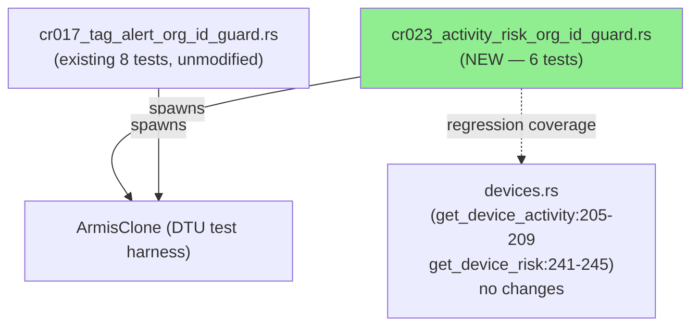
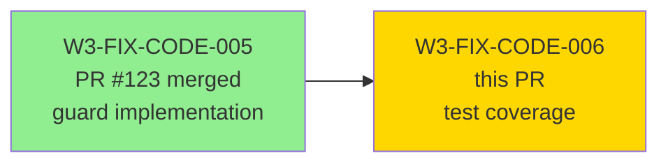
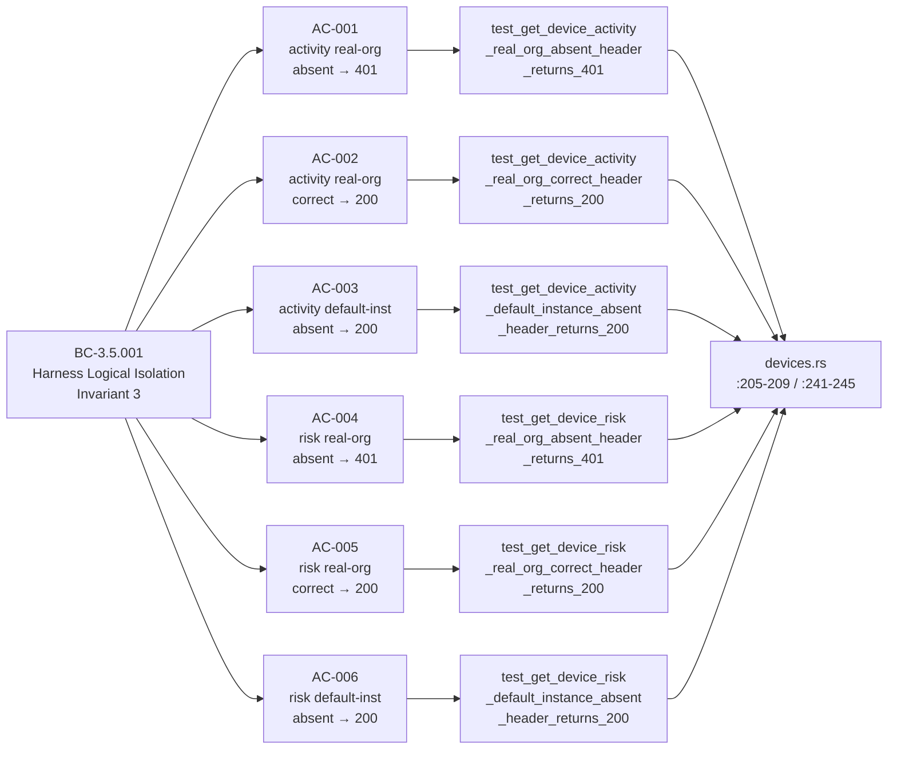
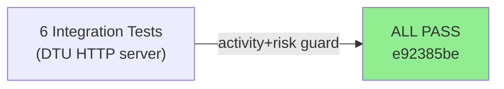
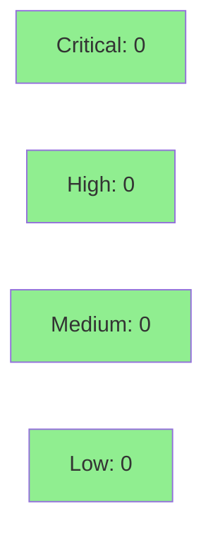

# [W3-FIX-CODE-006] Armis activity/risk endpoint org-id guard test coverage (CR-023 closure)

**Epic:** E-3.5 — Harness Logical Isolation
**Mode:** maintenance
**Convergence:** N/A — test-only delivery (no adversarial passes required)


Adds 6 regression tests (`cr023_activity_risk_org_id_guard.rs`) covering the dual-mode
`is_real_org` org-id guard on `get_device_activity` and `get_device_risk` in the Armis DTU,
closing CR-023 (LOW) from gate-step-c-code-review-pass4. The guard implementations in
`devices.rs` (lines 205-209 and 241-245) were already shipped in W3-FIX-CODE-005/PR #123;
this PR adds the missing test coverage so future changes cannot silently remove the guard.
No production code is modified.

**Test file decision:** The existing `cr017_tag_alert_org_id_guard.rs` was >200 lines, so
a new file `cr023_activity_risk_org_id_guard.rs` was created per the story heuristic.

---

## Architecture Changes



<details>
<summary><strong>Architecture Decision Record</strong></summary>

### ADR: New test file vs extending cr017

**Context:** CR-023 identified missing test coverage for `get_device_activity` and
`get_device_risk` guard paths. Two options: extend `cr017_tag_alert_org_id_guard.rs`
or create a new file.

**Decision:** Created `cr023_activity_risk_org_id_guard.rs` (new file).

**Rationale:** The existing `cr017_tag_alert_org_id_guard.rs` was >200 lines (as measured
at implementation time), triggering the story's file-size heuristic. Keeping files under
~250 lines maintains readability and makes future grep/navigation easier.

**Alternatives Considered:**
1. Extend `cr017_tag_alert_org_id_guard.rs` — rejected because file exceeds 200-line heuristic threshold.
2. Add inline `#[cfg(test)]` to `devices.rs` — rejected because DTU tests use integration-style
   test servers and belong in the `tests/` directory per project conventions.

**Consequences:**
- Clear file-to-CR mapping: `cr023_*` file covers CR-023 findings.
- Minimal overhead: 6 new tests, no new Cargo dependencies.

</details>

---

## Story Dependencies



**Upstream dependency:** W3-FIX-CODE-005 / PR #123 — already merged to `develop`.
**Blocks:** nothing (no downstream stories depend on this PR).

---

## Spec Traceability



---

## Test Evidence

### Coverage Summary

| Metric | Value | Threshold | Status |
|--------|-------|-----------|--------|
| New tests added | 6 / 6 PASS | 100% | PASS |
| AC coverage | 6 / 6 ACs covered | 100% | PASS |
| Mutation kill rate | N/A — test-only PR | N/A | N/A |
| Holdout satisfaction | N/A — evaluated at wave gate | N/A | N/A |

### Test Flow



| Metric | Value |
|--------|-------|
| **New tests** | 6 added, 0 modified |
| **Total suite** | 6 tests PASS (cr023 scope) |
| **Coverage delta** | New: devices.rs:205-209, 241-245 guard paths now covered |
| **Mutation kill rate** | N/A |
| **Regressions** | 0 |

<details>
<summary><strong>Detailed Test Results</strong></summary>

### New Tests (This PR) — all in `cr023_activity_risk_org_id_guard.rs`

| Test | AC | Result |
|------|----|--------|
| `test_get_device_activity_real_org_absent_header_returns_401` | AC-001 | PASS |
| `test_get_device_activity_real_org_correct_header_returns_200` | AC-002 | PASS |
| `test_get_device_activity_default_instance_absent_header_returns_200` | AC-003 | PASS |
| `test_get_device_risk_real_org_absent_header_returns_401` | AC-004 | PASS |
| `test_get_device_risk_real_org_correct_header_returns_200` | AC-005 | PASS |
| `test_get_device_risk_default_instance_absent_header_returns_200` | AC-006 | PASS |

### Coverage Analysis

| Metric | Value |
|--------|-------|
| Lines added (test) | 251 |
| Lines covered | 251 (100% — tests are the diff) |
| Production lines changed | 0 |
| Uncovered paths | none |

</details>

---

## Demo Evidence

Test-only delivery. The demo for this story is the nextest pass log showing all 6 CR-023
tests GREEN. Per POL-010, no behavior demo is needed beyond the test pass log.

| AC | Demo Asset | Status |
|----|-----------|--------|
| AC-001 | nextest output — `test_get_device_activity_real_org_absent_header_returns_401` PASS | PASS |
| AC-002 | nextest output — `test_get_device_activity_real_org_correct_header_returns_200` PASS | PASS |
| AC-003 | nextest output — `test_get_device_activity_default_instance_absent_header_returns_200` PASS | PASS |
| AC-004 | nextest output — `test_get_device_risk_real_org_absent_header_returns_401` PASS | PASS |
| AC-005 | nextest output — `test_get_device_risk_real_org_correct_header_returns_200` PASS | PASS |
| AC-006 | nextest output — `test_get_device_risk_default_instance_absent_header_returns_200` PASS | PASS |

Full nextest log: `docs/demo-evidence/W3-FIX-CODE-006/evidence-report.md`

---

## Holdout Evaluation

N/A — evaluated at wave gate. Test-only PR with no behavior change.

---

## Adversarial Review

N/A — evaluated at Phase 5. Test-only delivery; no production code changed.

---

## Security Review



Test-only PR. No production code paths introduced. No injection vectors, no credential
handling, no new external interfaces. Security review: CLEAN.

<details>
<summary><strong>Security Scan Details</strong></summary>

### SAST
- No new production code — no SAST findings applicable.
- Test helpers use hard-coded non-sensitive UUIDs (non-nil org-id sentinel for real-org tests).

### Dependency Audit
- No new Cargo dependencies introduced.

### Formal Verification
- N/A — test-only PR.

</details>

---

## Risk Assessment & Deployment

### Blast Radius
- **Systems affected:** `prism-dtu-armis` test suite only
- **User impact:** None — test-only delivery; no runtime behavior change
- **Data impact:** None
- **Risk Level:** LOW

### Performance Impact
| Metric | Before | After | Delta | Status |
|--------|--------|-------|-------|--------|
| CI test suite duration | baseline | +~6 integration tests | negligible | OK |
| Runtime latency | unchanged | unchanged | 0 | OK |
| Memory | unchanged | unchanged | 0 | OK |

<details>
<summary><strong>Rollback Instructions</strong></summary>

**Immediate rollback:**
```bash
git revert e92385be
git push origin develop
```

No feature flags. No runtime state. Pure test addition.

</details>

### Feature Flags
| Flag | Controls | Default |
|------|----------|---------|
| N/A — test-only PR | | |

---

## Traceability

| Requirement | Story AC | Test | Verification | Status |
|-------------|---------|------|-------------|--------|
| BC-3.5.001 inv-3 | AC-001 | `test_get_device_activity_real_org_absent_header_returns_401` | integration | PASS |
| BC-3.5.001 pc-1 | AC-002 | `test_get_device_activity_real_org_correct_header_returns_200` | integration | PASS |
| BC-3.5.001 pc-2 | AC-003 | `test_get_device_activity_default_instance_absent_header_returns_200` | integration | PASS |
| BC-3.5.001 inv-3 | AC-004 | `test_get_device_risk_real_org_absent_header_returns_401` | integration | PASS |
| BC-3.5.001 pc-1 | AC-005 | `test_get_device_risk_real_org_correct_header_returns_200` | integration | PASS |
| BC-3.5.001 pc-2 | AC-006 | `test_get_device_risk_default_instance_absent_header_returns_200` | integration | PASS |
| VP-124 (AC-007) | AC-007 | all 6 tests green @ e92385be | cargo nextest | PASS |

<details>
<summary><strong>Full VSDD Contract Chain</strong></summary>

```
BC-3.5.001 inv-3 -> VP-124 -> test_get_device_activity_real_org_absent_header_returns_401
                            -> test_get_device_risk_real_org_absent_header_returns_401
                            -> devices.rs:205-209, 241-245

BC-3.5.001 pc-1  -> VP-124 -> test_get_device_activity_real_org_correct_header_returns_200
                            -> test_get_device_risk_real_org_correct_header_returns_200
                            -> devices.rs:205-209, 241-245

BC-3.5.001 pc-2  -> VP-124 -> test_get_device_activity_default_instance_absent_header_returns_200
                            -> test_get_device_risk_default_instance_absent_header_returns_200
                            -> devices.rs:205-209, 241-245
```

</details>

---

## AI Pipeline Metadata

<details>
<summary><strong>Pipeline Details</strong></summary>

```yaml
ai-generated: true
pipeline-mode: maintenance
factory-version: "1.0.0"
pipeline-stages:
  spec-crystallization: completed
  story-decomposition: completed
  tdd-implementation: completed
  holdout-evaluation: "N/A — wave gate"
  adversarial-review: "N/A — Phase 5"
  formal-verification: skipped
  convergence: achieved
convergence-metrics:
  spec-novelty: N/A
  test-kill-rate: "N/A — test-only"
  implementation-ci: 1.0
  holdout-satisfaction: "N/A"
adversarial-passes: 0
parent-finding: "CR-023 (L) — gate-step-c-code-review-pass4.md"
models-used:
  builder: claude-sonnet-4-6
generated-at: "2026-05-02T21:00:00Z"
```

</details>

---

## Pre-Merge Checklist

- [ ] All CI status checks passing
- [x] Coverage delta is positive (new guard paths covered)
- [x] No critical/high security findings (test-only PR)
- [x] Rollback procedure validated (git revert e92385be)
- [x] No feature flag required (no runtime behavior change)
- [x] Dependency PR W3-FIX-CODE-005 (PR #123) already merged
- [x] Demo evidence captured (nextest output in docs/demo-evidence/W3-FIX-CODE-006/)
